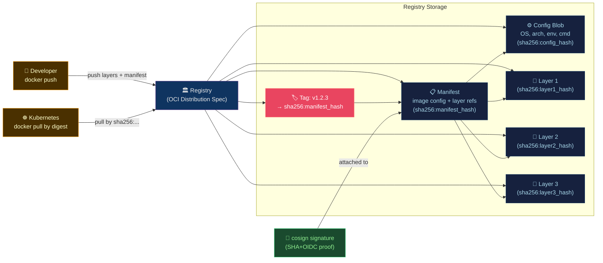

# 📦 Container Registry and Distribution

> [!abstract] TL;DR
> A container registry is an **OCI Distribution Spec** compliant HTTP service storing images as content-addressable blobs (layers) + manifests. Pin images by **digest** (`sha256:...`) not tag — tags are mutable pointers. **Content trust** (Notary v2 / cosign) signs manifests with cryptographic keys or OIDC-based keyless signing. **Image pull policies**: `Always` (never serve stale cache), `IfNotPresent` (cache-first), `Never` (require local). Major registries: Docker Hub, GHCR, ECR, GAR, ACR, self-hosted Harbor/Zot.

---

## Intuition — analogy FIRST

A container registry is like a **library with a central catalog**. A "tag" is like a book's title — a name that can be re-assigned to any book (mutable). A "digest" is like the ISBN — cryptographically unique to this exact printing (immutable). Signing an image is like the author notarizing the book — you can verify the publisher. Never order a library book by title alone ("latest Harry Potter might be a different edition"); always specify the exact ISBN (digest).

---

## How It Works



---

## Key Concepts / Details

### OCI Distribution Spec — Registry API

```bash
# Registry HTTP API endpoints:
# GET /v2/                          → API version check
# GET /v2/<name>/tags/list          → list tags
# GET /v2/<name>/manifests/<ref>    → pull manifest by tag or digest
# PUT /v2/<name>/manifests/<ref>    → push manifest
# GET/PUT /v2/<name>/blobs/<digest> → pull/push layer blobs

# Push flow:
# 1. POST /v2/<name>/blobs/uploads/      → initiate upload
# 2. PATCH /v2/<name>/blobs/uploads/<id> → upload chunks
# 3. PUT /v2/<name>/blobs/uploads/<id>   → finalize with digest
# 4. PUT /v2/<name>/manifests/<tag>      → create tag pointing to manifest
```

### Tag vs Digest — Always Pin by Digest in Production

```bash
# Tag (mutable) — reference can change without notice
docker pull nginx:1.27            # tag can be re-pushed with different image!
docker pull myapp:latest          # classic footgun

# Digest (immutable) — cryptographic guarantee of exact content
docker pull nginx@sha256:a4c5e8f2b7d9...
# sha256 is the SHA-256 hash of the manifest JSON

# Get digest of a tag
docker inspect --format='{{index .RepoDigests 0}}' nginx:1.27
# → nginx@sha256:a4c5e8f2b7d9abc123...

# Or use skopeo (no pull required)
skopeo inspect docker://nginx:1.27 | jq '.Digest'

# Pin in Kubernetes Deployment
spec:
  containers:
    - name: nginx
      image: nginx@sha256:a4c5e8f2b7d9abc123...    # immutable reference
```

### Image Manifest Types

```json
// OCI Image Manifest (schema v2)
{
  "schemaVersion": 2,
  "mediaType": "application/vnd.oci.image.manifest.v1+json",
  "config": {
    "mediaType": "application/vnd.oci.image.config.v1+json",
    "digest": "sha256:config_hash...",
    "size": 7023
  },
  "layers": [
    {
      "mediaType": "application/vnd.oci.image.layer.v1.tar+gzip",
      "digest": "sha256:layer1_hash...",
      "size": 77643144
    },
    {
      "mediaType": "application/vnd.oci.image.layer.v1.tar+gzip",
      "digest": "sha256:layer2_hash...",
      "size": 1234567
    }
  ]
}
```

```json
// OCI Image Index (multi-arch manifest list)
{
  "schemaVersion": 2,
  "mediaType": "application/vnd.oci.image.index.v1+json",
  "manifests": [
    {
      "mediaType": "application/vnd.oci.image.manifest.v1+json",
      "digest": "sha256:amd64_manifest...",
      "platform": {"os": "linux", "architecture": "amd64"}
    },
    {
      "digest": "sha256:arm64_manifest...",
      "platform": {"os": "linux", "architecture": "arm64"}
    }
  ]
}
```

### Multi-Platform Builds

```bash
# Create multi-arch image for amd64 + arm64
docker buildx create --name multiarch --use
docker buildx build \
  --platform linux/amd64,linux/arm64 \
  --tag myregistry.io/myapp:v1 \
  --push .

# BuildKit compiles cross-architecture automatically
# Uses QEMU for non-native arch emulation during build
```

### Content Trust and Signing

```bash
# Cosign — keyless signing via Sigstore (OIDC)
# Sign image (in CI with OIDC token — no keys stored!)
cosign sign --yes myregistry.io/myapp@sha256:abc123

# Sign with a key
cosign generate-key-pair                    # → cosign.key, cosign.pub
cosign sign --key cosign.key myregistry.io/myapp@sha256:abc123

# Verify
cosign verify \
  --certificate-identity-regexp="^https://github.com/org/repo/.*" \
  --certificate-oidc-issuer="https://token.actions.githubusercontent.com" \
  myregistry.io/myapp@sha256:abc123

# Policy enforcement (Cosign + Kyverno or OPA)
# Block unsigned images from running in Kubernetes
```

```yaml
# Kyverno ClusterPolicy: require signed images
apiVersion: kyverno.io/v1
kind: ClusterPolicy
metadata:
  name: require-image-signature
spec:
  validationFailureAction: Enforce
  rules:
    - name: check-image-signature
      match:
        any:
          - resources:
              kinds: [Pod]
      verifyImages:
        - imageReferences: ["myregistry.io/*"]
          attestors:
            - count: 1
              entries:
                - keyless:
                    subject: "https://github.com/org/repo/.github/workflows/build.yml@refs/heads/main"
                    issuer: "https://token.actions.githubusercontent.com"
```

### Major Registries Comparison

| Registry | Auth | Image Retention | Multi-Arch | Built-in Scan | Cost |
|---------|------|----------------|------------|---------------|------|
| **Docker Hub** | Docker account | 1 pull/6h (free) | Yes | Snyk (paid) | Free/Pro |
| **GHCR** | GitHub token | Tied to repo | Yes | No native | Free with GitHub |
| **ECR (AWS)** | IAM/IRSA | Manual/lifecycle | Yes | Inspector | Per-GB stored+data |
| **GAR (GCP)** | Workload Identity | Auto-cleanup | Yes | Artifact Analysis | Per-GB |
| **ACR (Azure)** | AAD | Auto-purge | Yes | Defender | Per-GB |
| **Harbor** | LDAP/OIDC | Configurable | Yes | Trivy (built-in) | OSS (self-hosted) |

### Image Lifecycle Management

```bash
# ECR lifecycle policy (auto-delete old images)
aws ecr put-lifecycle-policy \
  --repository-name myapp \
  --lifecycle-policy-text '{
    "rules": [
      {
        "rulePriority": 1,
        "description": "Keep last 10 production images",
        "selection": {
          "tagStatus": "tagged",
          "tagPrefixList": ["v"],
          "countType": "imageCountMoreThan",
          "countNumber": 10
        },
        "action": {"type": "expire"}
      },
      {
        "rulePriority": 2,
        "description": "Delete untagged images older than 7 days",
        "selection": {
          "tagStatus": "untagged",
          "countType": "sinceImagePushed",
          "countUnit": "days",
          "countNumber": 7
        },
        "action": {"type": "expire"}
      }
    ]
  }'
```

### Pull Policy in Kubernetes

```yaml
spec:
  containers:
    - name: app
      image: myregistry.io/myapp@sha256:abc123
      imagePullPolicy: Always      # always re-pull (network cost, freshness guarantee)
      # imagePullPolicy: IfNotPresent  # use local cache if digest matches
      # imagePullPolicy: Never         # must exist locally (airgap)
```

**Rule**: When using tag-based references, use `Always`. When using digest-pinned references, `IfNotPresent` is safe and faster.

---

## Real-World Notes

- **Registry proxy/cache**: Tools like `registry:2` (Docker Registry) or Harbor as pull-through cache reduce external pull dependencies and rate-limit exposure (Docker Hub: 100 pulls/6h anonymous).
- **Cross-region replication**: ECR, GAR, and ACR support cross-region image replication for low-latency pulls in multi-region deployments.
- **Image promotion workflow**: Build once → push to dev registry → scan → promote digest to staging registry → approve → promote to prod registry. Never rebuild between environments.
- **OCI Artifacts**: Registries now store non-image artifacts (Helm charts, SBOM, signatures, attestations) using the same OCI distribution protocol. This is how `cosign` attaches signatures.

---

## Common Pitfalls

1. **Mutable `:latest` tag in Kubernetes** — pods drift silently between restarts if the tag gets re-pushed; always pin by digest.
2. **No registry authentication in CI** — public registries throttle unauthenticated pulls; always authenticate CI runners.
3. **Storing images indefinitely** — unmanaged registries accumulate gigabytes; implement lifecycle policies from day one.
4. **Registry in same cluster as workloads** — if the cluster goes down, you can't pull images to recover it; keep registry on separate infrastructure.
5. **Ignoring `imagePullSecrets`** — private registry images fail with `ErrImagePull` without `imagePullSecrets` configured on the ServiceAccount or Pod.

---

## Related Concepts

- [[_MOC_Containers_Docker|↑ Containers & Docker MOC]]
- [[Dockerfile_Best_Practices|← Dockerfile]] — what gets pushed to registries
- [[Container_Security_and_Hardening|← Container Security]] — cosign signing strategy
- [[../02_CICD_Pipelines/GitHub_Actions|← GitHub Actions]] — build and push workflow
- [[../04_Kubernetes/Kubernetes_Core_Concepts|→ K8s Core Concepts]] — imagePullSecrets, pull policies

---

## Review Questions

1. A container image is deployed with `image: myapp:v1`. Two days later, the engineering team pushes a bugfix under the same `v1` tag. Existing pods continue running the old version. On the next pod restart, which version runs? How do you prevent this ambiguity?
2. Explain the difference between `cosign sign --key cosign.key` and keyless signing. What infrastructure is required for each, and which is better suited for ephemeral CI environments?
3. Design a multi-stage image promotion pipeline: build → security scan → dev registry → staging registry → prod registry. What does each stage gate on?

---

## Sources

- opencontainers.org/distribution-spec
- docs.sigstore.dev/cosign
- docs.aws.amazon.com/ecr
- goharbor.io — Harbor self-hosted registry
- skopeo.io — registry inspection tool

#DevOps #Docker #Registry #OCI #Distribution #Cosign #Signing #ECR #GHCR #Harbor
