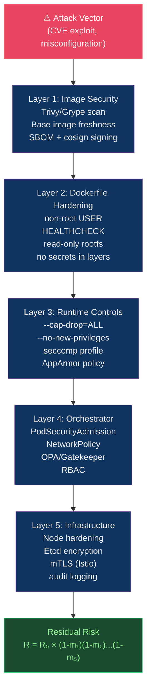

# 🔐 Container Security and Hardening

> [!abstract] TL;DR
> Container security is defense-in-depth across layers. **Runtime**: non-root UID, `--no-new-privileges`, read-only rootfs + tmpfs for writes, `--cap-drop=ALL` (never `CAP_SYS_ADMIN`), seccomp profiles, AppArmor/SELinux mandatory access control. **Supply chain**: Trivy/Grype for CVE scanning, Hadolint for Dockerfile linting, SBOM generation with `syft`, image signing with `cosign`. **Residual risk model**: `R = R₀ × ∏(1-mᵢ)` — each mitigation reduces the risk product by its effectiveness factor.

---

## Intuition — analogy FIRST

Container security layers are like **layers of bank vault protection**. The building (host) has perimeter security (network policies). The vault room (cgroups/namespaces) physically limits what can be accessed. The vault door (seccomp/AppArmor) restricts which operations are permitted. The guard (non-root user) is restricted in what they can do even inside the vault. No single layer is sufficient — the defense value is the product of all layers' effectiveness, matching the `R₀ × ∏(1-mᵢ)` risk formula.

---

## How It Works



---

## Key Concepts / Details

### Non-Root User + No New Privileges

```dockerfile
# Create a non-root user
RUN useradd --uid 1001 --gid 1001 --no-create-home --shell /bin/false appuser

# Or use pre-existing group
RUN groupadd -r appgroup && useradd -r -g appgroup -u 1001 appuser

# Switch to non-root before CMD/ENTRYPOINT
USER 1001:1001   # use numeric UID/GID (not username — for security)

# Read-only root with tmpfs for writes
# In Kubernetes pod spec:
securityContext:
  runAsNonRoot: true
  runAsUser: 1001
  runAsGroup: 1001
  readOnlyRootFilesystem: true
  allowPrivilegeEscalation: false
  seccompProfile:
    type: RuntimeDefault
```

```bash
# Docker runtime flags
docker run \
  --user 1001:1001 \
  --read-only \
  --tmpfs /tmp:rw,noexec,nosuid,size=65536k \
  --no-new-privileges \
  myapp:latest
```

### Linux Capabilities — Principle of Least Privilege

```bash
# Default Docker capabilities (more than needed):
# CAP_CHOWN, CAP_DAC_OVERRIDE, CAP_FSETID, CAP_FOWNER,
# CAP_KILL, CAP_SETGID, CAP_SETUID, CAP_SETPCAP,
# CAP_NET_BIND_SERVICE, CAP_SYS_CHROOT, ...

# Drop ALL capabilities, add back only what's needed
docker run \
  --cap-drop=ALL \
  --cap-add=NET_BIND_SERVICE \   # only if binding port <1024
  myapp:latest

# In Kubernetes:
securityContext:
  capabilities:
    drop: ["ALL"]
    add: ["NET_BIND_SERVICE"]

# NEVER add:
# CAP_SYS_ADMIN  → near-root access, full namespace escape
# CAP_NET_ADMIN  → modify routing tables, firewalls
# CAP_SYS_PTRACE → trace other processes (container escape)
```

| Capability | Risk | Common Need |
|-----------|------|-------------|
| `CAP_SYS_ADMIN` | Critical — container escape | Almost never |
| `CAP_NET_BIND_SERVICE` | Low — bind port <1024 | Web servers on port 80 |
| `CAP_NET_RAW` | Medium — raw sockets, ping | Rare, avoid |
| `CAP_SYS_PTRACE` | High — debug/escape | Dev only, never prod |
| `CAP_DAC_OVERRIDE` | Medium — bypass file perms | Avoid |

### Seccomp Profiles

```json
// Custom seccomp profile (restrict syscalls)
{
  "defaultAction": "SCMP_ACT_ERRNO",
  "architectures": ["SCMP_ARCH_X86_64"],
  "syscalls": [
    {
      "names": [
        "accept4", "brk", "close", "connect", "epoll_ctl",
        "epoll_wait", "exit", "exit_group", "fcntl",
        "fstat", "futex", "getpid", "gettimeofday",
        "listen", "mmap", "mprotect", "munmap",
        "nanosleep", "open", "openat", "poll",
        "read", "recvfrom", "sendto", "setsockopt",
        "socket", "stat", "write"
      ],
      "action": "SCMP_ACT_ALLOW"
    }
  ]
}
```

```bash
docker run --security-opt seccomp=./seccomp-profile.json myapp

# Use RuntimeDefault profile (Kubernetes)
securityContext:
  seccompProfile:
    type: RuntimeDefault    # Docker default = ~50 syscalls allowed
```

**Runtime default seccomp** blocks ~44 dangerous syscalls including `ptrace`, `reboot`, `kexec_load`, `mount`.

### AppArmor / SELinux

```bash
# AppArmor profile (Ubuntu/Debian hosts)
# Load profile
apparmor_parser -r /etc/apparmor.d/docker-myapp

# Apply to container
docker run --security-opt apparmor=docker-myapp myapp

# Check loaded profiles
aa-status | grep docker
```

```
# /etc/apparmor.d/docker-myapp
#include <tunables/global>
profile docker-myapp flags=(attach_disconnected, mediate_deleted) {
  #include <abstractions/base>
  network inet tcp,
  network inet udp,
  deny network raw,
  deny @{PROC}/* w,
  deny /sys/[^f]** wklx,
  /app/** r,
  /tmp/** rw,
  deny /etc/passwd w,
  deny /etc/shadow rw,
}
```

### Vulnerability Scanning — Trivy

```bash
# Scan image for CVEs
trivy image myapp:v1

# Scan with specific severity threshold (fail CI on HIGH+)
trivy image --exit-code 1 --severity HIGH,CRITICAL myapp:v1

# Scan Dockerfile for misconfigurations
trivy config Dockerfile

# Generate SBOM (Software Bill of Materials)
trivy image --format cyclonedx --output sbom.json myapp:v1

# Scan a running container
trivy rootfs --severity CRITICAL /proc/$(docker inspect --format '{{.State.Pid}}' myapp)/root/

# Integration in GitHub Actions
- uses: aquasecurity/trivy-action@master
  with:
    image-ref: myapp:${{ github.sha }}
    format: sarif
    output: trivy-results.sarif
    severity: HIGH,CRITICAL
    exit-code: 1
```

### SBOM and Supply Chain Security — SLSA

```bash
# Generate SBOM with syft
syft myapp:v1 -o cyclonedx-json > sbom.json
syft myapp:v1 -o spdx-json > sbom.spdx.json

# Sign image with cosign (keyless via OIDC)
cosign sign --yes myregistry.io/myapp@sha256:abc123

# Verify signature
cosign verify \
  --certificate-identity-regexp="^https://github.com/org/repo" \
  --certificate-oidc-issuer="https://token.actions.githubusercontent.com" \
  myregistry.io/myapp@sha256:abc123

# Attach SBOM to image
cosign attach sbom --sbom sbom.json myregistry.io/myapp@sha256:abc123
```

**SLSA Levels** (Supply chain Levels for Software Artifacts):

| Level | Requirements | Guarantees |
|-------|-------------|------------|
| SLSA 1 | Provenance generated | Build scripted |
| SLSA 2 | Signed provenance | Build service-controlled |
| SLSA 3 | Non-falsifiable provenance | Build hardened |
| SLSA 4 | Two-person review + hermetic | Strong security guarantees |

### Residual Risk Formula Applied

```
R = R₀ × ∏(1 - mᵢ)

Example: Critical CVE in base image (R₀ = 0.9)
- Non-root user:         m₁ = 0.40 → reduces escalation risk
- Read-only rootfs:      m₂ = 0.30 → limits persistence
- Cap-drop ALL:          m₃ = 0.25 → limits syscall access
- Seccomp RuntimeDefault: m₄ = 0.20 → limits syscall attack surface
- NetworkPolicy (K8s):   m₅ = 0.30 → limits lateral movement

R = 0.9 × (1-0.4)(1-0.3)(1-0.25)(1-0.2)(1-0.3)
  = 0.9 × 0.6 × 0.7 × 0.75 × 0.8 × 0.7
  = 0.9 × 0.1764
  = 0.159  (vs 0.9 without mitigations → 82% risk reduction)
```

---

## Real-World Notes

- **Distroless eliminates shell exploits**: Most container exploits involve running shell commands. Distroless images have no `/bin/sh` — an attacker with RCE in the app can't easily spawn a shell.
- **Hadolint in CI**: Lint Dockerfiles before merging. Catches: `apt-get` without `--no-install-recommends`, `COPY` without `.dockerignore`, running as root, `latest` tags.
  ```bash
  hadolint Dockerfile
  # DL3008: Pin versions in apt-get install
  # DL3009: Delete apt-get lists after install
  # SC2035: Use ./* or -- to prevent flag injection
  ```
- **Image signing adoption**: The CNCF security survey found only 35% of organizations sign container images. Signing with cosign + Sigstore adds <1 minute to builds.

---

## Common Pitfalls

1. **Running as root "just temporarily"** — root in container means root-equivalent access if namespace isolation breaks; make non-root the default from day one.
2. **`--privileged` in production** — grants all capabilities + disables seccomp + disables AppArmor. Never use in production; debug by adding specific caps.
3. **Scanning only at build time** — new CVEs emerge daily; implement registry scanning (ECR, GAR) that rescans stored images weekly.
4. **`CAP_NET_RAW` for ping** — many teams add this just to test connectivity; use `curl` or `wget` instead of `ping`.
5. **Trusting `:latest` from public registries** — `:latest` is mutable and unsigned; pin to `@sha256:...` and verify signature.

---

## Related Concepts

- [[_MOC_Containers_Docker|↑ Containers & Docker MOC]]
- [[Docker_Architecture_and_Internals|← Docker Architecture]] — namespaces/cgroups are the security foundation
- [[Dockerfile_Best_Practices|← Dockerfile]] — non-root and read-only in Dockerfile
- [[Container_Registry_and_Distribution|→ Registry]] — image signing + trust at distribution
- [[../04_Kubernetes/Kubernetes_Core_Concepts|→ K8s Core Concepts]] — PodSecurityAdmission enforces these policies

---

## Review Questions

1. A container needs to bind to port 443. Without running as root, what is the minimal capability addition needed, and how do you add it in both Docker and Kubernetes?
2. Apply the residual risk formula to an image with R₀=0.85 using: non-root (m=0.40), read-only rootfs (m=0.35), seccomp (m=0.20), NetworkPolicy (m=0.30). What is the residual risk?
3. A security audit finds your containers run with default seccomp. What is the difference between `RuntimeDefault` and a custom allowlist profile, and when would you choose each?

---

## Sources

- "Container Security" by Liz Rice (O'Reilly)
- aquasecurity.github.io/trivy
- sigstore.dev — cosign, syft
- SLSA: slsa.dev
- CIS Docker Benchmark

#DevOps #Docker #Security #Hardening #Capabilities #Seccomp #AppArmor #Trivy #SBOM #SLSA
