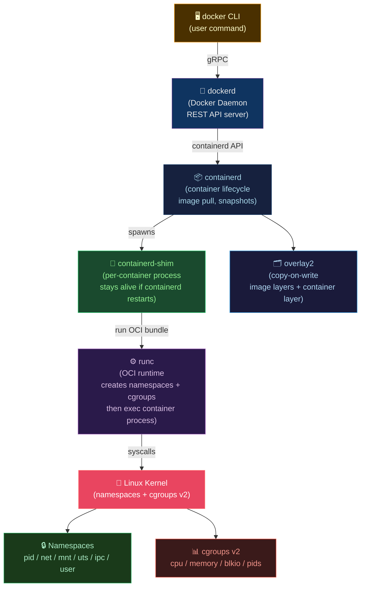

# 🔬 Docker Architecture and Internals

> [!abstract] TL;DR
> A container is a **Linux process** (or process group) with namespace isolation and cgroup resource limits — no guest OS kernel. The Docker stack: `dockerd` (daemon) → `containerd` (container lifecycle manager) → `containerd-shim` (per-container process) → `runc` (OCI runtime, creates namespaces+cgroups). Six namespaces: `pid`, `net`, `mnt`, `uts`, `ipc`, `user`. cgroups v2 unified hierarchy controls CPU quota/period (`--cpus=0.5` = 50ms/100ms cycle), memory, and OOM killer. Storage uses `overlay2` copy-on-write filesystem.

---

## Intuition — analogy FIRST

A container is like a **studio apartment within a skyscraper**. The skyscraper (host kernel) is shared infrastructure. Each apartment (container) has its own front door (namespace isolation) — residents can't see other apartments' contents. The building manager (cgroups) limits each apartment's utilities: `--cpus=0.5` is a half-speed electricity cap. The overlay filesystem is like an apartment furnished with **rented furniture** (image layers) plus your own personal items on top (container layer).

---

## How It Works



---

## Key Concepts / Details

### Linux Namespaces — The Six Isolation Types

| Namespace | Isolates | Created With | Example Effect |
|-----------|----------|--------------|----------------|
| `pid` | Process IDs | `CLONE_NEWPID` | Container PID 1 ≠ host PID 1; container can't see host processes |
| `net` | Network interfaces, routing | `CLONE_NEWNET` | Container gets its own `eth0`, IP address |
| `mnt` | Filesystem mounts | `CLONE_NEWNS` | Container's `/` is independent of host's `/` |
| `uts` | Hostname, domain name | `CLONE_NEWUTS` | Container has its own hostname |
| `ipc` | SysV IPC, POSIX message queues | `CLONE_NEWIPC` | Containers can't signal each other via IPC |
| `user` | UIDs/GIDs | `CLONE_NEWUSER` | UID 0 in container ≠ UID 0 on host (rootless containers) |

```bash
# Inspect namespaces of a running container
docker inspect --format '{{.State.Pid}}' mycontainer
# → 12345
ls -la /proc/12345/ns/
# net, mnt, pid, uts, ipc, user → symlinks to namespace IDs
```

### cgroups v2 — Resource Control

```bash
# CPU: --cpus=0.5 sets quota=50ms, period=100ms
# Container can use 50ms of CPU every 100ms = 50% of one CPU core
docker run --cpus=0.5 --memory=512m --memory-swap=512m myapp

# cgroups v2 unified hierarchy (Linux 4.5+)
# All controllers under single tree: /sys/fs/cgroup/
cat /sys/fs/cgroup/system.slice/docker-<id>.scope/cpu.max
# 50000 100000  (quota period)

# OOM Killer: when memory limit exceeded
# --memory-swap=512m + --memory=512m means NO swap
# Process is OOM-killed, container exits with code 137

# Inspect resource usage
docker stats mycontainer
# CONTAINER  CPU %  MEM USAGE / LIMIT  NET I/O  BLOCK I/O
```

### overlay2 — Copy-on-Write Storage

```bash
# Docker image = read-only stack of layers (upperdir/lowerdir)
# Container layer = read-write overlay on top

# Image layers for a typical Python app:
# Layer 1: ubuntu:22.04 base (~80MB)  [read-only]
# Layer 2: RUN apt-get install...     [read-only]
# Layer 3: COPY requirements.txt ...  [read-only]
# Layer 4: RUN pip install ...        [read-only]
# Layer 5: COPY . .                   [read-only]
# Container: upperdir                 [read-write]

# Inspect layers
docker history myapp:v1
docker inspect myapp:v1 --format '{{json .RootFS.Layers}}'

# Storage locations (host)
ls /var/lib/docker/overlay2/
```

**Copy-on-write**: When a container modifies a file from a lower layer, the file is copied up to the container's `upperdir` layer first. The original layer is unchanged. This makes container creation O(1) regardless of image size.

### OCI Specifications

Three OCI (Open Container Initiative) specs:
1. **Image Spec**: How container images are packaged (layers, config, manifest)
2. **Runtime Spec**: How container processes are created and run (Linux namespaces, cgroups, mounts)
3. **Distribution Spec**: How images are pushed/pulled from registries (HTTP API)

```bash
# OCI image structure (inside an image tarball)
# manifest.json → config.json → layer tarballs

# Inspect OCI manifest
crane manifest myregistry.io/myapp:v1 | jq .

# Pull as OCI archive
skopeo copy docker://myapp:v1 oci:/tmp/myapp-oci
```

### containerd-shim — Why It Exists

The shim (`containerd-shim-runc-v2`) sits between `containerd` and the running container process:
- Allows `containerd` to restart/upgrade **without killing running containers**
- Reaps zombie processes when the container's PID 1 doesn't handle SIGCHLD
- Manages stdio (stdin/stdout/stderr) and exit status

```bash
# See the shim process in ps
ps aux | grep containerd-shim
# → containerd-shim-runc-v2 -namespace k8s.io -id <container-id>
```

### Runtime Alternatives

| Runtime | Description | Use Case |
|---------|-------------|----------|
| `runc` | OCI reference implementation | Default, general purpose |
| `crun` | Faster C implementation | Low-latency, low-memory |
| `gVisor (runsc)` | Userspace kernel (Go) | Sandboxing, untrusted code |
| `Kata Containers` | Lightweight VM per container | Strong isolation, HW virtualization |
| `Firecracker` | AWS Lambda/Fargate | MicroVM, <125ms cold start |

```bash
# Configure containerd runtime in K8s
# /etc/containerd/config.toml
[plugins."io.containerd.grpc.v1.cri".containerd.runtimes.gvisor]
  runtime_type = "io.containerd.runsc.v1"
```

---

## Real-World Notes

- **`dockerd` is being decoupled**: Many Kubernetes setups now use `containerd` directly (via CRI) without `dockerd`. `crictl` is the `docker` CLI equivalent for containerd/CRI.
- **cgroups v1 vs v2**: Ubuntu 22.04+ uses cgroups v2 by default. Some older monitoring tools expect v1 paths; verify with `mount | grep cgroup`.
- **Layer deduplication**: Multiple images sharing the same base layer share disk blocks — Docker's content-addressable storage deduplicates by layer digest.
- **PID 1 problem**: Docker containers often run real applications (not init systems) as PID 1. PID 1 must handle signal forwarding and zombie reaping. Use `tini` or `dumb-init` if your app doesn't.

```dockerfile
# Add tini as PID 1 init
FROM ubuntu:22.04
RUN apt-get install -y tini
ENTRYPOINT ["/usr/bin/tini", "--"]
CMD ["/app/server"]
```

---

## Common Pitfalls

1. **Running as root in container** — UID 0 in container maps to UID 0 on host unless user namespace is enabled; container escape → root on host.
2. **Ignoring OOM kills** — containers exit with code 137 silently; add monitoring for OOM events: `dmesg | grep -i "oom killer"`.
3. **Not setting memory limits** — unconstrained containers can consume all host memory, causing host OOM and killing unrelated processes.
4. **Storing mutable state in container layer** — container layer is ephemeral; use named volumes or bind mounts for persistent data.
5. **Mixing cgroups v1 and v2 expectations** — some tools (older versions of systemd, Java JVM) miscalculate resource limits under cgroups v2.

---

## Related Concepts

- [[_MOC_Containers_Docker|↑ Containers & Docker MOC]]
- [[Dockerfile_Best_Practices|→ Dockerfile Best Practices]] — leverage overlay2 cache ordering
- [[Container_Security_and_Hardening|→ Container Security]] — namespace + cgroup security implications
- [[../04_Kubernetes/Kubernetes_Core_Concepts|→ K8s Core Concepts]] — Pods run containers via containerd

---

## Review Questions

1. A container is killed with exit code 137. What kernel mechanism caused this, and what two configuration changes would prevent it?
2. Explain why two containers that share the same base image (e.g., `ubuntu:22.04`) do not consume twice the disk space.
3. A security team requires that container UID 0 does not map to host UID 0. What Linux kernel feature enables this, and how do you enable it in Docker?

---

## Sources

- OCI Specs: opencontainers.org
- containerd.io documentation
- Brendan Gregg — Linux Performance (cgroups chapters)
- "Container Security" by Liz Rice

#DevOps #Docker #Internals #Namespaces #Cgroups #Containerd #Overlay2 #OCI
