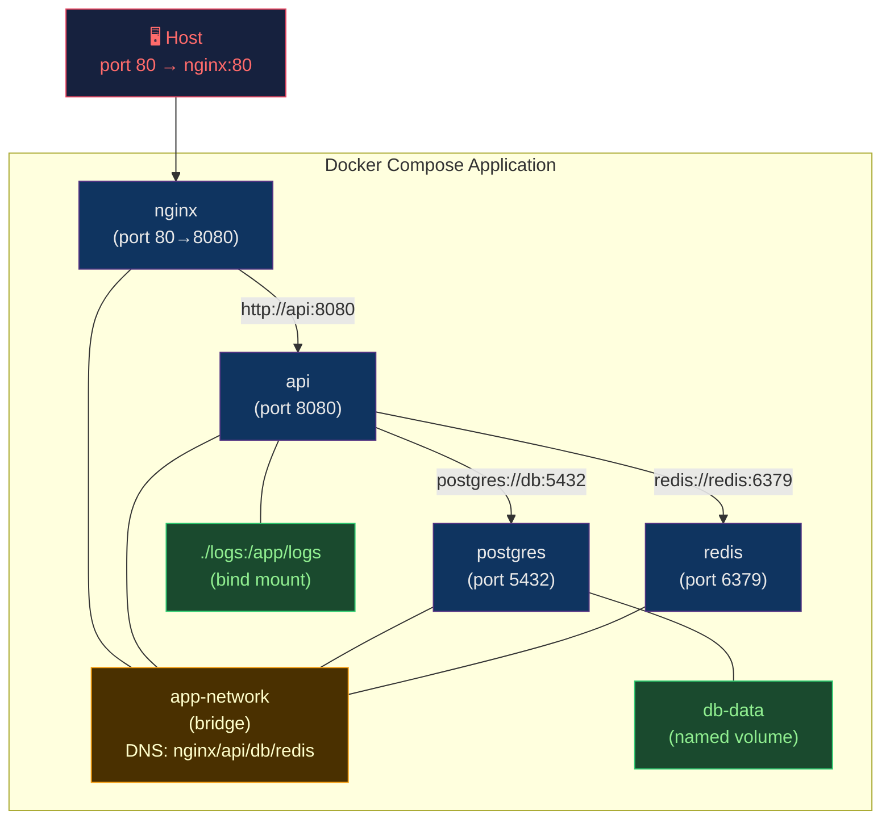

# 🔗 Docker Compose and Networking

> [!abstract] TL;DR
> **Docker Compose** defines multi-container applications in `docker-compose.yml` (v3 YAML), with `services`, `networks`, `volumes`. `depends_on` with `condition: service_healthy` gates startup order on health checks. **Docker networking**: `bridge` (default, private subnet per Compose project with DNS), `host` (share host network stack, no isolation), `overlay` (multi-host Swarm networks). **DNS service discovery**: service name resolves to container IP automatically. **Volumes**: bind-mount (host path), named (Docker-managed), tmpfs (in-memory ephemeral).

---

## Intuition — analogy FIRST

Docker Compose is like a **stage director's script** for a multi-actor play. Each `service` is an actor with their role (image), costume (environment), and cue (depends_on). The `network` is the shared stage — actors can speak to each other by name. Without a shared network, actors are in soundproofed booths. The `volume` is the shared prop trunk — files persist beyond any single performance.

---

## How It Works



---

## Key Concepts / Details

### Complete docker-compose.yml

```yaml
# docker-compose.yml (Compose v3 syntax)
version: "3.9"

services:
  nginx:
    image: nginx:1.27-alpine
    ports:
      - "80:80"
      - "443:443"
    volumes:
      - ./nginx/nginx.conf:/etc/nginx/nginx.conf:ro
      - ./nginx/ssl:/etc/nginx/ssl:ro
    depends_on:
      api:
        condition: service_healthy
    networks:
      - frontend
      - backend
    restart: unless-stopped
    logging:
      driver: "json-file"
      options:
        max-size: "10m"
        max-file: "3"

  api:
    build:
      context: .
      dockerfile: Dockerfile
      target: runtime              # multi-stage: only build 'runtime' stage
      args:
        - BUILD_VERSION=${GIT_SHA}
    environment:
      - DATABASE_URL=postgresql://appuser:${DB_PASSWORD}@db:5432/appdb
      - REDIS_URL=redis://redis:6379
      - LOG_LEVEL=${LOG_LEVEL:-info}
    env_file:
      - .env                       # load additional vars from file
    depends_on:
      db:
        condition: service_healthy
      redis:
        condition: service_started
    healthcheck:
      test: ["CMD", "curl", "-f", "http://localhost:8080/health"]
      interval: 10s
      timeout: 5s
      retries: 5
      start_period: 30s
    networks:
      - backend
    volumes:
      - ./logs:/app/logs           # bind mount: host path → container path
    deploy:
      replicas: 2
      resources:
        limits:
          cpus: "0.5"
          memory: 512M
        reservations:
          cpus: "0.1"
          memory: 256M
    restart: on-failure

  db:
    image: postgres:16-alpine
    environment:
      POSTGRES_DB: appdb
      POSTGRES_USER: appuser
      POSTGRES_PASSWORD: ${DB_PASSWORD}
    volumes:
      - db-data:/var/lib/postgresql/data   # named volume: persists data
      - ./init-scripts:/docker-entrypoint-initdb.d:ro
    healthcheck:
      test: ["CMD-SHELL", "pg_isready -U appuser -d appdb"]
      interval: 10s
      timeout: 5s
      retries: 5
    networks:
      - backend
    restart: unless-stopped

  redis:
    image: redis:7-alpine
    command: redis-server --appendonly yes --maxmemory 256mb --maxmemory-policy allkeys-lru
    volumes:
      - redis-data:/data
    networks:
      - backend
    restart: unless-stopped

  # Dev-only service (override in docker-compose.override.yml)
  migrate:
    build:
      context: .
      target: runtime
    command: ["python", "manage.py", "migrate"]
    depends_on:
      db:
        condition: service_healthy
    networks:
      - backend
    profiles:
      - migrate                    # only runs with: docker compose --profile migrate up

networks:
  frontend:
    driver: bridge
  backend:
    driver: bridge
    internal: true                 # no external internet access (security)

volumes:
  db-data:
    driver: local
  redis-data:
    driver: local
```

### docker-compose.override.yml (Dev Overrides)

```yaml
# docker-compose.override.yml (auto-merged in dev, not in prod)
services:
  api:
    build:
      target: development          # use dev stage with hot-reload
    volumes:
      - .:/app                     # mount source for live reload
    environment:
      - DEBUG=true
      - RELOAD=true
    ports:
      - "8080:8080"                # expose API port in dev
      - "5678:5678"                # debugger port

  db:
    ports:
      - "5432:5432"                # expose DB to host for dev tools
```

### Network Modes

#### Bridge (Default)

```bash
# Each Compose project gets its own bridge network
# Services get DNS entries: service-name → container IP

# Inspect network
docker network inspect myproject_backend

# Service-to-service communication by name
# From api container: ping db → resolves to db container IP
# DNS is handled by Docker's embedded DNS server (127.0.0.11)

# Custom subnet
networks:
  backend:
    driver: bridge
    ipam:
      config:
        - subnet: 172.28.0.0/16
```

#### Host Mode

```bash
# Container shares host's network namespace
# No port mapping needed (or possible)
# Use case: high-performance networking, eBPF tools

docker run --network host nginx
# nginx binds directly to host port 80

# In Compose:
services:
  monitoring:
    image: grafana/agent
    network_mode: host             # access all host network interfaces
```

#### Overlay (Docker Swarm)

```bash
# Multi-host networking for Docker Swarm
# Encrypted VXLAN tunnel between nodes
docker network create --driver overlay --encrypted myapp-overlay

# Service using overlay network
docker service create \
  --network myapp-overlay \
  --name api \
  myapp:v2
```

### Volume Types

| Type | Definition | Persistence | Use Case |
|------|-----------|-------------|---------|
| **Named volume** | `db-data:/var/lib/postgresql/data` | Persistent (Docker-managed) | Database data, persistent state |
| **Bind mount** | `./src:/app/src` | Persistent (host-managed) | Development live-reload, logs |
| **tmpfs** | `tmpfs: /tmp` | Ephemeral (RAM) | Temp files, secrets in memory |
| **Anonymous** | `/var/lib/data` | Ephemeral (auto-named) | Throwaway containers |

```yaml
# tmpfs for sensitive data (never written to disk)
services:
  api:
    tmpfs:
      - /tmp
      - /run/secrets:size=65536   # in-memory secrets mount
```

### Useful Compose Commands

```bash
# Start all services (build if needed)
docker compose up --build -d

# Start specific service and its dependencies
docker compose up api --build

# View logs (follow)
docker compose logs -f api

# Scale a service
docker compose up --scale api=3 -d

# Run one-off command in service container
docker compose exec api python manage.py shell

# Run new container (doesn't replace existing)
docker compose run --rm api python manage.py migrate

# Stop and remove (keep volumes)
docker compose down

# Stop and remove (including volumes)
docker compose down -v

# Override compose file
docker compose -f docker-compose.yml -f docker-compose.prod.yml up -d
```

---

## Real-World Notes

- **`depends_on` only controls start order, not readiness**: Use `condition: service_healthy` with `healthcheck:` to wait for actual readiness (DB accepting connections, not just container started).
- **Compose for production**: Compose v3 with `deploy:` section works with Docker Swarm, not plain Compose. For K8s, use Kompose to convert.
- **Network segmentation**: Use multiple networks (`frontend`, `backend`) and set `internal: true` on backend network to prevent unintended internet egress.
- **`.env` file security**: `.env` files are not encrypted; don't commit them. Use Docker secrets or Vault for production.

---

## Common Pitfalls

1. **`depends_on` without health check** — service starts before dependency is ready; add `healthcheck:` and `condition: service_healthy`.
2. **Bind-mounting entire source in production** — development convenience, production security hole; only bind-mount specific files needed.
3. **Named volumes not backed up** — `docker compose down -v` destroys all named volumes; implement volume backup strategy.
4. **Port conflicts with host** — `ports: "5432:5432"` fails if host PostgreSQL is running; use `127.0.0.1:15432:5432` to isolate.
5. **Using `version:` field in Compose v2.x+** — Compose v2 ignores the `version:` field; it's obsolete but not harmful.

---

## Related Concepts

- [[_MOC_Containers_Docker|↑ Containers & Docker MOC]]
- [[Docker_Architecture_and_Internals|← Docker Architecture]] — network namespaces underpin Docker networking
- [[Dockerfile_Best_Practices|← Dockerfile]] — services reference images/builds
- [[../04_Kubernetes/Kubernetes_Networking_and_Ingress|→ K8s Networking]] — cluster networking evolution from Docker

---

## Review Questions

1. Your `api` service starts before `db` is accepting connections, causing startup failures. Show the exact YAML configuration to fix this.
2. Explain why `network_mode: host` is inappropriate for most production multi-service applications, but useful for monitoring agents.
3. A developer accidentally ran `docker compose down -v` and lost all database data. What two preventative measures would have protected the data?

---

## Sources

- docs.docker.com/compose/
- docs.docker.com/network/
- Compose file reference: docs.docker.com/compose/compose-file/

#DevOps #Docker #Compose #Networking #Bridge #Volumes #DNS
