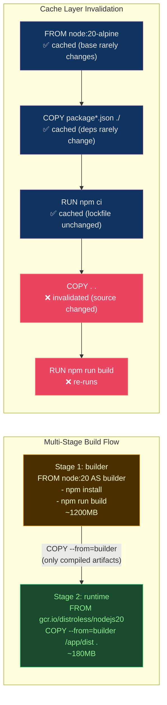

# 📄 Dockerfile Best Practices

> [!abstract] TL;DR
> Dockerfile cache efficiency depends on **layer ordering**: put least-changing instructions first (`FROM` → `COPY manifest` → `RUN install` → `COPY source`). **Multi-stage builds** discard build tooling and produce minimal images (80–90% smaller: ~1200MB builder → ~180MB runtime). **Base image ladder**: ubuntu/debian 70–120MB → alpine 7MB → distroless 2–20MB → scratch 0MB. BuildKit secrets (`--secret`) prevent credentials appearing in layers. `.dockerignore` prevents unnecessary context transfers. `HEALTHCHECK` enables container self-reporting.

---

## Intuition — analogy FIRST

Dockerfile layers are like **journal pages** — once written, they're permanent. Docker caches pages by their content. When you edit a page, every page after it must be rewritten. Put **immutable pages first** (base image, dependency manifests) and **frequently changing pages last** (source code). Multi-stage builds are like writing your research notes in a draft book, then transcribing only the final answer into a clean published book — the reader (production) never sees the messy drafts.

---

## How It Works



---

## Key Concepts / Details

### Cache Optimization — Layer Order Matters

```dockerfile
# ❌ BAD: COPY source before installing deps
FROM node:20-alpine
COPY . .                    # invalidates on ANY file change
RUN npm ci                  # re-runs every build (even if deps unchanged)
RUN npm run build

# ✅ GOOD: Install deps first (stable), copy source last (changing)
FROM node:20-alpine
WORKDIR /app

# Step 1: Install dependencies (cached until package-lock.json changes)
COPY package.json package-lock.json ./
RUN npm ci --only=production

# Step 2: Copy source (invalidates only when source changes)
COPY . .
RUN npm run build
```

### Multi-Stage Builds

```dockerfile
# Complete Python API example: 1.2GB builder → 180MB runtime
# ===== Stage 1: Build =====
FROM python:3.12-slim AS builder

WORKDIR /build

# Install build tools (only needed at build time)
RUN apt-get update && apt-get install -y --no-install-recommends \
    build-essential gcc libpq-dev

COPY requirements.txt .
RUN pip install --user --no-cache-dir -r requirements.txt

# ===== Stage 2: Runtime =====
FROM python:3.12-slim AS runtime

# Non-root user
RUN useradd --uid 1000 --create-home appuser

WORKDIR /app

# Copy only installed packages from builder
COPY --from=builder /root/.local /home/appuser/.local

# Copy application code
COPY --chown=appuser:appuser . .

USER appuser

ENV PATH="/home/appuser/.local/bin:${PATH}"
ENV PYTHONUNBUFFERED=1
ENV PYTHONDONTWRITEBYTECODE=1

EXPOSE 8080

HEALTHCHECK --interval=30s --timeout=5s --start-period=10s --retries=3 \
    CMD python -c "import urllib.request; urllib.request.urlopen('http://localhost:8080/health')"

CMD ["uvicorn", "app.main:app", "--host", "0.0.0.0", "--port", "8080"]
```

```dockerfile
# Go binary: even more dramatic (800MB builder → 10MB scratch)
FROM golang:1.22-alpine AS builder
WORKDIR /build
COPY go.mod go.sum ./
RUN go mod download
COPY . .
RUN CGO_ENABLED=0 GOOS=linux go build -ldflags="-s -w" -o server .

FROM scratch
COPY --from=builder /build/server /server
COPY --from=builder /etc/ssl/certs/ca-certificates.crt /etc/ssl/certs/
ENTRYPOINT ["/server"]
```

### Base Image Ladder

| Base Image | Size | Security Surface | Use Case |
|-----------|------|-----------------|---------|
| `ubuntu:22.04` | ~80MB | Large (full OS tools) | Dev/debug environments |
| `debian:bookworm-slim` | ~75MB | Reduced | General purpose |
| `python:3.12-slim` | ~130MB | Medium (no apt extras) | Python apps |
| `alpine:3.19` | ~7MB | Small (musl libc) | Multi-stage runtime stages |
| `distroless/python3` | ~50MB | Minimal (no shell) | Production Python |
| `distroless/nodejs20` | ~100MB | Minimal | Production Node.js |
| `distroless/static` | ~2MB | Minimal (no libc) | Static binaries |
| `scratch` | 0MB | None | Fully static Go binaries |

**Distroless**: Google's images with no shell, no package manager, no unnecessary OS tools. Significantly reduces attack surface — an attacker who exploits the app has no `sh` to run.

```bash
# Verify distroless has no shell
docker run --rm gcr.io/distroless/python3 /bin/sh
# → exec /bin/sh: no such file or directory
```

### BuildKit Secrets — Never Put Credentials in Layers

```dockerfile
# ❌ BAD: ARG leaks secrets into image history
ARG NPM_TOKEN
RUN echo "//registry.npmjs.org/:_authToken=${NPM_TOKEN}" > .npmrc
RUN npm install
# .npmrc with token is now in the layer!

# ✅ GOOD: BuildKit --secret mounts a secret without caching it
# syntax=docker/dockerfile:1
FROM node:20-alpine

WORKDIR /app
COPY package*.json ./

RUN --mount=type=secret,id=npmrc,target=/root/.npmrc \
    npm ci
# Secret is NEVER written to any layer

COPY . .
RUN npm run build
```

```bash
# Build with secret
docker buildx build \
    --secret id=npmrc,src=$HOME/.npmrc \
    --tag myapp:latest .
```

```dockerfile
# SSH forwarding (for private Git repos in build)
# syntax=docker/dockerfile:1
FROM python:3.12-slim AS builder
RUN --mount=type=ssh \
    pip install git+ssh://git@github.com/org/private-package.git
```

```bash
docker buildx build --ssh default=$SSH_AUTH_SOCK --tag myapp:latest .
```

### ARG vs ENV

| | ARG | ENV |
|--|-----|-----|
| Available at | Build time only | Build + runtime |
| Visible in `docker history` | Yes (value visible!) | Yes |
| Override at runtime | No | `docker run -e KEY=val` |
| Use for | Build-time config (Go GOOS) | Runtime config (DB_HOST) |
| Secret safe? | No | No |

**Rule**: Never put secrets in `ARG` or `ENV`. Use BuildKit `--secret` for build-time secrets, and Kubernetes Secrets / Vault for runtime secrets.

### .dockerignore

```
# .dockerignore
.git
.gitignore
node_modules
**/__pycache__
**/*.pyc
.env
.env.*
*.md
tests/
docs/
.vscode/
*.log
dist/           # (if using multi-stage, builder produces this)
coverage/
```

**Why it matters**: Every file in the build context is sent to the Docker daemon over the socket. A project with a `node_modules` (200MB) or `.git` directory (large) dramatically slows every build if not excluded.

### HEALTHCHECK

```dockerfile
# HTTP health check
HEALTHCHECK --interval=30s \   # check every 30s
            --timeout=5s \     # fail if no response in 5s
            --start-period=30s \ # grace period on startup
            --retries=3 \      # fail status after 3 consecutive failures
    CMD curl -f http://localhost:8080/health || exit 1

# Status values: starting (grace) → healthy → unhealthy
```

Docker Compose and Kubernetes use `HEALTHCHECK` differently:
- Docker Compose: uses HEALTHCHECK for `depends_on: condition: service_healthy`
- Kubernetes: ignores HEALTHCHECK; uses `livenessProbe` and `readinessProbe` separately

---

## Real-World Notes

- **BuildKit is default in Docker 23.0+** — ensure `DOCKER_BUILDKIT=1` for older versions.
- **Image size scanning**: Integrate `dive` to inspect layer efficiency and find large files.
  ```bash
  dive myapp:latest  # interactive layer explorer
  ```
- **Labels for metadata**: Add standard labels for traceability.
  ```dockerfile
  LABEL org.opencontainers.image.source="https://github.com/org/repo"
  LABEL org.opencontainers.image.revision="$GIT_SHA"
  LABEL org.opencontainers.image.created="2026-07-26"
  ```
- **Pin base image by digest**: `FROM node:20-alpine@sha256:abc123` for reproducible builds. Tag-based `FROM node:20-alpine` can silently change.

---

## Common Pitfalls

1. **Broad `COPY . .` before dependency install** — any file change (README, test file) busts the deps cache layer.
2. **Single stage with dev dependencies in production** — `npm install` vs `npm ci --only=production`; test tools in production image.
3. **Not cleaning apt cache** — `RUN apt-get install -y pkg` leaves cache in layer; always add `&& rm -rf /var/lib/apt/lists/*` in same `RUN`.
4. **`EXPOSE` is documentation only** — doesn't publish the port; still need `-p 8080:8080` at runtime or Compose `ports:`.
5. **CMD vs ENTRYPOINT confusion** — `ENTRYPOINT` = fixed command, `CMD` = default args. `docker run myapp bash` overrides CMD, not ENTRYPOINT.

---

## Related Concepts

- [[_MOC_Containers_Docker|↑ Containers & Docker MOC]]
- [[Docker_Architecture_and_Internals|← Docker Architecture]] — overlay2 layer model
- [[Container_Security_and_Hardening|→ Container Security]] — non-root, capabilities in Dockerfile
- [[Container_Registry_and_Distribution|→ Registry]] — push optimized images

---

## Review Questions

1. A Python application Dockerfile has `COPY . .` on line 5, then `RUN pip install -r requirements.txt` on line 6. The team says CI is slow. Identify the problem and show the corrected Dockerfile.
2. A developer needs to pull a private npm package during build. Show the BuildKit-based approach that doesn't leak the token into any layer.
3. Compare the attack surface differences between `FROM python:3.12` (300MB) and `FROM gcr.io/distroless/python3` (50MB) in a post-exploit scenario.

---

## Sources

- docs.docker.com/develop/develop-images/dockerfile_best-practices/
- docs.docker.com/build/buildkit/
- gcr.io/distroless — Google Distroless images
- wagoodman/dive — layer explorer

#DevOps #Docker #Dockerfile #MultiStage #BuildKit #Distroless #CacheOptimization
