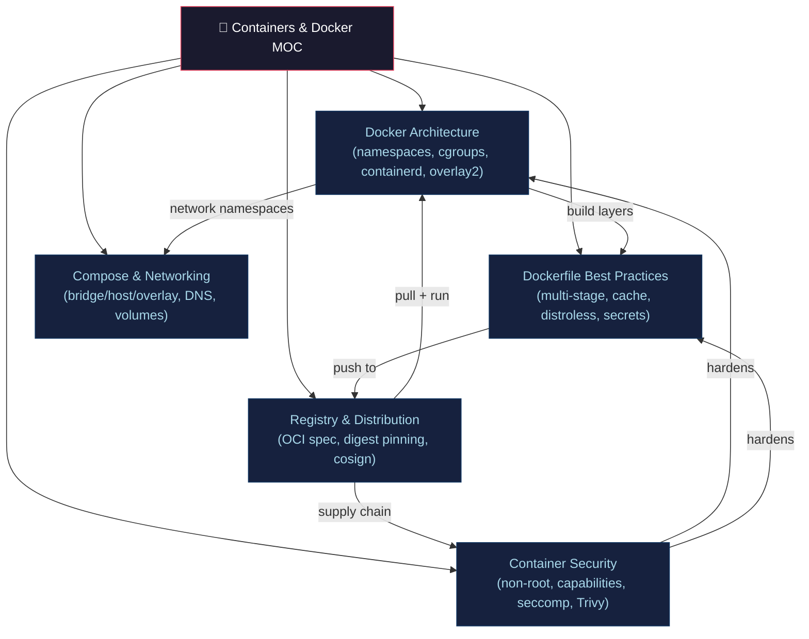

# 🐳 Containers & Docker — Section MOC

> [!abstract] Section Overview
> Containers are Linux processes with namespace isolation and cgroup resource limits — no guest kernel. Docker provides the tooling (Dockerfile, Compose, registry) on top of the OCI specs. This section covers internals, best practices, networking, security hardening, and registry distribution.

---

## Concept Map



---

## Notes in This Section

| Note | Key Concepts | Difficulty |
|------|-------------|------------|
| [[Docker_Architecture_and_Internals\|Docker Architecture]] | namespaces, cgroups, containerd, runc, overlay2, OCI | Intermediate |
| [[Dockerfile_Best_Practices\|Dockerfile Best Practices]] | multi-stage, cache ordering, base ladder, BuildKit secrets | Intermediate |
| [[Docker_Compose_and_Networking\|Docker Compose & Networking]] | Compose v3 YAML, bridge/host/overlay, DNS, volumes | Beginner |
| [[Container_Security_and_Hardening\|Container Security]] | non-root, capabilities, seccomp, AppArmor, Trivy, SBOM | Advanced |
| [[Container_Registry_and_Distribution\|Registry & Distribution]] | OCI distribution spec, digest pinning, Notary/cosign | Intermediate |

---

## Learning Path

```
Docker Architecture → Dockerfile Best Practices → Docker Compose & Networking
→ Container Registry → Container Security
```

---

## Risk Formula Reference

```
Container residual risk = R₀ × ∏(1 - mᵢ)

Where:
  R₀ = base risk score (e.g., CVE severity × exploitability)
  mᵢ = mitigation effectiveness of control i

Example: R₀=0.8, non-root(m₁=0.4), read-only-rootfs(m₂=0.3), seccomp(m₃=0.2)
Residual = 0.8 × (1-0.4) × (1-0.3) × (1-0.2)
         = 0.8 × 0.6 × 0.7 × 0.8 = 0.269
```

---

## Related Sections

- [[_MOC_DevOps_Master|↑ DevOps Master MOC]]
- [[../04_Kubernetes/_MOC_Kubernetes|→ Kubernetes]] — containers run in Pods
- [[../02_CICD_Pipelines/_MOC_CICD_Pipelines|← CI/CD Pipelines]] — build and push images

---

#DevOps #Docker #Containers #MOC
