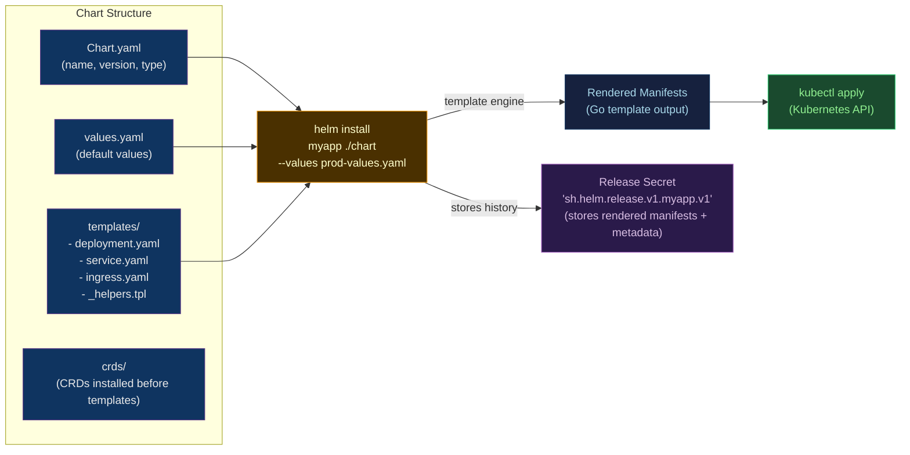

# ⛵ Helm Charts

> [!abstract] TL;DR
> Helm is the Kubernetes package manager. A **chart** = `Chart.yaml` (metadata) + `values.yaml` (defaults) + `templates/` (Go-templated K8s manifests). `helm install` renders templates with values, creates a **release** (named instance), and stores release history in cluster Secrets. `helm upgrade --atomic` rolls back automatically on failure. `helm template` renders locally for CI diff validation. `helm rollback` reverts a release. **Helmfile** manages multiple releases declaratively. OCI registries replace Helm repos.

---

## Intuition — analogy FIRST

Helm is a **recipe book for Kubernetes applications**. A chart is the recipe — `values.yaml` is the list of customizable ingredients (replicas, image tag, ingress host). `helm install` is cooking the dish with your specific ingredients. The release is the dish on your table, with its history (recipe version + ingredient list per serving). `helm rollback` returns to a previous serving. Helmfile is the **weekly meal plan** — declaring which dishes to cook across multiple kitchens.

---

## How It Works



---

## Key Concepts / Details

### Chart Structure

```
mychart/
├── Chart.yaml              # chart metadata
├── values.yaml             # default values
├── values-production.yaml  # environment overrides
├── charts/                 # chart dependencies (subcharts)
│   └── postgresql-13.1.0.tgz
├── crds/                   # CRDs (installed first, not managed by helm lifecycle)
│   └── myresource.yaml
└── templates/
    ├── _helpers.tpl         # named templates ({{ define "..." }})
    ├── deployment.yaml
    ├── service.yaml
    ├── ingress.yaml
    ├── configmap.yaml
    ├── serviceaccount.yaml
    ├── hpa.yaml
    └── NOTES.txt           # printed after install/upgrade
```

```yaml
# Chart.yaml
apiVersion: v2
name: myapp
description: My Application Helm Chart
type: application           # or: library (no templates, only helpers)
version: 0.3.1              # chart version (semver)
appVersion: "1.2.0"         # app version (informational)
maintainers:
  - name: Platform Team
    email: platform@example.com
dependencies:
  - name: postgresql
    version: "~13.1.0"
    repository: "oci://registry-1.docker.io/bitnamicharts"
    condition: postgresql.enabled   # values.postgresql.enabled=true
```

### values.yaml — Configuration Interface

```yaml
# values.yaml (defaults)
replicaCount: 2

image:
  repository: myregistry.io/myapp
  pullPolicy: IfNotPresent
  tag: ""           # overridden by CI to actual SHA

serviceAccount:
  create: true
  name: ""          # auto-generated from chart name if empty
  annotations: {}   # add IRSA annotation in AWS values

service:
  type: ClusterIP
  port: 80

ingress:
  enabled: false
  className: nginx
  hosts:
    - host: myapp.example.com
      paths:
        - path: /
          pathType: Prefix
  tls: []

resources:
  requests:
    cpu: 100m
    memory: 128Mi
  limits:
    cpu: 500m
    memory: 512Mi

autoscaling:
  enabled: false
  minReplicas: 2
  maxReplicas: 10
  targetCPUUtilizationPercentage: 70

postgresql:
  enabled: true
  auth:
    database: myapp
    username: myapp
```

### templates/ — Go Template Syntax

```yaml
# templates/deployment.yaml
{{- define "myapp.fullname" -}}
{{- printf "%s-%s" .Release.Name .Chart.Name | trunc 63 | trimSuffix "-" }}
{{- end }}

apiVersion: apps/v1
kind: Deployment
metadata:
  name: {{ include "myapp.fullname" . }}
  namespace: {{ .Release.Namespace }}
  labels:
    {{- include "myapp.labels" . | nindent 4 }}
  annotations:
    helm.sh/chart: {{ .Chart.Name }}-{{ .Chart.Version }}
spec:
  {{- if not .Values.autoscaling.enabled }}
  replicas: {{ .Values.replicaCount }}
  {{- end }}
  selector:
    matchLabels:
      {{- include "myapp.selectorLabels" . | nindent 6 }}
  template:
    metadata:
      labels:
        {{- include "myapp.selectorLabels" . | nindent 8 }}
        app.kubernetes.io/version: {{ .Values.image.tag | quote }}
    spec:
      serviceAccountName: {{ include "myapp.serviceAccountName" . }}
      containers:
        - name: {{ .Chart.Name }}
          image: "{{ .Values.image.repository }}:{{ .Values.image.tag | default .Chart.AppVersion }}"
          imagePullPolicy: {{ .Values.image.pullPolicy }}
          ports:
            - name: http
              containerPort: 8080
          resources:
            {{- toYaml .Values.resources | nindent 12 }}
      {{- with .Values.nodeSelector }}
      nodeSelector:
        {{- toYaml . | nindent 8 }}
      {{- end }}
```

**Key Go template objects:**

| Object | Description |
|--------|-------------|
| `.Values` | values.yaml contents (user-configurable) |
| `.Release.Name` | Release name (`myapp-production`) |
| `.Release.Namespace` | Target namespace |
| `.Chart.Name` | Chart name from Chart.yaml |
| `.Chart.Version` | Chart version |
| `.Files.Get "config.yaml"` | Access non-template files |
| `.Capabilities.KubeVersion.Minor` | Kubernetes version |

### Helm CLI Commands

```bash
# Install a chart
helm install myapp-prod ./mychart \
  --namespace production \
  --create-namespace \
  --values values-production.yaml \
  --set image.tag=sha256:abc123 \
  --set autoscaling.enabled=true \
  --atomic \                  # rollback on failure, fail if timeout
  --timeout 10m \
  --wait                      # wait for resources to be ready

# Upgrade existing release
helm upgrade myapp-prod ./mychart \
  --values values-production.yaml \
  --set image.tag=sha256:def456 \
  --atomic

# Preview changes (CI usage)
helm template myapp-prod ./mychart --values values-production.yaml
helm diff upgrade myapp-prod ./mychart --values values-production.yaml  # plugin

# Release management
helm list -n production
helm history myapp-prod -n production
helm rollback myapp-prod 3 -n production    # rollback to revision 3
helm status myapp-prod -n production

# Add OCI registry
helm registry login myregistry.io
helm push mychart-0.3.1.tgz oci://myregistry.io/charts/
helm install myapp-prod oci://myregistry.io/charts/mychart --version 0.3.1

# Lint and test
helm lint ./mychart
helm test myapp-prod -n production     # runs pods in templates/tests/
```

### Helmfile — Declarative Multi-Release Management

```yaml
# helmfile.yaml
repositories:
  - name: bitnami
    url: oci://registry-1.docker.io/bitnamicharts
    oci: true

environments:
  staging:
    values:
      - environments/staging/values.yaml
  production:
    values:
      - environments/production/values.yaml

releases:
  - name: myapp
    namespace: production
    chart: ./charts/myapp
    version: 0.3.1
    values:
      - values/myapp-common.yaml
      - values/myapp-{{ .Environment.Name }}.yaml
    set:
      - name: image.tag
        value: {{ requiredEnv "IMAGE_TAG" }}
    wait: true
    atomic: true

  - name: postgresql
    namespace: production
    chart: bitnami/postgresql
    version: "~13.1.0"
    values:
      - values/postgresql-{{ .Environment.Name }}.yaml
    needs:
      - production/myapp   # deploy myapp first
```

```bash
# Apply all releases
helmfile -e production sync

# Diff all releases
helmfile -e production diff

# Apply specific release
helmfile -e production -l name=myapp sync

# Template all releases
helmfile -e production template
```

### chart-testing (ct) — CI Linting and Testing

```yaml
# ct.yaml
chart-dirs: [charts]
chart-repos:
  - bitnami=https://charts.bitnami.com/bitnami
validate-maintainers: true
check-version-increment: true
```

```bash
# Lint changed charts (in CI)
ct lint --target-branch main

# Install and test in Kind cluster (CI)
kind create cluster
ct install --target-branch main
```

---

## Real-World Notes

- **`helm upgrade --install`**: Installs if release doesn't exist, upgrades if it does. Safe for idempotent CI pipelines.
- **Release history**: Helm stores release history as Kubernetes Secrets (`sh.helm.release.v1.<name>.v<revision>`). Default history is 10 revisions. Clean up: `helm upgrade --history-max 5`.
- **Values hierarchy**: `values.yaml` < `--values file.yaml` < `--set key=value`. `--set` values take highest precedence.
- **`helm template` for GitOps**: Render chart locally → commit rendered manifests → ArgoCD applies. Avoids ArgoCD needing Helm; keeps rendered YAML in Git for auditability.

---

## Common Pitfalls

1. **`--set` with complex types** — `--set ingress.tls[0].hosts[0]=example.com` syntax is fragile; use `--values` files for complex values.
2. **Subchart values isolation** — subchart values are nested: `postgresql.auth.password` in parent values.yaml, not `auth.password`.
3. **CRD upgrades** — `helm upgrade` does not upgrade CRDs in `crds/` directory (they're created once and never updated); manage CRD upgrades separately.
4. **`--atomic` hiding root cause** — `--atomic` rolls back on failure, which removes the failed resources; add `--debug` to capture the error before rollback.
5. **Version pinning omission** — `helm install bitnami/postgresql` without `--version` installs latest, breaking reproducibility; always pin chart versions.

---

## Related Concepts

- [[_MOC_Kubernetes|↑ Kubernetes MOC]]
- [[Kubernetes_Core_Concepts|← K8s Core Concepts]] — Helm templates these resources
- [[Operators_and_CRDs|→ Operators & CRDs]] — Operators often deployed via Helm
- [[../02_CICD_Pipelines/ArgoCD_and_GitOps|→ ArgoCD & GitOps]] — ArgoCD can manage Helm releases
- [[../03_Containers_Docker/Container_Registry_and_Distribution|← Registry]] — OCI Helm chart storage

---

## Review Questions

1. A `helm upgrade --atomic` fails and rolls back. How do you investigate the root cause of the failure if the resources no longer exist post-rollback?
2. Explain the difference between `.Values`, `.Release`, and `.Chart` objects in Go templates. Give a concrete example of when you'd use each.
3. Design a Helmfile configuration that deploys a PostgreSQL subchart before deploying the main application, with different replica counts for staging (2) and production (5).

---

## Sources

- helm.sh/docs
- helmfile.dev
- github.com/helm/chart-testing
- github.com/databus23/helm-diff

#DevOps #Kubernetes #Helm #Charts #GoTemplates #Helmfile #OCI #PackageManager
