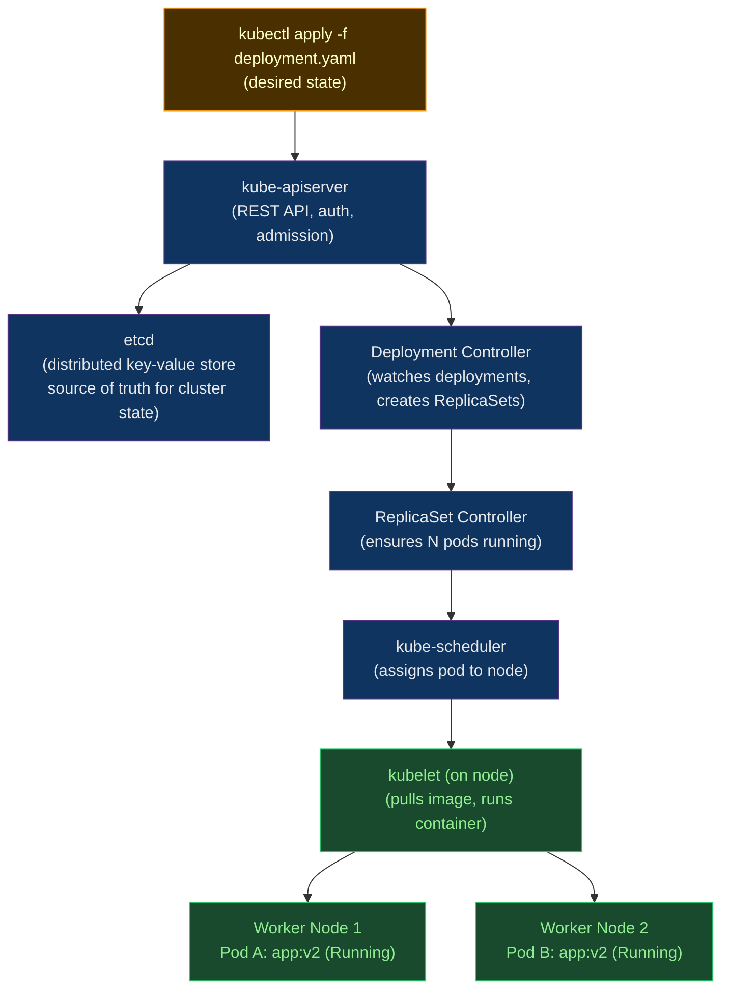

# ☸️ Kubernetes Core Concepts

> [!abstract] TL;DR
> Kubernetes is a **declarative reconciliation engine**: you specify desired state in YAML; controllers continuously reconcile actual state toward desired. The **Pod** is the smallest scheduling unit — shared network/storage namespace, one IP. Liveness probes restart sick containers (5-minute exponential backoff); readiness probes gate traffic. A **Deployment** creates a new ReplicaSet per template change, enabling RollingUpdate (`maxSurge`/`maxUnavailable`). ConfigMaps for non-secret config; Secrets (base64, not encrypted — enable etcd encryption). RBAC: ServiceAccount → RoleBinding → Role. Always set resource requests and limits.

---

## Intuition — analogy FIRST

Kubernetes is like an **HR system for containers**. You write a job description (Deployment YAML), and the HR system (controller) continuously ensures the right number of qualified workers (Pods) are on the floor. If a worker calls in sick (fails liveness), HR replaces them automatically. If a worker is training (not ready), HR doesn't send customers to them (readiness). The namespace is the department — RBAC determines who can manage which department.

---

## How It Works



---

## Key Concepts / Details

### Pod — The Atomic Unit

```yaml
apiVersion: v1
kind: Pod
metadata:
  name: myapp-pod
  namespace: production
  labels:
    app: myapp
    version: v2
spec:
  serviceAccountName: myapp-sa      # RBAC identity for this Pod

  securityContext:                  # Pod-level security
    runAsNonRoot: true
    runAsUser: 1001
    fsGroup: 1001

  containers:
    - name: app
      image: myregistry.io/myapp@sha256:abc123
      ports:
        - containerPort: 8080

      resources:                    # ALWAYS set — scheduling + QoS class
        requests:
          cpu: "100m"               # 0.1 CPU cores
          memory: "256Mi"
        limits:
          cpu: "500m"               # 0.5 CPU cores
          memory: "512Mi"

      livenessProbe:                # restart if fails (with backoff)
        httpGet:
          path: /healthz
          port: 8080
        initialDelaySeconds: 15
        periodSeconds: 10
        failureThreshold: 3         # restart after 3 consecutive failures
        # Backoff: 10s → 20s → 40s → 80s → 160s → 300s (cap)

      readinessProbe:               # gate traffic until ready
        httpGet:
          path: /ready
          port: 8080
        initialDelaySeconds: 5
        periodSeconds: 5
        failureThreshold: 2         # remove from endpoints after 2 failures

      startupProbe:                 # for slow-starting containers
        httpGet:
          path: /healthz
          port: 8080
        failureThreshold: 30        # 30 × 10s = 5 min to start
        periodSeconds: 10

      env:
        - name: DB_HOST
          valueFrom:
            secretKeyRef:
              name: db-credentials
              key: host
        - name: LOG_LEVEL
          valueFrom:
            configMapKeyRef:
              name: app-config
              key: log_level

      volumeMounts:
        - name: config
          mountPath: /etc/app/config
          readOnly: true

  volumes:
    - name: config
      configMap:
        name: app-config
```

**QoS Classes** (determined by requests/limits):
| Class | Condition | OOM Kill Priority |
|-------|-----------|------------------|
| `Guaranteed` | requests == limits for all containers | Last |
| `Burstable` | requests < limits (or only requests set) | Middle |
| `BestEffort` | No requests or limits | First |

### Deployment — Declarative Pod Management

```yaml
apiVersion: apps/v1
kind: Deployment
metadata:
  name: myapp
  namespace: production
spec:
  replicas: 3
  selector:
    matchLabels:
      app: myapp                    # must match template labels

  strategy:
    type: RollingUpdate
    rollingUpdate:
      maxSurge: 1                   # allow 1 extra pod above desired
      maxUnavailable: 0             # never reduce below desired (zero-downtime)

  template:
    metadata:
      labels:
        app: myapp
        version: v2
      annotations:
        prometheus.io/scrape: "true"
        prometheus.io/port: "8080"
    spec:
      # (pod spec here)
      topologySpreadConstraints:    # spread across zones
        - maxSkew: 1
          topologyKey: topology.kubernetes.io/zone
          whenUnsatisfiable: DoNotSchedule
          labelSelector:
            matchLabels:
              app: myapp
```

```bash
# Deployment lifecycle commands
kubectl apply -f deployment.yaml
kubectl rollout status deployment/myapp --timeout=10m
kubectl rollout history deployment/myapp
kubectl rollout undo deployment/myapp              # revert
kubectl rollout undo deployment/myapp --to-revision=5

# Update image directly
kubectl set image deployment/myapp app=myapp:v3
```

### ConfigMap and Secret

```yaml
# ConfigMap — non-sensitive configuration
apiVersion: v1
kind: ConfigMap
metadata:
  name: app-config
data:
  log_level: "info"
  max_connections: "100"
  app.properties: |                 # multi-line value
    feature.new_checkout=true
    cache.ttl=300
---
# Secret — sensitive data (base64 encoded, NOT encrypted by default!)
apiVersion: v1
kind: Secret
metadata:
  name: db-credentials
type: Opaque
data:
  host: cG9zdGdyZXM6NTQzMg==       # base64("postgres:5432")
  password: c3VwZXJzZWNyZXQ=       # base64("supersecret")
stringData:                         # auto-base64-encodes
  api_key: "actual-plaintext-key"
```

**Etcd encryption**: Secrets are stored as base64 in etcd — readable by anyone with etcd access. Enable encryption:

```yaml
# /etc/kubernetes/encryption-config.yaml
apiVersion: apiserver.config.k8s.io/v1
kind: EncryptionConfiguration
resources:
  - resources: ["secrets"]
    providers:
      - aescbc:
          keys:
            - name: key1
              secret: <base64-encoded-32-byte-key>
      - identity: {}   # fallback for reading existing unencrypted secrets
```

### RBAC — Role-Based Access Control

```yaml
# ServiceAccount — identity for Pods
apiVersion: v1
kind: ServiceAccount
metadata:
  name: myapp-sa
  namespace: production
---
# Role — namespaced permissions
apiVersion: rbac.authorization.k8s.io/v1
kind: Role
metadata:
  name: pod-reader
  namespace: production
rules:
  - apiGroups: [""]
    resources: ["pods", "pods/log"]
    verbs: ["get", "list", "watch"]
  - apiGroups: ["apps"]
    resources: ["deployments"]
    verbs: ["get", "list"]
---
# RoleBinding — connect ServiceAccount to Role
apiVersion: rbac.authorization.k8s.io/v1
kind: RoleBinding
metadata:
  name: myapp-pod-reader
  namespace: production
subjects:
  - kind: ServiceAccount
    name: myapp-sa
    namespace: production
roleRef:
  kind: Role
  name: pod-reader
  apiGroup: rbac.authorization.k8s.io
```

**ClusterRole + ClusterRoleBinding** for cluster-scoped resources (nodes, PVs, CRDs).

### Resource Management — LimitRange and ResourceQuota

```yaml
# LimitRange — default requests/limits per pod in namespace
apiVersion: v1
kind: LimitRange
metadata:
  name: default-limits
  namespace: production
spec:
  limits:
    - type: Container
      default:              # applied if not specified
        cpu: "200m"
        memory: "256Mi"
      defaultRequest:
        cpu: "100m"
        memory: "128Mi"
      max:
        cpu: "2"
        memory: "2Gi"
      min:
        cpu: "50m"
        memory: "64Mi"
---
# ResourceQuota — total resource cap for namespace
apiVersion: v1
kind: ResourceQuota
metadata:
  name: production-quota
  namespace: production
spec:
  hard:
    requests.cpu: "20"
    requests.memory: "40Gi"
    limits.cpu: "40"
    limits.memory: "80Gi"
    pods: "50"
    services: "10"
    persistentvolumeclaims: "20"
    count/deployments.apps: "20"
```

---

## Real-World Notes

- **Always set requests AND limits**: Without requests, the scheduler places pods anywhere, causing node overcommitment. Without limits, a runaway process starves neighbors.
- **Liveness vs readiness**: Misconfiguring liveness as a deep health check (DB connectivity) causes restart cascades when DB is slow — not a Pod problem. Liveness should check the process itself; readiness checks dependencies.
- **Avoid running as UID 0**: Kubernetes 1.25+ enforces `PodSecurity` admission policies. `baseline` profile blocks hostPID, hostNetwork, privileged. `restricted` profile additionally blocks non-root, adds seccomp.
- **Namespace strategy**: Don't put everything in `default`. Use namespaces for: environment (production/staging), team (team-payments/team-platform), or service boundary.

---

## Common Pitfalls

1. **Missing readiness probe** — pod is `Running` but 0 replicas in service endpoints; traffic hits 503 during deployment.
2. **OOMKilled restart loops** — memory limit too low; pod is repeatedly OOM-killed. Use `kubectl describe pod` to see `OOMKilled` in Last State.
3. **`latest` image tag** — Kubernetes caches by tag; `imagePullPolicy: IfNotPresent` + `:latest` means new pushes don't reach running pods.
4. **Secrets in ConfigMaps** — easy mistake; ConfigMaps are readable by anyone who can `get configmaps`; Secrets have RBAC separation.
5. **Deployment selector mutation** — you can't change `spec.selector` on a Deployment; must delete and recreate, causing downtime.

---

## Related Concepts

- [[_MOC_Kubernetes|↑ Kubernetes MOC]]
- [[Kubernetes_Networking_and_Ingress|→ K8s Networking]] — Services expose Pods
- [[Storage_and_StatefulSets|→ Storage & StatefulSets]] — PVCs attach to Pods
- [[Helm_Charts|→ Helm Charts]] — template Deployment YAML
- [[../03_Containers_Docker/Container_Security_and_Hardening|← Container Security]] — securityContext origins

---

## Review Questions

1. A pod shows `CrashLoopBackOff`. Walk through the complete diagnostic procedure using only `kubectl` commands.
2. A Deployment has `maxSurge: 0, maxUnavailable: 1` and 10 replicas. How many pods are available to serve traffic at the worst point during a rolling update?
3. Design the RBAC setup for: a `deploy-bot` ServiceAccount that can update Deployments in `production` namespace but cannot delete them or access Secrets.

---

## Sources

- kubernetes.io/docs/concepts/
- kubernetes.io/docs/concepts/security/rbac-good-practices/
- CKAD/CKA curriculum

#DevOps #Kubernetes #CoreConcepts #Pod #Deployment #RBAC #ConfigMap #ResourceQuota
