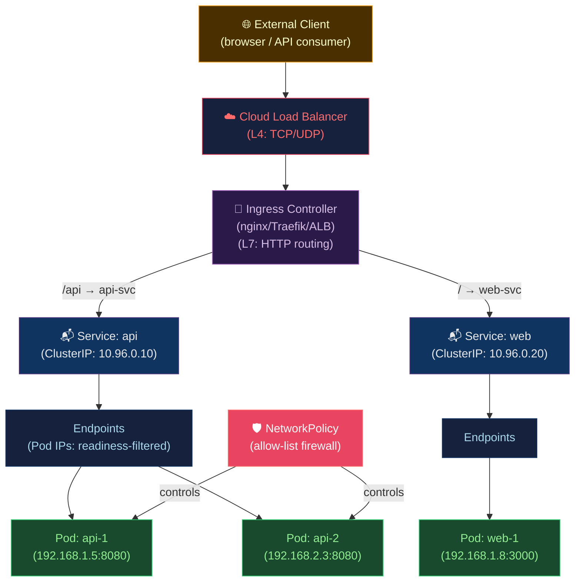

# 🌐 Kubernetes Networking and Ingress

> [!abstract] TL;DR
> Kubernetes networking mandates: every Pod gets a **unique routable IP**, all Pods can communicate without NAT, nodes can reach Pods. **CNI plugins** implement this: Flannel (VXLAN overlay), Calico (BGP routing, NetworkPolicy), Cilium (eBPF, L7 visibility). **Services** provide stable VIPs over readiness-filtered endpoints: ClusterIP (internal), NodePort (external via node port 30000–32767), LoadBalancer (cloud LB), ExternalName (CNAME). `kube-proxy` implements service IPs via iptables (O(n) rule chains) or IPVS (O(1) hash tables). **CoreDNS** resolves `svc.cluster.local`. **Ingress** does L7 HTTP routing; **Gateway API** is the successor with richer routing semantics.

---

## Intuition — analogy FIRST

Kubernetes networking is a **city's postal system**. Every Pod has a house address (Pod IP). Services are **post office boxes** (stable VIP) — the actual residents (Pods) can move, but mail always goes to the same PO box, which forwards to current residents. kube-proxy is the postal clerk routing letters via a directory (iptables rules or IPVS table). CoreDNS is the phone book that translates `my-service.my-namespace` into the PO box number. Ingress is the **front-door receptionist** who reads the "To: /api vs /web" on the envelope and sends it to the right floor.

---

## How It Works



---

## Key Concepts / Details

### CNI Plugin Comparison

| Plugin | Routing Model | NetworkPolicy | Performance | Use Case |
|--------|--------------|---------------|-------------|---------|
| **Flannel** | VXLAN overlay | No (need Calico) | Good | Simple clusters, learning |
| **Calico** | BGP (L3) or VXLAN | Yes (full) | Excellent | Production, bare-metal |
| **Cilium** | eBPF (bypass iptables) | Yes (L3-L7) | Best | High-perf, L7 visibility |
| **Weave** | VXLAN mesh | Yes | Good | Multi-cloud |

**Cilium eBPF advantage**: Bypasses iptables entirely — each packet is processed in kernel eBPF programs at the socket level, reducing latency by 30–40% vs iptables-based CNI.

### Service Types

```yaml
# ClusterIP — internal only (default)
apiVersion: v1
kind: Service
metadata:
  name: api
  namespace: production
spec:
  type: ClusterIP
  selector:
    app: myapp              # selects Pods by label
  ports:
    - port: 80              # service port
      targetPort: 8080      # container port
      protocol: TCP
# DNS: api.production.svc.cluster.local → 10.96.0.10
---
# NodePort — expose on every node's port (30000-32767)
spec:
  type: NodePort
  ports:
    - port: 80
      targetPort: 8080
      nodePort: 30080       # optional: auto-assigned if omitted
---
# LoadBalancer — cloud provider creates external LB
spec:
  type: LoadBalancer
  loadBalancerSourceRanges: ["203.0.113.0/24"]  # restrict source IPs
  ports:
    - port: 443
      targetPort: 8443
---
# ExternalName — CNAME to external service
spec:
  type: ExternalName
  externalName: mydb.us-east-1.rds.amazonaws.com
---
# Headless — no ClusterIP, DNS returns Pod IPs directly
spec:
  clusterIP: None           # headless: for StatefulSets
```

### kube-proxy: iptables vs IPVS

```bash
# iptables mode (default, O(n) rule lookup)
# For each service, kube-proxy inserts iptables DNAT rules
# 1000 services = 1000+ iptables rules traversed per packet
# Rule processing is linear: O(n) — scales poorly

# IPVS mode (O(1) hash table lookup)
# Uses Linux Virtual Server (ipvs) kernel module
# Supports: rr, lc, dh, sh, sed, nq load-balancing algorithms
kubectl edit configmap kube-proxy -n kube-system
# Change: mode: "ipvs"
# Add: ipvs.scheduler: "rr"  # round-robin

# Check current mode
kubectl get configmap kube-proxy -n kube-system -o yaml | grep mode
```

**Performance**: At 10,000 services, iptables mode adds ~10ms latency per packet. IPVS stays constant at <1ms.

### CoreDNS — DNS-Based Service Discovery

```
DNS name pattern: <service>.<namespace>.svc.cluster.local

Examples:
  api.production.svc.cluster.local    → ClusterIP of 'api' Service
  api.production.svc                  → same (cluster.local appended)
  api.production                      → same (svc.cluster.local appended)
  api                                 → if calling from same namespace

# Headless Service (StatefulSet): per-Pod DNS records
  web-0.web.default.svc.cluster.local → Pod IP of web-0
  web-1.web.default.svc.cluster.local → Pod IP of web-1
```

```yaml
# CoreDNS ConfigMap customization
apiVersion: v1
kind: ConfigMap
metadata:
  name: coredns
  namespace: kube-system
data:
  Corefile: |
    .:53 {
        errors
        health
        kubernetes cluster.local in-addr.arpa ip6.arpa {
          pods insecure
          fallthrough in-addr.arpa ip6.arpa
        }
        prometheus :9153
        forward . /etc/resolv.conf    # forward non-cluster DNS to host
        cache 30
        loop
        reload
        loadbalance
    }
    # Custom stub zone for internal corporate DNS
    corp.example.com:53 {
        forward . 10.0.0.53
    }
```

### Ingress — L7 HTTP Routing

```yaml
# nginx Ingress
apiVersion: networking.k8s.io/v1
kind: Ingress
metadata:
  name: myapp-ingress
  namespace: production
  annotations:
    nginx.ingress.kubernetes.io/rewrite-target: /
    nginx.ingress.kubernetes.io/ssl-redirect: "true"
    nginx.ingress.kubernetes.io/rate-limit: "100"          # RPS per client
    cert-manager.io/cluster-issuer: "letsencrypt-prod"    # auto TLS
spec:
  ingressClassName: nginx
  tls:
    - hosts: ["api.example.com"]
      secretName: api-tls
  rules:
    - host: api.example.com
      http:
        paths:
          - path: /api
            pathType: Prefix
            backend:
              service:
                name: api
                port:
                  number: 80
          - path: /
            pathType: Prefix
            backend:
              service:
                name: web
                port:
                  number: 80
```

### Gateway API — The Ingress Successor

```yaml
# Gateway API (kubernetes-sigs/gateway-api)
# Roles: infrastructure provider → Gateway; developer → HTTPRoute

# GatewayClass (infrastructure, managed by platform team)
apiVersion: gateway.networking.k8s.io/v1
kind: GatewayClass
metadata:
  name: nginx-gateway
spec:
  controllerName: "k8s.nginx.org/nginx-gateway-controller"
---
# Gateway (created by platform team)
apiVersion: gateway.networking.k8s.io/v1
kind: Gateway
metadata:
  name: prod-gateway
  namespace: infra
spec:
  gatewayClassName: nginx-gateway
  listeners:
    - name: https
      port: 443
      protocol: HTTPS
      tls:
        certificateRefs:
          - name: prod-tls
      allowedRoutes:
        namespaces:
          from: All             # allow routes from any namespace
---
# HTTPRoute (created by app team, in their namespace)
apiVersion: gateway.networking.k8s.io/v1
kind: HTTPRoute
metadata:
  name: api-route
  namespace: production
spec:
  parentRefs:
    - name: prod-gateway
      namespace: infra
  hostnames: ["api.example.com"]
  rules:
    - matches:
        - path:
            type: PathPrefix
            value: /api/v2
      filters:
        - type: RequestHeaderModifier
          requestHeaderModifier:
            add:
              - name: X-Version
                value: "v2"
      backendRefs:
        - name: api-v2
          port: 80
          weight: 90
        - name: api-v1
          port: 80
          weight: 10            # canary: 10% to v1
```

### NetworkPolicy — Pod-Level Firewall

```yaml
# Deny all ingress by default (then allow selectively)
apiVersion: networking.k8s.io/v1
kind: NetworkPolicy
metadata:
  name: default-deny-ingress
  namespace: production
spec:
  podSelector: {}               # applies to all pods in namespace
  policyTypes: [Ingress]
---
# Allow api pods to receive traffic from nginx ingress only
apiVersion: networking.k8s.io/v1
kind: NetworkPolicy
metadata:
  name: allow-ingress-to-api
  namespace: production
spec:
  podSelector:
    matchLabels:
      app: api
  policyTypes: [Ingress]
  ingress:
    - from:
        - namespaceSelector:
            matchLabels:
              kubernetes.io/metadata.name: ingress-nginx
          podSelector:
            matchLabels:
              app.kubernetes.io/name: ingress-nginx
      ports:
        - port: 8080
```

---

## Real-World Notes

- **Cilium's Hubble** provides real-time network visibility (which pods communicate with which, at L7). Invaluable for auditing and debugging NetworkPolicies.
- **Service topology awareness**: With `topologyKeys`, Kubernetes prefers endpoints on the same node (or zone), reducing cross-AZ traffic costs. Now replaced by **EndpointSliceTerminatingCondition** and topology hints.
- **cert-manager**: Automates TLS certificate provisioning from Let's Encrypt or internal CAs. Works with both Ingress and Gateway API.
- **ExternalDNS**: Automatically creates DNS records in Route53/Cloud DNS/etc. based on Service/Ingress annotations — eliminates manual DNS management.

---

## Common Pitfalls

1. **No NetworkPolicy** — by default, all Pods can talk to all other Pods in the cluster; implement default-deny from day one.
2. **Service selecting wrong Pods** — label selector must exactly match Pod labels; debug with `kubectl get endpoints my-service`.
3. **Ingress without IngressClass** — after K8s 1.18, IngressClass is required; using default class annotation without it causes orphaned Ingress resources.
4. **Headless service + StatefulSet DNS not resolving** — Pod must be Running AND have an IP for its DNS record to exist; check pod readiness.
5. **NodePort on cloud provider** — NodePort exposes pods via each node's public IP on a high port; nodes with public IPs is a security exposure; use LoadBalancer instead.

---

## Related Concepts

- [[_MOC_Kubernetes|↑ Kubernetes MOC]]
- [[Kubernetes_Core_Concepts|← K8s Core Concepts]] — Services route to Pods
- [[Storage_and_StatefulSets|→ Storage & StatefulSets]] — headless services for StatefulSets
- [[../07_Monitoring_Observability/Prometheus_and_Alertmanager|→ Prometheus]] — scrapes via Service/PodMonitor

---

## Review Questions

1. A Service has 5 healthy pods but `kubectl get endpoints my-service` shows 0 endpoints. What are the three most common causes?
2. Explain why iptables-based kube-proxy becomes a performance bottleneck at 5000+ services, and how IPVS mode solves this.
3. Design a NetworkPolicy that allows: `frontend` pods → `api` pods (port 8080 only), `api` pods → `db` pods (port 5432 only), deny all other traffic.

---

## Sources

- kubernetes.io/docs/concepts/services-networking/
- cilium.io — eBPF networking
- gateway-api.sigs.k8s.io
- coredns.io

#DevOps #Kubernetes #Networking #CNI #Services #Ingress #CoreDNS #GatewayAPI #NetworkPolicy
