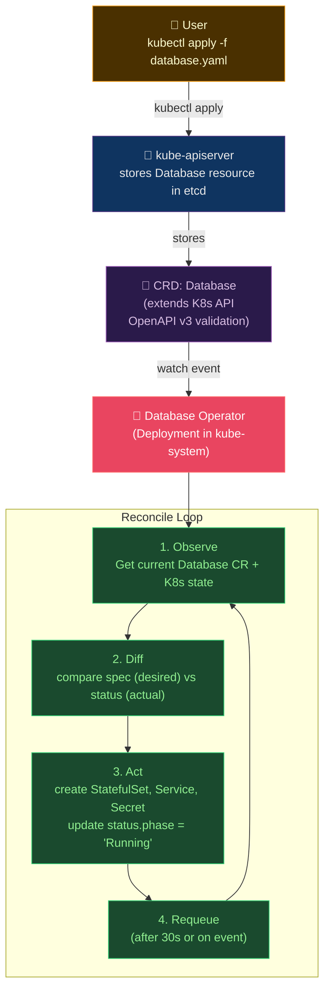

# 🤖 Operators and CRDs

> [!abstract] TL;DR
> A **CRD** (CustomResourceDefinition) extends the Kubernetes API with domain-specific types (e.g., `Database`, `KafkaTopic`). An **Operator** is a controller that reconciles instances of a CRD — implementing the **operator pattern**: observe → diff → act, repeating until desired == actual (idempotent, level-triggered, not edge-triggered). `spec` is user-owned (desired state); `status` is controller-owned (actual state). Built with **Kubebuilder** or **Operator SDK**. Advanced: conversion webhooks (CRD version migration), leader election (Lease), OLM/OperatorHub for distribution.

---

## Intuition — analogy FIRST

Think of a CRD as a **new species of bureaucratic form** that Kubernetes has never seen before. The Operator is the **specialist civil servant** who knows exactly what to do with that form — they read the request (spec), check current reality (status), and take actions to make reality match the request. Crucially, they don't just act once — they continuously watch for drift and re-correct. This is "level-triggered" control: they respond to **the current state**, not just to changes, so missed events don't cause permanent divergence.

---

## How It Works



---

## Key Concepts / Details

### CustomResourceDefinition

```yaml
apiVersion: apiextensions.k8s.io/v1
kind: CustomResourceDefinition
metadata:
  name: databases.mycompany.io    # plural.group
spec:
  group: mycompany.io
  names:
    kind: Database
    listKind: DatabaseList
    plural: databases
    singular: database
    shortNames: [db]
  scope: Namespaced               # or: Cluster (cluster-scoped resource)
  versions:
    - name: v1alpha1
      served: true
      storage: true               # only one version can be storage version
      schema:
        openAPIV3Schema:          # validation schema
          type: object
          properties:
            spec:
              type: object
              required: [engine, version, storage]
              properties:
                engine:
                  type: string
                  enum: [postgres, mysql, redis]
                version:
                  type: string
                  pattern: '^\d+\.\d+$'
                storage:
                  type: string
                replicas:
                  type: integer
                  minimum: 1
                  maximum: 10
                  default: 1
            status:
              type: object
              properties:
                phase:
                  type: string
                  enum: [Pending, Provisioning, Running, Failed]
                connectionString:
                  type: string
                conditions:
                  type: array
                  items:
                    type: object
      additionalPrinterColumns:   # kubectl get databases output columns
        - name: Engine
          type: string
          jsonPath: .spec.engine
        - name: Phase
          type: string
          jsonPath: .status.phase
        - name: Age
          type: date
          jsonPath: .metadata.creationTimestamp
      subresources:
        status: {}                # enables /status subresource (separate RBAC)
        scale:                   # enables /scale subresource (kubectl scale)
          specReplicasPath: .spec.replicas
          statusReplicasPath: .status.replicas
```

### Custom Resource Instance

```yaml
# User creates an instance of the CRD
apiVersion: mycompany.io/v1alpha1
kind: Database
metadata:
  name: payments-db
  namespace: production
spec:
  engine: postgres
  version: "16.1"
  storage: "100Gi"
  replicas: 3
# Operator fills in status:
status:
  phase: Running
  connectionString: "postgres://payments-db.production.svc.cluster.local:5432/payments"
  conditions:
    - type: Ready
      status: "True"
      lastTransitionTime: "2026-07-26T10:00:00Z"
      reason: AllReplicasReady
      message: "All 3 replicas are ready"
```

### Kubebuilder — Build an Operator

```bash
# Initialize project
kubebuilder init --domain mycompany.io --repo github.com/org/database-operator

# Create API (CRD + Controller scaffolding)
kubebuilder create api --group mycompany --version v1alpha1 --kind Database

# Project structure
.
├── api/v1alpha1/
│   ├── database_types.go       # CRD struct definition
│   └── groupversion_info.go
├── controllers/
│   ├── database_controller.go  # reconcile logic
│   └── suite_test.go
├── config/
│   ├── crd/                    # generated CRD YAML
│   ├── rbac/                   # RBAC for operator
│   └── manager/                # operator Deployment
└── main.go                     # controller manager setup
```

```go
// controllers/database_controller.go
package controllers

import (
    ctrl "sigs.k8s.io/controller-runtime"
    mycompanyv1alpha1 "github.com/org/database-operator/api/v1alpha1"
)

type DatabaseReconciler struct {
    client.Client
    Scheme *runtime.Scheme
}

// +kubebuilder:rbac:groups=mycompany.io,resources=databases,verbs=get;list;watch;create;update;patch;delete
// +kubebuilder:rbac:groups=mycompany.io,resources=databases/status,verbs=get;update;patch
// +kubebuilder:rbac:groups=apps,resources=statefulsets,verbs=get;list;watch;create;update;patch;delete

func (r *DatabaseReconciler) Reconcile(ctx context.Context, req ctrl.Request) (ctrl.Result, error) {
    log := log.FromContext(ctx)

    // 1. OBSERVE: fetch the Database CR
    db := &mycompanyv1alpha1.Database{}
    if err := r.Get(ctx, req.NamespacedName, db); err != nil {
        if errors.IsNotFound(err) {
            return ctrl.Result{}, nil   // deleted, nothing to do
        }
        return ctrl.Result{}, err
    }

    // 2. Handle deletion (finalizers)
    if !db.DeletionTimestamp.IsZero() {
        return r.handleDeletion(ctx, db)
    }

    // 3. DIFF: check if StatefulSet exists
    sts := &appsv1.StatefulSet{}
    err := r.Get(ctx, types.NamespacedName{Name: db.Name, Namespace: db.Namespace}, sts)
    if errors.IsNotFound(err) {
        // 4. ACT: create StatefulSet
        newSts := r.statefulSetForDatabase(db)
        if err := r.Create(ctx, newSts); err != nil {
            return ctrl.Result{}, err
        }
        log.Info("Created StatefulSet", "name", db.Name)
    } else if err != nil {
        return ctrl.Result{}, err
    } else {
        // ACT: update if spec changed
        if !reflect.DeepEqual(sts.Spec, expectedSpec) {
            sts.Spec = expectedSpec
            if err := r.Update(ctx, sts); err != nil {
                return ctrl.Result{}, err
            }
        }
    }

    // 5. Update status
    db.Status.Phase = "Running"
    if err := r.Status().Update(ctx, db); err != nil {
        return ctrl.Result{}, err
    }

    // 6. REQUEUE after 30s (level-triggered: re-check even without events)
    return ctrl.Result{RequeueAfter: 30 * time.Second}, nil
}
```

### Spec vs Status — Owner Semantics

| Field | Owner | Meaning |
|-------|-------|---------|
| `spec` | User | What the user wants (desired state) |
| `status` | Controller | What actually exists (observed state) |

**Rule**: Controllers should ONLY write to `status`, never to `spec`. Users write to `spec`. This separation enables safe concurrent access and GitOps compatibility.

### Leader Election — Multi-Replica Operators

```go
// main.go
mgr, err := ctrl.NewManager(ctrl.GetConfigOrDie(), ctrl.Options{
    LeaderElection:          true,
    LeaderElectionID:        "database-operator-leader",
    // Uses Lease resource in kube-system for election
    // Only one replica is active at a time
    LeaderElectionNamespace: "kube-system",
    LeaseDuration:           &leaseDuration,   // 15s default
    RenewDeadline:           &renewDeadline,   // 10s default
    RetryPeriod:             &retryPeriod,     // 2s default
})
```

### Conversion Webhooks — CRD Version Migration

```yaml
# When promoting v1alpha1 → v1beta1 → v1
# Old objects stored as v1alpha1 need to be served as v1beta1

apiVersion: apiextensions.k8s.io/v1
kind: CustomResourceDefinition
spec:
  conversion:
    strategy: Webhook
    webhook:
      clientConfig:
        service:
          name: database-operator-webhook
          namespace: kube-system
          path: /convert
      conversionReviewVersions: [v1]
```

### Level-Triggered vs Edge-Triggered

```
Edge-triggered (BAD for operators):
  Event fires ONCE when state changes
  If event missed → permanent divergence
  Example: "fire when pod count drops below 3"

Level-triggered (GOOD for operators):
  Controller checks CURRENT state, not just events
  Missed event → recovers on next reconcile
  Example: "ensure pod count == 3" (checks on every reconcile)

Result: requeueAfter + watch-based triggers = eventually consistent self-healing
```

### OLM — Operator Lifecycle Manager

```yaml
# OperatorHub.io: 300+ community operators
# Install an operator via OLM:
apiVersion: operators.coreos.com/v1alpha1
kind: Subscription
metadata:
  name: prometheus-operator
  namespace: monitoring
spec:
  channel: stable
  name: prometheus
  source: operatorhubio-catalog
  sourceNamespace: olm
  installPlanApproval: Manual   # Manual vs Automatic upgrade approval
```

---

## Real-World Notes

- **Production operators use Kubebuilder + controller-gen**: The `+kubebuilder:rbac:...` comments are code markers that `controller-gen` reads to auto-generate RBAC YAML. This ensures RBAC stays synchronized with the code.
- **Finalizers for cleanup**: Add a finalizer to your CR to ensure cleanup logic runs before deletion. Without it, deleting a `Database` CR might leave a running StatefulSet.
- **Operator SDK adds Ansible/Helm support**: If you don't want to write Go, Operator SDK supports Helm and Ansible as the reconcile logic.
- **Owning child resources**: Use `ctrl.SetControllerReference(owner, child, r.Scheme)` to set ownership — child resources are automatically garbage-collected when the owner is deleted.

---

## Common Pitfalls

1. **No status subresource** — without `subresources: status: {}`, updating status via `r.Update()` also updates spec, causing conflicts; always use `r.Status().Update()`.
2. **Edge-triggered reconcile** — only reacting to watch events without periodic requeue misses drift; always add `RequeueAfter`.
3. **Missing RBAC for child resources** — operator fails to create StatefulSets with `Forbidden`; add all child resource types to `+kubebuilder:rbac` markers.
4. **Runaway reconcile loops** — reconcile that always finds diff (because status.conditions timestamp changes) causes infinite requeue; use `reflect.DeepEqual` carefully.
5. **No CRD validation schema** — users can apply invalid CR specs; missing `openAPIV3Schema` allows garbage values that crash the operator.

---

## Related Concepts

- [[_MOC_Kubernetes|↑ Kubernetes MOC]]
- [[Kubernetes_Core_Concepts|← K8s Core Concepts]] — CRDs extend the K8s API
- [[Helm_Charts|← Helm Charts]] — operators commonly installed via Helm
- [[../02_CICD_Pipelines/ArgoCD_and_GitOps|→ ArgoCD]] — ArgoCD itself is implemented as an operator

---

## Review Questions

1. Explain why a controller that only reacts to watch events (edge-triggered) is less reliable than one that also requeues periodically (level-triggered).
2. A user deletes a `Database` CR but the underlying StatefulSet and PVCs remain. What Kubernetes mechanism should the operator use to prevent this, and what are the exact steps?
3. You need to migrate your CRD from v1alpha1 to v1beta1 with a different field structure (e.g., `spec.size` → `spec.storage.size`). What mechanism handles serving old objects via the new schema?

---

## Sources

- book.kubebuilder.io
- sdk.operatorframework.io
- operatorhub.io
- "Programming Kubernetes" by Michael Hausenblas & Stefan Schimanski

#DevOps #Kubernetes #Operators #CRD #Kubebuilder #ReconcileLoop #LeaderElection #OLM
