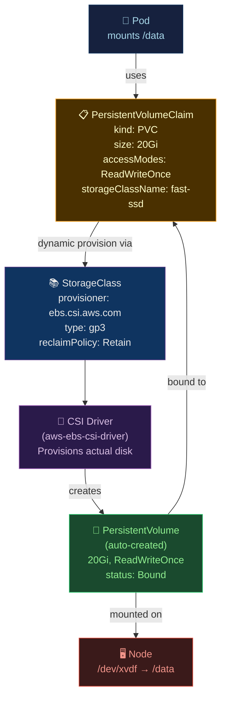

# 💾 Storage and StatefulSets

> [!abstract] TL;DR
> Kubernetes separates storage **provisioning** (PersistentVolume) from **consumption** (PersistentVolumeClaim). StorageClass enables **dynamic provisioning** via CSI drivers. **StatefulSets** provide ordered deployment, stable network identities (`web-0`, `web-1`), and per-pod PVCs — essential for databases and message queues. Pods bind to PVCs; PVCs bind to PVs with matching access modes and storage class. **PodDisruptionBudget** limits voluntary disruptions (node drains, upgrades) to protect availability.

---

## Intuition — analogy FIRST

PersistentVolumes are **pre-built storage units** in a warehouse. PersistentVolumeClaims are **reservation tickets** — you specify size and access mode, and the warehouse (Kubernetes) assigns you a matching unit. StorageClass is the **storage tier catalog** (SSD, HDD, replicated, local) — dynamic provisioning means the warehouse automatically builds a new unit to your spec when you place a ticket. StatefulSets are for **numbered offices** (pod-0, pod-1) where each office has its own dedicated storage — move the worker, keep the office intact.

---

## How It Works



---

## Key Concepts / Details

### PersistentVolume and PersistentVolumeClaim

```yaml
# StorageClass (defined by platform team)
apiVersion: storage.k8s.io/v1
kind: StorageClass
metadata:
  name: fast-ssd
  annotations:
    storageclass.kubernetes.io/is-default-class: "true"   # default SC
provisioner: ebs.csi.aws.com
parameters:
  type: gp3
  iops: "3000"
  throughput: "125"
  encrypted: "true"
  kmsKeyId: "arn:aws:kms:us-east-1:123:key/abc"
reclaimPolicy: Retain        # Retain (keep PV when PVC deleted) or Delete
allowVolumeExpansion: true   # allow PVC resize
volumeBindingMode: WaitForFirstConsumer  # bind only when pod is scheduled (zone-aware)
---
# PersistentVolumeClaim (requested by dev team)
apiVersion: v1
kind: PersistentVolumeClaim
metadata:
  name: database-storage
  namespace: production
spec:
  accessModes:
    - ReadWriteOnce        # single node read-write
    # ReadOnlyMany:        # multiple nodes read-only
    # ReadWriteMany:       # multiple nodes read-write (NFS, EFS)
    # ReadWriteOncePod:    # single pod only (K8s 1.22+)
  storageClassName: fast-ssd
  resources:
    requests:
      storage: 100Gi
  # Resize: just increase storage request and apply
  # Requires allowVolumeExpansion: true on StorageClass
```

```bash
# Check PVC status
kubectl get pvc -n production
# NAME                STATUS   VOLUME           CAPACITY   ACCESS MODES
# database-storage    Bound    pvc-abc123       100Gi      RWO

# Resize PVC (online resize for supported CSI drivers)
kubectl patch pvc database-storage -p '{"spec":{"resources":{"requests":{"storage":"200Gi"}}}}'

# Check PV reclaim policy
kubectl get pv pvc-abc123 -o yaml | grep reclaimPolicy
```

### StatefulSet — Ordered, Stable Identity

```yaml
apiVersion: apps/v1
kind: StatefulSet
metadata:
  name: postgres
  namespace: production
spec:
  serviceName: postgres      # must reference a headless service
  replicas: 3
  selector:
    matchLabels:
      app: postgres

  # Ordered deployment: postgres-0 → postgres-1 → postgres-2
  # Ordered deletion (reverse): postgres-2 → postgres-1 → postgres-0
  podManagementPolicy: OrderedReady   # or Parallel (for peer discovery apps)
  updateStrategy:
    type: RollingUpdate
    rollingUpdate:
      partition: 0           # only update pods >= partition index (canary updates)

  template:
    metadata:
      labels:
        app: postgres
    spec:
      containers:
        - name: postgres
          image: postgres:16-alpine
          env:
            - name: POSTGRES_PASSWORD
              valueFrom:
                secretKeyRef:
                  name: postgres-secret
                  key: password
            - name: POD_NAME
              valueFrom:
                fieldRef:
                  fieldPath: metadata.name   # → "postgres-0"
          volumeMounts:
            - name: data
              mountPath: /var/lib/postgresql/data

  volumeClaimTemplates:           # per-pod PVCs created automatically
    - metadata:
        name: data
      spec:
        accessModes: [ReadWriteOnce]
        storageClassName: fast-ssd
        resources:
          requests:
            storage: 100Gi

# Results in: postgres-0/data-postgres-0, postgres-1/data-postgres-1, etc.
# PVCs survive pod deletion (must manually delete PVCs to free storage)
---
# Headless Service for StatefulSet DNS
apiVersion: v1
kind: Service
metadata:
  name: postgres
  namespace: production
spec:
  clusterIP: None              # headless
  selector:
    app: postgres
  ports:
    - port: 5432
# DNS records: postgres-0.postgres.production.svc.cluster.local
#              postgres-1.postgres.production.svc.cluster.local
```

### StatefulSet vs Deployment

| Feature | Deployment | StatefulSet |
|---------|-----------|-------------|
| Pod names | Random suffix (myapp-7d4f9b-xyz) | Stable ordinal (web-0, web-1) |
| Pod DNS | Not stable | Stable (web-0.web.default.svc...) |
| Storage | Shared volume or none | Per-pod PVC (stable) |
| Update order | Unordered | Ordered (reverse for delete) |
| Scale down | Random pod removed | Highest ordinal removed first |
| Use case | Stateless apps | Databases, Kafka, ZooKeeper, etcd |

### PodDisruptionBudget — Availability During Maintenance

```yaml
apiVersion: policy/v1
kind: PodDisruptionBudget
metadata:
  name: postgres-pdb
  namespace: production
spec:
  selector:
    matchLabels:
      app: postgres

  # Either minAvailable OR maxUnavailable (not both)
  minAvailable: 2              # at least 2 pods must remain available
  # maxUnavailable: 1          # at most 1 pod can be unavailable at a time

# PDB is respected by:
# - kubectl drain (node upgrade/maintenance)
# - Cluster Autoscaler (scale-down decisions)
# - Eviction API (voluntary evictions)
# NOT respected by:
# - Node failures (involuntary disruptions)
# - OOM kills
```

```bash
# PDB prevents draining if it would violate the budget
kubectl drain node-1 --ignore-daemonsets --delete-emptydir-data
# Error: Cannot evict pod as it would violate the pod's disruption budget.

# Check disruption budget status
kubectl get pdb -n production
# NAME            MIN-AVAILABLE   MAX-UNAVAILABLE   ALLOWED-DISRUPTIONS
# postgres-pdb    2               N/A               1
```

### CSI — Container Storage Interface

```bash
# Install AWS EBS CSI Driver (for EKS)
helm repo add aws-ebs-csi-driver https://kubernetes-sigs.github.io/aws-ebs-csi-driver
helm install aws-ebs-csi-driver aws-ebs-csi-driver/aws-ebs-csi-driver \
  --namespace kube-system \
  --set controller.serviceAccount.annotations."eks\.amazonaws\.com/role-arn"=arn:aws:iam::123:role/ebs-csi-role

# List CSI drivers
kubectl get csidriver

# Check CSI node availability
kubectl get csinodes
```

**Popular CSI Drivers:**

| Driver | Provisioner | Use Case |
|--------|-------------|---------|
| AWS EBS | `ebs.csi.aws.com` | RWO block storage (single AZ) |
| AWS EFS | `efs.csi.aws.com` | RWX network file system |
| GCP PD | `pd.csi.storage.gke.io` | RWO block storage |
| Azure Disk | `disk.csi.azure.com` | RWO block storage |
| Rook-Ceph | `rook-ceph.rbd.csi.ceph.com` | RWO/RWX block + object |
| NFS | `nfs.csi.k8s.io` | RWX (multi-pod) |
| local-path | `rancher.io/local-path` | Fast local storage (dev/test) |

### Volume Types Summary

```yaml
spec:
  volumes:
    # ConfigMap as file
    - name: config
      configMap:
        name: app-config
        defaultMode: 0400         # read-only for owner

    # Secret as file (memory-mapped, never touches disk on tmpfs-supported clusters)
    - name: secrets
      secret:
        secretName: app-secrets
        defaultMode: 0400

    # EmptyDir: shared ephemeral storage between containers in same Pod
    - name: shared-data
      emptyDir:
        medium: Memory            # or "" for disk-backed
        sizeLimit: 1Gi

    # HostPath: mount host directory (use only for DaemonSets)
    - name: host-logs
      hostPath:
        path: /var/log
        type: Directory

    # Projected: combine multiple sources
    - name: combined
      projected:
        sources:
          - serviceAccountToken:
              audience: api
              expirationSeconds: 3600
              path: token
          - configMap:
              name: app-config
          - secret:
              name: app-secrets
```

---

## Real-World Notes

- **WaitForFirstConsumer binding**: Critical for multi-AZ clusters — ensures the PV is created in the same zone as the Pod. Without it, PV may be in us-east-1a but Pod scheduled on us-east-1b node.
- **StatefulSet partition updates**: Set `partition: 2` on a 3-replica StatefulSet to update only pod-2 first (canary). Verify, then set partition to 0 to update all.
- **PVC won't delete while Pod uses it**: PVC has a finalizer `kubernetes.io/pvc-protection`. Termination waits until all pods using it are deleted. Good for accident prevention.
- **Database backups before StatefulSet updates**: Use `kubectl exec postgres-0 -- pg_dump` or backup CronJob before any StatefulSet update. The PDB prevents simultaneous pod loss but doesn't protect against application-level errors.

---

## Common Pitfalls

1. **RWO PVC in two zones** — `EBS` is AZ-specific; if a pod is rescheduled to a different AZ, PVC won't mount. Use `volumeBindingMode: WaitForFirstConsumer`.
2. **StatefulSet scale-down losing the wrong pod** — Kubernetes removes highest ordinal first; this is correct behavior but surprises teams expecting random removal.
3. **PVC not shrinking** — Kubernetes supports volume expansion but NOT shrinking; plan initial sizing carefully.
4. **emptyDir disappears on pod restart** — `emptyDir` volumes survive container restarts but not pod deletion; use PVC for persistent data.
5. **PDB blocking cluster upgrades** — if `minAvailable = replicas`, voluntary eviction is impossible; always leave room for at least 1 disruption.

---

## Related Concepts

- [[_MOC_Kubernetes|↑ Kubernetes MOC]]
- [[Kubernetes_Core_Concepts|← K8s Core Concepts]] — Pod volumes mount spec
- [[Kubernetes_Networking_and_Ingress|← Networking]] — headless service for StatefulSet
- [[Operators_and_CRDs|→ Operators & CRDs]] — database operators manage StatefulSets
- [[../06_Cloud_Platforms/AWS_Core_Services|→ AWS]] — EBS, EFS for PV backing

---

## Review Questions

1. A StatefulSet postgres has 3 replicas. The platform team runs `kubectl drain node-2` but it gets stuck. What PDB configuration causes this, and how do you unblock the drain while maintaining availability?
2. You need to resize a PVC from 50Gi to 200Gi online (without pod restart) on EKS. What two prerequisites must be in place (on the StorageClass and CSI driver)?
3. Explain why `ReclaimPolicy: Retain` is safer than `Delete` for production databases, and what manual steps you must take after a PVC is deleted with `Retain` policy.

---

## Sources

- kubernetes.io/docs/concepts/storage/
- kubernetes-sigs/aws-ebs-csi-driver
- kubernetes.io/docs/concepts/workloads/controllers/statefulset/

#DevOps #Kubernetes #Storage #PVC #PersistentVolume #StatefulSet #CSI #PodDisruptionBudget
