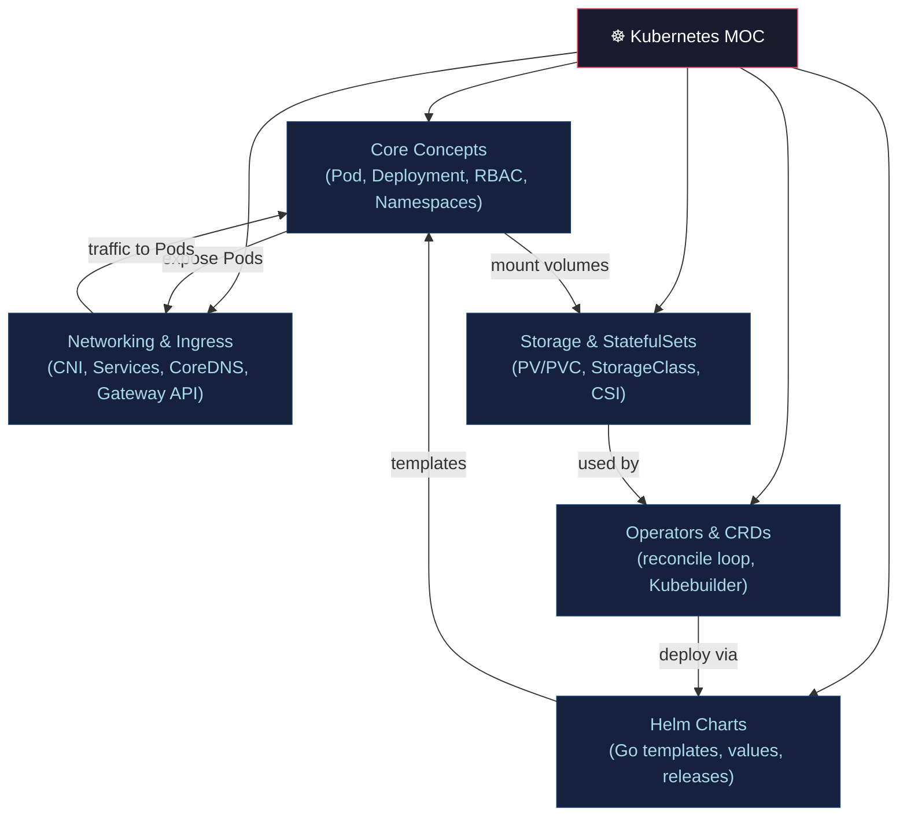

# ☸️ Kubernetes — Section MOC

> [!abstract] Section Overview
> Kubernetes is a declarative container orchestration platform. Controllers reconcile desired state (Git/YAML) with actual state (cluster). This section covers core concepts (Pod, Deployment, RBAC), networking (CNI, Services, Ingress), storage (PV/PVC, StatefulSets), Helm package management, and the Operator/CRD extension model.

---

## Concept Map



---

## Notes in This Section

| Note | Key Concepts | Difficulty |
|------|-------------|------------|
| [[Kubernetes_Core_Concepts\|K8s Core Concepts]] | Pod, Deployment, probes, RBAC, ResourceQuota | Intermediate |
| [[Kubernetes_Networking_and_Ingress\|Networking & Ingress]] | CNI, Services, kube-proxy, CoreDNS, Gateway API | Advanced |
| [[Storage_and_StatefulSets\|Storage & StatefulSets]] | PV/PVC, StorageClass, StatefulSet, CSI, PDB | Advanced |
| [[Helm_Charts\|Helm Charts]] | chart structure, Go templates, releases, helmfile | Intermediate |
| [[Operators_and_CRDs\|Operators & CRDs]] | CRD, reconcile loop, Kubebuilder, OLM | Advanced |

---

## Learning Path

```
K8s Core Concepts → Networking & Ingress → Storage & StatefulSets
→ Helm Charts → Operators & CRDs
```

---

## Related Sections

- [[_MOC_DevOps_Master|↑ DevOps Master MOC]]
- [[../03_Containers_Docker/_MOC_Containers_Docker|← Containers & Docker]] — containers run in Pods
- [[../02_CICD_Pipelines/ArgoCD_and_GitOps|← ArgoCD & GitOps]] — deploys to K8s
- [[../07_Monitoring_Observability/_MOC_Monitoring_Observability|→ Observability]] — K8s emits metrics/logs/traces

---

#DevOps #Kubernetes #K8s #MOC
