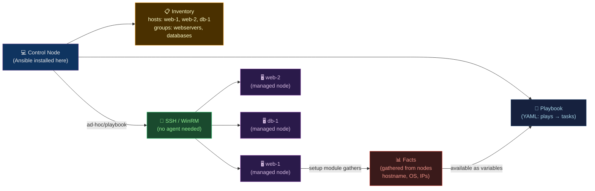

# 📋 Ansible

> [!abstract] TL;DR
> Ansible is an **agentless** configuration management tool that connects via SSH (Linux) or WinRM (Windows) — no daemon to install on managed nodes. Core hierarchy: **inventory** (hosts) → **playbook** (plays) → **play** (tasks + handlers) → **task** (module call). **Idempotency**: each task reports `changed` or `ok` — running twice produces the same outcome. Jinja2 templates enable dynamic content. **Roles** (Galaxy) provide reusable, testable playbook bundles. Protect `command`/`shell` modules with `creates:` or `changed_when:`. AWX/Tower provides a web UI and job scheduling.

---

## Intuition — analogy FIRST

Ansible is a **remote chef instruction kit**. You write a recipe (playbook) describing the desired meal (system state). Ansible connects to each kitchen (server) via SSH, checks what's already cooked (current state), and only applies missing steps — it doesn't re-boil water that's already boiling (idempotency). Roles are pre-published recipe books (Galaxy roles) — you import them instead of writing every recipe from scratch.

---

## How It Works



---

## Key Concepts / Details

### Inventory

```ini
# inventory/production.ini

[webservers]
web-1.example.com ansible_user=ubuntu
web-2.example.com ansible_user=ubuntu

[databases]
db-1.example.com ansible_user=ubuntu ansible_port=2222

[loadbalancers]
lb-1.example.com

[production:children]    # group of groups
webservers
databases
loadbalancers

[all:vars]
ansible_ssh_private_key_file=~/.ssh/id_rsa
```

```yaml
# inventory/production.yml (dynamic inventory for cloud)
plugin: aws_ec2
regions:
  - us-east-1
filters:
  instance-state-name: running
  tag:Environment: production
keyed_groups:
  - key: tags.Role
    prefix: role
  - key: placement.region
    prefix: region
```

### Complete Playbook

```yaml
# site.yml
---
- name: Configure web servers
  hosts: webservers
  become: true                     # sudo privilege escalation
  gather_facts: true               # collect facts (os, memory, IPs)
  serial: 2                        # rolling: update 2 hosts at a time
  max_fail_percentage: 30          # fail play if >30% of hosts fail

  vars:
    nginx_port: 80
    app_version: "{{ lookup('env', 'APP_VERSION') | default('1.0.0') }}"

  vars_files:
    - vars/common.yml
    - "vars/{{ ansible_os_family }}.yml"   # OS-specific vars

  pre_tasks:
    - name: Update apt cache
      apt:
        update_cache: true
        cache_valid_time: 3600     # skip update if cache < 1h old

  tasks:
    - name: Install nginx
      package:
        name: nginx
        state: present             # idempotent: install if not present

    - name: Configure nginx
      template:
        src: templates/nginx.conf.j2
        dest: /etc/nginx/nginx.conf
        owner: root
        group: root
        mode: "0644"
        validate: "nginx -t -c %s"  # validate before writing
      notify: Restart nginx         # trigger handler on change

    - name: Create app directory
      file:
        path: /opt/myapp
        state: directory
        owner: www-data
        group: www-data
        mode: "0755"

    - name: Deploy application
      unarchive:
        src: "https://releases.example.com/myapp-{{ app_version }}.tar.gz"
        dest: /opt/myapp
        remote_src: true           # download on remote, not control node
        creates: "/opt/myapp/myapp-{{ app_version }}"  # skip if already exists

    - name: Run database migration
      command: /opt/myapp/bin/migrate
      args:
        creates: /opt/myapp/.migration_done   # idempotency guard
      when:
        - inventory_hostname == groups['webservers'][0]  # run on first host only

    - name: Check service health
      uri:
        url: "http://localhost:{{ nginx_port }}/health"
        status_code: 200
      retries: 5
      delay: 10
      register: health_check

    - name: Debug health response
      debug:
        msg: "Health check: {{ health_check.status }}"

  handlers:
    - name: Restart nginx
      service:
        name: nginx
        state: restarted
        # Handlers only fire if notified AND task was changed
        # Multiple notifies → handler runs ONCE at end of play

  post_tasks:
    - name: Ensure nginx is enabled on boot
      service:
        name: nginx
        enabled: true
        state: started
```

### Idempotency — State: present vs changed vs ok

```yaml
# Module-provided idempotency (state-based):
- name: Create user
  user:
    name: appuser
    uid: 1001
    state: present           # creates if absent, does nothing if exists
    # → ok if already exists, changed if created

# Guard command/shell (NOT idempotent by default):
- name: Initialize database
  command: /opt/myapp/bin/init-db
  args:
    creates: /var/lib/myapp/.initialized   # skip if file exists (manual guard)

- name: Check if database initialized
  stat:
    path: /var/lib/myapp/.initialized
  register: db_init

- name: Initialize database (conditional)
  command: /opt/myapp/bin/init-db
  when: not db_init.stat.exists
  changed_when: true         # mark as changed when it runs

# changed_when: never skip, always report changed
- name: Run always-changing script
  shell: date > /tmp/timestamp
  changed_when: false         # don't report as changed (suppress noise)
```

### Jinja2 Templating

```jinja2
{# templates/nginx.conf.j2 #}
worker_processes {{ ansible_processor_vcpus }};  {# use fact: CPU count #}

events {
    worker_connections 1024;
}

http {
    upstream app {
    
        server {{ hostvars[host]['ansible_host'] }}:8080;
    
    }

    server {
        listen {{ nginx_port }};
        server_name {{ ansible_fqdn }};  {# fact: fully qualified domain name #}

        location / {
            proxy_pass http://app;
            
            proxy_set_header X-Forwarded-Proto https;
            
        }

        location /health {
            access_log off;
            return 200 "healthy\n";
        }
    }
}
```

### Roles — Reusable Playbook Units

```
roles/
└── nginx/
    ├── defaults/
    │   └── main.yml        # lowest-priority vars (overridable by users)
    ├── vars/
    │   └── main.yml        # higher-priority vars (internal to role)
    ├── tasks/
    │   └── main.yml        # tasks (auto-included)
    ├── handlers/
    │   └── main.yml        # handlers (auto-included)
    ├── templates/
    │   └── nginx.conf.j2
    ├── files/
    │   └── mime.types
    ├── meta/
    │   └── main.yml        # role metadata, dependencies
    └── molecule/           # testing (Molecule + Docker/Podman)
        └── default/
            └── converge.yml
```

```yaml
# Using roles in a playbook
- hosts: webservers
  roles:
    - role: geerlingguy.nginx   # Galaxy role
    - role: ./roles/myapp       # local role
      vars:
        app_port: 8080

# Install Galaxy role
ansible-galaxy role install geerlingguy.nginx

# requirements.yml
- name: geerlingguy.nginx
  version: "3.2.0"
ansible-galaxy install -r requirements.yml
```

### Ansible Vault — Encrypted Secrets

```bash
# Encrypt a file
ansible-vault encrypt vars/secrets.yml

# Encrypt a string inline
ansible-vault encrypt_string 'MySecretPassword' --name 'db_password'

# Run playbook with vault password
ansible-playbook site.yml --ask-vault-pass
ansible-playbook site.yml --vault-password-file .vault_pass
```

### AWX / Ansible Tower

```yaml
# AWX provides:
# - Web UI for playbook execution
# - Job scheduling (cron-based)
# - RBAC (who can run which playbooks on which hosts)
# - Credential management (SSH keys, vault passwords)
# - Job templates (parameterized playbook runs)
# - Webhooks (trigger from CI/CD)

# Run via API
curl -X POST https://awx.example.com/api/v2/job_templates/42/launch/ \
  -H "Authorization: Bearer $TOKEN" \
  -H "Content-Type: application/json" \
  -d '{"extra_vars": {"app_version": "1.2.3"}}'
```

---

## Real-World Notes

- **Ansible is not a provisioning tool**: Terraform/CloudFormation create infrastructure; Ansible configures what's running on it. They're complementary.
- **Fact caching**: Gathering facts on every run adds 1–3 seconds per host. Use `gather_facts: false` when facts aren't needed, or configure `fact_caching` (Redis/JSON) for large inventories.
- **Parallel execution**: `forks = 5` (default) means Ansible connects to 5 hosts simultaneously. Increase for large inventories: `ansible-playbook -f 20 site.yml`.
- **Molecule for role testing**: Molecule creates Docker/Podman containers, applies your role, runs assertions — TDD for Ansible roles. Integrate with CI.

---

## Common Pitfalls

1. **`command`/`shell` without idempotency guard** — reruns a script that shouldn't run twice; always use `creates:`, `when:`, or `changed_when:`.
2. **`become: true` everywhere** — least-privilege violation; only use `become` on specific tasks that need it, not at play level.
3. **Bare `debug:` in production** — `debug` tasks print sensitive data to stdout; remove or use `no_log: true`.
4. **Forgetting `--check` mode** — always run `--check` (dry run) before applying to production; `-D` (diff) shows what would change.
5. **Handler not firing** — handlers only fire if the notifying task reports `changed` (not `ok`); if the task is already in desired state, handler never runs.

---

## Related Concepts

- [[_MOC_Infrastructure_as_Code|↑ IaC MOC]]
- [[Terraform_Core_and_Modules|← Terraform]] — provisions infrastructure that Ansible configures
- [[Pulumi|→ Pulumi]] — code-first alternative approach
- [[../02_CICD_Pipelines/GitHub_Actions|→ GitHub Actions]] — trigger Ansible via CI/CD

---

## Review Questions

1. A `command` task runs a shell script. Without using `shell:`, how do you make it idempotent using `creates:`, and what file should that guard file be?
2. You need a handler that restarts nginx, but only after all configuration tasks complete — not after each individual task. How does Ansible's handler mechanism guarantee this behavior?
3. Design a rolling update strategy for 20 web servers using `serial:` that: updates 3 servers at a time, fails the entire play if more than 10% fail, and verifies health before continuing.

---

## Sources

- docs.ansible.com
- ansible-lint.readthedocs.io
- molecule.readthedocs.io
- AWX: github.com/ansible/awx

#DevOps #IaC #Ansible #Playbooks #Roles #Idempotency #Jinja2 #AWX #ConfigurationManagement
