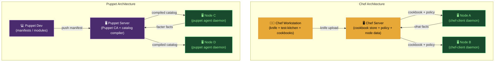

# 🍳 Chef and Puppet

> [!abstract] TL;DR
> Chef and Puppet are **agent-based** configuration management tools — unlike Ansible's agentless SSH approach, both require a daemon running on every managed node that periodically "converges" (applies) configuration. **Chef** is **procedural** (Ruby DSL, recipes execute top-to-bottom), while **Puppet** is **declarative** (manifests describe desired state, order is derived from dependency graphs). Chef organises config into **cookbooks → recipes → resources**; Puppet uses **manifests → classes → modules**. Both use a pull model: nodes check in to a central Chef Server / Puppet Server every 30 minutes by default, compare current state to desired state, and apply only what differs — true continuous compliance.

---

## Intuition — analogy FIRST

Think of Puppet as a **strict interior designer with a blueprint**: you hand them a finished-room specification ("the room must have a blue couch, three lamps, and a rug") and they figure out the order of steps. The designer continuously checks the room and fixes anything that drifts from the spec.

Chef is more like a **head chef with a recipe book**: you write step-by-step recipes ("first install flour, then mix batter, then bake"), and the chef follows them in order. You have full control over sequence, but you're responsible for making each step idempotent.

Both send a "sous chef" (agent) to live in every kitchen permanently, whereas Ansible is a remote chef who shows up via SSH, cooks once, and leaves.

---

## How It Works



---

## Key Concepts / Details

### Chef — Cookbooks, Recipes, Resources

```ruby
# metadata.rb — cookbook declaration
name 'myapp'
version '1.2.0'
chef_version '>= 16.0'
depends 'apt', '~> 7.4'       # cookbook dependency (like Ansible Galaxy)

# recipes/default.rb — procedural recipe (Ruby DSL)
# Step 1: ensure apt cache is current
apt_update 'update' do
  action :update
  frequency 86_400              # run at most once per day
end

# Step 2: install packages
package %w[nginx curl git] do
  action :install               # idempotent: skip if already installed
end

# Step 3: deploy config from template
template '/etc/nginx/nginx.conf' do
  source 'nginx.conf.erb'       # templates/nginx.conf.erb in cookbook
  owner  'root'
  group  'root'
  mode   '0644'
  variables(
    port:    node['myapp']['nginx_port'],   # node attribute lookup
    workers: node['cpu']['total']
  )
  notifies :restart, 'service[nginx]', :delayed  # notify handler on change
end

# Step 4: manage service
service 'nginx' do
  action %i[enable start]
end

# Custom resource (LWRP) — reusable across recipes
resource_name :deploy_app

property :app_name, String, required: true
property :version,  String, default:  '1.0.0'

action :install do
  remote_file "/opt/#{new_resource.app_name}-#{new_resource.version}.tar.gz" do
    source "https://releases.example.com/#{new_resource.app_name}-#{new_resource.version}.tar.gz"
    action :create_if_missing
  end
  execute "extract-#{new_resource.app_name}" do
    command "tar -xzf /opt/#{new_resource.app_name}-#{new_resource.version}.tar.gz -C /opt/"
    creates "/opt/#{new_resource.app_name}-#{new_resource.version}"
  end
end
```

```ruby
# Node attributes — tiered precedence (low → normal → force → automatic)
# attributes/default.rb
default['myapp']['nginx_port'] = 80
default['myapp']['workers']    = 4

# Override per environment or role
# environments/production.json
{
  "name": "production",
  "override_attributes": {
    "myapp": { "nginx_port": 443 }
  }
}
```

### Chef — Policy Files (Modern Workflow)

```ruby
# Policyfile.rb — replaces roles + environments for modern Chef
name 'webapp'
run_list 'recipe[myapp::default]', 'recipe[myapp::monitoring]'

default_source :supermarket                 # community cookbooks
cookbook 'nginx',  '~> 11.0'
cookbook 'myapp',  path: '.'               # local cookbook

# Push policy to server
chef push webapp production
# Node locks to a specific policy revision — reproducible deployments
```

### Puppet — Manifests, Classes, Modules

```puppet
# manifests/site.pp — site entry point (declarative)
node 'web*.example.com' {             # node matcher (regex or exact)
  include profile::nginx
  include profile::monitoring
}

# modules/profile/manifests/nginx.pp — class (declarative, order-free)
class profile::nginx (
  Integer $port    = 80,
  String  $worker_processes = 'auto',
) {
  # Puppet resolves dependency order automatically via require/before/notify
  package { 'nginx':
    ensure => installed,
  }

  file { '/etc/nginx/nginx.conf':
    ensure  => file,
    owner   => 'root',
    group   => 'root',
    mode    => '0644',
    content => template('profile/nginx.conf.erb'),
    require => Package['nginx'],      # explicit ordering when needed
    notify  => Service['nginx'],
  }

  service { 'nginx':
    ensure  => running,
    enable  => true,
    require => File['/etc/nginx/nginx.conf'],
  }
}
```

```puppet
# Puppet Hiera — data separation (like Ansible host_vars)
# hiera.yaml (data hierarchy)
hierarchy:
  - name: "Node-specific"
    path: "nodes/%{trusted.certname}.yaml"
  - name: "Environment"
    path: "environments/%{environment}.yaml"
  - name: "Common"
    path: "common.yaml"

# data/common.yaml
profile::nginx::port: 80

# data/environments/production.yaml
profile::nginx::port: 443
profile::nginx::worker_processes: "4"

# Class auto-binds Hiera data via parameter name matching
```

```puppet
# Puppet Forge module install
puppet module install puppetlabs-apache --version 8.0.0

# r10k — control repo and module management (like Ansible Galaxy with a repo)
# Puppetfile
mod 'puppetlabs/apache',  '8.0.0'
mod 'puppetlabs/stdlib',  '8.5.0'
mod 'profile',
  git: 'https://github.com/myorg/puppet-profile',
  tag: 'v1.2.0'
```

### Comparison: Ansible vs Chef vs Puppet

| Aspect | Ansible | Chef | Puppet |
|--------|---------|------|--------|
| **Agent required** | No (SSH) | Yes (chef-client) | Yes (puppet agent) |
| **Language style** | Declarative YAML | Procedural Ruby DSL | Declarative Ruby-like DSL |
| **Execution model** | Push (control node → managed node) | Pull (agent polls Chef Server ~30m) | Pull (agent polls Puppet Server ~30m) |
| **Ordering** | Sequential (top-to-bottom) | Sequential by default | Dependency graph (automatic) |
| **State tracking** | None (re-runs all tasks) | Node object on Chef Server | Catalog + report server |
| **Learning curve** | Low (YAML) | High (Ruby, resources, attributes) | Medium (DSL, Hiera, Forge) |
| **Idempotency** | Manual (module-provided or guard) | Built-in per resource | Built-in per resource |
| **Best for** | Ad-hoc orchestration, cloud provisioning | Complex application cookbooks (Ruby shops) | Large fleet continuous compliance |
| **Community** | Ansible Galaxy | Chef Supermarket | Puppet Forge |

---

## Real-World Notes

- **Chef Test Kitchen** integrates with Docker/Vagrant to spin up VM instances, apply your cookbook, and run InSpec or Serverspec tests — TDD for configuration management.
- **Puppet Bolt** is Puppet's agentless task runner (like Ansible ad-hoc) — useful for one-off operational tasks without deploying the full agent.
- **Chef Automate** and **Puppet Enterprise** add dashboards, compliance reporting (mapped to CIS benchmarks), and role-based access — comparable to Ansible Tower/AWX.
- **Continuous compliance**: because agents run every 30 minutes, any manual drift (someone `ssh`'s and changes a file) is automatically corrected — this is the key advantage over Ansible's one-shot runs.
- **Scale**: Puppet Server can manage 5,000–10,000+ nodes from a single instance; Chef Server scales similarly. Ansible starts feeling slow at 500+ hosts without AWX/Tower sharding.

---

## Common Pitfalls

1. **Chef: forgetting `notifies :delayed`** — using `:immediately` triggers restarts mid-resource-collection, before all files are deployed, causing broken restarts.
2. **Puppet: circular dependencies** — resource A `require`s B while B `notify`s A; Puppet raises a dependency cycle error and halts catalog compilation.
3. **Chef: overloading node attributes** — storing application state in node attributes (e.g., current deployed version) creates Chef Server as an unintended source of truth; use a proper data store.
4. **Puppet: Hiera lookup misses** — forgetting that class parameter names must match Hiera keys exactly (`profile::nginx::port`, not `nginx::port`).
5. **Both: chef-client / puppet agent clock drift** — if the agent certificate's clock diverges, authentication to the server fails; ensure NTP is configured before the agent.

---

## Related Concepts

- [[_MOC_Infrastructure_as_Code|↑ IaC MOC]]
- [[Ansible|← Ansible]] — agentless counterpart; read alongside for comparison
- [[Terraform_Core_and_Modules|← Terraform]] — provisions infra that Chef/Puppet then configures
- [[Drift_Detection_and_State_Management|→ Drift Detection]] — Chef/Puppet continuous convergence vs Terraform drift

---

## Review Questions

1. Explain the pull vs push model difference between Puppet/Chef and Ansible. When does the pull model's "continuous convergence" provide a meaningful operational advantage?
2. A Puppet manifest has `Service['nginx']` notified by `File['/etc/nginx/nginx.conf']`, which requires `Package['nginx']`. Without any explicit `before` statements, what order does Puppet execute these resources in? Why?
3. You're choosing between Ansible and Chef for a 2,000-node fleet that must enforce CIS Level 2 benchmarks continuously. Which tool is better suited and why?

---

## Sources

- docs.chef.io
- www.puppet.com/docs
- learn.chef.io
- Puppet Forge: forge.puppet.com
- Test Kitchen: kitchen.ci

#DevOps #IaC #Chef #Puppet #ConfigManagement #Ansible #Cookbooks #Manifests #Hiera #DeclarativeVsProcedural
