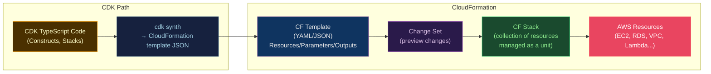

# ☁️ CloudFormation and CDK

> [!abstract] TL;DR
> **CloudFormation (CF)** is AWS's declarative IaC service: you define a `template` (YAML/JSON) with `Resources`, `Parameters`, `Outputs`, `Mappings`, `Conditions`. CF manages the **stack** lifecycle (create/update/delete). **Change sets** preview changes before applying. **Stack policies** protect critical resources. **Nested stacks** and **StackSets** enable multi-account/multi-region deployments. **AWS CDK** (Cloud Development Kit) uses TypeScript/Python/Java to synthesize CF templates — with L1 (raw CF), L2 (opinionated constructs), and L3 (high-level patterns) abstraction levels. CDK Pipelines automates self-mutating pipelines.

---

## Intuition — analogy FIRST

CloudFormation is like **filling out a government form** — structured, explicit, verbose, and guaranteed to work with AWS services. CDK is like **hiring an architect who fills out those forms for you** from a higher-level brief ("I want a web app with a load balancer") — the architect knows all the best practices and produces the forms automatically. The tradeoff: CF gives you full control and auditability; CDK gives you speed and code reuse at the cost of a synthesis step.

---

## How It Works



---

## Key Concepts / Details

### CloudFormation Template Structure

```yaml
AWSTemplateFormatVersion: "2010-09-09"
Description: "Production application stack"

# Parameters: user input at stack create/update
Parameters:
  Environment:
    Type: String
    AllowedValues: [dev, staging, production]
    Default: dev

  DBPassword:
    Type: String
    NoEcho: true                   # masked in console and logs
    MinLength: 12

  InstanceType:
    Type: String
    Default: t3.medium

# Mappings: static lookup table
Mappings:
  EnvironmentMap:
    production:
      InstanceType: m5.xlarge
      MinCapacity: 3
    staging:
      InstanceType: t3.medium
      MinCapacity: 1

# Conditions: conditional resource creation
Conditions:
  IsProduction: !Equals [!Ref Environment, production]
  CreateReadReplica: !And
    - !Condition IsProduction
    - !Not [!Equals [!Ref DBPassword, ""]]

# Resources: the meat of the template
Resources:
  VPC:
    Type: AWS::EC2::VPC
    Properties:
      CidrBlock: "10.0.0.0/16"
      EnableDnsHostnames: true
      Tags:
        - Key: Name
          Value: !Sub "${Environment}-vpc"    # string interpolation
        - Key: Environment
          Value: !Ref Environment

  RDSInstance:
    Type: AWS::RDS::DBInstance
    DeletionPolicy: Snapshot         # create snapshot on stack delete
    UpdateReplacePolicy: Snapshot    # create snapshot before replacement
    Properties:
      DBInstanceClass: !FindInMap [EnvironmentMap, !Ref Environment, InstanceType]
      Engine: postgres
      EngineVersion: "16.1"
      MasterUsername: appuser
      MasterUserPassword: !Ref DBPassword
      StorageEncrypted: true
      DeletionProtection: !If [IsProduction, true, false]

  ReadReplica:
    Type: AWS::RDS::DBInstance
    Condition: CreateReadReplica      # only create if condition is true
    Properties:
      SourceDBInstanceIdentifier: !Ref RDSInstance
      DBInstanceClass: db.r6g.large

  # Cross-stack reference
  SharedSecurityGroup:
    Type: AWS::EC2::SecurityGroup
    Properties:
      VpcId: !ImportValue "shared-vpc-VpcId"   # import from another stack

# Outputs: values exported for cross-stack references
Outputs:
  VpcId:
    Description: The VPC ID
    Value: !Ref VPC
    Export:
      Name: !Sub "${Environment}-vpc-VpcId"

  RDSEndpoint:
    Description: RDS Connection Endpoint
    Value: !GetAtt RDSInstance.Endpoint.Address
```

### Change Sets — Safe Updates

```bash
# Create change set (preview without applying)
aws cloudformation create-change-set \
  --stack-name myapp-production \
  --template-url s3://mybucket/template.yaml \
  --parameters ParameterKey=Environment,ParameterValue=production \
  --change-set-name "v2-upgrade-$(date +%s)" \
  --capabilities CAPABILITY_IAM

# Review the change set
aws cloudformation describe-change-set \
  --stack-name myapp-production \
  --change-set-name "v2-upgrade-1234567"

# Execute if safe
aws cloudformation execute-change-set \
  --stack-name myapp-production \
  --change-set-name "v2-upgrade-1234567"
```

### Stack Policies — Protect Resources from Updates

```json
{
  "Statement": [
    {
      "Effect": "Allow",
      "Action": "Update:*",
      "Principal": "*",
      "Resource": "*"
    },
    {
      "Effect": "Deny",
      "Action": ["Update:Replace", "Update:Delete"],
      "Principal": "*",
      "Resource": "LogicalResourceId/RDSInstance"
    }
  ]
}
```

```bash
aws cloudformation set-stack-policy \
  --stack-name myapp-production \
  --stack-policy-body file://stack-policy.json
```

### Nested Stacks and StackSets

```yaml
# Nested stack — break large templates into reusable modules
Resources:
  VPCStack:
    Type: AWS::CloudFormation::Stack
    Properties:
      TemplateURL: https://s3.amazonaws.com/mybucket/vpc.yaml
      Parameters:
        Environment: !Ref Environment
      TimeoutInMinutes: 30

  AppStack:
    Type: AWS::CloudFormation::Stack
    DependsOn: VPCStack
    Properties:
      TemplateURL: https://s3.amazonaws.com/mybucket/app.yaml
      Parameters:
        VpcId: !GetAtt VPCStack.Outputs.VpcId
```

```bash
# StackSets: deploy same template to multiple accounts/regions
aws cloudformation create-stack-set \
  --stack-set-name "SecurityBaseline" \
  --template-url s3://mybucket/security-baseline.yaml \
  --capabilities CAPABILITY_NAMED_IAM

aws cloudformation create-stack-instances \
  --stack-set-name "SecurityBaseline" \
  --accounts 111111111111 222222222222 \
  --regions us-east-1 eu-west-1 \
  --operation-preferences MaxConcurrentPercentage=25
```

### AWS CDK — Constructs (L1/L2/L3)

```typescript
// CDK Application structure
import * as cdk from 'aws-cdk-lib';
import * as ec2 from 'aws-cdk-lib/aws-ec2';
import * as ecs from 'aws-cdk-lib/aws-ecs';
import * as rds from 'aws-cdk-lib/aws-rds';

export class AppStack extends cdk.Stack {
  constructor(scope: cdk.App, id: string, props: cdk.StackProps) {
    super(scope, id, props);

    // L1: Raw CloudFormation resource (CfnXxx)
    const cfnBucket = new s3.CfnBucket(this, 'RawBucket', {
      bucketName: 'my-raw-bucket',
      versioningConfiguration: { status: 'Enabled' }
    });

    // L2: Opinionated construct with best practices
    const vpc = new ec2.Vpc(this, 'AppVpc', {
      maxAzs: 3,
      natGateways: 1,
      subnetConfiguration: [
        { name: 'public', subnetType: ec2.SubnetType.PUBLIC, cidrMask: 24 },
        { name: 'private', subnetType: ec2.SubnetType.PRIVATE_WITH_EGRESS, cidrMask: 24 },
        { name: 'isolated', subnetType: ec2.SubnetType.PRIVATE_ISOLATED, cidrMask: 28 }
      ]
    });

    // L2: RDS with automatic security group, parameter groups
    const database = new rds.DatabaseCluster(this, 'AppDatabase', {
      engine: rds.DatabaseClusterEngine.auroraPostgres({
        version: rds.AuroraPostgresEngineVersion.VER_16_1
      }),
      writer: rds.ClusterInstance.provisioned('writer', {
        instanceType: ec2.InstanceType.of(ec2.InstanceClass.R6G, ec2.InstanceSize.LARGE)
      }),
      readers: [
        rds.ClusterInstance.provisioned('reader', {
          instanceType: ec2.InstanceType.of(ec2.InstanceClass.R6G, ec2.InstanceSize.LARGE)
        })
      ],
      vpc,
      vpcSubnets: { subnetType: ec2.SubnetType.PRIVATE_ISOLATED },
      storageEncrypted: true,
      deletionProtection: true,
      removalPolicy: cdk.RemovalPolicy.SNAPSHOT
    });

    // L3: High-level pattern (ApplicationLoadBalancedFargateService)
    const loadBalancedService = new ecs_patterns.ApplicationLoadBalancedFargateService(
      this, 'FargateService', {
        vpc,
        taskImageOptions: {
          image: ecs.ContainerImage.fromRegistry('myapp:latest'),
          environment: {
            DB_HOST: database.clusterEndpoint.hostname
          },
          secrets: {
            DB_PASSWORD: ecs.Secret.fromSecretsManager(dbSecret, 'password')
          }
        },
        desiredCount: 3,
        cpu: 512,
        memoryLimitMiB: 1024,
        publicLoadBalancer: true
      }
    );

    // Grant permissions (CDK manages IAM automatically)
    database.grantConnect(loadBalancedService.taskDefinition.taskRole);

    // Outputs
    new cdk.CfnOutput(this, 'LoadBalancerDNS', {
      value: loadBalancedService.loadBalancer.loadBalancerDnsName
    });
  }
}
```

```bash
# CDK CLI
cdk synth                    # generate CF template
cdk diff                     # compare with deployed stack
cdk deploy                   # deploy
cdk destroy                  # delete stack
cdk ls                       # list all stacks
cdk doctor                   # check CDK environment
```

### CF vs CDK vs Terraform Comparison

| Dimension | CloudFormation | CDK | Terraform |
|-----------|--------------|-----|-----------|
| Language | YAML/JSON | TypeScript/Python/Java/Go | HCL |
| Cloud scope | AWS only | AWS only (mostly) | Cloud-agnostic |
| Abstraction | Low (raw resources) | High (constructs) | Medium |
| State management | Managed by AWS | Managed by AWS | External (S3/etc.) |
| Drift detection | Built-in | Built-in | Plan/refresh |
| Test support | cfn-guard, taskcat | jest + CDK assertions | Terratest |
| Learning curve | Medium | Medium-High | Medium |

---

## Real-World Notes

- **CDK Pipelines**: Self-mutating CodePipeline that updates itself before deploying your app. If CDK code changes affect the pipeline stages, the pipeline updates itself first.
- **CF drift detection**: `aws cloudformation detect-stack-drift` identifies resources that were modified outside CloudFormation. Unlike Terraform, CF provides this as a managed API.
- **CDK bootstrapping**: Required once per account/region before CDK deployments: `cdk bootstrap aws://ACCOUNT-ID/REGION`. Creates S3 bucket and IAM roles.
- **CFN-NAG and cfn-guard**: Static analysis tools for CF templates — like Hadolint for Dockerfiles. Catch security misconfigurations before deployment.

---

## Common Pitfalls

1. **`UPDATE_ROLLBACK_FAILED` stuck state** — a failed update that can't roll back requires manual resource intervention; use AWS support or carefully use `ContinueUpdateRollback`.
2. **Circular dependency in cross-stack references** — Stack A exports VPC ID, Stack B imports it; both can't be deleted simultaneously. Plan deletion order.
3. **CDK context caching** — CDK caches AZ lookups in `cdk.context.json`; stale cache causes incorrect AZ assignments. Run `cdk context --clear` periodically.
4. **L3 constructs hiding security defaults** — L3 patterns auto-create IAM roles with broader permissions than needed; inspect synthesized template with `cdk synth`.
5. **CF template size limit** — CloudFormation templates are limited to 1MB (inline) or larger via S3. Large templates exceed this; use nested stacks.

---

## Related Concepts

- [[_MOC_Infrastructure_as_Code|↑ IaC MOC]]
- [[Terraform_Core_and_Modules|↔ Terraform]] — cloud-agnostic alternative
- [[Drift_Detection_and_State_Management|→ Drift Detection]] — CF built-in drift detection
- [[../06_Cloud_Platforms/AWS_Core_Services|→ AWS]] — CF/CDK provisions AWS resources

---

## Review Questions

1. You need to update an RDS instance's storage size in a CF stack. What command do you run to preview the change without applying it, and what property in the template protects against accidental deletion?
2. Compare CDK L1, L2, and L3 constructs with a concrete example: creating an S3 bucket with versioning enabled and lifecycle rules.
3. Design a StackSets deployment strategy to enforce a security baseline (CloudTrail, Config Rules, GuardDuty) across 15 AWS accounts in 3 regions. What are the key `OperationPreferences` to set?

---

## Sources

- docs.aws.amazon.com/cloudformation
- docs.aws.amazon.com/cdk/api/v2
- "AWS CloudFormation Step by Step" — AWS re:Post guides
- github.com/aws/aws-cdk

#DevOps #IaC #CloudFormation #CDK #AWS #Stacks #Constructs #ChangeSet #StackSets
