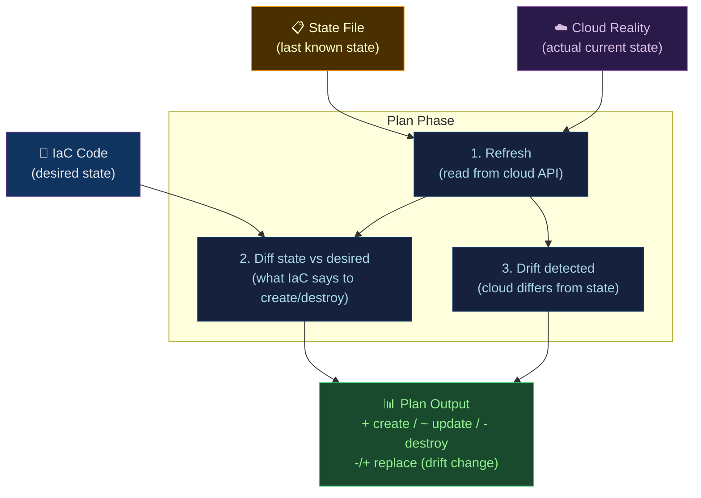

# 🔍 Drift Detection and State Management

> [!abstract] TL;DR
> **State** is the IaC ledger — the tool's record of what resources exist and their current attributes. **Drift** = gap between state and reality (someone changed infra manually, or cloud auto-changed something). `terraform plan` detects drift by refreshing state and diffing. `plan -detailed-exitcode` (exit 2 = changes) enables CI drift gates. `plan/apply -refresh-only` surgically reconciles state without creating/destroying resources. Terraform 1.5+ `import {}` block enables declarative import. **Immutable infrastructure** prevents drift by replacing rather than mutating. Terraformer and Driftctl automate discovery.

---

## Intuition — analogy FIRST

State is like a **property registry** that says you own a 3-bedroom house. Drift is when someone adds a bathroom without updating the registry. The registry (state) says 3 bedrooms; reality has 3 bedrooms + 1 bathroom. `terraform plan` visits the house (refreshes from API) and updates the registry. `terraform apply` then removes the unauthorized bathroom (if not in IaC). Immutable infrastructure is like **forbidding home renovations entirely** — instead of renovating the kitchen, you build a new house with the kitchen you want and demolish the old one.

---

## How It Works



---

## Key Concepts / Details

### What is Drift?

```
Drift scenarios:

1. Manual console change:
   IaC: instance_type = "t3.medium"
   State: t3.medium
   Reality: t3.large  (someone changed it manually)
   → plan shows: ~ update instance_type (reverts to t3.medium)

2. Auto-scaling / cloud automatic change:
   State: multi-az = false
   Reality: multi-az = true  (RDS auto-enabled for maintenance)
   → plan shows: ~ update multi_az

3. Resource created outside IaC:
   State: (no security group sg-1234)
   Reality: sg-1234 exists  (created manually)
   → plan shows: nothing (doesn't know about it)
   → Driftctl shows: sg-1234 unmanaged

4. Resource deleted outside IaC:
   State: instance i-1234 exists
   Reality: i-1234 terminated  (manual delete)
   → plan shows: + create (tries to recreate)
```

### Plan with Drift Detection

```bash
# Refresh state from cloud + detect drift
terraform plan

# CI drift gate: exit code 2 = changes exist
terraform plan -detailed-exitcode
# exit 0: no diff (no changes + no drift)
# exit 1: error
# exit 2: diff exists (changes or drift found)

# CI pipeline job
- name: Detect drift
  run: |
    terraform plan -detailed-exitcode -out=plan.binary
    EXIT_CODE=$?
    if [ $EXIT_CODE -eq 2 ]; then
      echo "::warning::Drift detected! Review plan output."
    elif [ $EXIT_CODE -eq 1 ]; then
      echo "::error::Terraform plan failed"
      exit 1
    fi

# Refresh-only plan (sync state without making cloud changes)
terraform plan -refresh-only
# Shows: "~ (state updated)" for drifted attributes
# Doesn't show create/destroy (no IaC changes)

# Apply only state refresh (accept drift, update state to match reality)
terraform apply -refresh-only -auto-approve
# Use when: cloud auto-changed something valid (cert renewal, auto-scaling)
```

### State Operations

```bash
# List resources in state
terraform state list
terraform state list aws_instance.*         # pattern filter

# Show specific resource state
terraform state show aws_instance.web

# Move resource in state (rename without destroy+create)
terraform state mv aws_instance.web aws_instance.web_primary

# Remove resource from state (stop managing without destroying)
terraform state rm aws_s3_bucket.logs
# Use when: resource should persist but be managed by different team/stack

# Pull/push state (manual backup)
terraform state pull > backup-$(date +%s).tfstate
terraform state push backup.tfstate

# Force-unlock stuck state
terraform force-unlock <lock-id>

# Import existing resource into state (old way, imperative)
terraform import aws_s3_bucket.logs my-existing-bucket-name
```

### Declarative Import (Terraform 1.5+)

```hcl
# New declarative import block (Terraform 1.5+)
import {
  id = "sg-0a12b34c56d78ef9a"          # cloud resource ID
  to = aws_security_group.app           # target address in state
}

resource "aws_security_group" "app" {
  # ... resource config to match existing
}

# Generate resource config from existing (Terraform 1.6+)
# terraform plan -generate-config-out=imported.tf
# Automatically generates HCL matching existing resource
```

```bash
# Workflow: adopt existing resource into IaC
# 1. Add import block to config
# 2. terraform plan (generates config if using 1.6+)
# 3. terraform apply (imports to state)
# 4. terraform plan again (should show no changes)
# 5. Remove import block (it's one-time)
```

### Terraformer — Reverse IaC Generation

```bash
# Generate Terraform code from existing cloud resources
# (Reverse-engineer live infra into IaC)
brew install terraformer

# Import all VPCs from AWS
terraformer import aws \
  --resources=vpc,subnet,security_group \
  --regions=us-east-1 \
  --profile=default

# Output: generated/ directory with .tf files and terraform.tfstate
ls generated/aws/vpc/
# vpc.tf  security_groups.tf  subnets.tf  terraform.tfstate

# CAUTION: Generated code is verbose and un-modular
# Use as starting point, not production-ready code
```

### Driftctl — Cloud Resource Coverage

```bash
# Install
brew install driftctl

# Scan: find unmanaged cloud resources
driftctl scan \
  --from tfstate+s3://my-state-bucket/prod/*.tfstate \
  --to aws+tf

# Output:
# Found 247 resources (managed: 231, unmanaged: 16, deleted: 0)
# Unmanaged resources:
# aws_security_group: sg-1234abc (no IaC covering this)
# aws_s3_bucket: some-manual-bucket
# Coverage: 93.7%

# CI gate: fail if coverage drops below threshold
driftctl scan --output json://coverage.json
COVERAGE=$(jq '.summary.coverage' coverage.json)
if (( $(echo "$COVERAGE < 95" | bc -l) )); then
  echo "IaC coverage too low: $COVERAGE%"
  exit 1
fi
```

### Immutable Infrastructure

```hcl
# Immutable: replace instead of update in-place
resource "aws_instance" "app" {
  ami           = data.aws_ami.app.id
  instance_type = var.instance_type

  user_data = base64encode(templatefile("init.sh", {
    app_version = var.app_version
  }))

  lifecycle {
    create_before_destroy = true     # create new before destroying old
    # No: prevent_destroy (we WANT replacement)
    # No: ignore_changes (we WANT to track everything)
  }

  # New AMI or user_data change = new instance created, old destroyed
  # Traffic shifted via load balancer target group
}

# Compare: mutable approach (avoid)
resource "aws_instance" "app_mutable" {
  # Changing user_data in place (partial configuration)
  # State may diverge from reality if script fails midway
  # "Works on my machine" syndrome
}
```

**Immutable benefits**:
- No configuration drift (fresh instance every deployment)
- Predictable state (identical to what IaC describes)
- Easy rollback (previous AMI still exists)

**Immutable workflow**: Build → package (AMI/container) → deploy new → verify → destroy old

### State Security

```hcl
# State stores PLAINTEXT secrets (RDS passwords, API keys, etc.)
# Security measures:

backend "s3" {
  bucket = "tf-state-123456789"
  key    = "prod/terraform.tfstate"
  region = "us-east-1"

  # 1. Encryption at rest
  encrypt = true
  kms_key_id = "arn:aws:kms:us-east-1:123:key/abc"

  # 2. Access via IAM (no public access)
  # S3 bucket: block all public access
  # Bucket policy: only allow specific IAM roles

  # 3. Versioning (recover if state corrupted)
  # Enable on S3 bucket: aws s3api put-bucket-versioning

  # 4. Access logging
  # S3 server access logs: who accessed state and when

  # 5. DynamoDB locking (prevent concurrent apply)
  dynamodb_table = "tf-locks"
}
```

---

## Real-World Notes

- **Daily drift detection**: Add a scheduled CI job that runs `terraform plan -detailed-exitcode` against production and posts to Slack if exit code is 2.
- **Refresh-only as first response to drift**: Before applying IaC changes that would revert drift, understand WHY it drifted. Use `plan -refresh-only` to see what changed, then decide: accept drift (apply -refresh-only) or revert (apply).
- **State lock timeout**: Long-running applies can hold locks for hours. Monitor DynamoDB lock table for stale locks; investigate before force-unlocking.
- **Workspace-per-environment vs directory-per-environment**: Workspaces share backend; directories with Terragrunt have separate backends per environment. Directories are safer (state isolation).

---

## Common Pitfalls

1. **Accepting drift without investigation** — `apply -refresh-only` on production without understanding why drift occurred; the next deploy will revert it.
2. **State corruption** — never manually edit `.tfstate`; if you must, back up first and make changes carefully.
3. **`terraform state mv` in wrong order** — moving resource A to B when B already exists in state causes conflict; check `state list` first.
4. **Import without matching config** — importing a resource without matching HCL config causes immediate plan to show differences (and potential destruction).
5. **Forgetting `-refresh-only` is irreversible for state** — applying a refresh-only plan updates state to match reality permanently; you can't undo this without restoring state backup.

---

## Related Concepts

- [[_MOC_Infrastructure_as_Code|↑ IaC MOC]]
- [[Terraform_Core_and_Modules|← Terraform Core]] — state is Terraform's foundation
- [[CloudFormation_and_CDK|← CloudFormation]] — CF has built-in drift detection API
- [[Pulumi|← Pulumi]] — `pulumi refresh` is equivalent to `terraform refresh`
- [[../07_Monitoring_Observability/SLO_SLI_SLA_and_Error_Budgets|→ SLOs]] — infrastructure drift can trigger SLO violations

---

## Review Questions

1. Your production Terraform plan shows an RDS instance is being replaced (`-/+`) because `db_name` changed. This was an accidental manual console change. What sequence of Terraform commands restores the state without actually modifying the database?
2. Driftctl reports 87% IaC coverage on production. List three types of cloud resources that are commonly unmanaged and explain why teams often skip them.
3. Design a CI pipeline job that: runs nightly, detects drift in production Terraform state, posts a Slack alert with drift details, but does NOT automatically apply or revert changes.

---

## Sources

- developer.hashicorp.com/terraform/docs/state
- github.com/snyk/driftctl
- github.com/GoogleCloudPlatform/terraformer
- "Terraform: Up & Running" Chapter 8 — State Management

#DevOps #IaC #Drift #StateManagement #TerraformImport #ImmutableInfra #Driftctl #Terraformer
