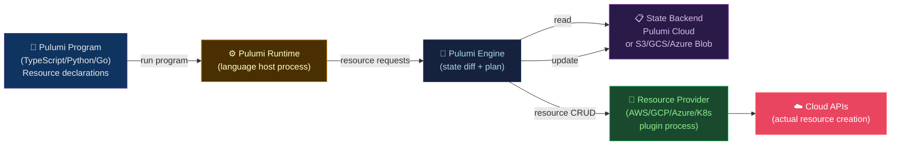

# 🔷 Pulumi

> [!abstract] TL;DR
> Pulumi is an IaC tool that uses **general-purpose programming languages** (TypeScript, Python, Go, C#, Java) instead of DSLs. This enables loops, conditionals, type-safe abstractions, and unit testing. A **Stack** = named deployment instance (like Terraform workspace). A **Program** = your code that declares resources. **ComponentResource** bundles related resources into reusable abstractions. `pulumi up` previews and applies; `pulumi preview` is plan-only. **ESC** (Environments, Secrets, Configuration) manages cross-stack secrets. Pulumi Cloud provides state management; self-hosted backends (S3) are supported.

---

## Intuition — analogy FIRST

Pulumi vs Terraform is like **coding vs spreadsheets**. Terraform HCL is like a spreadsheet with formula-like syntax — great for structured tabular data, limited when you need loops, generics, or abstractions. Pulumi is like writing actual code — you get the full power of a programming language (TypeScript, Python) with IDE autocomplete, type checking, and unit tests. The tradeoff: more expressive, but more footguns (accidental complexity, logic bugs in infrastructure code).

---

## How It Works



---

## Key Concepts / Details

### Basic Pulumi Program (TypeScript)

```typescript
// index.ts
import * as pulumi from "@pulumi/pulumi";
import * as aws from "@pulumi/aws";
import * as awsx from "@pulumi/awsx";    // Crosswalk: higher-level AWS abstractions

const config = new pulumi.Config();
const environment = config.require("environment");
const dbPassword = config.requireSecret("dbPassword");  // encrypted in state

// VPC using Crosswalk (higher-level abstraction)
const vpc = new awsx.ec2.Vpc("main-vpc", {
  cidrBlock: "10.0.0.0/16",
  numberOfAvailabilityZones: 3,
  natGateways: {
    strategy: awsx.ec2.NatGatewayStrategy.Single,
  },
  tags: {
    Environment: environment,
    ManagedBy: "Pulumi",
  },
});

// RDS with computed references (no interpolation syntax!)
const dbSubnetGroup = new aws.rds.SubnetGroup("db-subnet-group", {
  subnetIds: vpc.isolatedSubnetIds,   // TypeScript array, no ${...} needed
  tags: { Environment: environment },
});

const database = new aws.rds.Instance("app-database", {
  engine: "postgres",
  engineVersion: "16.1",
  instanceClass: environment === "production" ? "db.r6g.large" : "db.t3.medium",
  allocatedStorage: 100,
  dbSubnetGroupName: dbSubnetGroup.name,
  password: dbPassword,              // encrypted Output<string>
  storageEncrypted: true,
  deletionProtection: environment === "production",
  skipFinalSnapshot: environment !== "production",
  tags: { Environment: environment },
});

// Dynamic config based on environment — impossible in HCL without workarounds
const replicaCount = environment === "production" ? 3 : 1;
const appInstances = Array.from({ length: replicaCount }, (_, i) =>
  new aws.ec2.Instance(`app-${i}`, {
    ami: "ami-0c55b159cbfafe1f0",
    instanceType: "t3.medium",
    vpcSecurityGroupIds: [appSg.id],
    subnetId: vpc.privateSubnetIds[i % 3],  // spread across AZs
    tags: { Name: `app-${environment}-${i}` },
  })
);

// Exports
export const vpcId = vpc.vpcId;
export const dbEndpoint = database.endpoint;
export const appInstanceIds = appInstances.map(i => i.id);
```

### ComponentResource — Reusable Abstractions

```typescript
// components/webApplication.ts
import * as pulumi from "@pulumi/pulumi";
import * as aws from "@pulumi/aws";
import * as awsx from "@pulumi/awsx";

interface WebApplicationArgs {
  environment: string;
  imageTag: string;
  domainName: string;
  containerPort?: number;
  desiredCount?: number;
}

export class WebApplication extends pulumi.ComponentResource {
  public readonly loadBalancerDns: pulumi.Output<string>;
  public readonly serviceUrl: pulumi.Output<string>;

  constructor(
    name: string,
    args: WebApplicationArgs,
    opts?: pulumi.ComponentResourceOptions
  ) {
    super("mycompany:aws:WebApplication", name, {}, opts);

    const { environment, imageTag, domainName, containerPort = 8080, desiredCount = 2 } = args;

    // All child resources are parented to this component
    const childOpts = { parent: this };

    const cluster = new aws.ecs.Cluster(`${name}-cluster`, {
      tags: { Environment: environment }
    }, childOpts);

    const service = new awsx.ecs.FargateService(`${name}-service`, {
      cluster: cluster.arn,
      desiredCount,
      taskDefinitionArgs: {
        container: {
          name: name,
          image: imageTag,
          cpu: 256,
          memory: 512,
          portMappings: [{ containerPort }],
        }
      }
    }, childOpts);

    this.loadBalancerDns = service.loadBalancer.apply(lb => lb.dnsName);
    this.serviceUrl = pulumi.interpolate`https://${domainName}`;

    // Register outputs so Pulumi knows about them
    this.registerOutputs({
      loadBalancerDns: this.loadBalancerDns,
      serviceUrl: this.serviceUrl,
    });
  }
}

// Usage:
const webApp = new WebApplication("myapp", {
  environment: "production",
  imageTag: `myregistry.io/myapp:${process.env.GIT_SHA}`,
  domainName: "app.example.com",
  desiredCount: 5,
});
export const serviceUrl = webApp.serviceUrl;
```

### Unit Testing (Pulumi Mock Framework)

```typescript
// infrastructure.test.ts
import * as pulumi from "@pulumi/pulumi";
import * as assert from "assert";

// Mock Pulumi for unit tests (no cloud calls)
pulumi.runtime.setMocks({
  newResource: function(type: string, name: string, inputs: any) {
    return {
      id: `${name}-id`,
      state: inputs,
    };
  },
  call: function(token: string, args: any) {
    return args;
  }
});

describe("WebApplication Component", () => {
  let infra: typeof import("./index");

  before(async () => {
    infra = await import("./index");
  });

  it("should create production resources with deletion protection", async () => {
    const db = infra.database;
    const deletionProtection = await new Promise(resolve =>
      db.deletionProtection.apply(resolve)
    );
    assert.strictEqual(deletionProtection, true);
  });

  it("should use t3.medium for non-production", async () => {
    // Test environment-based instance type selection
  });
});
```

### Pulumi CLI and Stack Management

```bash
# Initialize project
pulumi new typescript               # scaffold TypeScript project
pulumi new aws-typescript           # AWS-specific template

# Stack management (equivalent to Terraform workspaces)
pulumi stack init production
pulumi stack select production

# Configuration per stack
pulumi config set environment production
pulumi config set --secret dbPassword "MySecretPassword"

# Preview changes
pulumi preview

# Apply changes
pulumi up

# Target specific resources
pulumi up --target urn:pulumi:production::myapp::aws:rds/instance:Instance::app-database

# Refresh state from cloud
pulumi refresh

# Destroy stack
pulumi destroy

# Export/import state
pulumi stack export > backup.json
pulumi stack import < backup.json
```

### Pulumi ESC — Environments, Secrets, Configuration

```yaml
# ESC Environment definition (managed in Pulumi Cloud or self-hosted)
values:
  aws:
    region: us-east-1
    accountId: 123456789
  database:
    host: db.production.internal
    port: 5432
  kubeconfig:
    fn::open::aws-login:                    # dynamic secret: assumes IAM role
      login:
        fn::open::aws-login:
          oidc:
            roleArn: arn:aws:iam::123:role/pulumi-eks
      cluster:
        clusterName: production
        region: us-east-1
  environmentVariables:
    AWS_REGION: ${aws.region}
    DB_HOST: ${database.host}
```

```bash
# Use ESC environment in Pulumi program
pulumi env run production -- pulumi up

# Or directly open env values
pulumi env open production
```

### Terraform vs Pulumi Comparison

| Feature | Terraform | Pulumi |
|---------|-----------|--------|
| Language | HCL (DSL) | TypeScript/Python/Go/C# |
| IDE support | Plugin-based | Native (full IntelliSense) |
| Loops | `for_each`/`count` | Native language loops |
| Types | Limited | Full type system |
| Unit tests | Terratest (external) | Native mock framework |
| State | Backend (S3/etc.) | Pulumi Cloud or backend |
| Providers | 3000+ | ~100 (growing) |
| Learning curve | Medium (HCL) | High (new paradigm + lang) |
| Community | Larger | Growing |

---

## Real-World Notes

- **Output types**: Pulumi resources return `Output<T>` (like Promises). You can't inspect the value directly — use `.apply()`. This is the biggest mental shift from Terraform.
- **`pulumi.all()`**: Combine multiple Outputs: `pulumi.all([a, b]).apply(([aVal, bVal]) => ...)`.
- **Crosswalk for AWS**: `@pulumi/awsx` provides higher-level patterns (similar to CDK L3) — VPC with all subnets, ECS with ALB, etc.
- **Automation API**: Pulumi's Automation API embeds Pulumi in your own programs (Node.js, Python). Use it to build custom provisioning tools or SaaS backends.

---

## Common Pitfalls

1. **Logic bugs in `ComponentResource`** — with general-purpose languages, you can write bugs (off-by-one in replica count) that silently provision wrong infra; unit test your components.
2. **Output unwrapping with `apply`** — using `myResource.id` directly in a string literal gives `[object Object]`; always use `pulumi.interpolate` or `.apply()`.
3. **Secrets in `config.get()` instead of `config.requireSecret()`** — using `get()` for secrets stores them in plaintext in stack config; always use `requireSecret()`.
4. **No state backend for self-hosted** — Pulumi's default backend is Pulumi Cloud; configure S3 backend explicitly for air-gapped environments: `pulumi login s3://my-bucket`.
5. **ComponentResource without `registerOutputs`** — without registering outputs, Pulumi can't track the component's outputs for other stacks.

---

## Related Concepts

- [[_MOC_Infrastructure_as_Code|↑ IaC MOC]]
- [[Terraform_Core_and_Modules|← Terraform]] — HCL-based alternative
- [[CloudFormation_and_CDK|← CDK]] — AWS-native code-first IaC
- [[Drift_Detection_and_State_Management|→ Drift Detection]] — `pulumi refresh` vs `pulumi preview`

---

## Review Questions

1. You need to create 5 EC2 instances in different availability zones using Pulumi TypeScript. Write the code using native TypeScript array methods, and explain why this is cleaner than Terraform's `count`.
2. A `ComponentResource` has 3 child resources. How do you ensure all child resources are deleted when the component is deleted?
3. Explain why `Output<string>` cannot be directly concatenated with a string literal in Pulumi, and show two correct ways to produce a string like `"https://myapp.com"` from an `Output<string>` domain.

---

## Sources

- pulumi.com/docs
- pulumi.com/docs/concepts/resources/components/
- pulumi.com/blog/pulumi-esc
- "Infrastructure as Code" by Kief Morris (O'Reilly)

#DevOps #IaC #Pulumi #TypeScript #Python #ComponentResource #ESC #AutomationAPI
