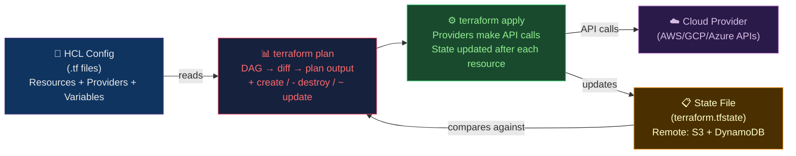

# 🌍 Terraform Core and Modules

> [!abstract] TL;DR
> Terraform reads HCL config, builds an implicit **DAG** (topological order for dependency resolution), computes a **plan** (diff of desired vs state), and applies changes. Plan symbols: `+` create, `-` destroy, `~` update in-place, `-/+` replace (destroy+create), `!` tainted. **State** is the ledger of known resources — stored remotely (S3 + DynamoDB lock + SSE encryption). State holds plaintext secrets — treat it like a secret. **Modules** enforce blast-radius boundaries. Use `for_each` (stable key-addressed) over `count` (fragile index-addressed). `lifecycle` blocks control sensitive resource behavior. Terragrunt adds DRY backend config.

---

## Intuition — analogy FIRST

Terraform is a **blueprint-to-building system** for cloud infrastructure. HCL is the blueprint; state is the **property ledger** (what the city thinks you own). Plan is the **building inspector's report** comparing your new blueprint to the ledger. Apply is the **construction crew**. If the ledger and reality diverge (drift), plan catches it. Modules are **pre-approved building templates** — your blueprint imports a standard "office building module" rather than designing every floor from scratch.

---

## How It Works



---

## Key Concepts / Details

### HCL Fundamentals

```hcl
# main.tf

# Provider configuration
terraform {
  required_version = ">= 1.8"
  required_providers {
    aws = {
      source  = "hashicorp/aws"
      version = "~> 5.0"         # allow 5.x, block 6.x
    }
  }

  # Remote backend (S3 + DynamoDB for locking)
  backend "s3" {
    bucket         = "my-terraform-state"
    key            = "prod/vpc/terraform.tfstate"
    region         = "us-east-1"
    encrypt        = true         # SSE-S3 encryption at rest
    dynamodb_table = "terraform-locks"
    # State holds plaintext secrets! Ensure S3 bucket policy restricts access.
  }
}

provider "aws" {
  region = var.aws_region
  default_tags {
    tags = {
      Environment = var.environment
      ManagedBy   = "Terraform"
    }
  }
}

# Variable declarations
variable "aws_region" {
  type    = string
  default = "us-east-1"
}

variable "environment" {
  type    = string
  validation {
    condition     = contains(["dev", "staging", "production"], var.environment)
    error_message = "Environment must be dev, staging, or production."
  }
}

variable "db_password" {
  type      = string
  sensitive = true    # masked in plan output and logs
}

# Data source (read existing resource, don't create)
data "aws_availability_zones" "available" {
  state = "available"
}

# Local values (computed expressions)
locals {
  common_tags = {
    Environment = var.environment
    Region      = var.aws_region
  }
  az_count = min(3, length(data.aws_availability_zones.available.names))
}

# Resource
resource "aws_vpc" "main" {
  cidr_block           = "10.0.0.0/16"
  enable_dns_hostnames = true
  enable_dns_support   = true

  tags = merge(local.common_tags, {
    Name = "main-vpc-${var.environment}"
  })
}

# Output
output "vpc_id" {
  value       = aws_vpc.main.id
  description = "The VPC ID"
}

output "vpc_arn" {
  value     = aws_vpc.main.arn
  sensitive = true    # mask in output
}
```

### for_each vs count — Why for_each Wins

```hcl
# BAD: count — index-addressed, fragile
variable "subnet_cidrs" {
  default = ["10.0.1.0/24", "10.0.2.0/24", "10.0.3.0/24"]
}

resource "aws_subnet" "main" {
  count      = length(var.subnet_cidrs)
  cidr_block = var.subnet_cidrs[count.index]
}
# aws_subnet.main[0], aws_subnet.main[1], aws_subnet.main[2]
# Remove "10.0.1.0/24" from list → index shifts → Terraform DESTROYS and recreates [1],[2]!

# GOOD: for_each — key-addressed, stable
variable "subnets" {
  default = {
    "public-1"  = "10.0.1.0/24"
    "public-2"  = "10.0.2.0/24"
    "private-1" = "10.0.3.0/24"
  }
}

resource "aws_subnet" "main" {
  for_each   = var.subnets
  cidr_block = each.value

  tags = {
    Name = each.key
  }
}
# aws_subnet.main["public-1"], aws_subnet.main["public-2"], etc.
# Remove "public-1" → only that subnet is destroyed; others unchanged
```

### lifecycle Blocks

```hcl
resource "aws_rds_instance" "main" {
  # ... config

  lifecycle {
    prevent_destroy = true         # fail if destroy attempted (protect prod DB)

    create_before_destroy = true   # create new before destroying old
                                   # (for resources that can't be renamed in-place)

    ignore_changes = [
      tags,                        # ignore tag drift (managed by external system)
      engine_version,              # ignore minor version drift
    ]

    replace_triggered_by = [       # force replace when other resource changes
      aws_kms_key.main.key_rotation_enabled
    ]
  }
}
```

### Modules — Reusable Infrastructure Patterns

```hcl
# Module definition: modules/vpc/main.tf
variable "environment" { type = string }
variable "cidr_block" { type = string }

resource "aws_vpc" "this" {
  cidr_block = var.cidr_block
  tags = { Environment = var.environment }
}

output "vpc_id" { value = aws_vpc.this.id }

# Module call (consumer)
module "vpc_production" {
  source      = "./modules/vpc"    # local path
  # source    = "git::https://github.com/org/tf-modules.git//vpc?ref=v1.2.0"
  # source    = "registry.terraform.io/hashicorp/vpc/aws"

  environment = "production"
  cidr_block  = "10.0.0.0/16"
}

module "vpc_staging" {
  source      = "./modules/vpc"
  environment = "staging"
  cidr_block  = "10.1.0.0/16"
}

# Reference module output
resource "aws_security_group" "app" {
  vpc_id = module.vpc_production.vpc_id
}
```

### Workspaces and Terragrunt

```bash
# Terraform workspaces (simple multi-env)
terraform workspace new staging
terraform workspace select staging
terraform apply -var-file=staging.tfvars

# Workspaces share same backend; different state keys
# terraform.tfstate.d/staging/ terraform.tfstate.d/production/

# Terragrunt (DRY backend + dependencies between modules)
# terragrunt.hcl
remote_state {
  backend = "s3"
  config = {
    bucket  = "my-tfstate-${local.env}"
    key     = "${path_relative_to_include()}/terraform.tfstate"
    region  = "us-east-1"
    encrypt = true
    dynamodb_table = "terraform-locks"
  }
}

inputs = {
  environment = local.env
  aws_region  = "us-east-1"
}

# Dependency between modules
dependency "vpc" {
  config_path = "../vpc"
}

inputs = {
  vpc_id = dependency.vpc.outputs.vpc_id
}
```

### Terraform Plan Symbols

| Symbol | Meaning | Risk |
|--------|---------|------|
| `+` | Create (new resource) | Low |
| `-` | Destroy (remove resource) | High — data loss |
| `~` | Update in-place (attributes change) | Medium |
| `-/+` | Replace (destroy + create) | High — downtime + new IDs |
| `!` | Tainted (marked for replacement) | Medium |
| `<=` | Read (data source refresh) | None |

```bash
# Always review plan before apply
terraform plan -out=plan.binary
terraform show -json plan.binary | jq '.resource_changes[] | select(.change.actions | contains(["delete"]))'

# Apply saved plan (no re-plan)
terraform apply plan.binary

# CI gate: non-zero exit code means changes exist
terraform plan -detailed-exitcode
# exit 0: no changes
# exit 1: error
# exit 2: changes detected (CI drift gate)
```

---

## Real-World Notes

- **State locking**: DynamoDB-based locking prevents concurrent applies. If Terraform crashes mid-apply, the lock stays; manually remove with `terraform force-unlock <lock-id>`.
- **State has plaintext secrets**: Every resource attribute (including RDS passwords, secret keys) is stored in plain text in state. Secure the S3 bucket with bucket policies, block public access, and enable access logging.
- **`-target` is dangerous**: `terraform apply -target=aws_instance.web` applies only targeted resources — can cause inconsistency between related resources. Use sparingly and only in emergencies.
- **Provider upgrades**: Major provider version bumps (e.g., AWS provider 4→5) often have breaking changes; test in a non-production workspace first.

---

## Common Pitfalls

1. **`count = 0` vs `for_each = {}`** — removing a resource by setting `count = 0` destroys it; intent should be documented clearly.
2. **Hardcoded ARNs in modules** — modules that hardcode account IDs or regions aren't reusable; use `data.aws_caller_identity.current.account_id`.
3. **`terraform import` without state update** — importing a resource into state without matching HCL config causes plan to show immediate destroy.
4. **No state backup before dangerous operations** — always `aws s3 cp` the state file to a backup location before `terraform state rm` or `mv`.
5. **Module version not pinned** — `source = "terraform-aws-modules/vpc/aws"` without `version = "~> 5.0"` fetches latest, breaking reproducibility.

---

## Related Concepts

- [[_MOC_Infrastructure_as_Code|↑ IaC MOC]]
- [[Drift_Detection_and_State_Management|→ Drift Detection]] — state management deep dive
- [[CloudFormation_and_CDK|→ CloudFormation & CDK]] — AWS alternative
- [[Pulumi|→ Pulumi]] — code-first alternative
- [[../06_Cloud_Platforms/AWS_Core_Services|→ AWS]] — common resource targets

---

## Review Questions

1. A Terraform plan shows `-/+` (replace) for an RDS instance because you changed `db_name`. What `lifecycle` attribute would have prevented this accidental replacement, and what is the tradeoff?
2. You have a list of 5 subnets using `count`. You need to remove the second subnet. Explain exactly what Terraform's plan will show and why `for_each` would have been safer.
3. The state file shows a resource that was deleted manually in the cloud console. Running `terraform apply` would recreate it, but you want to remove it from state without recreating it. What command do you use?

---

## Sources

- developer.hashicorp.com/terraform/docs
- terragrunt.gruntwork.io
- "Terraform: Up & Running" by Yevgeniy Brikman

#DevOps #IaC #Terraform #HCL #Modules #State #Terragrunt #ForEach
