# 🔒 Terraform Security

> [!abstract] TL;DR
> Terraform security spans three layers: (1) **Static scanning** — tools like **Checkov**, **tfsec**, **Terrascan**, and **KICS** catch misconfigurations in `.tf` files before `terraform apply`; (2) **Policy-as-Code** — **HashiCorp Sentinel** enforces governance rules at plan time (requires Terraform Cloud/Enterprise); and (3) **State security** — Terraform state files may contain **secrets in plaintext** (passwords, private keys) — mitigated by remote state backends with encryption + access control, and by using sensitive variables. Embedding these tools in CI/CD gates ("shift-left IaC") prevents insecure infrastructure from being provisioned in the first place.

---

## Intuition — analogy FIRST

Writing Terraform without security scanning is like submitting a construction permit for a building with no fire exits. The building might go up just fine, but it violates safety codes you didn't know about — and the city inspector (cloud provider's compliance audit) will flag it later. Static scanners are the **automated code inspector** who reviews blueprints before construction begins: they know every building code (security benchmark) and flag every violation while it's still cheap to fix — a Git comment, not a production incident.

---

## How It Works

```mermaid
graph LR
    DEV["👩‍💻 Developer\nwrites .tf files"]:::dev
    PR["📋 Pull Request\nCI pipeline"]:::ci

    subgraph SCAN["Static Scanning (shift-left)"]
        CKV["Checkov\nmulti-framework\nTF + K8s + CF + Docker"]:::tool
        TFS["tfsec\nTerraform-specific\n1000+ rules"]:::tool
        TERRA["Terrascan\nmulti-cloud\nOPA policies"]:::tool
        KICS["KICS (Checkmarx)\nIaC + Dockerfile\nSQL + Ansible"]:::tool
    end

    subgraph GATE["Policy Gate (plan-time)"]
        SENT["HashiCorp Sentinel\nTF Cloud/Enterprise\nhard/soft-mandatory"]:::sentinel
    end

    STATE["🗄️ Remote State\n(S3 + DynamoDB / TF Cloud)\nencrypted + access-controlled"]:::state
    APPLY["✅ terraform apply\n(after all gates pass)"]:::apply

    DEV -->|"git push"| PR
    PR --> SCAN
    SCAN -->|"pass / fail"| GATE
    GATE --> APPLY
    APPLY --> STATE

    classDef dev fill:#0f3460,stroke:#533483,color:#e8e8e8
    classDef ci fill:#16213e,stroke:#0f3460,color:#a8d8ea
    classDef tool fill:#1a4a2e,stroke:#2ecc71,color:#90ee90
    classDef sentinel fill:#4a3000,stroke:#f39c12,color:#ffc
    classDef state fill:#3a1a1a,stroke:#e74c3c,color:#f1948a
    classDef apply fill:#2a1a4a,stroke:#9b59b6,color:#d7bde2
```



---

## Key Concepts / Details

### Checkov — Multi-Framework IaC Scanner

```bash
# Install
pip install checkov

# Scan Terraform directory
checkov -d ./terraform/ --framework terraform

# Scan with output formats
checkov -d ./terraform/ \
  --output cli \
  --output sarif \
  --output-file-path ./results/checkov.sarif

# Hard-fail on HIGH/CRITICAL only (don't block on LOW/MEDIUM)
checkov -d ./terraform/ --soft-fail-on LOW,MEDIUM

# Suppress a check with inline comment + justification
# In your .tf file:
# #checkov:skip=CKV_AWS_57:Public access intentionally allowed for static website
resource "aws_s3_bucket" "website" {
  bucket = "my-public-website"
  # checkov:skip=CKV_AWS_57:Public website hosting
}

# Custom check (Python)
# checkov/custom_checks/check_no_default_vpc.py
from checkov.terraform.checks.resource.base_resource_check import BaseResourceCheck

class NoDefaultVPCCheck(BaseResourceCheck):
    def __init__(self):
        name = "Ensure default VPC is not used"
        id = "CKV2_AWS_CUSTOM_001"
        supported_resources = ["aws_default_vpc"]
        categories = [CheckCategories.NETWORKING]
        super().__init__(name=name, id=id, categories=categories, supported_resources=supported_resources)

    def scan_resource_conf(self, conf):
        return CheckResult.FAILED   # default VPC always fails
```

### tfsec — Terraform-Specific Deep Analysis

```bash
# Install
brew install tfsec             # macOS
# or: curl -s https://raw.githubusercontent.com/aquasecurity/tfsec/master/scripts/install_linux.sh | bash

# Scan
tfsec ./terraform/

# SARIF output (for GitHub Code Scanning)
tfsec ./terraform/ --format sarif --out tfsec.sarif

# Only show HIGH and CRITICAL
tfsec ./terraform/ --minimum-severity HIGH

# Ignore a rule inline
resource "aws_security_group" "allow_ssh" {
  ingress {
    from_port   = 22
    to_port     = 22
    protocol    = "tcp"
    cidr_blocks = ["0.0.0.0/0"]  # tfsec:ignore:AWS006 bastion — restricted by IAM
  }
}

# Custom config file (.tfsec/config.yml)
minimum_severity: MEDIUM
exclude:
  - AWS006     # open SSH — handled separately via IAM policy
```

### Terrascan — Multi-Cloud with OPA

```bash
# Install
brew install terrascan

# Scan Terraform (AWS)
terrascan scan -t aws -d ./terraform/

# Scan Kubernetes manifests
terrascan scan -t k8s -d ./k8s-manifests/

# Scan with custom OPA policy
terrascan scan -d ./terraform/ \
  --policy-type aws \
  --config-path ./terrascan-config.toml

# terrascan-config.toml
[policy]
  rego_subdir = "custom-policies"   # directory of .rego files
```

### KICS — "Keeping Infrastructure as Code Secure"

```bash
# Install
docker pull checkmarx/kics:latest

# Scan multiple IaC types simultaneously
docker run -v "$(pwd):/path" checkmarx/kics scan \
  -p /path/terraform \
  -p /path/kubernetes \
  -o /path/kics-results \
  --report-formats json,sarif

# KICS covers: Terraform, CloudFormation, Kubernetes, Dockerfile,
#              Ansible, Azure ARM, GCP DM, Helm, OpenAPI, gRPC
```

### HashiCorp Sentinel — Policy-as-Code (Enterprise)

```python
# Sentinel policy: enforce all S3 buckets must have versioning enabled
# policy/s3-versioning.sentinel

import "tfplan/v2" as tfplan

# Find all S3 buckets in the plan
s3_buckets = tfplan.find_resources("aws_s3_bucket_versioning")

# Rule: every S3 bucket must have versioning enabled
main = rule {
  all s3_buckets as _, bucket {
    bucket.change.after.versioning_configuration[0].status == "Enabled"
  }
}
```

```python
# Sentinel policy: enforce cost limit using Terraform Cloud cost estimation
import "decimal"
import "tfrun"

# Soft-mandatory: warn if monthly cost > $1000
monthly_cost = decimal.new(tfrun.cost_estimate.delta_monthly_cost)
main = rule when tfrun.cost_estimate.delta_monthly_cost is not null {
  monthly_cost.less_than(decimal.new(1000))
}
```

```hcl
# Sentinel policy set in Terraform Cloud (sentinel.hcl)
policy "s3-versioning" {
  source            = "./policies/s3-versioning.sentinel"
  enforcement_level = "hard-mandatory"   # blocks apply if violated
}

policy "cost-limit" {
  source            = "./policies/cost-limit.sentinel"
  enforcement_level = "soft-mandatory"   # warns, allows override with justification
}
```

### Secrets in Terraform State — Risks and Solutions

```hcl
# PROBLEM: sensitive values appear in plaintext in state
resource "aws_db_instance" "main" {
  username = "admin"
  password = var.db_password   # stored PLAINTEXT in terraform.tfstate!
}

# terraform.tfstate snippet (the risk):
# "password": "MySecret123",   ← plaintext in JSON

# SOLUTION 1: Mark outputs as sensitive
output "db_password" {
  value     = aws_db_instance.main.password
  sensitive = true   # prevents accidental display in plan/apply output
}

# SOLUTION 2: Remote state backend with encryption (S3 + KMS)
terraform {
  backend "s3" {
    bucket         = "my-terraform-state"
    key            = "production/terraform.tfstate"
    region         = "us-east-1"
    encrypt        = true                        # S3 server-side encryption
    kms_key_id     = "arn:aws:kms:us-east-1:123:key/abc"
    dynamodb_table = "terraform-state-lock"
  }
}

# SOLUTION 3: Use secrets manager instead of storing in state
resource "aws_db_instance" "main" {
  username = "admin"
  # Generate password externally and inject from secrets manager
  password = data.aws_secretsmanager_secret_version.db_pass.secret_string
}

data "aws_secretsmanager_secret_version" "db_pass" {
  secret_id = "production/db/password"
}

# SOLUTION 4: Restrict state file access (IAM + bucket policy)
# Only Terraform CI role can read/write state; developers use assume-role
```

### Drift Detection and Security

```bash
# Detect drift (infrastructure changed outside Terraform)
terraform plan -detailed-exitcode
# Exit code: 0 = no diff, 1 = error, 2 = diff exists (drift detected)

# Integration with Driftctl (open source)
driftctl scan --from tfstate+s3://my-bucket/terraform.tfstate
# Reports: managed (in TF), unmanaged (not in TF), deleted (in TF but not in cloud)

# Schedule drift detection in CI
name: Drift Detection
on:
  schedule:
    - cron: "0 */6 * * *"   # every 6 hours
jobs:
  drift:
    runs-on: ubuntu-latest
    steps:
      - run: terraform plan -detailed-exitcode -out=plan.tfplan
      - run: |
          if [ $? -eq 2 ]; then
            echo "DRIFT DETECTED" && notify-slack
          fi
```

---

## Tool Comparison

| Tool | Frameworks covered | Policy language | CI/CD integration | Speed |
|------|--------------------|-----------------|-------------------|-------|
| **Checkov** | TF, CF, K8s, ARM, Helm, Docker | Python + Rego | Excellent (SARIF) | Fast |
| **tfsec** | Terraform-only | Go (built-in rules) | Good (SARIF) | Very fast |
| **Terrascan** | TF, CF, K8s, ARM, Helm | OPA/Rego | Good | Moderate |
| **KICS** | TF, CF, K8s, Ansible, ARM, Docker, Helm, gRPC | Rego + custom | Good | Moderate |
| **Sentinel** | Terraform plans | Sentinel DSL | TF Cloud/Enterprise | Fast (in-plan) |

---

## Real-World Notes

- **SARIF integration with GitHub**: all major tools support SARIF output, which GitHub uploads to the "Security" tab — findings become code annotations on PRs.
- **Baseline approach**: on a new project, run Checkov and suppress all current violations with a `--baseline` file; then fail on any *new* violation — this avoids being overwhelmed by legacy tech debt.
- **Sentinel vs Checkov**: Checkov runs in CI on `.tf` source files; Sentinel runs after `terraform plan` on the actual plan JSON — Sentinel is more accurate (it sees resolved values) but requires Terraform Cloud.
- **State file rotation**: if a state file is compromised, all secrets it contains should be rotated immediately. Enable S3 versioning so you can audit what was in state at any point.

---

## Common Pitfalls

1. **Checking in `terraform.tfstate` to Git** — the single most common and dangerous mistake; add `*.tfstate` and `*.tfstate.backup` to `.gitignore` immediately.
2. **Using `sensitive = true` and thinking the value is secure** — `sensitive` only hides the value in plan/apply stdout; the value is still in plaintext in the state file.
3. **Provider credentials in `.tf` files** — never hardcode `access_key` / `secret_key` in provider blocks; use environment variables or instance profiles.
4. **Skipping checks without justification** — a `checkov:skip` comment without a documented reason creates untracked exceptions; mandate justification strings in your team policy.
5. **No rotation of state backend credentials** — the IAM role or service account used by Terraform to write state is highly privileged; rotate and audit it regularly.

---

## Related Concepts

- [[_MOC_Infrastructure_as_Code|↑ IaC MOC]]
- [[Terraform_Core_and_Modules|← Terraform Core]] — prerequisite; understand Terraform state and modules first
- [[Drift_Detection_and_State_Management|← Drift Detection]] — drift is a security risk, not just an ops concern
- [[../02_CICD_Pipelines/ArgoCD_and_GitOps|→ GitOps]] — GitOps + IaC scanning = complete shift-left pipeline

---

## Review Questions

1. Explain why `sensitive = true` in a Terraform output does NOT prevent the value from appearing in the state file. What does it actually prevent?
2. You are onboarding a legacy Terraform project with 300 Checkov violations. You don't want to fix them all immediately but want to prevent regressions. What is the "baseline" strategy and how does it work?
3. Compare Checkov and HashiCorp Sentinel as security enforcement mechanisms. When would you use each, and what can Sentinel detect that Checkov cannot?

---

## Sources

- checkov.io (Bridgecrew/Palo Alto)
- aquasecurity.github.io/tfsec
- runterrascan.io
- github.com/Checkmarx/kics
- developer.hashicorp.com/sentinel

#DevOps #IaC #Terraform #Security #Checkov #tfsec #Terrascan #KICS #Sentinel #StateManagement #Secrets
