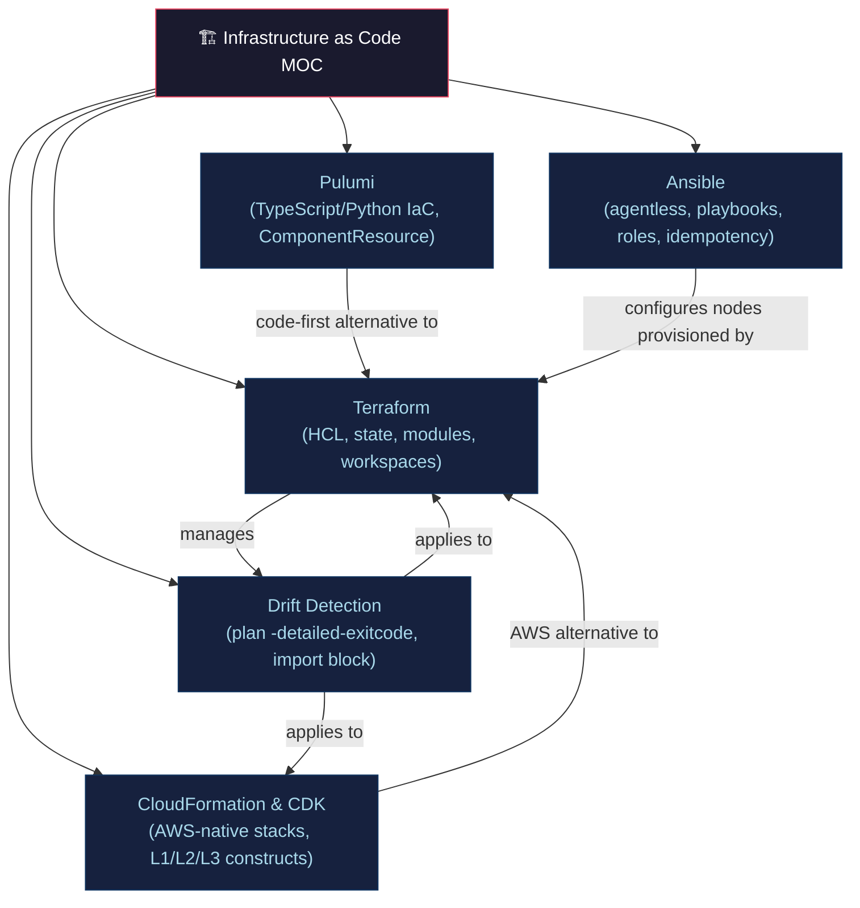

# 🏗️ Infrastructure as Code — Section MOC

> [!abstract] Section Overview
> IaC defines infrastructure (servers, networks, databases) in version-controlled code, enabling repeatability, auditability, and drift detection. This section covers Terraform (HCL, state, modules), CloudFormation/CDK (AWS-native), Ansible (configuration management), Pulumi (general-purpose languages), and drift detection strategies.

---

## Concept Map



---

## Notes in This Section

| Note | Key Concepts | Difficulty |
|------|-------------|------------|
| [[Terraform_Core_and_Modules\|Terraform Core & Modules]] | HCL DAG, state, plan+apply, modules, workspaces | Intermediate |
| [[CloudFormation_and_CDK\|CloudFormation & CDK]] | CF stacks, change sets, CDK constructs L1/L2/L3 | Intermediate |
| [[Ansible\|Ansible]] | Agentless SSH, playbooks, roles, idempotency | Beginner |
| [[Pulumi\|Pulumi]] | TypeScript/Python IaC, ComponentResource, ESC | Intermediate |
| [[Drift_Detection_and_State_Management\|Drift Detection]] | State management, drift, import, immutable infra | Advanced |

---

## Learning Path

```
Terraform Core & Modules → Drift Detection → CloudFormation & CDK
→ Ansible → Pulumi
```

---

## Related Sections

- [[_MOC_DevOps_Master|↑ DevOps Master MOC]]
- [[../06_Cloud_Platforms/_MOC_Cloud_Platforms|→ Cloud Platforms]] — IaC provisions cloud resources
- [[../04_Kubernetes/_MOC_Kubernetes|→ Kubernetes]] — Terraform provisions EKS/GKE/AKS
- [[../02_CICD_Pipelines/_MOC_CICD_Pipelines|← CI/CD]] — IaC changes flow through pipelines

---

#DevOps #IaC #Terraform #CloudFormation #Ansible #Pulumi #MOC
