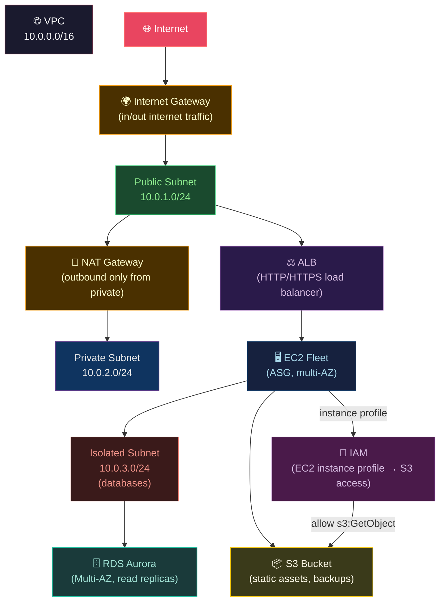

# 🟠 AWS Core Services

> [!abstract] TL;DR
> AWS is the largest cloud provider with ~200+ services. Key pillars: **EC2** (virtual machines, instance families, placement groups, ASG); **S3** (11-nines object store, storage class ladder, lifecycle, presigned URLs); **VPC** (public/private subnets, IGW, NAT Gateway, peering, PrivateLink); **IAM** (deny-by-default, explicit-deny-wins, permission boundaries, IRSA via OIDC); **Lambda** (Firecracker MicroVMs, cold start mitigation, provisioned concurrency, GB-seconds billing); **ECS/EKS/Fargate** for containers; **RDS/Aurora** for managed databases; **ElastiCache** for caching.

---

## Intuition — analogy FIRST

AWS is a **city built to your spec**. EC2 is the buildings (compute). S3 is the warehouse district (unlimited storage). VPC is the city's road network — public roads (internet-facing subnets), private roads (internal subnets), and tunnels (VPN/Direct Connect). IAM is the city's security office — everyone is denied by default; guards check badges (policies). Lambda is the **vending machine** model — pay only when someone presses a button, not for the machine sitting idle.

---

## How It Works



---

## Key Concepts / Details

### EC2 — Instance Families and Placement

| Family | Focus | Examples | Use Case |
|--------|-------|----------|---------|
| M (General) | Balance | m7i, m7g | Web apps, small databases |
| C (Compute) | CPU | c7i, c7g (Graviton) | CPU-bound processing |
| R (Memory) | RAM | r7i, r7g | In-memory databases, big data |
| I (I/O) | NVMe SSD | i4i, im4gn | High IOPS databases |
| G/P (GPU) | GPU | g5, p4d | ML training/inference |
| T (Burstable) | Burstable CPU | t3, t4g | Dev/test, variable workloads |

```bash
# Placement groups
# Cluster: low-latency, high-bandwidth (same rack/AZ) — HPC workloads
aws ec2 create-placement-group --group-name hpc-cluster --strategy cluster

# Spread: max physical separation (different racks) — small-scale HA
# Max 7 instances per AZ
aws ec2 create-placement-group --group-name critical-spread --strategy spread

# Partition: distributed across partitions (groups of racks) — Hadoop/Kafka
aws ec2 create-placement-group --group-name kafka --strategy partition --partition-count 3

# Auto Scaling Group with target tracking
aws autoscaling create-auto-scaling-group \
  --auto-scaling-group-name myapp-asg \
  --launch-template LaunchTemplateId=lt-1234,Version='$Latest' \
  --min-size 2 --max-size 20 \
  --target-group-arns $ALB_TG_ARN \
  --health-check-type ELB --health-check-grace-period 60 \
  --vpc-zone-identifier "subnet-1,subnet-2,subnet-3"

# Target tracking policy: maintain 70% CPU
aws autoscaling put-scaling-policy \
  --auto-scaling-group-name myapp-asg \
  --policy-name target-cpu-70 \
  --policy-type TargetTrackingScaling \
  --target-tracking-configuration file://target-tracking.json
```

### S3 — Object Storage

```bash
# Storage class ladder (cost vs retrieval latency):
# Standard:            frequent access     → $0.023/GB
# Intelligent-Tiering: auto-tiering        → monitoring fee + class rates
# Standard-IA:         infrequent access   → $0.0125/GB + retrieval fee
# One Zone-IA:         IA, single AZ       → $0.01/GB
# Glacier Instant:     archive, instant    → $0.004/GB
# Glacier Flexible:    archive, 1-5 min    → $0.0036/GB
# Glacier Deep:        archive, 12h        → $0.00099/GB

# Lifecycle policy
aws s3api put-bucket-lifecycle-configuration \
  --bucket my-bucket \
  --lifecycle-configuration file://lifecycle.json

# lifecycle.json
{
  "Rules": [{
    "Status": "Enabled",
    "Transitions": [
      {"Days": 30, "StorageClass": "STANDARD_IA"},
      {"Days": 90, "StorageClass": "GLACIER_IR"},
      {"Days": 365, "StorageClass": "DEEP_ARCHIVE"}
    ],
    "Expiration": {"Days": 2555}   # 7 years
  }]
}

# Presigned URL (time-limited direct access)
aws s3 presign s3://my-bucket/report.pdf --expires-in 3600

# S3 Select (query CSV/JSON without downloading full file)
aws s3api select-object-content \
  --bucket my-bucket --key data.csv \
  --expression "SELECT s.name FROM S3Object s WHERE s.age > 30" \
  --expression-type SQL \
  --input-serialization '{"CSV": {"FileHeaderInfo": "Use"}}' \
  --output-serialization '{"CSV": {}}' /dev/stdout
```

### VPC — Network Architecture

```bash
# Public subnet: has route to Internet Gateway
# Private subnet: routes to NAT Gateway (outbound only)
# Isolated subnet: no route to internet (databases)

# VPC Peering: connect two VPCs (same or different accounts/regions)
aws ec2 create-vpc-peering-connection \
  --vpc-id vpc-1234 \
  --peer-vpc-id vpc-5678 \
  --peer-region eu-west-1

# PrivateLink: expose service to other VPCs without peering or internet
# - Service: NLB → VPC Endpoint Service
# - Consumer: VPC Endpoint (Interface) → ENI in your subnet
# Traffic never leaves AWS backbone

# VPN: site-to-site IPSec VPN to on-premises
# Direct Connect: dedicated fiber (1/10/100 Gbps) to on-premises
```

### IAM — Identity and Access Management

```json
// IAM policy evaluation logic:
// 1. Start: DENY all
// 2. Evaluate all applicable policies
// 3. Any explicit DENY → DENY (overrides everything)
// 4. Any explicit ALLOW → ALLOW
// 5. Otherwise: DENY (implicit deny)

// Permission boundary example: limit max permissions for a role
{
  "Version": "2012-10-17",
  "Statement": [{
    "Effect": "Allow",
    "Action": ["s3:*", "ec2:Describe*"],
    "Resource": "*"
  }]
}
// Role's effective permissions = intersection of role policy AND boundary

// IRSA (IAM Roles for Service Accounts) — K8s pods assume IAM role
// 1. Create OIDC provider for EKS cluster
// 2. Create IAM role with trust policy for ServiceAccount
// 3. Annotate K8s ServiceAccount with role ARN
```

```yaml
# K8s ServiceAccount with IRSA annotation
apiVersion: v1
kind: ServiceAccount
metadata:
  name: s3-reader
  namespace: production
  annotations:
    eks.amazonaws.com/role-arn: arn:aws:iam::123:role/S3ReaderRole
```

### Lambda — Serverless Compute

```python
# Lambda function structure
import boto3
import json

# Hoist expensive initialization OUTSIDE handler (executed once, cached)
s3 = boto3.client('s3')              # connection pooled across invocations
db = connect_to_database()           # reused if warm start

def handler(event, context):
    # Handler called on every invocation
    bucket = event['bucket']
    key = event['key']

    response = s3.get_object(Bucket=bucket, Key=key)
    data = json.loads(response['Body'].read())

    return {
        'statusCode': 200,
        'body': json.dumps(process(data))
    }
```

**Lambda pricing**: `$0.0000166667 per GB-second`. A 512MB function running 100ms = 0.05 GB-seconds. 1M invocations at 100ms = $0.83/month.

**Cold start mitigation**:
1. **Hoist SDK clients outside handler** — reuse connections across warm invocations
2. **Provisioned Concurrency** — pre-warm N instances (`~$0.0000041 per GB-second` extra)
3. **Smaller package size** — smaller zip = faster initialization
4. **Prefer runtimes**: Java (slowest cold start) > Python/Node.js > Go (fastest)
5. **Lambda SnapStart** (Java 21+) — snapshot + restore, ~90% cold start reduction

**Firecracker**: AWS Lambda and Fargate use Firecracker MicroVMs — each function/task runs in an isolated MicroVM that boots in <125ms. Combines VM security with container-like speed.

### EKS, ECS, and Fargate

| Service | Control plane | Worker management | Use case |
|---------|--------------|-------------------|---------|
| ECS | AWS-managed | EC2 (self-manage) or Fargate | Simple containers |
| ECS + Fargate | AWS-managed | AWS-managed (serverless) | No node ops |
| EKS | AWS-managed K8s | EC2 (managed node groups) or Fargate | K8s workloads |
| EKS + Fargate | AWS-managed K8s | AWS-managed | K8s, no nodes |

```bash
# Create EKS cluster with managed node group
eksctl create cluster \
  --name production \
  --region us-east-1 \
  --nodegroup-name standard \
  --node-type m7g.large \
  --nodes 3 --nodes-min 3 --nodes-max 10 \
  --enable-ssm \
  --asg-access \
  --alb-ingress-access

# Configure kubectl
aws eks update-kubeconfig --region us-east-1 --name production
```

---

## Real-World Notes

- **Graviton processors (AWS Arm)**: M7g/C7g/R7g instances offer ~20% better price/performance vs Intel. Most applications run without modification on Graviton.
- **EBS gp3 vs gp2**: gp3 is newer, cheaper, allows independent IOPS/throughput configuration. Always use gp3 for new volumes.
- **S3 eventual consistency is gone**: S3 now offers strong read-after-write consistency for all operations since December 2020.
- **SCP (Service Control Policy)**: Org-level guardrails that cap maximum permissions for all accounts in an OU. Even account admins can't exceed SCP limits.

---

## Common Pitfalls

1. **NAT Gateway data processing charges** — each GB through NAT Gateway costs $0.045 beyond hourly. High-traffic apps pay significant NAT costs; use VPC endpoints for AWS services.
2. **S3 public access block override** — even if a bucket policy allows public access, if the account-level block is enabled, access is denied; disable account-level block only if intentional.
3. **Lambda timeout too short** — default 3s. Cold starts alone can exceed this for Java; set appropriately and monitor `Duration` CloudWatch metric.
4. **IAM wildcard actions** — `"Action": "*"` or `"Action": "s3:*"` is overpermissive; use IAM Access Analyzer to identify least-privilege policies.
5. **No DynamoDB provisioned capacity for TF state** — DynamoDB on-demand for Terraform state locking is fine (low traffic); provisioned with too-low RCU causes throttling during concurrent operations.

---

## Related Concepts

- [[_MOC_Cloud_Platforms|↑ Cloud Platforms MOC]]
- [[GCP_Services|→ GCP Services]] — comparable services
- [[Azure_Services|→ Azure Services]] — comparable services
- [[FinOps_and_Cost_Optimization|→ FinOps]] — AWS cost optimization
- [[../05_Infrastructure_as_Code/Terraform_Core_and_Modules|← Terraform]] — provisions AWS resources
- [[../04_Kubernetes/Kubernetes_Core_Concepts|← K8s]] — runs on EKS

---

## Review Questions

1. An application runs on EC2 with an instance profile that has `s3:*` on `*`. Security audit flags this. Design a least-privilege policy that allows only reading objects from a specific bucket and path.
2. Explain the difference between VPC Peering and AWS PrivateLink. When would you choose one over the other?
3. A Lambda function in Java has a cold start of 4 seconds. Name three specific changes to reduce this, ranked by cost impact.

---

## Sources

- docs.aws.amazon.com
- aws.amazon.com/architecture/well-architected/
- AWS Pricing Calculator: calculator.aws.amazon.com

#DevOps #Cloud #AWS #EC2 #S3 #VPC #IAM #Lambda #EKS #RDS #Fargate #IRSA
