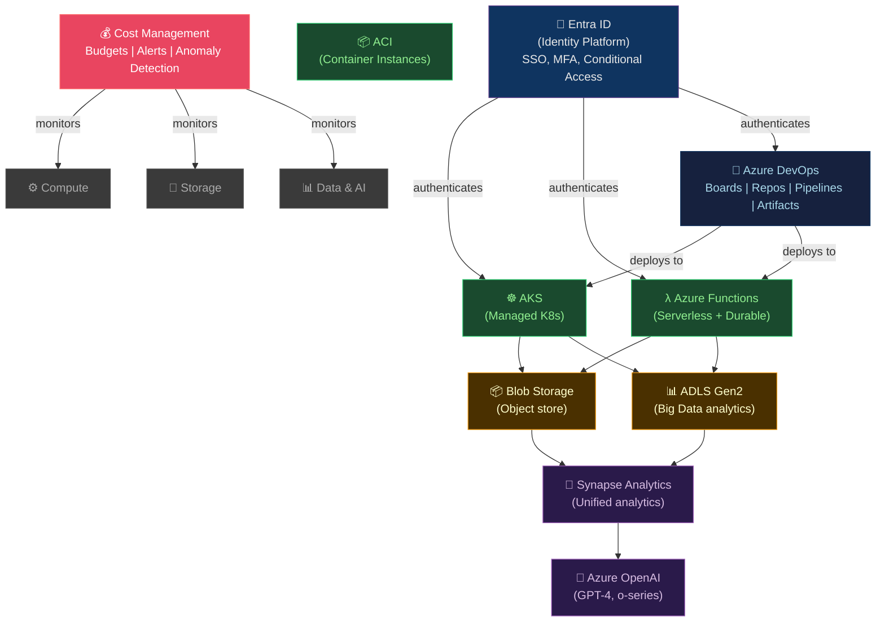

# 🔷 Azure Services

> [!abstract] TL;DR
> Azure is Microsoft's cloud platform with deep enterprise integration. **AKS** (Azure Kubernetes Service) manages K8s with Workload Identity (pod→Azure AD). **Azure Functions** supports Durable Orchestrations for stateful workflows. **Azure DevOps** provides integrated Boards/Repos/Pipelines/Artifacts. **Entra ID** (formerly Azure AD) is the identity backbone — SSO, MFA, Conditional Access. **Blob Storage + ADLS Gen2** covers object storage to big data analytics. **Azure OpenAI** hosts GPT-4/o models with RBAC. **Cost Management + Budgets** provides FinOps tooling with 80%/100% alerts and anomaly detection.

---

## Intuition — analogy FIRST

Azure is the cloud of choice for **Microsoft-centric enterprises** — if your organization runs Active Directory, Office 365, and .NET workloads, Azure has the deepest native integrations. Entra ID is the **enterprise directory** extended to the cloud — every service, user, and application authenticates through it. Azure DevOps is the **complete developer toolchain** in one portal — no separate JIRA, GitHub, CI/CD, or artifact management needed.

---

## How It Works



---

## Key Concepts / Details

### AKS — Azure Kubernetes Service

```bash
# Create AKS cluster with Azure CNI and Workload Identity
az aks create \
  --resource-group myRG \
  --name production \
  --node-count 3 \
  --node-vm-size Standard_D4s_v5 \
  --enable-cluster-autoscaler \
  --min-count 3 --max-count 20 \
  --network-plugin azure \          # Azure CNI (each pod gets VNet IP)
  --network-policy azure \          # Azure NetworkPolicy support
  --enable-workload-identity \      # Pod → Azure AD authentication
  --enable-oidc-issuer \
  --enable-managed-identity \
  --generate-ssh-keys

# Add node pool (e.g., GPU pool)
az aks nodepool add \
  --cluster-name production \
  --resource-group myRG \
  --name gpupool \
  --node-count 2 \
  --node-vm-size Standard_NC6s_v3 \  # NVIDIA V100
  --node-taints nvidia.com/gpu=true:NoSchedule

# Workload Identity for pods
az identity create \
  --name myapp-identity \
  --resource-group myRG

# Federate K8s ServiceAccount with Azure Managed Identity
az identity federated-credential create \
  --name myapp-federated \
  --identity-name myapp-identity \
  --resource-group myRG \
  --issuer $(az aks show --name production --resource-group myRG --query oidcIssuerProfile.issuerUrl -o tsv) \
  --subject "system:serviceaccount:production:myapp-sa"

# Grant role to managed identity
az role assignment create \
  --assignee <client-id> \
  --role "Storage Blob Data Reader" \
  --scope /subscriptions/.../storageAccounts/mystorage
```

```yaml
# K8s ServiceAccount annotated for Workload Identity
apiVersion: v1
kind: ServiceAccount
metadata:
  name: myapp-sa
  namespace: production
  annotations:
    azure.workload.identity/client-id: <managed-identity-client-id>
```

### Azure Functions — Serverless and Durable Orchestrations

```python
# Simple HTTP trigger function (Python)
import azure.functions as func
import json

app = func.FunctionApp(http_auth_level=func.AuthLevel.ANONYMOUS)

@app.route(route="process")
def process(req: func.HttpRequest) -> func.HttpResponse:
    data = req.get_json()
    result = process_data(data)
    return func.HttpResponse(json.dumps(result), mimetype="application/json")
```

```python
# Durable Functions: orchestrator + activities (stateful workflows)
import azure.durable_functions as df

# Orchestrator: coordinates long-running workflow
@df.orchestrator_function
def order_orchestrator(context: df.DurableOrchestrationContext):
    order_id = context.get_input()

    # Activity 1: Validate payment (waits for completion)
    payment_result = yield context.call_activity("ValidatePayment", order_id)
    if not payment_result["success"]:
        return {"status": "payment_failed"}

    # Activity 2: Allocate inventory
    inventory = yield context.call_activity("AllocateInventory", order_id)

    # Parallel fan-out
    tasks = [
        context.call_activity("NotifyWarehouse", order_id),
        context.call_activity("SendConfirmationEmail", order_id),
    ]
    results = yield context.task_all(tasks)   # wait for both

    # Human approval: wait for external event (up to 7 days)
    approval = yield context.wait_for_external_event("ManagerApproval")
    if not approval:
        yield context.call_activity("CancelOrder", order_id)

    return {"status": "completed", "order_id": order_id}

# Activity: actual work
@df.activity_trigger
def validate_payment(order_id: str) -> dict:
    result = payment_service.validate(order_id)
    return {"success": result.is_valid}
```

**Durable Functions patterns**: Chaining (sequential), Fan-out/Fan-in (parallel), External events (human approval), Eternal orchestrator (monitoring loop), Aggregator.

### Entra ID (Azure Active Directory)

```bash
# Application registration (OAuth2 client credentials flow)
az ad app create \
  --display-name "My App" \
  --sign-in-audience AzureADMyOrg

# Service Principal for CI/CD (Federated Identity = no client secret)
az ad sp create-for-rbac \
  --name github-actions-sp \
  --role contributor \
  --scopes /subscriptions/<sub-id>/resourceGroups/production \
  --sdk-auth

# Conditional Access: require MFA for admin portal
# (Configured via Azure Portal / Microsoft Entra admin center)

# RBAC: assign role to service principal
az role assignment create \
  --assignee <sp-object-id> \
  --role "Key Vault Secrets User" \
  --scope /subscriptions/<sub>/resourceGroups/rg/providers/Microsoft.KeyVault/vaults/myKV
```

**Entra ID key concepts:**
- **Tenants**: Organization boundary; one Entra ID tenant per organization
- **App Registration**: OAuth2/OIDC application identity (web, SPA, service)
- **Managed Identity**: Azure resource identity (no secrets; AKS nodes, VMs, Functions)
- **Federated Identity Credentials**: GitHub Actions → Azure without client secrets
- **Conditional Access**: Require MFA based on location, device compliance, risk score

### Azure DevOps — Integrated Toolchain

```yaml
# azure-pipelines.yml
trigger:
  branches:
    include: [main]

pool:
  vmImage: ubuntu-latest

variables:
  DOCKER_REGISTRY: myregistry.azurecr.io
  IMAGE_TAG: $(Build.BuildId)

stages:
  - stage: Build
    jobs:
      - job: BuildAndTest
        steps:
          - task: NodeTool@0
            inputs:
              versionSpec: '20.x'
          - script: npm ci && npm test
          - task: Docker@2
            inputs:
              command: buildAndPush
              repository: myapp
              dockerfile: Dockerfile
              containerRegistry: myACRConnection
              tags: |
                $(IMAGE_TAG)
                latest

  - stage: Deploy
    dependsOn: Build
    condition: and(succeeded(), eq(variables['Build.SourceBranch'], 'refs/heads/main'))
    jobs:
      - deployment: DeployToProduction
        environment: Production       # requires approval gate configured in Azure DevOps
        strategy:
          runOnce:
            deploy:
              steps:
                - task: AzureCLI@2
                  inputs:
                    azureSubscription: AzureConnection
                    scriptType: bash
                    scriptLocation: inlineScript
                    inlineScript: |
                      az aks get-credentials --name production --resource-group myRG
                      helm upgrade myapp ./charts/myapp \
                        --set image.tag=$(IMAGE_TAG) \
                        --wait --atomic
```

### Azure Blob Storage and ADLS Gen2

```python
# Azure Blob Storage (object storage)
from azure.storage.blob import BlobServiceClient
from azure.identity import DefaultAzureCredential

# Authenticate using Managed Identity / Workload Identity
credential = DefaultAzureCredential()
blob_client = BlobServiceClient(
    account_url="https://mystorage.blob.core.windows.net",
    credential=credential
)

# Upload
container_client = blob_client.get_container_client("my-container")
with open("data.parquet", "rb") as f:
    container_client.upload_blob("data/2026/07/data.parquet", f, overwrite=True)

# ADLS Gen2: Hierarchical namespace on Blob (for Spark, Databricks, Synapse)
# Enable during storage account creation:
# az storage account create --hierarchical-namespace true --name myADLS ...

# Directory operations (POSIX-like)
from azure.storage.filedatalake import DataLakeServiceClient
dls_client = DataLakeServiceClient(account_url, credential=credential)
file_system = dls_client.get_file_system_client("raw")
directory = file_system.get_directory_client("events/2026/07")
directory.create_directory()
```

### Azure Cost Management

```bash
# Create budget with alert at 80% and 100%
az consumption budget create \
  --budget-name monthly-production \
  --amount 5000 \
  --time-grain Monthly \
  --time-period '{"startDate": "2026-07-01", "endDate": "2027-07-01"}' \
  --scope /subscriptions/<sub-id> \
  --notifications '[
    {"enabled": true, "operator": "GreaterThan", "threshold": 80,
     "contactEmails": ["platform@example.com"], "thresholdType": "Actual"},
    {"enabled": true, "operator": "GreaterThan", "threshold": 100,
     "contactEmails": ["platform@example.com", "cto@example.com"], "thresholdType": "Actual"}
  ]'

# Enable cost anomaly detection
az costmanagement alert create \
  --scope /subscriptions/<sub-id> \
  --type ActualCostAlert \
  --budget-name monthly-production

# Cost analysis export
az costmanagement export create \
  --name monthly-cost-export \
  --type ActualCost \
  --scope /subscriptions/<sub-id> \
  --storage-account-id /subscriptions/<sub-id>/resourceGroups/rg/providers/Microsoft.Storage/storageAccounts/mystorageaccount \
  --recurrence Monthly
```

---

## Real-World Notes

- **Azure OpenAI vs OpenAI API**: Azure OpenAI runs the same GPT models but in your Azure tenant — data stays in your VNet, no data sent to OpenAI for training, same RBAC and compliance controls as other Azure services.
- **AKS cost saving**: Use **Spot node pools** for batch workloads (70–90% cheaper). AKS Spot VMs are evicted with 30s notice — design workloads to be eviction-tolerant.
- **Azure Policy**: Enforce governance (e.g., "all resources must have cost tags", "deny public IPs", "require encryption") across subscriptions/management groups.
- **Microsoft Defender for Cloud**: Unified security posture management — auto-scans AKS, VMs, storage accounts for misconfigurations and provides secure score.

---

## Common Pitfalls

1. **Using client secrets instead of Managed Identity** — rotating secrets is manual and error-prone; use Managed Identity for Azure resources and Federated Identity for external systems.
2. **AKS node pool in single AZ** — default AKS clusters are single-AZ; use availability zones in node pool creation for production.
3. **Blob Storage public access** — newly created storage accounts have public access blocked, but older ones may not; audit with `az storage account list --query "[?allowBlobPublicAccess]"`.
4. **Durable Functions orchestrator with non-deterministic code** — orchestrators replay on each step; `DateTime.Now`, `Guid.NewGuid()`, and external calls in orchestrator break replay; use deterministic APIs.
5. **Missing resource group tags** — cost attribution is impossible without tags; enforce via Azure Policy at management group level.

---

## Related Concepts

- [[_MOC_Cloud_Platforms|↑ Cloud Platforms MOC]]
- [[AWS_Core_Services|↔ AWS]] — comparable services (AKS≈EKS, Functions≈Lambda, Blob≈S3)
- [[GCP_Services|↔ GCP]] — comparable services (AKS≈GKE, Functions≈Cloud Functions)
- [[Multi_Cloud_Patterns|→ Multi-Cloud]] — Azure Arc for hybrid/multi-cloud
- [[FinOps_and_Cost_Optimization|→ FinOps]] — Azure Cost Management integration

---

## Review Questions

1. An application running in AKS needs to read secrets from Azure Key Vault without any credentials stored in K8s Secrets. Walk through the exact steps to set up Workload Identity for this.
2. Explain Durable Functions' Fan-out/Fan-in pattern. How does it differ from running parallel Azure Functions independently, and what problem does it solve?
3. A finance team reports that Azure costs exceeded budget with no warning. Design the alerting configuration (budget name, thresholds, recipients) and explain why anomaly detection is a separate feature from budget alerts.

---

## Sources

- learn.microsoft.com/azure
- docs.microsoft.com/azure/aks
- docs.microsoft.com/azure/azure-functions/durable
- Microsoft Cloud Adoption Framework

#DevOps #Cloud #Azure #AKS #Functions #EntraID #AzureDevOps #BlobStorage #ADLS #AzureOpenAI
