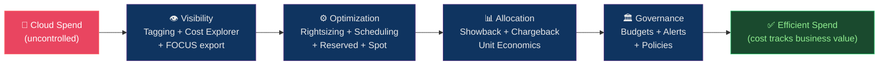

# 💰 FinOps and Cost Optimization

> [!abstract] TL;DR
> FinOps is the practice of connecting cloud spending to business value through **unit economics** (cost/transaction, cost/user). Purchasing options: On-Demand (baseline, no commit) → **Reserved Instances** (~40% off, 1-year) → **Savings Plans** (~30% flexible across service families) → **Spot/Preemptible** (70–90% off, 2-min eviction notice). **Rightsizing**: use AWS Compute Optimizer/GCP Recommender to match instance size to actual utilization. **Schedule**: turn off non-prod 14 hours/day weeknights + weekends (~66% cut). **FOCUS** standard normalizes billing across clouds. Budgets alert at 80%/100%; anomaly detection fires same-day.

---

## Intuition — analogy FIRST

FinOps is like **activity-based costing for a restaurant**. On-Demand cloud is renting a table by the minute. Reserved Instances is signing a year-long lease on that table (big discount, but you pay whether you eat or not). Spot Instances is using a table that might be reclaimed mid-meal — you get it cheap, but you must be ready to pack up in 2 minutes. Rightsizing is auditing whether you're using a 20-seat banquet hall for a team of 3. Unit economics answers: "What does each meal (transaction) actually cost us?"

---

## How It Works



---

## Key Concepts / Details

### Unit Economics — The North Star Metric

```
Unit economics maps cloud cost to business outcomes:

cost_per_transaction = monthly_cloud_cost / monthly_transactions
cost_per_user = monthly_cloud_cost / monthly_active_users
cost_per_GB_processed = monthly_cloud_cost / monthly_GB_processed

Example analysis:
  Cloud bill: $50,000/month
  Transactions: 5,000,000/month
  → $0.01 per transaction

  After optimization (Reserved + rightsizing): $32,000/month
  → $0.0064 per transaction (36% improvement)

  Engineering value: each optimization is measured as $/transaction reduction
  not "$18k/month savings" (which loses context as volume grows)
```

### Purchasing Options Spectrum

| Option | Discount | Commitment | Eviction Risk | Use Case |
|--------|---------|------------|---------------|---------|
| On-Demand | 0% baseline | None | None | Unpredictable, new |
| Reserved 1-year | ~40% | 1 year, partial upfront | None | Steady-state baseline |
| Reserved 3-year | ~60% | 3 years, all upfront | None | Long-lived, high confidence |
| Savings Plans (AWS) | ~30% | 1-3 year, flexible | None | Flexible across instance families |
| Preemptible/Spot | 70–90% | None | 2-min (AWS/GCP) notice | Batch, fault-tolerant |
| Committed Use (GCP) | ~37–55% | 1-3 year | None | GKE, Cloud Run baselines |

```bash
# AWS Savings Plans: flexible alternative to Reserved Instances
# Compute Savings Plans: any EC2 family, any region, also Lambda/Fargate
# EC2 Instance Savings Plans: specific instance family, one region

# Purchase Savings Plan
aws savingsplans purchase-savings-plan \
  --savings-plan-offering-id <offering-id> \
  --commitment 100.00 \                  # $/hour commitment
  --savings-plan-type ComputeSavingsPlans \
  --term-duration-in-years 1 \
  --purchase-time 2026-07-26T00:00:00Z

# Check utilization
aws ce get-savings-plans-utilization \
  --time-period Start=2026-07-01,End=2026-07-26

# Target: >80% utilization (paying for unused commitment otherwise)
```

### Spot/Preemptible — Fault-Tolerant Workloads

```python
# AWS Spot with interruption handling
import boto3
import requests

def check_spot_interruption():
    """Check EC2 instance metadata for spot interruption notice"""
    try:
        # IMDSv2 token
        token = requests.put(
            'http://169.254.169.254/latest/api/token',
            headers={'X-aws-ec2-metadata-token-ttl-seconds': '21600'},
            timeout=1
        ).text

        response = requests.get(
            'http://169.254.169.254/latest/meta-data/spot/termination-time',
            headers={'X-aws-ec2-metadata-token': token},
            timeout=1
        )
        if response.status_code == 200:
            # Interruption notice: ~2 minutes remaining
            return response.text
    except:
        pass
    return None

# Handler: checkpoint state before eviction
def graceful_shutdown():
    save_checkpoint()       # write progress to S3
    deregister_from_lb()    # remove from load balancer
    drain_in_flight_requests()
```

```yaml
# Kubernetes: mix Spot and On-Demand nodes
# On-Demand node group: stable baseline
# Spot node group: cost-efficient burst capacity

# K8s node affinity for Spot-tolerant workloads
spec:
  affinity:
    nodeAffinity:
      preferredDuringSchedulingIgnoredDuringExecution:
        - weight: 100
          preference:
            matchExpressions:
              - key: "eks.amazonaws.com/capacityType"
                operator: In
                values: ["SPOT"]
  tolerations:
    - key: "eks.amazonaws.com/capacityType"
      value: "SPOT"
      effect: "NoSchedule"

# Cluster Autoscaler: prefer Spot, fall back to On-Demand
```

### Rightsizing — Match Size to Usage

```bash
# AWS Compute Optimizer: ML-based recommendations
aws compute-optimizer get-ec2-instance-recommendations \
  --instance-arns arn:aws:ec2:us-east-1:123:instance/i-1234 \
  --output json | jq '.instanceRecommendations[].recommendationOptions'

# Output shows: risk level, estimated savings, recommended instance type
# e.g.: "m5.xlarge" → "m5.large" saving $72/month (42%)

# GCP Rightsizing recommendations
gcloud recommender recommendations list \
  --location=us-central1 \
  --recommender=google.compute.instance.MachineTypeRecommender \
  --format=table

# CloudWatch metric to identify idle resources
aws cloudwatch get-metric-statistics \
  --namespace AWS/EC2 \
  --metric-name CPUUtilization \
  --dimensions Name=InstanceId,Value=i-1234 \
  --start-time 2026-07-01T00:00:00Z \
  --end-time 2026-07-26T00:00:00Z \
  --period 86400 \        # 1-day periods
  --statistics Average

# If avg CPU < 5% over 30 days → strong rightsizing candidate
```

**Rightsizing tiers:**
1. **Idle** (<5% CPU, ~0% memory) → `stop` or `terminate`
2. **Underutilized** (<40% CPU peak) → downsize 1 tier
3. **Memory-bound** (low CPU, high memory) → switch to memory-optimized family
4. **Right-sized** (60–80% CPU peak) → maintain
5. **Overutilized** (>90% CPU) → upsize or scale horizontally

### Scheduling — Turn Off Non-Prod

```python
# Lambda function to stop non-prod instances at night
import boto3

def lambda_handler(event, context):
    ec2 = boto3.client('ec2')
    action = event.get('action', 'stop')  # 'start' or 'stop'

    # Find tagged instances
    response = ec2.describe_instances(
        Filters=[
            {'Name': 'tag:Environment', 'Values': ['dev', 'staging']},
            {'Name': 'tag:AutoSchedule', 'Values': ['true']},
            {'Name': 'instance-state-name', 'Values': ['running' if action == 'stop' else 'stopped']}
        ]
    )

    instance_ids = [
        instance['InstanceId']
        for reservation in response['Reservations']
        for instance in reservation['Instances']
    ]

    if instance_ids:
        if action == 'stop':
            ec2.stop_instances(InstanceIds=instance_ids)
            print(f"Stopped {len(instance_ids)} instances")
        else:
            ec2.start_instances(InstanceIds=instance_ids)
            print(f"Started {len(instance_ids)} instances")
```

```bash
# EventBridge schedule: stop at 8PM, start at 7AM (M-F)
aws events put-rule \
  --name stop-non-prod \
  --schedule-expression "cron(0 20 ? * MON-FRI *)" \
  --state ENABLED

# Savings calculation:
# 8PM-7AM weekdays: 11h × 5 = 55h off
# Weekends: 48h off
# Weekly: 103h off / 168h total = 61% off-hours
# Hourly cost × 61% = potential saving on non-prod compute
```

### Tagging Strategy — Cost Attribution

```bash
# Mandatory tags enforcement via AWS Organizations SCP
{
  "Version": "2012-10-17",
  "Statement": [{
    "Effect": "Deny",
    "Action": [
      "ec2:RunInstances",
      "rds:CreateDBInstance",
      "eks:CreateCluster"
    ],
    "Resource": "*",
    "Condition": {
      "Null": {
        "aws:RequestedRegion": "false",
        "aws:ResourceTag/Environment": "true",  # must have Environment tag
        "aws:ResourceTag/Team": "true",          # must have Team tag
        "aws:ResourceTag/CostCenter": "true"     # must have CostCenter tag
      }
    }
  }]
}

# Cost Explorer: allocate costs by tag
aws ce get-cost-and-usage \
  --time-period Start=2026-07-01,End=2026-07-26 \
  --granularity MONTHLY \
  --metrics "UnblendedCost" \
  --group-by Type=TAG,Key=Team
```

### FOCUS — Cloud Cost Standard

```
FOCUS (FinOps Open Cost and Usage Specification) v1.0

Standardizes cost data schema across AWS, GCP, Azure:
  BillingPeriodStart / BillingPeriodEnd
  ServiceCategory (Compute / Storage / Networking / Database / AI and Machine Learning)
  ResourceId
  ListUnitPrice / EffectiveCost / BilledCost
  PricingCategory (On-Demand / Reserved / Spot / Committed Use / Free)
  SkuPriceId
  Tags (normalized format)

Benefits:
  - Single dashboard across all clouds
  - Standard BI queries for multi-cloud cost
  - Vendor-neutral tooling (OpenCost, Kubecost)

Export:
  AWS: Cost and Usage Report → S3 → FOCUS schema
  GCP: Billing export → BigQuery → FOCUS schema
  Azure: Cost Management export → Storage → FOCUS schema
```

### Budget Alerting and Anomaly Detection

```bash
# AWS Budget with two thresholds
aws budgets create-budget \
  --account-id 123456789 \
  --budget '{
    "BudgetName": "monthly-production",
    "BudgetLimit": {"Amount": "5000", "Unit": "USD"},
    "TimeUnit": "MONTHLY",
    "BudgetType": "COST"
  }' \
  --notifications-with-subscribers '[
    {
      "Notification": {
        "NotificationType": "ACTUAL",
        "ComparisonOperator": "GREATER_THAN",
        "Threshold": 80,
        "ThresholdType": "PERCENTAGE"
      },
      "Subscribers": [{"SubscriptionType": "EMAIL", "Address": "finops@example.com"}]
    },
    {
      "Notification": {
        "NotificationType": "ACTUAL",
        "ComparisonOperator": "GREATER_THAN",
        "Threshold": 100,
        "ThresholdType": "PERCENTAGE"
      },
      "Subscribers": [
        {"SubscriptionType": "EMAIL", "Address": "finops@example.com"},
        {"SubscriptionType": "SNS", "Address": "arn:aws:sns:..."}
      ]
    }
  ]'

# Cost Anomaly Detection (ML-based, same-day alerts)
aws ce create-anomaly-monitor \
  --anomaly-monitor '{
    "MonitorName": "service-anomalies",
    "MonitorType": "DIMENSIONAL",
    "MonitorDimension": "SERVICE"
  }'

aws ce create-anomaly-subscription \
  --anomaly-subscription '{
    "SubscriptionName": "high-spend-alert",
    "Threshold": 50,    # Alert if anomaly exceeds $50
    "Frequency": "DAILY",
    "MonitorArnList": ["arn:aws:ce::123:anomalymonitor/abc"],
    "Subscribers": [{"Address": "finops@example.com", "Type": "EMAIL"}]
  }'
```

---

## Real-World Notes

- **Reserved coverage target**: Aim for 70–80% Reserved/Savings Plan coverage on stable baseline compute. Too high (>90%) means paying for unused reservations when you scale down.
- **Spot for ML training**: GPU instances (p4d, g5) at Spot pricing = 70–90% off. Implement checkpointing to S3 every N minutes — most ML frameworks support resuming from checkpoint.
- **KubeCost/OpenCost**: Deploy in-cluster to get per-namespace, per-workload cost attribution with no cloud billing export. Integrates with Prometheus.
- **S3 storage savings**: Enable Intelligent-Tiering for buckets with unpredictable access patterns. Automatically moves objects between tiers, saving up to 40%.

---

## Common Pitfalls

1. **Reserved Instances without utilization tracking** — paying for Reserved capacity you're not using; target >80% RI utilization, sell unused RIs on the AWS Marketplace.
2. **Spot without fallback** — critical workloads on Spot only; build mixed instance type + On-Demand fallback in ASG launch templates.
3. **Tagging too late** — applying tags retroactively is hard; enforce tags via SCP/Policy from account creation.
4. **Ignoring data transfer costs** — egress between AZs ($0.01/GB), regions ($0.02/GB), and internet ($0.09/GB) can dominate bills for data-intensive architectures.
5. **Monthly budget review vs continuous** — checking costs monthly misses intra-month anomalies; use daily anomaly detection and weekly budget summaries.

---

## Related Concepts

- [[_MOC_Cloud_Platforms|↑ Cloud Platforms MOC]]
- [[AWS_Core_Services|← AWS]] — Reserved Instances, Savings Plans, Compute Optimizer
- [[GCP_Services|← GCP]] — Committed Use Discounts, Spot VMs
- [[Azure_Services|← Azure]] — Azure Reservations, Cost Management
- [[Multi_Cloud_Patterns|← Multi-Cloud]] — FOCUS standard for cross-cloud cost

---

## Review Questions

1. A team has 100 always-on EC2 m5.xlarge instances ($0.192/hr). Calculate: On-Demand annual cost, 1-year Reserved (All Upfront, 40% discount), Savings Plan (30% discount). What is the annual saving of each option?
2. AWS Compute Optimizer recommends downsizing 20 EC2 instances from m5.2xlarge to m5.xlarge. The average CPU utilization is 15%. What additional metric (besides CPU) should you check before downsizing, and why?
3. Design a complete FinOps tagging strategy for a company with 3 product teams, 4 environments, and 3 cloud providers. Include: mandatory tags, enforcement mechanism, and cost reporting query.

---

## Sources

- finops.org — FinOps Foundation
- finops.org/wg/focus/ — FOCUS specification
- docs.aws.amazon.com/cost-management
- cloud.google.com/billing/docs
- learn.microsoft.com/azure/cost-management-billing

#DevOps #Cloud #FinOps #CostOptimization #Reserved #Spot #Rightsizing #UnitEconomics #FOCUS #Budgets
