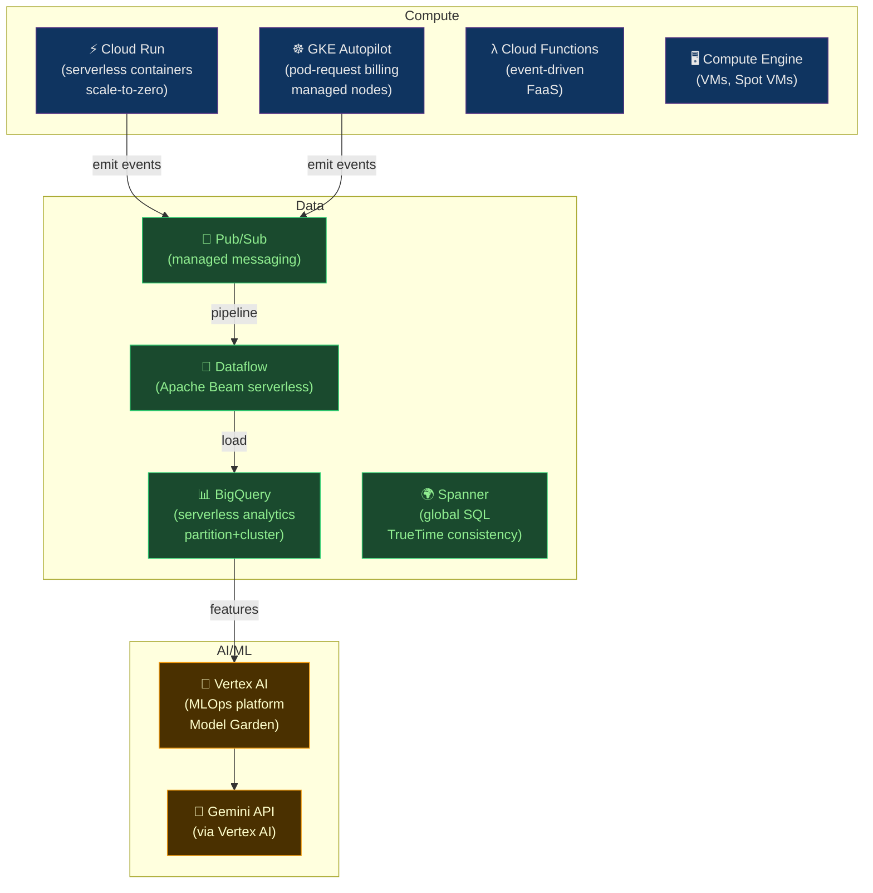

# 🔵 GCP Services

> [!abstract] TL;DR
> GCP excels in data analytics and AI/ML. **GKE Autopilot** bills per pod request (not node), managed control plane + node ops. **Cloud Run** is serverless containers: scales to zero, instances = ⌈arrival_rate × latency / concurrency⌉. **BigQuery** is serverless analytics: partition + cluster for query cost reduction, materialized views for pre-aggregation. **Spanner** uses TrueTime (GPS + atomic clocks) for globally consistent transactions, commit-wait ε≈ms. **Pub/Sub → Dataflow → BigQuery → Vertex AI** forms GCP's serverless data pipeline. **Cloud Armor** provides WAF/DDoS at global load balancer.

---

## Intuition — analogy FIRST

GCP is built around **Google's internal infrastructure playbook**. GKE Autopilot is like hiring a facilities manager who charges per desk used (pod requests), not per floor rented (nodes). Cloud Run is a **smart vending machine** — dormant when nobody buys, instantly active when demand arrives, sized by `arrival_rate × latency / concurrency`. Spanner is the **atomic clock-synced bank ledger** — two clerks in different cities can make concurrent transactions with a mathematically guaranteed ordering, achieved by GPS + atomic clock uncertainty windows.

---

## How It Works



---

## Key Concepts / Details

### GKE — Kubernetes on GCP

```bash
# Standard mode: manage node pools yourself
gcloud container clusters create production \
  --zone us-central1-a \
  --machine-type n2-standard-4 \
  --num-nodes 3 \
  --enable-autoscaling --min-nodes 3 --max-nodes 20 \
  --enable-vertical-pod-autoscaling \
  --workload-pool $(gcloud config get-value project).svc.id.goog  # Workload Identity

# Autopilot mode: GCP manages nodes
gcloud container clusters create-auto production \
  --region us-central1
# Billing: per pod vCPU + memory request, not per node
# Automatically scales nodes; you only see pods
```

**GKE Autopilot vs Standard:**

| | Autopilot | Standard |
|--|-----------|----------|
| Node management | Google | You |
| Billing unit | Pod request | Node |
| Node access | None | Full |
| Security | Hardened defaults | Configurable |
| Best for | Teams wanting managed K8s | Full control needed |

**Workload Identity** (GCP's IRSA equivalent):
```yaml
# K8s ServiceAccount → GCP Service Account
apiVersion: v1
kind: ServiceAccount
metadata:
  name: my-ksa
  namespace: production
  annotations:
    iam.gke.io/gcp-service-account: my-gsa@project.iam.gserviceaccount.com
```

### Cloud Run — Serverless Containers

**Instance count formula:**
```
instances = ⌈ (arrival_rate × latency) / concurrency ⌉

Example:
  arrival_rate = 100 req/s
  latency      = 200ms = 0.2s
  concurrency  = 80 (concurrent requests per instance)

  instances = ⌈ (100 × 0.2) / 80 ⌉ = ⌈ 20/80 ⌉ = ⌈ 0.25 ⌉ = 1 instance

  At 1000 req/s:
  instances = ⌈ (1000 × 0.2) / 80 ⌉ = ⌈ 2.5 ⌉ = 3 instances
```

```bash
# Deploy to Cloud Run
gcloud run deploy myapp \
  --image us-central1-docker.pkg.dev/project/repo/myapp:v1 \
  --region us-central1 \
  --platform managed \
  --concurrency 80 \
  --cpu 2 \
  --memory 2Gi \
  --min-instances 0 \        # scale to zero
  --max-instances 100 \
  --timeout 30s \
  --allow-unauthenticated

# Traffic splitting (canary/blue-green)
gcloud run services update-traffic myapp \
  --to-revisions myapp-v2=10,myapp-v1=90   # 10% canary

# Check scaling settings
gcloud run services describe myapp --format='yaml(spec.template.metadata.annotations)'
```

**Cloud Run billing**: Only billed when requests are being processed. `scale to 0` = $0 when idle. Minimum billing interval: 100ms.

### BigQuery — Serverless Data Warehouse

```sql
-- Partitioned table (reduces scan cost)
CREATE TABLE `project.dataset.events`
PARTITION BY DATE(event_time)
CLUSTER BY user_id, event_type   -- up to 4 columns, order matters
OPTIONS (
  partition_expiration_days = 365,
  require_partition_filter = TRUE  -- force queries to include partition filter
) AS
SELECT * FROM source_table;

-- Query with partition filter (scans only relevant partitions)
SELECT user_id, COUNT(*) as events
FROM `project.dataset.events`
WHERE DATE(event_time) BETWEEN '2026-07-01' AND '2026-07-26'
  AND event_type = 'purchase'   -- cluster filter reduces further
GROUP BY user_id
ORDER BY events DESC;

-- Materialized view (pre-computed, auto-refreshed)
CREATE MATERIALIZED VIEW `project.dataset.daily_revenue`
OPTIONS (enable_refresh = true, refresh_interval_minutes = 60)
AS
SELECT
  DATE(order_time) as order_date,
  SUM(amount) as revenue,
  COUNT(DISTINCT user_id) as unique_buyers
FROM `project.dataset.orders`
GROUP BY order_date;
```

```bash
# Estimate query cost before running
bq query --dry_run --nouse_legacy_sql "SELECT ..."
# This query will process 2.3 GB when run.
# Cost: 2.3 GB × $5/TB = $0.0115

# Optimize with slots (reserved capacity)
bq mk --reservation --slots=500 --project_id=project my-reservation
bq mk --capacity_commitment --plan=ANNUAL --slots=500 \
  --edition=ENTERPRISE --project_id=project

# Export to GCS
bq extract \
  --destination_format PARQUET \
  project:dataset.table \
  'gs://my-bucket/export/*.parquet'
```

### Cloud Spanner — Globally Distributed SQL

```
TrueTime mechanism:
  Each GCP data center has: GPS receivers + atomic clocks
  TrueTime API returns: [earliest, latest] uncertainty interval ε ≈ 7ms typical

  Commit-waiting protocol:
  1. Transaction commits with timestamp T
  2. Server waits until wall-clock ≥ T + ε (ensures T is definitely in the past)
  3. Read at T always sees correct state

  Result: External consistency (linearizability) across global regions
  Cost: ~7ms latency overhead per write (commit wait)
```

```python
# Spanner Python client
from google.cloud import spanner

client = spanner.Client()
instance = client.instance("my-instance")
database = instance.database("my-database")

# Read-write transaction (globally consistent)
def transfer_funds(transaction, from_account, to_account, amount):
    # Read with lock
    balances = transaction.execute_sql(
        "SELECT balance FROM Accounts WHERE id = @id",
        params={"id": from_account}
    )
    balance = list(balances)[0][0]
    if balance < amount:
        raise ValueError("Insufficient funds")

    transaction.execute_update(
        "UPDATE Accounts SET balance = balance - @amount WHERE id = @from",
        params={"amount": amount, "from": from_account}
    )
    transaction.execute_update(
        "UPDATE Accounts SET balance = balance + @amount WHERE id = @to",
        params={"amount": amount, "to": to_account}
    )

database.run_in_transaction(transfer_funds, "acc-1", "acc-2", 100.0)
```

### Pub/Sub → Dataflow → BigQuery Pipeline

```python
# Pub/Sub: publish event
from google.cloud import pubsub_v1
publisher = pubsub_v1.PublisherClient()
topic_path = publisher.topic_path("project", "events")
publisher.publish(topic_path, json.dumps(event).encode())

# Dataflow: Apache Beam pipeline (runs as managed service)
import apache_beam as beam
from apache_beam.options.pipeline_options import PipelineOptions

options = PipelineOptions([
    '--runner=DataflowRunner',
    '--project=my-project',
    '--region=us-central1',
    '--temp_location=gs://my-bucket/temp',
    '--streaming',              # unbounded source (Pub/Sub)
])

with beam.Pipeline(options=options) as p:
    (p
     | 'ReadFromPubSub' >> beam.io.ReadFromPubSub(
         subscription='projects/project/subscriptions/events-sub')
     | 'ParseJSON' >> beam.Map(lambda msg: json.loads(msg))
     | 'WindowEvents' >> beam.WindowInto(
         beam.window.FixedWindows(60))  # 1-minute windows
     | 'AggregateByUser' >> beam.GroupByKey()
     | 'WriteToBigQuery' >> beam.io.WriteToBigQuery(
         'project:dataset.events',
         schema='user_id:STRING,count:INTEGER,window_start:TIMESTAMP',
         write_disposition=beam.io.BigQueryDisposition.WRITE_APPEND)
    )
```

### Cloud Armor — WAF and DDoS Protection

```bash
# Create security policy
gcloud compute security-policies create my-policy \
  --description "WAF policy"

# Block IPs from specific country (geo-blocking)
gcloud compute security-policies rules create 1000 \
  --security-policy my-policy \
  --expression "origin.region_code == 'CN'" \
  --action deny-403

# OWASP WAF rules (preconfigured)
gcloud compute security-policies rules create 2000 \
  --security-policy my-policy \
  --expression "evaluatePreconfiguredExpr('sqli-v33-stable')" \
  --action deny-403

# Rate limiting
gcloud compute security-policies rules create 3000 \
  --security-policy my-policy \
  --expression "true" \
  --action rate-based-ban \
  --rate-limit-threshold-count 100 \
  --rate-limit-threshold-interval-sec 60

# Attach to backend service
gcloud compute backend-services update my-backend \
  --security-policy my-policy \
  --global
```

---

## Real-World Notes

- **GCP free tier for BigQuery**: First 1TB of query/month and 10GB storage are free. This enables learning and small analytics projects at zero cost.
- **Cloud Run vs Cloud Functions**: Cloud Run is more flexible (any container, longer timeout up to 60min), Cloud Functions is simpler (code-only, auto-managed). For new projects, prefer Cloud Run.
- **Vertex AI Model Garden**: 150+ foundation models (Gemini, Claude, Llama, etc.) accessible via a unified API. Use for RAG pipelines, fine-tuning, and model evaluation.
- **Committed Use Discounts**: 1-year commit = ~37% discount; 3-year = ~55%. Available for Compute Engine, Cloud Run, GKE.

---

## Common Pitfalls

1. **BigQuery without partition filter** — full table scan on petabyte table; set `require_partition_filter = TRUE` to enforce.
2. **Cloud Run concurrency too high** — setting `--concurrency 1000` with a non-thread-safe app causes data corruption; calibrate based on app's thread safety.
3. **Pub/Sub subscription without acknowledgment** — messages redelivered after `ack_deadline` (10s default). Always ack promptly or extend deadline.
4. **Spanner hot spots** — monotonically increasing primary keys (timestamps, auto-increment IDs) cause all writes to go to one server. Use UUID v4 or hash-prefixed keys.
5. **GKE Autopilot eviction for lacking requests** — Autopilot requires resource requests on all containers; pods without requests are evicted.

---

## Related Concepts

- [[_MOC_Cloud_Platforms|↑ Cloud Platforms MOC]]
- [[AWS_Core_Services|↔ AWS]] — comparable services comparison
- [[Azure_Services|↔ Azure]] — comparable services
- [[Multi_Cloud_Patterns|→ Multi-Cloud]] — GCP in multi-cloud architecture
- [[FinOps_and_Cost_Optimization|→ FinOps]] — GCP committed use discounts

---

## Review Questions

1. A Cloud Run service has `concurrency=10` and handles requests in 500ms. At what arrival rate (req/s) does GCP provision the second instance?
2. A BigQuery query scanning a 10TB table costs $50. What two schema-level optimizations (not query changes) would reduce this cost, and by approximately how much?
3. Explain why monotonically increasing primary keys cause hot spots in Spanner, and describe two alternative key strategies that distribute load evenly.

---

## Sources

- cloud.google.com/docs
- cloud.google.com/spanner/docs/true-time-external-consistency
- cloud.google.com/bigquery/docs/best-practices-performance-overview

#DevOps #Cloud #GCP #GKE #CloudRun #BigQuery #Spanner #PubSub #Dataflow #VertexAI #CloudArmor
