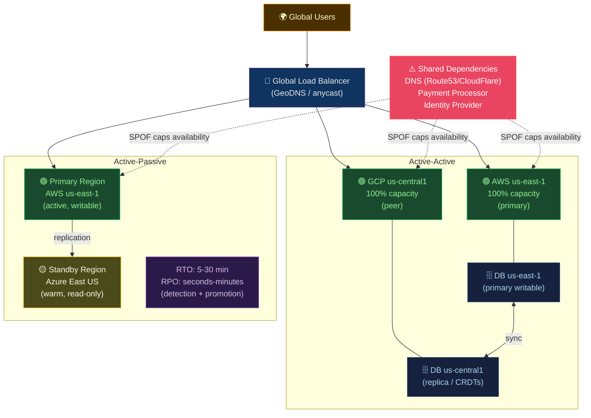

# 🌐 Multi-Cloud Patterns

> [!abstract] TL;DR
> Multi-cloud runs workloads across multiple cloud providers to avoid vendor lock-in, meet data sovereignty requirements, or maximize availability. **Active-active**: every region serves traffic (max availability, max complexity). **Active-passive**: one region primary, another standby (cheaper, higher detection+promotion latency). **Availability formula**: `A = 1 - (1-p)ⁿ` — two 99.9% regions → 99.9999%, capped by shared dependencies (DNS, payment processor). Tools: **Anthos/Azure Arc** for GitOps-managed multi-cluster. **SD-WAN** for network fabric. **FOCUS** for cost standards. Tradeoffs: data sovereignty, operational complexity, lock-in spectrum.

---

## Intuition — analogy FIRST

Multi-cloud is like **operating two factories in different cities**. Active-active: both factories produce simultaneously — if one city floods, the other handles 100% of orders (zero downtime, double inventory cost). Active-passive: one factory runs; the other is "warm standby" — when the primary floods, you scramble to activate the standby (5–30 minute outage, cheaper idle cost). The critical insight: your availability is only as good as the **common parts supplier** — if both factories use the same bolt supplier and that supplier fails, both factories stop regardless.

---

## How It Works



---

## Key Concepts / Details

### Availability Mathematics

```
Single region availability:
  A = p = 0.999 (99.9% = 40.3 min downtime/month)

Multi-region: independent failure modes:
  A = 1 - (1-p)ⁿ

  n=2: A = 1 - (0.001)² = 1 - 0.000001 = 0.999999 → 99.9999%
  n=3: A = 1 - (0.001)³ = 0.999999999 → 99.9999999%

CRITICAL: Shared dependencies cap effective availability

Example: Two-region 99.9% with shared 99.9% DNS provider:
  Effective A ≈ min(two-region A, DNS A)
             = min(99.9999%, 99.9%)
             = 99.9%  ← no improvement!

To realize two-region benefit: DNS must be higher than 99.999%
Use: Cloudflare (99.99%+ SLA) or GeoDNS with health-checked failover
```

### Active-Active Architecture

```yaml
# Global Traffic Manager (AWS Route 53 with health checks)
# GeoDNS: route users to nearest healthy region

# Route 53 latency-based routing with failover
myapp.example.com:
  - region: us-east-1
    type: A
    set-id: us-east-1
    routing-policy: latency
    health-check: https://api.us-east-1.example.com/health
  - region: eu-west-1
    type: A
    set-id: eu-west-1
    routing-policy: latency
    health-check: https://api.eu-west-1.example.com/health
    failover: secondary  # activated if primary health check fails
```

**Data consistency in active-active:**

| Approach | Consistency | Complexity | Examples |
|---------|-------------|------------|---------|
| Single-region writer, multi-region reader | Strong (reads may lag) | Medium | Aurora Global Database |
| CRDTs (Conflict-free Replicated Data Types) | Eventual (converge) | High | Shopping carts, counters |
| Distributed transactions (2PC) | Strong | Very high | CockroachDB, Spanner |
| Event sourcing + CQRS | Eventual | High | Custom event systems |
| Avoid shared mutable state | N/A | Low | Stateless services |

### Active-Passive with RTO/RPO

```
RTO (Recovery Time Objective): max acceptable downtime
RPO (Recovery Point Objective): max acceptable data loss

Active-passive timelines:
  Failure detected:     0 min
  Alert fires:          +1-2 min (depends on health check interval)
  Operator notified:    +3-5 min
  Decision to failover: +5-10 min (or automated)
  DNS TTL propagation:  +5-60 min (depends on TTL)
  Standby warm-up:      +2-10 min (cold vs warm)
  
  Total RTO:           ~15-80 minutes

  RPO = replication lag at time of failure
  Typically: 0-30 seconds for synchronous replication
             30-300 seconds for asynchronous replication
```

```bash
# Automated failover with Aurora Global Database
# RTO ~1 minute (database level)
aws rds failover-global-cluster \
  --global-cluster-identifier global-cluster-1 \
  --target-db-cluster-identifier arn:aws:rds:eu-west-1:123:cluster:replica

# After failover: update connection strings (via Parameter Store / Secrets Manager)
aws ssm put-parameter \
  --name /myapp/production/db_host \
  --value "new-primary.cluster.eu-west-1.rds.amazonaws.com" \
  --overwrite
```

### Anthos (GCP) and Azure Arc — Multi-Cluster GitOps

```yaml
# Anthos Config Management: apply GitOps to GKE + on-premises clusters
# Register cluster with Anthos
gcloud container hub memberships register my-onprem-cluster \
  --context=my-onprem-cluster \
  --kubeconfig=$HOME/.kube/config \
  --enable-workload-identity

# Policy Controller: enforce OPA Gatekeeper policies across all clusters
apiVersion: configmanagement.gke.io/v1
kind: ConfigManagement
metadata:
  name: config-management
spec:
  clusterName: production-us
  git:
    syncRepo: https://github.com/org/k8s-config
    syncBranch: main
    policyDir: "policies/"
  policyController:
    enabled: true
    referentialRulesEnabled: true
```

```bash
# Azure Arc: connect non-Azure K8s clusters to Azure management plane
az connectedk8s connect \
  --name my-aws-eks-cluster \
  --resource-group hybrid-rg \
  --location eastus

# Apply GitOps configuration via Arc
az k8s-configuration flux create \
  --resource-group hybrid-rg \
  --cluster-name my-aws-eks-cluster \
  --cluster-type connectedClusters \
  --name config-sync \
  --namespace cluster-config \
  --scope cluster \
  --url https://github.com/org/k8s-config \
  --branch main \
  --kustomization name=infra path=./infrastructure
```

### Lock-In Spectrum

```
Maximum Lock-in ←————————————————————→ Maximum Portability

Managed DB         | ✗ | AWS RDS Aurora Serverless v2, Spanner
  (proprietary)    |   | (dump+restore to migrate, months of work)

Serverless FaaS    | ✗ | Lambda, Cloud Functions
  (vendor API)     |   | (rewrite required to switch)

Managed K8s        | ~ | EKS, GKE, AKS
  (K8s standard)  |   | (manifest portable, node/networking differs)

OSS DBs            | ✓ | Postgres (RDS, Cloud SQL, Azure Database)
  (on managed)     |   | (connection string change only)

Containers on K8s  | ✓ | Any runtime target
  (OCI + K8s)      |   | (kubectl apply works anywhere)

VMs               | ✓ | EC2, Compute Engine, Azure VMs
  (common)         |   | (AMI conversion needed, but straightforward)
```

**Data sovereignty considerations:**
- GDPR: EU citizen data must remain in EU → choose EU regions only
- HIPAA: US health data → AWS/Azure/GCP all offer HIPAA-eligible services
- China data: must use licensed China-specific cloud regions (AWS China, Azure China)
- Government: FedRAMP (US), IRAP (Australia) compliant regions only

### SD-WAN for Multi-Cloud Networking

```
Traditional: site-to-cloud VPN tunnels (complex, manual, vendor-specific)

SD-WAN layer:
  - Unified control plane across AWS VPN, Azure ExpressRoute, GCP Interconnect
  - Dynamic path selection based on latency/jitter
  - Application-aware routing
  - Providers: Cisco Viptela, Palo Alto Prisma, VMware SD-WAN, Alkira

Multi-cloud network topology:
  On-premises ←→ SD-WAN hub ←→ AWS VPC (Transit Gateway)
                             ←→ GCP VPC (Cloud Interconnect)
                             ←→ Azure VNet (ExpressRoute)
```

---

## Real-World Notes

- **Multi-cloud is usually not the right first choice**: Start with single-cloud + multi-region. Multi-cloud adds operational overhead (two sets of IAM, billing, networking). Adopt multi-cloud only for specific requirements.
- **Cost of multi-cloud**: Cloud providers charge for egress between regions; cross-cloud egress is even more expensive. Data-intensive architectures (analytics, ML) pay significant egress costs.
- **FOCUS standard**: FinOps Open Cost and Usage Specification — normalizes billing data across AWS, GCP, Azure into a common schema. Enables unified cost dashboards.
- **Practical multi-cloud**: Most "multi-cloud" teams use primary cloud for app + secondary for specific services (e.g., AWS primary + GCP BigQuery for analytics + Azure DevOps for toolchain).

---

## Common Pitfalls

1. **Shared dependencies invalidating multi-region math** — calculating availability as if regions are fully independent when they share DNS, CDN, or identity; identify and address all SPOFs.
2. **Active-active with non-idempotent operations** — if a request is sent to both regions, non-idempotent operations (charge card twice) cause data corruption; implement idempotency keys.
3. **DNS TTL too long** — 300s (5 min) TTL means failover takes 5+ minutes to propagate; use 30–60s TTL for critical endpoints (higher DNS query load but faster failover).
4. **Data exfiltration via cross-cloud replication** — replicating data from AWS to GCP may violate data residency requirements; audit all replication streams against compliance requirements.
5. **Cognitive overhead spiral** — each cloud has 200+ services; two clouds = 400+ services to understand; start with minimal cross-cloud footprint and expand deliberately.

---

## Related Concepts

- [[_MOC_Cloud_Platforms|↑ Cloud Platforms MOC]]
- [[AWS_Core_Services|← AWS]] — primary cloud foundation
- [[GCP_Services|← GCP]] — analytics/AI multi-cloud component
- [[Azure_Services|← Azure]] — enterprise identity integration
- [[FinOps_and_Cost_Optimization|→ FinOps]] — FOCUS standard for multi-cloud cost

---

## Review Questions

1. Calculate the theoretical availability of: active-active, two regions each at 99.95%, with a shared DNS provider at 99.9%. What is the effective availability?
2. An e-commerce platform processes 10,000 orders/hour. Design the active-active data strategy: which data uses CRDT, which uses single-writer, and why?
3. A compliance team says EU customer data cannot leave the EU, but developers want to use AWS us-east-1 (Virginia) for its larger service catalog. Design the architecture that satisfies both requirements.

---

## Sources

- AWS Well-Architected: Multi-Region Applications
- Google SRE Book: Chapter 26 (Distributed Consensus)
- cloud.google.com/anthos
- learn.microsoft.com/azure/azure-arc
- finops.org/wg/focus/

#DevOps #Cloud #MultiCloud #ActiveActive #ActivePassive #Availability #Anthos #AzureArc #DataSovereignty #FOCUS
