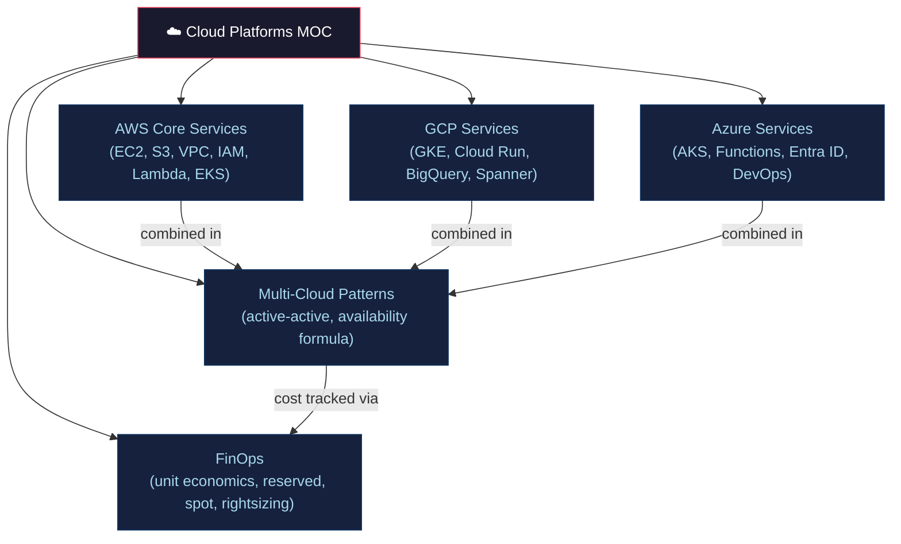

# ☁️ Cloud Platforms — Section MOC

> [!abstract] Section Overview
> Cloud platforms provide managed compute, storage, networking, and AI services. AWS, GCP, and Azure dominate the market. Multi-cloud patterns improve availability but add complexity. FinOps connects cloud spending to business value through unit economics and optimization levers.

---

## Concept Map



---

## Notes in This Section

| Note | Key Concepts | Difficulty |
|------|-------------|------------|
| [[AWS_Core_Services\|AWS Core Services]] | EC2, S3, VPC, IAM, Lambda, ECS/EKS, RDS | Advanced |
| [[GCP_Services\|GCP Services]] | GKE, Cloud Run, BigQuery, Spanner, Pub/Sub, Vertex AI | Advanced |
| [[Azure_Services\|Azure Services]] | AKS, Functions, Entra ID, Azure DevOps, Cost Management | Advanced |
| [[Multi_Cloud_Patterns\|Multi-Cloud Patterns]] | active-active/passive, availability A=1-(1-p)^n | Advanced |
| [[FinOps_and_Cost_Optimization\|FinOps & Cost Optimization]] | unit economics, reserved, spot, rightsizing, FOCUS | Intermediate |

---

## Key Formula

```
Multi-cloud availability:
A = 1 - (1-p)ⁿ

Two regions each at 99.9%:
A = 1 - (1 - 0.999)² = 1 - 0.000001 = 99.9999%

BUT capped by any shared single points of failure (DNS, payment, identity)
```

---

## Learning Path

```
AWS Core Services → FinOps & Cost Optimization → GCP Services
→ Azure Services → Multi-Cloud Patterns
```

---

## Related Sections

- [[_MOC_DevOps_Master|↑ DevOps Master MOC]]
- [[../05_Infrastructure_as_Code/_MOC_Infrastructure_as_Code|← IaC]] — provisions cloud resources
- [[../04_Kubernetes/_MOC_Kubernetes|← Kubernetes]] — runs on managed K8s (EKS/GKE/AKS)
- [[../07_Monitoring_Observability/_MOC_Monitoring_Observability|→ Observability]] — cloud-native monitoring

---

#DevOps #Cloud #AWS #GCP #Azure #MultiCloud #FinOps #MOC
