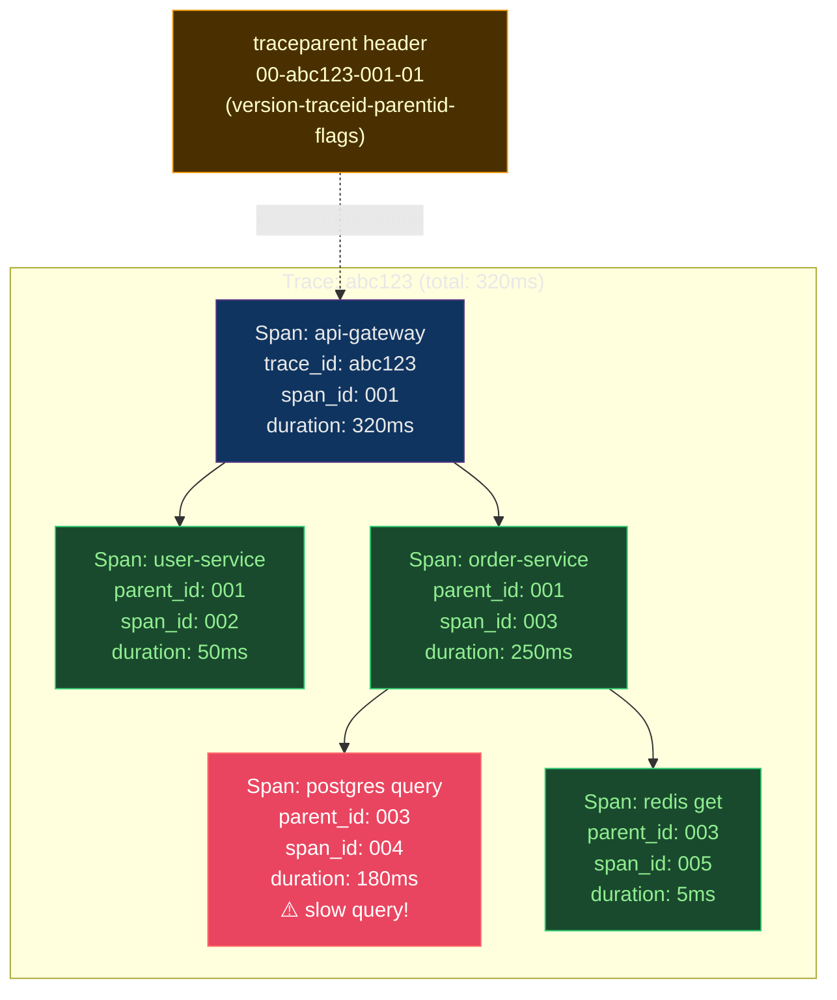

# 🔬 Distributed Tracing

> [!abstract] TL;DR
> A **trace** is a tree of timed **spans** linked by a shared `trace-id`. The W3C `traceparent` header (`version-traceid-parentid-flags`) propagates context across services. Async boundaries (Kafka, SQS) break propagation — inject trace-id into message attributes. **OpenTelemetry** (OTel) provides vendor-neutral auto-instrumentation and a Collector for fan-out. **Jaeger** indexes all fields (storage-heavy); **Tempo** stores by trace-id only (object storage, cheap). TraceQL queries Tempo. **Head sampling** blindly samples p%; **tail sampling** buffers complete traces and keeps errors/slow spans — superior but complex.

---

## Intuition — analogy FIRST

A distributed trace is like **tracking a package through a shipping network**. The package (request) gets a tracking number (trace-id) at origin. Each shipping hub (service) receives the package, processes it, and forwards — logging their handling time as a "span". The full tracking history from origin to delivery is the trace. Without the tracking number, you'd see each hub's logs separately with no connection. With it, you see the complete journey: where time was spent, which hub dropped the package (error), and how hubs ran in parallel.

---

## How It Works



---

## Key Concepts / Details

### W3C Trace Context — Header Format

```
traceparent: 00-4bf92f3577b34da6a3ce929d0e0e4736-00f067aa0ba902b7-01

Fields (dash-delimited):
  00                              = version (currently always 00)
  4bf92f3577b34da6a3ce929d0e0e4736 = trace-id (16 bytes, 32 hex chars)
  00f067aa0ba902b7                = parent-span-id (8 bytes, 16 hex chars)
  01                              = flags (01=sampled, 00=not sampled)

tracestate: vendor1=value1,vendor2=value2  (vendor-specific metadata)
```

```python
# Propagation in Python (OpenTelemetry)
from opentelemetry import trace
from opentelemetry.propagate import inject, extract
from opentelemetry.trace.propagation.tracecontext import TraceContextTextMapPropagator

# Inject into outgoing HTTP headers
headers = {}
inject(headers)     # adds traceparent to headers dict
response = requests.get("http://other-service/api", headers=headers)

# Extract from incoming HTTP request
context = extract(request.headers)
tracer = trace.get_tracer(__name__)
with tracer.start_as_current_span("process-request", context=context) as span:
    span.set_attribute("http.method", request.method)
    span.set_attribute("http.url", request.url)
    # ... process request
```

### Async Boundary Problem

```python
# PROBLEM: Kafka breaks trace propagation
# Producer creates span, but consumer doesn't have trace context

# SOLUTION: Inject trace context into Kafka message headers
from opentelemetry import trace
from opentelemetry.propagate import inject

def produce_message(producer, topic, value):
    headers = {}
    inject(headers)     # inject current span context into headers dict

    producer.produce(
        topic,
        value=json.dumps(value).encode(),
        headers=list(headers.items())   # include traceparent in Kafka headers
    )
    producer.flush()

# Consumer: extract and continue trace
def consume_message(message):
    headers = {k: v.decode() for k, v in message.headers()}
    context = extract(headers)    # restore trace context from headers

    tracer = trace.get_tracer(__name__)
    with tracer.start_as_current_span(
        "kafka-consumer",
        context=context,
        kind=trace.SpanKind.CONSUMER
    ) as span:
        span.set_attribute("messaging.system", "kafka")
        span.set_attribute("messaging.destination", message.topic())
        process(message.value())
```

### OpenTelemetry — Vendor-Neutral Instrumentation

```python
# Setup OpenTelemetry SDK
from opentelemetry import trace
from opentelemetry.sdk.trace import TracerProvider
from opentelemetry.sdk.trace.export import BatchSpanProcessor
from opentelemetry.exporter.otlp.proto.grpc.trace_exporter import OTLPSpanExporter
from opentelemetry.instrumentation.fastapi import FastAPIInstrumentor
from opentelemetry.instrumentation.sqlalchemy import SQLAlchemyInstrumentor
from opentelemetry.instrumentation.redis import RedisInstrumentor

# Initialize provider
provider = TracerProvider(resource=Resource.create({
    "service.name": "order-service",
    "service.version": "1.2.3",
    "deployment.environment": "production",
}))

# Export to OTel Collector (which fans out to Jaeger/Tempo/Datadog)
exporter = OTLPSpanExporter(endpoint="http://otel-collector:4317")
provider.add_span_processor(BatchSpanProcessor(exporter))
trace.set_tracer_provider(provider)

# Auto-instrument frameworks (zero-code instrumentation)
FastAPIInstrumentor().instrument()         # all HTTP routes
SQLAlchemyInstrumentor().instrument()      # all DB queries
RedisInstrumentor().instrument()           # all Redis calls

# Manual instrumentation for custom spans
tracer = trace.get_tracer(__name__)

def process_order(order_id: str):
    with tracer.start_as_current_span("process-order") as span:
        span.set_attribute("order.id", order_id)
        span.set_attribute("order.total", get_order_total(order_id))

        try:
            result = payment_service.charge(order_id)
            span.set_attribute("payment.status", "success")
            return result
        except PaymentError as e:
            span.set_status(trace.Status(trace.StatusCode.ERROR, str(e)))
            span.record_exception(e)    # adds exception event with stack trace
            raise
```

### OpenTelemetry Collector — Fan-Out Architecture

```yaml
# otel-collector-config.yaml
receivers:
  otlp:
    protocols:
      grpc:
        endpoint: 0.0.0.0:4317
      http:
        endpoint: 0.0.0.0:4318

processors:
  batch:
    timeout: 5s
    send_batch_size: 512
  memory_limiter:
    limit_mib: 512
  tail_sampling:
    decision_wait: 10s            # wait 10s to see if trace has errors
    policies:
      - name: errors-policy
        type: status_code
        status_code: {status_codes: [ERROR]}   # always keep errors
      - name: slow-policy
        type: latency
        latency: {threshold_ms: 1000}           # keep if >1s
      - name: probabilistic-policy
        type: probabilistic
        probabilistic: {sampling_percentage: 10}  # 10% of healthy fast

exporters:
  otlp/tempo:
    endpoint: tempo:4317
    tls:
      insecure: true
  otlp/jaeger:
    endpoint: jaeger:14250
  prometheusremotewrite:
    endpoint: http://prometheus:9090/api/v1/write
  logging:
    verbosity: normal

service:
  pipelines:
    traces:
      receivers: [otlp]
      processors: [memory_limiter, batch, tail_sampling]
      exporters: [otlp/tempo, otlp/jaeger]
    metrics:
      receivers: [otlp]
      processors: [memory_limiter, batch]
      exporters: [prometheusremotewrite]
```

### Jaeger vs Tempo

| Feature | Jaeger | Grafana Tempo |
|---------|--------|---------------|
| Storage backend | Elasticsearch/Cassandra | Object store (S3/GCS/Azure) |
| Index | All fields indexed | Trace ID only (+ tags via Tempo 2.0) |
| Cost | High (indexed storage) | Low (object store = ~$0.023/GB) |
| Query interface | Jaeger UI + HTTP API | TraceQL + Grafana panel |
| Search | By service, operation, tag | By trace ID (+ TraceQL for tags) |
| Scale | Medium (index limits) | High (object store scales infinitely) |
| Integration | Standalone | Native Grafana datasource |

```
# Tempo TraceQL query
{span.http.status_code = "500"}                           # error spans
{.http.url =~ ".*payment.*" && duration > 1s}             # slow payment calls
{resource.service.name = "order-service"} | rate()        # request rate
{nestedSetParent.resource.service.name = "api-gateway"}   # children of api-gateway
```

### Sampling Strategies

```
HEAD SAMPLING (decision at trace entry):
  Pros: simple, low latency overhead, minimal buffering
  Cons: blind — samples 10% of all traces, including uninteresting ones
        misses many error traces (if error rate is 0.1%, 90% not sampled)

  Implementation:
    Parent-based: if parent says "sampled", keep; otherwise 10% random
    Always sample: keep everything (only for low-traffic services)

TAIL SAMPLING (decision after trace completes):
  Pros: intelligent — keep ALL errors, ALL slow traces, sample only healthy fast
  Cons: must buffer entire trace before deciding (memory intensive)
        latency adds 5-30s to span export

  Implementation: OTel Collector tail_sampling processor (see config above)
  Policy hierarchy:
    1. Always keep: status_code == ERROR
    2. Always keep: latency > 1000ms
    3. Always keep: specific service (canary, new deployment)
    4. Probabilistic: 10% of everything else

HYBRID (recommended):
  Upstream services: 100% head sampling (low traffic)
  High-volume services: tail sampling at collector
```

### Correlating Traces with Logs and Metrics

```python
# Stamp trace_id into structured logs
import logging
from opentelemetry import trace

class TraceIdFilter(logging.Filter):
    def filter(self, record):
        span = trace.get_current_span()
        if span and span.is_recording():
            ctx = span.get_span_context()
            record.trace_id = format(ctx.trace_id, '032x')
            record.span_id = format(ctx.span_id, '016x')
        else:
            record.trace_id = "unknown"
            record.span_id = "unknown"
        return True

# JSON log entry with trace correlation:
# {
#   "level": "error",
#   "message": "Payment failed",
#   "trace_id": "4bf92f3577b34da6a3ce929d0e0e4736",
#   "span_id": "00f067aa0ba902b7"
# }
```

```promql
# Prometheus exemplars: link metrics to traces
# (requires Prometheus ≥2.27 + Grafana)
# Exemplar attached to histogram sample:
# http_request_duration_seconds_bucket{le="0.5"} 142 # {trace_id="abc123"} 0.473 1704067200

# In Grafana: click data point on histogram panel → navigate to trace in Tempo
```

---

## Real-World Notes

- **OTel adoption**: OpenTelemetry is now the de facto standard for vendor-neutral instrumentation. All major vendors (Datadog, Honeycomb, Dynatrace, New Relic) accept OTel format.
- **Auto-instrumentation for Java**: Java agent (`-javaagent:opentelemetry-javaagent.jar`) instruments hundreds of libraries without code changes. Only JAR file needed.
- **Trace-log correlation in practice**: Set Loki label `trace_id` from structured log field, then create Grafana derived field linking Tempo trace ID → automatic correlation.
- **Tempo backend cost**: At 10GB/day of trace data, Tempo on S3 costs ~$0.23/day ($7/month) vs Jaeger on Elasticsearch at ~$1-2/day ($30-60/month).

---

## Common Pitfalls

1. **No propagation through async boundaries** — Kafka consumers receive messages without trace context; all consumer spans are orphaned (no parent trace). Always inject/extract headers.
2. **Sampling too high in high-traffic services** — 100% sampling at 100,000 RPS = overwhelming trace backend; implement tail sampling at collector.
3. **Jaeger deployment running out of disk** — without ILM on Elasticsearch backend, Jaeger fills storage; set retention policies.
4. **Context not propagated through thread pools** — Java/Go thread pool executors don't automatically propagate OTel context; use OTel-aware executors or explicit context copying.
5. **Missing `service.name` resource attribute** — traces from a service with no name appear as "unknown_service" in Jaeger/Tempo; always set resource attributes.

---

## Related Concepts

- [[_MOC_Monitoring_Observability|↑ Observability MOC]]
- [[Prometheus_and_Alertmanager|← Prometheus]] — exemplars link metrics to traces
- [[Grafana_Dashboards|← Grafana]] — Tempo as trace datasource, trace-log correlation
- [[ELK_and_EFK_Stack|← ELK]] — trace_id in logs enables correlation
- [[SLO_SLI_SLA_and_Error_Budgets|→ SLOs]] — traces identify which requests break SLOs

---

## Review Questions

1. A request spans 5 services connected via HTTP and one Kafka message. Draw the trace tree showing where context propagation would break without explicit injection, and how to fix each break.
2. Compare head sampling (10%) vs tail sampling (keep all errors + slow, 5% others) for a service processing 10,000 RPS with 0.1% error rate. How many error traces does each strategy capture per minute?
3. An OTel Collector with tail sampling is buffering 30 seconds of traces for a service doing 5,000 RPS with 100KB average trace size. How much memory does the buffer require?

---

## Sources

- opentelemetry.io/docs
- grafana.com/docs/tempo
- jaegertracing.io
- w3c.github.io/trace-context

#DevOps #Observability #Tracing #OpenTelemetry #Jaeger #Tempo #W3C #Sampling #TraceQL
