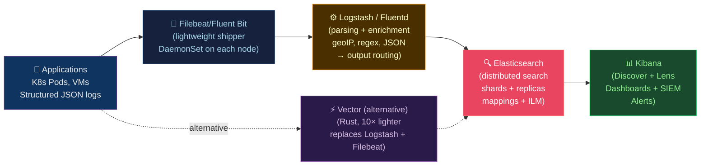

# 🔍 ELK and EFK Stack

> [!abstract] TL;DR
> **ELK**: Elasticsearch (distributed search + analytics) + Logstash (ingest pipeline: input→filter→output) + Kibana (visualization). **EFK**: replaces Logstash with Fluentd (Ruby, flexible plugins) or Fluent Bit (C, lightweight, DaemonSet in K8s). **Elasticsearch**: shards (primary + replicas), mappings (field types), ILM (hot→warm→cold→delete). **Kibana**: Discover, Lens, Dashboards, SIEM. **Vector** is a modern Rust alternative to Logstash/Fluentd with 10× lower resource usage. OpenSearch is the Apache-licensed fork.

---

## Intuition — analogy FIRST

Elasticsearch is like a **library with a magical index** — you can find any book by any word in any page in milliseconds. Logstash/Fluentd is the **delivery truck** that collects mail from every building (application), sorts it (parsing), and delivers to the library. Kibana is the **library's reading room** with search terminals and charts. ILM is the **archiving policy**: recent books (hot tier) stay on easily accessible shelves; older books move to storage rooms (warm/cold) and eventually shredded after the retention period (delete).

---

## How It Works



---

## Key Concepts / Details

### Elasticsearch — Core Concepts

```
Cluster: collection of nodes sharing the same cluster.name
Node:    single Elasticsearch instance (data, master, coordinating, ingest)
Index:   collection of documents with the same schema
Shard:   horizontal partition of an index (primary shard)
Replica: copy of a primary shard (fault tolerance + read throughput)

Sizing rules of thumb:
  Primary shard size: 10-50 GB optimal (up to 30 GB/shard)
  Replica count: 1 (tolerate 1 node failure) or 2 (higher availability)
  Shards per node: ≤ 20 per GB heap (with 30 GB heap → ≤ 600 shards)
```

```json
// Create index with explicit mapping
PUT /logs-production-2026.07
{
  "settings": {
    "number_of_shards": 3,
    "number_of_replicas": 1,
    "index.lifecycle.name": "logs-policy",      // ILM policy
    "index.lifecycle.rollover_alias": "logs"
  },
  "mappings": {
    "properties": {
      "@timestamp": {"type": "date"},
      "level": {
        "type": "keyword"              // exact match (not analyzed)
      },
      "message": {
        "type": "text",               // full-text search
        "fields": {
          "keyword": {"type": "keyword", "ignore_above": 256}
        }
      },
      "service": {"type": "keyword"},
      "trace_id": {"type": "keyword"},
      "duration_ms": {"type": "long"},
      "user_id": {
        "type": "keyword",
        "doc_values": false            // disable sorting (if not needed)
      },
      "geo": {"type": "geo_point"},
      "request_body": {
        "type": "text",
        "index": false                 // stored but not indexed (save space)
      }
    }
  }
}
```

**Mapping types:**
| ES Type | Use For | Stored | Indexed | Notes |
|---------|---------|--------|---------|-------|
| `keyword` | Exact match, aggregation | Yes | Yes | Service names, IDs, levels |
| `text` | Full-text search | Yes | Yes (analyzed) | Log messages, user content |
| `date` | Timestamps | Yes | Yes | `@timestamp` |
| `long/integer/float` | Numeric | Yes | Yes | Duration, counts |
| `boolean` | True/false | Yes | Yes | Flags |
| `geo_point` | Lat/lon | Yes | Yes | Client IPs → location |

### Index Lifecycle Management (ILM)

```json
// ILM policy: hot → warm → cold → delete
PUT _ilm/policy/logs-policy
{
  "policy": {
    "phases": {
      "hot": {
        "min_age": "0ms",
        "actions": {
          "rollover": {
            "max_primary_shard_size": "30gb",   // new index when shard hits 30GB
            "max_age": "1d"                       // or daily rollover
          },
          "set_priority": {"priority": 100}
        }
      },
      "warm": {
        "min_age": "3d",                         // move to warm after 3 days
        "actions": {
          "shrink": {"number_of_shards": 1},     // reduce shard count
          "forcemerge": {"max_num_segments": 1}, // optimize for reads
          "set_priority": {"priority": 50},
          "allocate": {"require": {"data": "warm"}}
        }
      },
      "cold": {
        "min_age": "30d",
        "actions": {
          "freeze": {},                           // read-only, reduced memory
          "allocate": {"require": {"data": "cold"}}
        }
      },
      "delete": {
        "min_age": "90d",
        "actions": {
          "delete": {}
        }
      }
    }
  }
}
```

### Logstash Pipeline

```ruby
# /etc/logstash/conf.d/pipeline.conf

input {
  beats {
    port => 5044                         # receive from Filebeat
    ssl => true
    ssl_certificate => "/etc/ssl/cert.pem"
    ssl_key => "/etc/ssl/key.pem"
  }
  kafka {
    bootstrap_servers => "kafka:9092"
    topics => ["application-logs"]
    codec => json
  }
}

filter {
  # Parse JSON logs
  json {
    source => "message"
    target => "parsed"
    remove_field => ["message"]
  }

  # Extract fields
  mutate {
    rename => { "[parsed][level]" => "level" }
    rename => { "[parsed][service]" => "service" }
    rename => { "[parsed][trace_id]" => "trace_id" }
    add_field => { "environment" => "production" }
  }

  # Parse timestamps
  date {
    match => ["[parsed][timestamp]", "ISO8601"]
    target => "@timestamp"
    timezone => "UTC"
  }

  # GeoIP enrichment from client IP
  geoip {
    source => "client_ip"
    target => "geoip"
    database => "/usr/share/GeoIP/GeoLite2-City.mmdb"
  }

  # Drop health check logs
  if [parsed][path] == "/health" {
    drop {}
  }

  # Tag slow requests
  if [parsed][duration_ms] and [parsed][duration_ms] > 1000 {
    mutate {
      add_tag => ["slow_request"]
    }
  }
}

output {
  elasticsearch {
    hosts => ["elasticsearch:9200"]
    index => "logs-%{[environment]}-%{+YYYY.MM.dd}"
    user => "logstash_writer"
    password => "${LOGSTASH_PASSWORD}"
    action => "index"
    document_id => "%{[@metadata][_id]}"   # dedup by ID
  }

  # Also send errors to separate index
  if "error" in [level] {
    elasticsearch {
      hosts => ["elasticsearch:9200"]
      index => "errors-%{+YYYY.MM.dd}"
    }
  }
}
```

### Fluentd and Fluent Bit — K8s Log Collection

```yaml
# Fluent Bit DaemonSet (one per node)
# Reads container logs from /var/log/containers/
apiVersion: apps/v1
kind: DaemonSet
metadata:
  name: fluent-bit
  namespace: logging
spec:
  selector:
    matchLabels:
      app: fluent-bit
  template:
    spec:
      containers:
        - name: fluent-bit
          image: cr.fluentbit.io/fluent/fluent-bit:3.1
          volumeMounts:
            - name: varlog
              mountPath: /var/log
            - name: config
              mountPath: /fluent-bit/etc/
      volumes:
        - name: varlog
          hostPath:
            path: /var/log
        - name: config
          configMap:
            name: fluent-bit-config
```

```ini
# fluent-bit.conf
[SERVICE]
    Flush         5
    Log_Level     info
    Parsers_File  parsers.conf

[INPUT]
    Name              tail
    Tag               kube.*
    Path              /var/log/containers/*.log
    multiline.parser  docker, cri
    DB                /var/log/flb_kube.db   # track file position

[FILTER]
    Name                kubernetes
    Match               kube.*
    Kube_URL            https://kubernetes.default.svc:443
    Kube_CA_File        /var/run/secrets/kubernetes.io/serviceaccount/ca.crt
    Kube_Token_File     /var/run/secrets/kubernetes.io/serviceaccount/token
    Merge_Log           On           # parse JSON logs from containers
    Merge_Log_Key       log_processed

[OUTPUT]
    Name            es
    Match           kube.*
    Host            elasticsearch.logging.svc.cluster.local
    Port            9200
    Index           kube-logs
    Generate_ID     On              # generate unique document IDs
    HTTP_User       ${ELASTIC_USER}
    HTTP_Passwd     ${ELASTIC_PASSWORD}
    TLS             On
    tls.verify      On
```

### Vector — Modern Alternative

```toml
# vector.toml
[sources.kubernetes_logs]
type = "kubernetes_logs"
auto_partial_merge = true          # handle multiline logs

[transforms.parse_json]
type = "remap"                     # VRL (Vector Remap Language)
inputs = ["kubernetes_logs"]
source = '''
  # Parse JSON message
  . = merge(., object!(parse_json!(.message)))
  .parsed_at = now()

  # Drop health checks
  if .path == "/health" {
    abort
  }

  # Tag slow requests
  if exists(.duration_ms) && .duration_ms > 1000 {
    .slow_request = true
  }
'''

[transforms.filter_errors]
type = "filter"
inputs = ["parse_json"]
condition = '.level == "error"'

[sinks.elasticsearch]
type = "elasticsearch"
inputs = ["parse_json"]
endpoints = ["https://elasticsearch:9200"]
index = "logs-{{ now() | strftime(\"%Y.%m.%d\") }}"
auth.strategy = "basic"
auth.user = "${ELASTIC_USER}"
auth.password = "${ELASTIC_PASSWORD}"

[sinks.s3_archive]
type = "aws_s3"
inputs = ["parse_json"]
bucket = "my-log-archive"
key_prefix = "logs/{{ now() | strftime(\"%Y/%m/%d\") }}/"
codec.format = "ndjson"
batch.max_bytes = 100000000        # 100MB files
```

**Vector advantages over Logstash**: 
- Written in Rust (10× lower CPU, 3× lower memory)
- VRL (Vector Remap Language) is type-safe and faster than grok
- Native support for Prometheus metrics, traces, and logs in one agent
- Hot-reload configuration without restart

### Kibana Discover and KQL

```
Kibana Query Language (KQL):
  level: error AND service: api          # AND filter
  level: (error OR warn)                 # OR on same field
  duration_ms > 1000                     # numeric range
  message: "timeout" AND NOT path: /health
  service: api* AND @timestamp >= "2026-07-26"

Lucene (legacy):
  level:error AND service:api
  duration_ms:[1000 TO *]               # range
  message:"connection refused"~1        # fuzzy match
```

---

## Real-World Notes

- **OpenSearch vs Elasticsearch**: AWS forked Elasticsearch in 2021 (OpenSearch) when Elastic changed license to non-OSS. OpenSearch is API-compatible and fully open source. Choose based on managed service preference (AWS OpenSearch Service vs Elastic Cloud).
- **Shard allocation awareness**: Configure zone awareness in ES so primary and replica shards are in different AZs — prevents data loss on AZ failure.
- **Hot tier SSD, cold tier HDD**: Elasticsearch Data Tiers allow different hardware per tier. Hot tier needs NVMe SSDs for ingestion performance; cold tier uses spinning disks for cost.
- **Curator → ILM**: The old Curator tool for index management is deprecated; use Elasticsearch ILM for all index lifecycle operations.

---

## Common Pitfalls

1. **Mapping explosion** — dynamic mapping + varied JSON keys creates thousands of fields; use `dynamic: strict` and explicit mappings.
2. **Over-sharding** — creating 100 shards for a small index wastes cluster resources; start with 1 shard per index, let ILM manage rollover.
3. **No ILM policy** — indexes grow indefinitely until disk fills; implement ILM from day one.
4. **Filebeat → Elasticsearch directly** — bypasses Logstash parsing; use Logstash/Vector in the pipeline for consistent parsing and enrichment.
5. **Logging in debug verbosity in production** — trace-level logs from Java frameworks can produce 10× more data than info-level; set appropriate log levels.

---

## Related Concepts

- [[_MOC_Monitoring_Observability|↑ Observability MOC]]
- [[Grafana_Dashboards|← Grafana]] — Loki as alternative to ELK for logs
- [[Prometheus_and_Alertmanager|← Prometheus]] — metrics complement log-based monitoring
- [[Distributed_Tracing|→ Distributed Tracing]] — trace IDs link logs to traces

---

## Review Questions

1. An Elasticsearch index has 10 shards, each 5GB. What is the recommended action, and how does ILM `shrink` help after rollover?
2. Logstash is processing 50,000 events/second but CPU usage is 90%. Name three specific Logstash configuration changes to improve throughput.
3. Design the ILM policy for: audit logs (must retain 7 years), application logs (keep 30 days), debug logs (keep 3 days). Include phase transitions, timing, and deletion rules.

---

## Sources

- elastic.co/guide/en/elasticsearch
- docs.fluentd.org
- vector.dev/docs
- opensearch.org/docs

#DevOps #Observability #ELK #EFK #Elasticsearch #Logstash #Fluentd #FluentBit #Kibana #Vector #ILM
