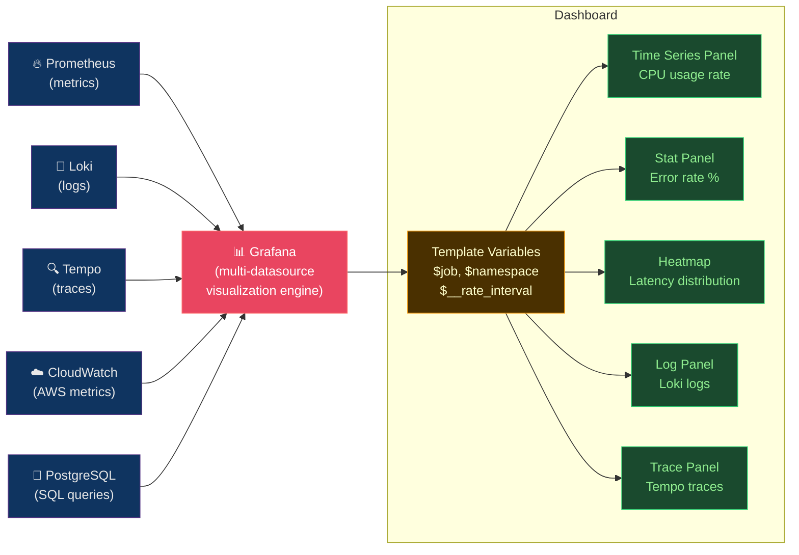

# 📈 Grafana Dashboards

> [!abstract] TL;DR
> Grafana is a **multi-datasource visualization platform** — it queries, it doesn't store. A dashboard = panels (query + datasource + visualization). **Template variables** (`$job`, `$namespace`, `$__rate_interval`) make dashboards reusable. Never average latency — use `histogram_quantile()` aggregating by `(le)`. **Unified Alerting** replaces per-datasource alerts with a single alerting engine. **Loki** collects structured logs via Grafana Alloy (OpenTelemetry Collector); **LogQL** filters, parses, and aggregates logs. Dashboard-as-code: Grafonnet (Jsonnet) + Grizzly CLI.

---

## Intuition — analogy FIRST

Grafana is like a **flight deck instrument panel** — it connects to multiple data sources (engines, fuel sensors, GPS) and displays them in a unified cockpit view. It doesn't store flight data; the black box does. Template variables are like the **pilot's control knobs** — turn the `$aircraft` knob and all instruments switch to that aircraft's data. Dashboard-as-code means the panel layout is a blueprint stored in Git — any pilot can recreate the cockpit from the blueprint.

---

## How It Works



---

## Key Concepts / Details

### Dashboard Structure and Template Variables

```json
{
  "title": "HTTP Service Dashboard",
  "uid": "http-service-v2",
  "schemaVersion": 38,
  "templating": {
    "list": [
      {
        "name": "job",
        "type": "query",
        "datasource": "Prometheus",
        "query": "label_values(http_requests_total, job)",
        "multi": true,
        "includeAll": true,
        "current": {"text": "All", "value": "$__all"}
      },
      {
        "name": "namespace",
        "type": "query",
        "datasource": "Prometheus",
        "query": "label_values(kube_pod_info{job=~\"$job\"}, namespace)",
        "refresh": 2
      },
      {
        "name": "__rate_interval",
        "type": "interval",
        "options": ["1m", "5m", "10m", "30m", "1h"]
      }
    ]
  }
}
```

**Template variable types:**
| Type | Description | Example |
|------|-------------|---------|
| `query` | Runs PromQL label query | Dynamic service list |
| `interval` | Time window | `$__rate_interval` |
| `constant` | Fixed value | Environment name |
| `datasource` | Switch data source | Multi-environment |
| `custom` | Manual list | Severity: warn, crit |
| `textbox` | Free text | Custom filter |

### PromQL in Grafana — The Right Way

```promql
# CORRECT: use $__rate_interval (zoom-aware)
rate(http_requests_total{job=~"$job"}[$__rate_interval])

# WRONG: hardcoded window ignores zoom level
rate(http_requests_total{job=~"$job"}[5m])

# CORRECT: p99 latency — histogram_quantile aggregated by (le)
histogram_quantile(0.99,
  sum(rate(http_request_duration_seconds_bucket{job=~"$job"}[$__rate_interval]))
  by (le, job)
)

# WRONG: average latency — hides distribution shape
avg(http_request_duration_seconds_sum / http_request_duration_seconds_count)
# Averages are NEVER the right way to measure latency.
# A single 10-second outlier gets diluted across 10,000 fast requests.

# Error ratio (for stat panel, threshold coloring)
sum(rate(http_requests_total{job=~"$job", status=~"5.."}[$__rate_interval]))
  /
sum(rate(http_requests_total{job=~"$job"}[$__rate_interval]))

# Apdex score (fraction within threshold)
(
  sum(rate(http_request_duration_seconds_bucket{le="0.1", job=~"$job"}[$__rate_interval]))
    +
  sum(rate(http_request_duration_seconds_bucket{le="0.4", job=~"$job"}[$__rate_interval])) * 0.5
)
/
sum(rate(http_request_duration_seconds_count{job=~"$job"}[$__rate_interval]))
```

### Loki — Log Aggregation

```yaml
# Grafana Alloy (OpenTelemetry Collector replacement) config
# Collects logs from Kubernetes pods and ships to Loki
logging {
  level  = "info"
  format = "logfmt"
}

discovery.kubernetes "pods" {
  role = "pod"
}

discovery.relabel "pod_logs" {
  targets = discovery.kubernetes.pods.targets
  rule {
    source_labels = ["__meta_kubernetes_pod_annotation_prometheus_io_scrape"]
    regex         = "true"
    action        = "keep"
  }
  rule {
    source_labels = ["__meta_kubernetes_namespace"]
    target_label  = "namespace"
  }
  rule {
    source_labels = ["__meta_kubernetes_pod_name"]
    target_label  = "pod"
  }
  rule {
    source_labels = ["__meta_kubernetes_container_name"]
    target_label  = "container"
  }
}

loki.source.kubernetes "pod_logs" {
  targets    = discovery.relabel.pod_logs.output
  forward_to = [loki.write.default.receiver]
}

loki.write "default" {
  endpoint {
    url = "http://loki:3100/loki/api/v1/push"
  }
}
```

### LogQL — Loki Query Language

```logql
# --- Log stream selectors ---
{namespace="production", container="api"}          # basic stream selector

# --- Filter operators ---
{namespace="production"} |= "error"               # contains "error"
{namespace="production"} != "health"              # not contains "health"
{namespace="production"} |~ "ERR|WARN"            # regex match
{namespace="production"} !~ "health|ready"        # regex not match

# --- Parser (extract structured data) ---
{namespace="production"}
  | json                                           # parse JSON logs
  | level="error"                                  # filter by parsed field
  | line_format "{{.level}}: {{.message}}"         # reformat output

{namespace="production"}
  | logfmt                                         # parse key=value logs
  | duration > 500ms                              # filter by extracted field

# --- Metric queries (aggregate logs) ---
# Rate of error logs per minute
rate({namespace="production"} |= "error" [1m])

# Count of error logs by service
sum by (service) (
  count_over_time({namespace="production"} | json | level="error" [5m])
)

# p99 request duration extracted from logs
quantile_over_time(0.99,
  {namespace="production"}
    | json
    | unwrap duration_ms
    | __error__=""
  [5m]
)
```

### Unified Alerting

```yaml
# Grafana alert rule (YAML, managed via API or Terraform)
apiVersion: 1
groups:
  - orgId: 1
    name: Production Alerts
    folder: DevOps
    interval: 1m
    rules:
      - uid: http-error-rate-alert
        title: HTTP Error Rate
        condition: C
        data:
          - refId: A
            queryType: ""
            relativeTimeRange:
              from: 300
              to: 0
            datasourceUid: prometheus-uid
            model:
              expr: |
                sum(rate(http_requests_total{status=~"5.."}[5m]))
                  /
                sum(rate(http_requests_total[5m]))
              instant: true
              intervalMs: 1000
              maxDataPoints: 43200
              refId: A
          - refId: C
            datasourceUid: __expr__
            model:
              type: threshold
              conditions:
                - evaluator:
                    params: [0.01]      # > 1% error rate
                    type: gt
                  query: {params: [A]}
        noDataState: NoData
        execErrState: Error
        for: 5m
        labels:
          severity: warning
          team: platform
        annotations:
          summary: HTTP error rate above threshold
          description: "Error rate is {{ $values.A }}%"
```

### Dashboard as Code — Grafonnet + Grizzly

```jsonnet
// dashboard.jsonnet (Grafonnet)
local grafana = import 'grafonnet/grafana.libsonnet';
local dashboard = grafana.dashboard;
local row = grafana.row;
local prometheus = grafana.prometheus;
local graphPanel = grafana.graphPanel;

dashboard.new(
  title='HTTP Service SLO',
  uid='http-slo-dashboard',
  tags=['production', 'slo'],
  time_from='now-3h',
  refresh='1m',
)
.addTemplate(
  grafana.template.datasource(
    name='datasource',
    query='prometheus',
    label='Prometheus',
  )
)
.addTemplate(
  grafana.template.new(
    name='job',
    datasource='$datasource',
    query='label_values(http_requests_total, job)',
    label='Service',
    multi=true,
    includeAll=true,
  )
)
.addPanel(
  graphPanel.new(
    title='Error Rate',
    datasource='$datasource',
  )
  .addTarget(
    prometheus.target(
      expr='sum(rate(http_requests_total{job=~"$job",status=~"5.."}[$__rate_interval]))'
           + ' / sum(rate(http_requests_total{job=~"$job"}[$__rate_interval]))',
      legendFormat='Error rate',
    )
  ),
  gridPos={x: 0, y: 0, w: 12, h: 8}
)
```

```bash
# Grizzly: deploy dashboards from code
grr apply dashboard.jsonnet

# Diff current vs code
grr diff dashboard.jsonnet

# Sync all dashboards in directory
grr apply ./dashboards/

# Pull existing dashboard to code
grr pull grafana/dashboards/my-dashboard > dashboard.json
```

---

## Real-World Notes

- **Dashboard proliferation**: Without governance, organizations end up with 500+ dashboards, most stale. Use folders + ownership labels + last-viewed timestamp to prune unused dashboards.
- **Grafana correlations**: Native feature that links metric panels to logs (Loki) and traces (Tempo) — clicking a data point navigates to correlated logs/traces in the same time window.
- **Exemplars**: Special labels attached to histogram metrics that include trace IDs. In Grafana, clicking a latency spike shows the actual trace. Requires: Prometheus exemplar support + Tempo as trace backend.
- **Public dashboards**: Grafana 9.1+ supports sharing dashboards publicly without authentication — useful for status pages.

---

## Common Pitfalls

1. **Averaging p99 across instances** — `avg(histogram_quantile(0.99, ...))` computes p99 per instance then averages; must aggregate histograms first with `sum by (le)` before `histogram_quantile`.
2. **Too many panels per dashboard** — browser performance degrades with >25 panels; split into overview + drill-down dashboards.
3. **Dashboard snapshots instead of dashboard-as-code** — JSON exports rot quickly; use Grafonnet + Grizzly for reproducible, version-controlled dashboards.
4. **High-cardinality template variables** — a `$user` dropdown with 10M users freezes Grafana; limit variables to low-cardinality dimensions.
5. **No refresh interval** — dashboard shows stale data; set `refresh: 30s` for operational dashboards, leave off for weekly review dashboards.

---

## Related Concepts

- [[_MOC_Monitoring_Observability|↑ Observability MOC]]
- [[Prometheus_and_Alertmanager|← Prometheus]] — primary metrics data source
- [[ELK_and_EFK_Stack|→ ELK/EFK]] — alternative log aggregation
- [[Distributed_Tracing|→ Distributed Tracing]] — Tempo traces in Grafana
- [[SLO_SLI_SLA_and_Error_Budgets|→ SLOs]] — SLO dashboards using error budget panels

---

## Review Questions

1. A Grafana panel shows average latency as 50ms, but users report slowness. Why is average latency misleading, and what PromQL query would reveal the true performance distribution?
2. Explain how `$__rate_interval` in Grafana differs from a hardcoded `[5m]` window. What happens when a user zooms out to a 7-day view with each?
3. Design a 3-panel "Service Health at a Glance" dashboard: panel 1 shows request rate, panel 2 shows error rate with red threshold at 1%, panel 3 shows p99 latency with red threshold at 500ms. Write the PromQL for each panel.

---

## Sources

- grafana.com/docs
- grafana.com/docs/loki/latest/query/
- github.com/grafana/grafonnet
- github.com/grafana/grizzly

#DevOps #Observability #Grafana #Dashboards #Loki #LogQL #Grafonnet #Grizzly #TemplateVariables
