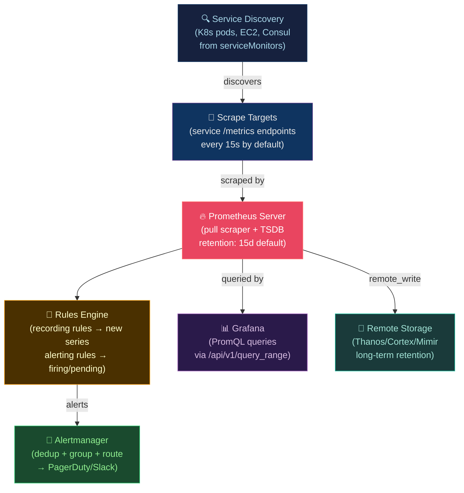

# 🔥 Prometheus and Alertmanager

> [!abstract] TL;DR
> Prometheus is a **pull-based TSDB** (time-series database) that scrapes `/metrics` endpoints via HTTP. A **time series** = metric name + label set, identified by a unique fingerprint. Cardinality is bound by label values — never use user IDs in labels. Metric types: **Counter** (monotonic, use `rate()`/`increase()`), **Gauge** (arbitrary, use raw), **Histogram** (buckets, use `histogram_quantile()`), **Summary** (pre-computed client-side quantiles). **Recording rules** pre-compute expensive PromQL; **Alerting rules** fire after duration → Alertmanager deduplicates, groups, routes, inhibits, and silences.

---

## Intuition — analogy FIRST

Prometheus is a **librarian who visits each bookshelf** (service) every 15 seconds and records how many books (metric values) are there. Pull-based means the librarian goes to the shelf — the shelf doesn't shout updates. This makes it resilient: if a shelf disappears, the librarian just stops recording for it. **Labels** are catalog attributes (author, genre) — using `user_id` as a label would give the library 10 million catalog categories, making searches unbearable (cardinality explosion).

---

## How It Works



---

## Key Concepts / Details

### Metric Types and When to Use Them

| Type | Definition | PromQL Functions | Example |
|------|-----------|-----------------|---------|
| **Counter** | Monotonically increasing (resets on restart) | `rate()`, `increase()` | `http_requests_total`, `errors_total` |
| **Gauge** | Arbitrary up/down value | Raw value, `delta()` | `memory_bytes`, `queue_depth`, `active_connections` |
| **Histogram** | Buckets of observed values + count + sum | `histogram_quantile()` | `request_duration_seconds` |
| **Summary** | Pre-computed quantiles client-side | Raw quantile labels | `rpc_duration_seconds{quantile="0.99"}` |

```python
# Instrumenting a Python service with Prometheus client
from prometheus_client import Counter, Gauge, Histogram, start_http_server
import time

# Counter: total requests (use rate() in PromQL)
REQUEST_COUNT = Counter(
    'http_requests_total',
    'Total HTTP requests',
    ['method', 'path', 'status_code']  # labels - keep low cardinality!
)

# Gauge: current connections
ACTIVE_CONNECTIONS = Gauge(
    'http_active_connections',
    'Currently active HTTP connections'
)

# Histogram: request latency (use histogram_quantile() in PromQL)
REQUEST_DURATION = Histogram(
    'http_request_duration_seconds',
    'HTTP request duration',
    ['method', 'path'],
    buckets=[0.001, 0.005, 0.01, 0.025, 0.05, 0.1, 0.25, 0.5, 1.0, 2.5, 5.0]
)

def handle_request(method, path):
    with ACTIVE_CONNECTIONS.track_inprogress():
        start = time.time()
        try:
            result = process_request(method, path)
            REQUEST_COUNT.labels(method=method, path=path, status_code='200').inc()
            return result
        except Exception as e:
            REQUEST_COUNT.labels(method=method, path=path, status_code='500').inc()
            raise
        finally:
            REQUEST_DURATION.labels(method=method, path=path).observe(time.time() - start)

start_http_server(8000)  # expose /metrics on port 8000
```

### PromQL — Key Queries

```promql
# --- COUNTERS: always use rate() or increase() ---

# Request rate per second (5-min window)
rate(http_requests_total[5m])

# Error rate
rate(http_requests_total{status=~"5.."}[5m])

# Error ratio (proportion of errors)
sum(rate(http_requests_total{status=~"5.."}[5m]))
  /
sum(rate(http_requests_total[5m]))

# WRONG: delta() on counter — gives incorrect results on resets
# delta(http_requests_total[5m])  # ❌ DON'T DO THIS

# --- GAUGES: use raw value ---
memory_bytes                          # current memory
avg(memory_bytes) by (instance)       # average per instance
max_over_time(memory_bytes[1h])       # peak in last hour

# --- HISTOGRAMS: histogram_quantile ---
# p99 latency (correct way — aggregate THEN quantile)
histogram_quantile(0.99,
  sum(rate(http_request_duration_seconds_bucket[5m])) by (le)
)

# p99 per service
histogram_quantile(0.99,
  sum(rate(http_request_duration_seconds_bucket[5m])) by (le, service)
)

# WRONG: average of quantiles ≠ quantile of all requests
# avg(http_request_duration_seconds{quantile="0.99"})  # ❌ WRONG

# --- AGGREGATIONS ---
sum(rate(http_requests_total[5m])) by (service)   # total rate per service
topk(5, rate(http_requests_total[5m]))             # top 5 by rate
count(up == 1)                                     # number of healthy targets
```

### Service Discovery and Scrape Config

```yaml
# prometheus.yml
global:
  scrape_interval: 15s
  evaluation_interval: 15s    # rule evaluation interval

scrape_configs:
  # Kubernetes pods (via PodMonitor/ServiceMonitor with Prometheus Operator)
  - job_name: kubernetes-pods
    kubernetes_sd_configs:
      - role: pod
    relabel_configs:
      # Only scrape pods with prometheus.io/scrape annotation
      - source_labels: [__meta_kubernetes_pod_annotation_prometheus_io_scrape]
        action: keep
        regex: true
      # Use port from annotation
      - source_labels: [__meta_kubernetes_pod_annotation_prometheus_io_port]
        action: replace
        target_label: __address__
        regex: (.+)
        replacement: ${1}:${2}
      # Add namespace label
      - source_labels: [__meta_kubernetes_namespace]
        target_label: namespace
      # Add pod name label
      - source_labels: [__meta_kubernetes_pod_name]
        target_label: pod

  # Static targets
  - job_name: node-exporter
    static_configs:
      - targets: ['node-1:9100', 'node-2:9100']
```

### Recording Rules — Pre-compute Expensive Queries

```yaml
# prometheus/rules/recording.yml
groups:
  - name: http_request_rates
    interval: 30s       # evaluate every 30s
    rules:
      # Naming convention: level:metric:operation
      - record: job:http_requests:rate5m
        expr: sum(rate(http_requests_total[5m])) by (job)

      - record: job_status:http_requests:rate5m
        expr: sum(rate(http_requests_total[5m])) by (job, status_code)

      - record: job:http_request_duration_p99:rate5m
        expr: |
          histogram_quantile(0.99,
            sum(rate(http_request_duration_seconds_bucket[5m])) by (job, le)
          )

  - name: slo_burn_rates
    rules:
      # Error rate over different windows (for multi-window burn rate alerting)
      - record: job:http_error_rate:rate5m
        expr: |
          sum(rate(http_requests_total{status=~"5.."}[5m])) by (job)
            /
          sum(rate(http_requests_total[5m])) by (job)

      - record: job:http_error_rate:rate1h
        expr: |
          sum(rate(http_requests_total{status=~"5.."}[1h])) by (job)
            /
          sum(rate(http_requests_total[1h])) by (job)
```

### Alerting Rules and Alertmanager

```yaml
# prometheus/rules/alerts.yml
groups:
  - name: http_alerts
    rules:
      # Pending → Firing after 5m
      - alert: HighErrorRate
        expr: job:http_error_rate:rate5m > 0.01
        for: 5m           # must be true for 5 minutes before firing
        labels:
          severity: warning
          team: platform
        annotations:
          summary: "High error rate on {{ $labels.job }}"
          description: "Error rate is {{ $value | humanizePercentage }} for {{ $labels.job }}"
          runbook_url: "https://runbook.example.com/high-error-rate"

      - alert: ErrorBudgetBurnRateFast
        expr: |
          (job:http_error_rate:rate1h > (14.4 * 0.001))
          and
          (job:http_error_rate:rate5m > (14.4 * 0.001))
        for: 2m
        labels:
          severity: critical
          page: "true"
        annotations:
          summary: "Fast error budget burn: {{ $labels.job }}"
          description: |
            Error rate {{ $value | humanizePercentage }} exceeds 14.4x budget rate.
            At this rate, monthly budget exhausted in ~1 hour.
```

```yaml
# alertmanager.yml
global:
  resolve_timeout: 5m
  pagerduty_url: https://events.pagerduty.com/v2/enqueue

route:
  receiver: default
  group_by: [alertname, job, namespace]   # group similar alerts
  group_wait: 30s                          # wait 30s for more alerts to group
  group_interval: 5m                       # resend interval for grouped alert
  repeat_interval: 4h                      # repeat if still firing

  routes:
    - match:
        severity: critical
        page: "true"
      receiver: pagerduty
      continue: false

    - match:
        severity: warning
      receiver: slack-warnings

receivers:
  - name: pagerduty
    pagerduty_configs:
      - routing_key: "{{ .GroupLabels.team }}-key"
        description: "{{ .Annotations.summary }}"
        details:
          runbook: "{{ .Annotations.runbook_url }}"

  - name: slack-warnings
    slack_configs:
      - api_url: https://hooks.slack.com/services/...
        channel: "#alerts-warning"
        text: "{{ .Annotations.description }}"
        send_resolved: true

  - name: default
    slack_configs:
      - channel: "#alerts-all"

inhibit_rules:
  # Don't page about warnings when critical is already firing for same job
  - source_matchers: [severity="critical"]
    target_matchers: [severity="warning"]
    equal: [alertname, job, namespace]
```

---

## Real-World Notes

- **Cardinality limits**: Prometheus recommends <10M active time series per instance. High-cardinality labels (user_id, request_id, session_id) create one series per unique value — destroying storage and query performance.
- **`$__rate_interval` in Grafana**: Use `$__rate_interval` variable (not hardcoded `[5m]`) in Grafana queries — it adapts to the dashboard zoom level automatically.
- **Thanos/Mimir for long-term storage**: Prometheus default retention is 15 days. Thanos (sidecar or receive mode) uploads blocks to S3 for multi-year retention with global query capability.
- **`up` metric**: Prometheus auto-generates `up{job=..., instance=...} = 1` for healthy targets, `0` for failed. Alert on `up == 0` for scrape failure detection.

---

## Common Pitfalls

1. **`rate()` window shorter than scrape interval** — `rate(metric[10s])` with 15s scrape interval returns no data (NaN) or misleading values; window must be at least 4× scrape interval.
2. **High cardinality labels** — adding `user_id` to request labels: 1M users × 3 status codes × 5 paths = 15M series. Use exemplars instead to link metrics to specific requests.
3. **`delta()` on counters** — `delta()` doesn't account for counter resets; always use `rate()` or `increase()` for counters.
4. **Alertmanager not reaching PagerDuty** — network policy or firewall blocks outbound to PagerDuty; test with `amtool alert add` and check Alertmanager logs.
5. **No `for:` on alerts** — without `for: 5m`, transient spikes immediately page at 3AM; always set a `for:` duration to filter noise.

---

## Related Concepts

- [[_MOC_Monitoring_Observability|↑ Observability MOC]]
- [[Grafana_Dashboards|→ Grafana]] — Prometheus is Grafana's primary data source
- [[SLO_SLI_SLA_and_Error_Budgets|→ SLOs]] — recording rules power SLO burn rate alerts
- [[Distributed_Tracing|→ Tracing]] — exemplars link metrics to traces
- [[../04_Kubernetes/Kubernetes_Core_Concepts|← K8s]] — Prometheus Operator manages scraping

---

## Review Questions

1. A Counter metric `requests_total` has value 1000 at t=0 and 1500 at t=5min. Write the PromQL query for per-second request rate, and explain what happens if the counter resets to 0 mid-window.
2. You add `user_id` as a label to a high-traffic metric. The system has 100,000 active users and each generates 3 status codes. How many time series does this create, and what is the impact on Prometheus?
3. Design the complete alerting pipeline for a 99.9% SLO service: write the recording rule for error rate, the alerting rule with multi-window burn rate, and the Alertmanager routing for critical vs warning.

---

## Sources

- prometheus.io/docs
- Prometheus: Up & Running (O'Reilly)
- alertmanager.io/docs
- monitoring.mixins.dev — reusable alert/recording rules

#DevOps #Observability #Prometheus #PromQL #Alertmanager #TSDB #RecordingRules #Cardinality
