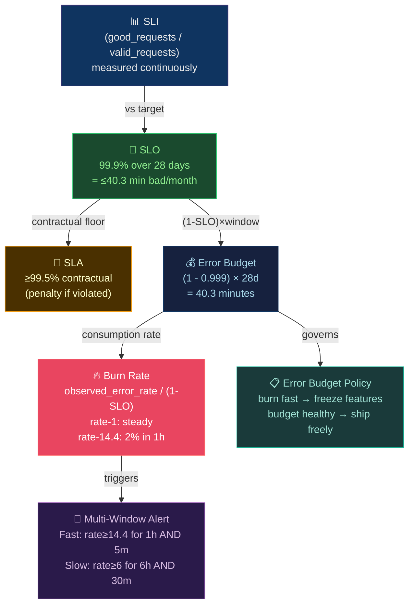

# 🎯 SLO, SLI, SLA, and Error Budgets

> [!abstract] TL;DR
> **SLI** (Service Level Indicator) = measured ratio: `good_requests / valid_requests`. **SLO** (Service Level Objective) = target SLI over a rolling window: 99.9% → 40.3 min downtime/28d. **SLA** = contractual SLO with financial penalties (always looser than SLO). **Error budget** = `(1 - SLO) × window` = allowed failure time. **Burn rate** = `observed_error_rate / (1 - SLO)` — rate-1 = exactly consuming budget; rate-14.4 = exhausting 28-day budget in 2 hours. **Multi-window multi-burn-rate alerting**: fast page when consuming 2% of budget in 1h (burn≥14.4) AND slow burn check (5% in 6h, burn≥6). Error budget policy: freeze feature work when budget is exhausted. Toil should be <50% of SRE time.

---

## Intuition — analogy FIRST

Error budget is like a **monthly allowance for mistakes**. If your SLO is 99.9%, you get 40.3 minutes of "bad" per month. Spend it fast (all 40 min in 1 hour) and you're out until next month. Burn rate measures **how fast you're spending**: burn rate 1 = steady spending, burn rate 14.4 = spending 14× faster than sustainable. Multi-window alerting is like watching both **hourly spend rate** (are we in a spending spree right now?) and **daily balance** (are we gradually bleeding money?) — you need both signals because one can fool you.

---

## How It Works



---

## Key Concepts / Details

### SLI — What to Measure

```
SLI = good_events / valid_events

Good SLIs:
  Availability:  successful_requests / total_requests
  Latency:       requests_under_500ms / total_requests  (not avg latency!)
  Throughput:    actual_throughput / expected_throughput
  Error rate:    1 - (error_requests / total_requests)

What makes a "good" event vs "valid" event:
  Valid: requests that SHOULD succeed (exclude health checks, OPTIONS, auth failures)
  Good:  requests that returned the expected result within threshold

Example: Payment API SLI
  Valid: POST /v1/payments where user is authenticated
  Good:  200 OK returned within 500ms
  → SLI = (200 OK < 500ms) / (authenticated POSTs)
```

```promql
# SLI query: error rate over 28-day window
# Prometheus recording rule
- record: slo:payment_api:error_rate28d
  expr: |
    1 - (
      sum(rate(http_requests_total{
        service="payment-api",
        status=~"2..",
        method="POST",
        path="/v1/payments"
      }[28d]))
      /
      sum(rate(http_requests_total{
        service="payment-api",
        method="POST",
        path="/v1/payments"
      }[28d]))
    )
```

### SLO Targets and Downtime Allowances

| SLO | Downtime/28 days | Downtime/year | Error budget (requests at 1000 RPS) |
|-----|-----------------|---------------|--------------------------------------|
| 99% | 6.72 hours | 3.65 days | 864,000 errors |
| 99.5% | 3.36 hours | 1.83 days | 432,000 errors |
| 99.9% | 40.3 minutes | 8.76 hours | 86,400 errors |
| 99.95% | 20.2 minutes | 4.38 hours | 43,200 errors |
| 99.99% | 4.03 minutes | 52.6 minutes | 8,640 errors |
| 99.999% | 24.2 seconds | 5.26 minutes | 864 errors |

```
Key insight: going from 99.9% to 99.99% requires:
  10× harder engineering (last 0.09% is much harder than first 99%)
  10× less error budget
  Ask: is the product valuable enough to justify this?
```

### Error Budget Math

```
Error budget = (1 - SLO) × window

99.9% SLO, 28-day window:
  budget = (1 - 0.999) × 28 × 24 × 60 = 40.32 minutes

At 1000 RPS total:
  budget_requests = 0.001 × 28 × 24 × 3600 × 1000 = 2,419,200 error requests

Remaining budget calculation:
  budget_consumed = actual_errors / budget_requests
  budget_remaining = 1 - budget_consumed

  If 500,000 errors occurred:
  budget_consumed = 500,000 / 2,419,200 = 20.7%
  budget_remaining = 79.3%
```

### Burn Rate — Multi-Window Multi-Burn-Rate Alerting

```
Burn rate = observed_error_rate / (1 - SLO)
          = observed_error_rate / error_budget_rate

burn_rate = 1:    consuming budget at exactly the sustainable rate
burn_rate = 14.4: consuming 14.4× sustainable rate
            → exhausts monthly budget in 28d/14.4 = ~2 days... NO

Correction: what does 14.4 mean?
  At burn rate 14.4, in 1 hour you consume:
  fraction_consumed = burn_rate × (1h / 28d) = 14.4 × (1/672) = 0.0214 = 2.14%
  → consuming 2% of monthly budget in 1 hour!

Alert thresholds (Google SRE Workbook):
  FAST  - burn_rate ≥ 14.4 for 1h   → 2% consumed in 1h  → PAGE immediately
  SLOW  - burn_rate ≥ 6 for 6h      → 5% consumed in 6h  → PAGE (slower)
  WARN  - burn_rate ≥ 3 for 72h     → 10% in 3 days       → TICKET
  LOW   - budget < 10% remaining    → budget nearly gone   → TICKET

Multi-window: must trigger on BOTH windows simultaneously to reduce false positives
  FAST page: (burn_rate_1h > 14.4) AND (burn_rate_5m > 14.4)
  SLOW page: (burn_rate_6h > 6) AND (burn_rate_30m > 6)
```

```promql
# Complete multi-window burn rate alerting

# Recording rules (pre-compute for efficiency)
- record: slo:payment_api:error_rate5m
  expr: |
    sum(rate(http_requests_total{service="payment-api",status=~"5.."}[5m]))
      /
    sum(rate(http_requests_total{service="payment-api"}[5m]))

- record: slo:payment_api:error_rate1h
  expr: |
    sum(rate(http_requests_total{service="payment-api",status=~"5.."}[1h]))
      /
    sum(rate(http_requests_total{service="payment-api"}[1h]))

- record: slo:payment_api:error_rate6h
  expr: |
    sum(rate(http_requests_total{service="payment-api",status=~"5.."}[6h]))
      /
    sum(rate(http_requests_total{service="payment-api"}[6h]))

# Alerting rules
- alert: PaymentAPI_BurnRate_Fast_Page
  expr: |
    (slo:payment_api:error_rate1h > (14.4 * 0.001))
    and
    (slo:payment_api:error_rate5m > (14.4 * 0.001))
  for: 2m
  labels:
    severity: critical
    slo: payment_api
  annotations:
    summary: "Fast burn rate: consuming >2% of monthly SLO budget in 1h"
    burn_rate: "{{ $value | humanizePercentage }} error rate"
    runbook: "https://runbooks.example.com/payment-api-burn-rate"

- alert: PaymentAPI_BurnRate_Slow_Page
  expr: |
    (slo:payment_api:error_rate6h > (6 * 0.001))
    and
    (slo:payment_api:error_rate5m > (6 * 0.001))
  for: 15m
  labels:
    severity: warning
    slo: payment_api
```

### SLA vs SLO vs SLI Hierarchy

```
SLI (measured) < SLO (objective) < SLA (contract)

SLI:  99.95% (actual measured availability last 28 days)
SLO:  99.9%  (our internal target — we aim to stay above this)
SLA:  99.5%  (contractual commitment — if we breach, pay penalty)

Why this ordering?
  Buffer between SLO and SLA:
    SLO 99.9% breached at 40 min downtime
    SLA 99.5% breached at 3.36 hours downtime
    ← 3 hours to fix before SLA violation and penalties kick in

  Buffer between SLI and SLO:
    SLI is measured; SLO is the target. Some variance is acceptable.
    If SLI = 99.97% and SLO = 99.9%, you're ahead — extra headroom for releases.
```

### Error Budget Policy

```yaml
# Error Budget Policy (example)
policy:
  name: payment-api-error-budget-policy

  states:
    healthy:                           # >50% budget remaining
      rules:
        - "Deploy features freely"
        - "Accept moderate risk changes"
        - "Scheduled maintenance allowed"

    at_risk:                          # 25-50% budget remaining
      rules:
        - "Require additional review for risky changes"
        - "No scheduled maintenance"
        - "Postmortem for any incidents"

    critical:                         # 10-25% budget remaining
      rules:
        - "Freeze all feature releases"
        - "Only security and bug fixes"
        - "Engineering focus on reliability"

    exhausted:                        # <10% budget remaining
      rules:
        - "Full feature freeze until next period"
        - "Incident review and toil audit"
        - "SRE embedded in team"
        - "Executive notification"
```

### Toil — The Reliability Tax

```
Toil = manual, repetitive, automatable operational work that:
  - Is triggered by a production system
  - Doesn't produce lasting value
  - Scales linearly with service growth

Toil budget: SREs should spend <50% on toil
  If toil > 50%: the team is stuck in reactive mode, can't improve reliability

Measuring toil:
  Count tickets that required manual intervention
  Time spent on manual deploys, restarts, capacity additions
  Pages that required manual investigation (no automated remediation)

Eliminating toil:
  Automate: script the manual process
  Fix root cause: eliminate the alert
  Improve observability: make diagnosis self-service
  Build abstraction: make the service self-healing
```

### Toil-SLO Integration

```
Error budget → governs release velocity
Toil budget → governs engineering allocation

When error budget is low AND toil is high:
  → The team is firefighting
  → Freeze features
  → Conduct toil audit
  → Spend "toil budget" on eliminating top toil sources

Virtuous cycle:
  Less toil → more reliability work → higher SLOs → more error budget
  → more confidence to ship features → better product
```

---

## Real-World Notes

- **28-day rolling window vs calendar month**: Calendar month makes budget tracking uneven (Feb has less). 28-day rolling window is consistent and always represents the same amount of time.
- **SLO ceremonies**: Monthly SLO review (budget consumption, trends), quarterly SLO calibration (are targets still right?), annual SLA negotiation.
- **Latency SLO is tricky**: Use percentile SLI (% of requests under 500ms), not average latency. A p99 latency SLO is more honest about tail behavior.
- **Alerting on budget, not error rate**: Alerting directly on error rate (`> 0.1%`) fires even when you have plenty of budget; alerting on burn rate respects context.

---

## Common Pitfalls

1. **SLO without error budget policy** — measuring SLO but not using budget to govern releases defeats the purpose; the policy must have teeth (feature freeze).
2. **Average latency SLI** — average hides bad tail behavior; always use p99 or % of requests under threshold.
3. **Alerting on SLA breach instead of burn rate** — by the time SLA is breached, customers have already suffered; alert on budget burn to get ahead.
4. **Too many SLOs** — starting with 20 SLOs creates tracking overhead; begin with 1-3 critical user journeys.
5. **SLO targets too high** — 99.999% for a service that doesn't need it; achievability is costly and creates false urgency when budget burns.

---

## Related Concepts

- [[_MOC_Monitoring_Observability|↑ Observability MOC]]
- [[Prometheus_and_Alertmanager|← Prometheus]] — recording rules + alerting rules for burn rate
- [[Grafana_Dashboards|← Grafana]] — SLO dashboards and budget visualization
- [[Distributed_Tracing|← Tracing]] — identify which requests break SLO
- [[../02_CICD_Pipelines/Release_Strategies|→ Release Strategies]] — error budget gates canary progression

---

## Review Questions

1. A service has SLO 99.9% over 28 days. After 14 days, it has experienced 30 minutes of downtime. Calculate: total budget, consumed %, remaining budget, and whether the team can proceed with a risky release.
2. Write the PromQL alerting rule for "fast burn page": fires when the 1-hour error rate implies consuming 2% of the 28-day error budget in 1 hour, AND the 5-minute error rate confirms it's still happening.
3. An SRE team reports 70% of their time is spent on toil (manual restarts, capacity requests, alert investigation). Design a 90-day plan to bring toil below 50%, with specific automation targets.

---

## Sources

- Google SRE Book: chapters 3-4 (SLOs, Toil)
- Google SRE Workbook: chapter 5 (Alerting on SLOs)
- sre.google/sre-book/
- sre.google/workbook/alerting-on-slos/

#DevOps #SRE #Observability #SLO #SLI #SLA #ErrorBudget #BurnRate #MultiWindow #Toil
