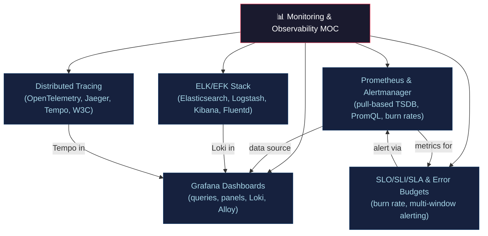

# 📊 Monitoring & Observability — Section MOC

> [!abstract] Section Overview
> Observability is the ability to understand internal system state from external outputs. The three pillars are metrics (Prometheus), logs (ELK/Loki), and traces (Jaeger/Tempo). SLOs quantify reliability commitments; error budgets gate feature velocity. This section covers Prometheus, Grafana, ELK/EFK, distributed tracing, and SLO engineering.

---

## Concept Map



---

## Notes in This Section

| Note | Key Concepts | Difficulty |
|------|-------------|------------|
| [[Prometheus_and_Alertmanager\|Prometheus & Alertmanager]] | TSDB, counter/gauge/histogram, PromQL, recording rules | Advanced |
| [[Grafana_Dashboards\|Grafana Dashboards]] | panels, template variables, Loki LogQL, Grafonnet | Intermediate |
| [[ELK_and_EFK_Stack\|ELK/EFK Stack]] | Elasticsearch, Logstash, Fluentd, ILM, Vector | Intermediate |
| [[Distributed_Tracing\|Distributed Tracing]] | spans, W3C traceparent, OpenTelemetry, head/tail sampling | Advanced |
| [[SLO_SLI_SLA_and_Error_Budgets\|SLO/SLI/SLA & Error Budgets]] | good/valid, burn rate, multi-window alerting, toil | Advanced |

---

## Key Formulas Reference

| Formula | Meaning |
|---------|---------|
| `rate(counter[5m])` | Per-second rate over 5min window (corrects resets) |
| `histogram_quantile(0.99, rate(hist_bucket[5m]))` | p99 latency from histogram |
| `SLI = good_requests / valid_requests` | Service Level Indicator |
| `error_budget = (1 - SLO) × window` | Total allowed error time |
| `burn_rate = observed_error_rate / (1 - SLO)` | Speed of budget consumption |
| `2% in 1h → burn_rate = 14.4` | Fast burn alert threshold |

---

## Learning Path

```
Prometheus & Alertmanager → Grafana Dashboards → SLO/SLI/SLA
→ Distributed Tracing → ELK/EFK Stack
```

---

## Related Sections

- [[_MOC_DevOps_Master|↑ DevOps Master MOC]]
- [[../04_Kubernetes/_MOC_Kubernetes|← Kubernetes]] — emits metrics/logs/traces
- [[../02_CICD_Pipelines/Release_Strategies|← Release Strategies]] — canary metric gates
- [[../06_Cloud_Platforms/_MOC_Cloud_Platforms|← Cloud]] — cloud-native monitoring options

---

#DevOps #Observability #Monitoring #Prometheus #Grafana #SRE #SLO #MOC
