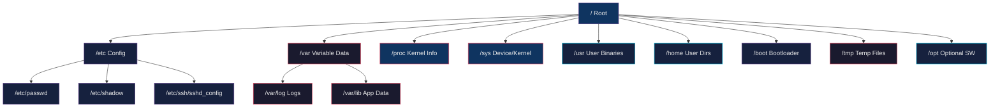

# 🐧 Linux Fundamentals

> [!abstract] TL;DR
> Linux organizes everything as files under a single root (`/`) hierarchy defined by the Filesystem Hierarchy Standard (FHS). Permissions are enforced via a 9-bit rwx model per owner/group/other, controlled with `chmod`/`chown`. Users and groups are stored in `/etc/passwd`, `/etc/shadow`, and `/etc/group`. Package managers (apt, dnf) handle software installation declaratively, while systemd manages service lifecycle through unit files and targets.

## Intuition

Think of Linux like a large office building. The file system is the building's floor plan — `/etc` is the administrative office (configuration), `/var` is the filing room (variable data that grows), `/home` is the personal desk area for each employee, and `/proc` is a live dashboard showing what every process is doing right now. Permissions are like keycards: each file has an owner, a department (group), and a rule for everyone else. You can only enter rooms your keycard allows.

## How It Works



## Key Concepts / Details

### File System Hierarchy

| Directory | Purpose | Examples |
|-----------|---------|---------|
| `/etc` | System-wide configuration files | `sshd_config`, `fstab`, `hosts` |
| `/var` | Variable data (grows at runtime) | `/var/log`, `/var/lib`, `/var/spool` |
| `/proc` | Virtual FS — kernel/process info | `/proc/cpuinfo`, `/proc/meminfo`, `/proc/PID/` |
| `/sys` | Virtual FS — device/kernel parameters | `/sys/block/`, `/sys/class/net/` |
| `/usr` | Read-only user binaries & libraries | `/usr/bin`, `/usr/lib`, `/usr/share` |
| `/home` | User home directories | `/home/alice`, `/home/bob` |
| `/boot` | Boot loader files, kernel | `vmlinuz`, `initrd.img`, `grub/` |
| `/tmp` | Temporary files (cleared on reboot) | Session temp files |
| `/opt` | Optional/third-party software | `/opt/google`, `/opt/splunk` |

### File Permissions

Permissions are displayed as 10 characters: `drwxr-xr--`

```
d  rwx  r-x  r--
|   |    |    |
|   |    |    └── Other: read only
|   |    └─────── Group: read + execute
|   └──────────── Owner: read + write + execute
└──────────────── Type: d=dir, -=file, l=symlink, p=pipe, s=socket
```

**Octal notation:**
```bash
# r=4, w=2, x=1
chmod 755 script.sh    # rwxr-xr-x  (owner=7, group=5, other=5)
chmod 644 file.txt     # rw-r--r--  (owner=6, group=4, other=4)
chmod 600 private.key  # rw-------  (owner only)
chmod 777 dir/         # rwxrwxrwx  (world-writable — avoid!)

# Symbolic mode
chmod u+x script.sh    # add execute for owner
chmod g-w file.txt     # remove write from group
chmod o=r file.txt     # set other to read-only
chmod a+r file.txt     # add read for all (a = u+g+o)
chmod -R 755 /var/www  # recursive

# Change ownership
chown alice file.txt
chown alice:developers file.txt
chown -R www-data:www-data /var/www/html
chgrp ops /etc/app.conf
```

**Special bits:**
```bash
chmod u+s /usr/bin/passwd   # SUID — runs as file owner (setuid bit = 4000)
chmod g+s /shared/dir       # SGID — new files inherit group (setgid bit = 2000)
chmod +t /tmp               # Sticky bit — only owner can delete (bit = 1000)

# Octal with special bits
chmod 4755 /usr/bin/custom  # SUID + rwxr-xr-x
chmod 2775 /shared          # SGID + rwxrwxr-x
chmod 1777 /tmp             # Sticky + rwxrwxrwx
```

### User and Group Management

```bash
# /etc/passwd format: username:x:UID:GID:comment:home:shell
cat /etc/passwd
# alice:x:1001:1001:Alice Smith:/home/alice:/bin/bash

# /etc/shadow: hashed passwords (root-readable only)
# /etc/group: group:x:GID:member1,member2

# Create user
useradd -m -s /bin/bash -c "Alice Smith" alice
useradd -m -G docker,sudo alice          # add to supplementary groups

# Set password
passwd alice
echo "alice:NewPass123!" | chpasswd      # non-interactive

# Modify user
usermod -aG docker alice                 # append to group (ALWAYS use -a)
usermod -s /bin/zsh alice                # change shell
usermod -L alice                         # lock account
usermod -U alice                         # unlock account
usermod -e 2026-12-31 alice              # set expiry

# Delete user
userdel -r alice                         # -r removes home dir

# Groups
groupadd developers
groupdel developers
groups alice                             # show user's groups
id alice                                 # uid, gid, groups

# Switch user
su - alice                               # login shell as alice
sudo -u alice command                    # run command as alice
```

### Package Managers

**apt (Debian/Ubuntu):**
```bash
apt update                               # refresh package index
apt upgrade                              # upgrade all packages
apt install nginx curl git               # install packages
apt remove nginx                         # remove package (keep config)
apt purge nginx                          # remove package + config
apt autoremove                           # remove orphaned dependencies
apt search "web server"                  # search packages
apt show nginx                           # show package details
apt list --installed                     # list installed packages
dpkg -l | grep nginx                     # dpkg-level query
dpkg -i package.deb                      # install local .deb
```

**yum/dnf (RHEL/CentOS/Fedora):**
```bash
dnf update                               # update all (dnf replaces yum in modern RHEL)
dnf install nginx httpd-tools            # install
dnf remove nginx                         # remove
dnf search "web server"                  # search
dnf info nginx                           # package info
dnf list installed                       # list installed
dnf history                              # transaction history
dnf history undo 5                       # undo transaction #5
rpm -qa | grep nginx                     # rpm-level query
rpm -ivh package.rpm                     # install local .rpm
yum-config-manager --enable epel         # enable extra repo
```

### systemd Basics

```bash
# Service management
systemctl start nginx
systemctl stop nginx
systemctl restart nginx
systemctl reload nginx                   # reload config without stopping
systemctl status nginx                   # show status + recent logs
systemctl enable nginx                   # enable at boot
systemctl disable nginx                  # disable at boot
systemctl is-active nginx                # returns: active/inactive
systemctl is-enabled nginx               # returns: enabled/disabled

# List services
systemctl list-units --type=service
systemctl list-units --type=service --state=running
systemctl list-unit-files --type=service

# Targets (equivalent to SysV runlevels)
systemctl get-default                    # e.g., multi-user.target
systemctl set-default graphical.target
systemctl isolate rescue.target          # switch to rescue mode

# Unit file locations
# /lib/systemd/system/     — package-provided
# /etc/systemd/system/     — admin overrides (higher priority)
# /run/systemd/system/     — runtime units

# Example unit file: /etc/systemd/system/myapp.service
cat > /etc/systemd/system/myapp.service << 'EOF'
[Unit]
Description=My Application
After=network.target

[Service]
Type=simple
User=appuser
WorkingDirectory=/opt/myapp
ExecStart=/opt/myapp/bin/start.sh
Restart=on-failure
RestartSec=5
StandardOutput=journal
StandardError=journal

[Install]
WantedBy=multi-user.target
EOF

systemctl daemon-reload                  # reload after editing unit files
```

## Real-World Notes

- The `/proc` filesystem is entirely in-memory and recreated at boot — reading `/proc/meminfo` or `/proc/cpuinfo` is zero-cost (no disk I/O). Tools like `free` and `top` simply parse these files.
- SUID binaries are a common attack surface. Audit them with `find / -perm /4000 -type f 2>/dev/null`. Only a handful of system utilities should have SUID set.
- Always use `usermod -aG group user` (with `-a`) when adding to a supplementary group. Without `-a`, you replace all groups, effectively removing the user from every other group.
- On modern Ubuntu systems (20.04+) with Netplan, never edit `/etc/network/interfaces` directly. Use `/etc/netplan/*.yaml` and apply with `netplan apply`.

## Common Pitfalls

1. **Forgetting `-a` in `usermod -aG`** — omitting the `-a` flag removes the user from all groups except the one specified, often locking users out of `sudo` or `docker`.
2. **Using `chmod 777` for quick fixes** — world-writable files bypass all permission controls. Use `chmod 755` for directories and `664`/`644` for files instead.
3. **Editing unit files directly without `daemon-reload`** — changes to `/etc/systemd/system/*.service` are not picked up until you run `systemctl daemon-reload`.
4. **Confusing `apt upgrade` vs `apt full-upgrade`** — `full-upgrade` may remove packages to resolve conflicts; use it intentionally. `upgrade` never removes packages.
5. **Assuming `/tmp` persists across reboots** — on systems using `systemd-tmpfiles`, `/tmp` is cleared at boot. Use `/var/tmp` for data that must survive reboots.

## Related Concepts

- [[Process_Management]]
- [[Shell_Scripting]]
- [[Linux_Networking_Commands]]
- [[Linux_Performance_Tuning]]
- [[Linux_Security_Hardening]]
- [[_MOC_Linux_and_OS|Linux and OS MOC]]

## Review Questions

1. What is the difference between `/proc` and `/sys` in the Linux filesystem hierarchy, and what kinds of information does each expose?
2. Explain what happens when you run `chmod 4755` on a binary. What security implications does this have?
3. A colleague runs `usermod -G docker alice`. What mistake have they made, and how would you fix it without further data loss?
4. What is the difference between `systemctl enable` and `systemctl start`? Can a service be started without being enabled?

## Sources

- [Linux Filesystem Hierarchy Standard (FHS 3.0)](https://refspecs.linuxfoundation.org/FHS_3.0/fhs/index.html)
- [systemd Documentation](https://www.freedesktop.org/wiki/Software/systemd/)
- [Debian apt manpage](https://manpages.debian.org/bookworm/apt/apt.8.en.html)
- [The Linux Command Line, William Shotts](https://linuxcommand.org/tlcl.php)
- [RHEL 9 System Administration Guide](https://access.redhat.com/documentation/en-us/red_hat_enterprise_linux/9)

#DevOps #Linux #SystemAdministration #FileSystem #Permissions #SystemD
