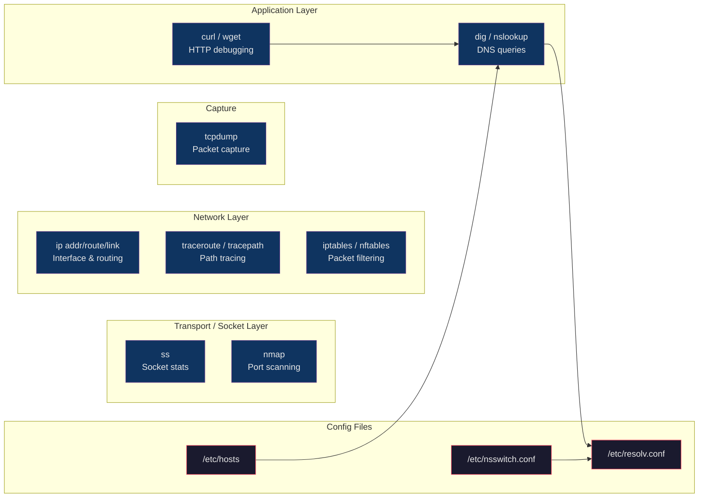

# 🌐 Linux Networking Commands

> [!abstract] TL;DR
> Modern Linux networking is managed through the `ip` suite (replacing `ifconfig`/`route`) for interface and routing configuration, and `ss` (replacing `netstat`) for socket inspection. `tcpdump` captures raw packets for deep debugging, while `curl` and `dig` handle application-layer HTTP and DNS diagnostics. Firewall rules are managed by `iptables`/`nftables` (direct) or `firewalld`/`ufw` (higher-level wrappers). Understanding these tools is critical for debugging connectivity, DNS resolution, and security issues in production.

## Intuition

Think of Linux networking like a city's road system. The `ip` command is the city planner — it manages roads (interfaces), intersections (routing), and addresses (IPs). `ss` is a traffic monitor sitting at every intersection, listing every car (socket connection) with its origin and destination. `tcpdump` is a speed camera that captures every packet flying past a specific road. `iptables` is the toll booth system — it decides which vehicles (packets) can pass and which get turned away. `dig` and `curl` are the test drivers you send out to confirm a specific route actually works end-to-end.

## How It Works



## Key Concepts / Details

### ip — Interface and Routing Management

`ip` replaces the deprecated `ifconfig`, `route`, and `arp` commands.

```bash
# ip addr — interface addresses
ip addr show                             # all interfaces
ip addr show eth0                        # specific interface
ip addr show dev eth0                    # same
ip -4 addr show                          # IPv4 only
ip -6 addr show                          # IPv6 only
ip -brief addr show                      # condensed output

# Add/remove IP addresses
ip addr add 192.168.1.100/24 dev eth0
ip addr del 192.168.1.100/24 dev eth0

# ip link — interface state
ip link show                             # all interfaces + state
ip link set eth0 up
ip link set eth0 down
ip link set eth0 mtu 9000               # jumbo frames

# ip route — routing table
ip route show                            # current routing table
ip route get 8.8.8.8                    # which route would be used for this dest
ip route add 10.0.0.0/8 via 192.168.1.1 dev eth0
ip route add default via 192.168.1.1    # set default gateway
ip route del 10.0.0.0/8 via 192.168.1.1
ip route flush cache

# ip neigh — ARP/NDP table (replaces arp -n)
ip neigh show
ip neigh flush all

# ip rule — policy routing
ip rule show

# Useful flags
ip -s link show eth0                    # show statistics (RX/TX bytes, errors)
ip -json addr show | jq .              # JSON output for scripting
```

### ss — Socket Statistics

`ss` replaces `netstat`. It queries the kernel directly and is faster.

```bash
# ss -tulnp: the most common incantation
# -t: TCP sockets
# -u: UDP sockets
# -l: listening sockets
# -n: numeric (no DNS resolution — faster)
# -p: show owning process
ss -tulnp

# Example output:
# Netid State  Recv-Q Send-Q  Local Address:Port  Peer Address:Port Process
# tcp   LISTEN 0      511     0.0.0.0:80           0.0.0.0:*         users:(("nginx",pid=1234,fd=6))
# tcp   LISTEN 0      128     127.0.0.1:5432       0.0.0.0:*         users:(("postgres",pid=5678,fd=5))

# All established TCP connections
ss -tn state established

# Filter by port
ss -tnp sport = :443
ss -tnp dport = :5432

# Filter by state
ss -tn state time-wait | wc -l          # count TIME_WAIT connections
ss -tn state close-wait

# Show socket memory
ss -tm

# Unix domain sockets
ss -lnx                                 # listening unix sockets

# Summary statistics
ss -s
```

### iptables — Packet Filtering

```bash
# List rules
iptables -L -n -v                       # all chains, numeric, verbose
iptables -L INPUT -n -v --line-numbers  # INPUT chain with rule numbers
iptables -t nat -L -n -v               # NAT table
iptables -t mangle -L -n               # mangle table

# Basic rule syntax:
# iptables -A CHAIN -p PROTO [--dport PORT] -j ACTION
# Actions: ACCEPT, DROP, REJECT, LOG, MASQUERADE, DNAT, SNAT

# Allow incoming SSH
iptables -A INPUT -p tcp --dport 22 -j ACCEPT

# Allow established/related connections
iptables -A INPUT -m state --state ESTABLISHED,RELATED -j ACCEPT

# Drop everything else on INPUT (after allowing what you need)
iptables -A INPUT -j DROP

# Allow outgoing on specific port
iptables -A OUTPUT -p tcp --dport 443 -j ACCEPT

# Insert rule at position 1
iptables -I INPUT 1 -p tcp --dport 80 -j ACCEPT

# Delete rule by number
iptables -D INPUT 3

# Flush all rules (danger: clears firewall)
iptables -F

# Save/restore rules
iptables-save > /etc/iptables/rules.v4
iptables-restore < /etc/iptables/rules.v4

# NAT masquerading (for router/gateway)
iptables -t nat -A POSTROUTING -o eth0 -j MASQUERADE
echo 1 > /proc/sys/net/ipv4/ip_forward
```

### nftables — Modern Replacement for iptables

```bash
# List all rules
nft list ruleset

# Basic table/chain/rule structure
nft add table inet filter
nft add chain inet filter input { type filter hook input priority 0 \; policy drop \; }
nft add rule inet filter input tcp dport 22 accept
nft add rule inet filter input ct state established,related accept
nft add rule inet filter input tcp dport { 80, 443 } accept

# Show rules
nft list table inet filter
nft list chain inet filter input

# Delete
nft flush ruleset                        # clear all (danger)
nft delete table inet filter

# Load from file
nft -f /etc/nftables.conf
```

### tcpdump — Packet Capture

```bash
# Basic capture on interface
tcpdump -i eth0
tcpdump -i any                           # all interfaces

# Common flags
# -n: numeric (no DNS), -nn: numeric + no port names
# -v: verbose, -vv: more verbose
# -c N: capture N packets then stop
# -w file.pcap: write to file
# -r file.pcap: read from file
# -s 0: capture full packet (default is 262144 bytes)

# Capture 100 packets on eth0, full verbose
tcpdump -i eth0 -nn -c 100 -v

# Filter syntax (BPF — Berkeley Packet Filter)
tcpdump -i eth0 host 10.0.1.5           # traffic to/from host
tcpdump -i eth0 port 443                # traffic on port 443
tcpdump -i eth0 tcp port 80             # TCP port 80
tcpdump -i eth0 'port 80 or port 443'   # multiple ports
tcpdump -i eth0 net 10.0.0.0/8         # subnet
tcpdump -i eth0 src 10.0.0.1            # source IP only
tcpdump -i eth0 dst port 5432          # destination port only
tcpdump -i eth0 'not port 22'          # exclude SSH noise

# Save to file and analyze later (with Wireshark)
tcpdump -i eth0 -nn -w /tmp/capture.pcap port 8080
tcpdump -r /tmp/capture.pcap -nn 'host 10.0.1.5'

# Show HTTP request headers
tcpdump -i eth0 -nn -A port 80 | grep -E "GET|POST|Host:|HTTP/"

# Count packets by host
tcpdump -i eth0 -nn -q 2>/dev/null | awk '{print $3}' | cut -d. -f1-4 | sort | uniq -c | sort -rn | head
```

### curl — HTTP Debugging

```bash
# Basic request
curl https://example.com

# Common flags
curl -I https://example.com              # HEAD request (headers only)
curl -L https://short.url/abc           # follow redirects
curl -v https://example.com             # verbose (shows TLS handshake, headers)
curl -s https://example.com             # silent (no progress)
curl -f https://example.com             # fail silently on HTTP errors (exit 22)
curl -o /dev/null https://example.com   # discard body
curl -w "%{http_code}\n" -so /dev/null https://example.com  # just status code

# Custom headers
curl -H "Authorization: Bearer $TOKEN" https://api.example.com/v1/users
curl -H "Content-Type: application/json" ...

# POST requests
curl -X POST -d '{"key":"value"}' -H "Content-Type: application/json" https://api.example.com
curl -X POST --data-urlencode "name=Alice" https://api.example.com/form

# File upload
curl -F "file=@/path/to/file.txt" https://upload.example.com

# Authentication
curl -u username:password https://example.com
curl --cert client.crt --key client.key https://mtls.example.com

# Resolve hostname to specific IP (bypass DNS)
curl --resolve "myapp.example.com:443:10.0.1.5" https://myapp.example.com

# Timing breakdown
curl -w "@curl-format.txt" -o /dev/null -s https://example.com
# curl-format.txt:
# time_namelookup:  %{time_namelookup}s\n
# time_connect:     %{time_connect}s\n
# time_pretransfer: %{time_pretransfer}s\n
# time_starttransfer: %{time_starttransfer}s\n
# time_total:       %{time_total}s\n

# Retry with backoff
curl --retry 3 --retry-delay 5 --retry-max-time 60 https://api.example.com
```

### dig — DNS Queries

```bash
# Basic A record lookup
dig example.com
dig example.com A                        # explicit record type

# Other record types
dig example.com MX                       # mail exchange records
dig example.com TXT                      # text records (SPF, DKIM, etc.)
dig example.com NS                       # nameservers
dig example.com CNAME                    # canonical name
dig example.com AAAA                     # IPv6 records
dig example.com ANY                      # all records

# Concise output
dig +short example.com                   # just the IP
dig +short example.com MX               # just MX records

# Query specific DNS server
dig @8.8.8.8 example.com               # Google DNS
dig @1.1.1.1 example.com               # Cloudflare DNS
dig @192.168.1.1 example.com           # local resolver

# Reverse DNS lookup
dig -x 93.184.216.34
dig +short -x 93.184.216.34

# Trace full resolution path
dig +trace example.com

# Check all authoritative nameservers
dig +nssearch example.com

# No recursion (query authoritative only)
dig +norecurse @ns1.example.com example.com

# nslookup (older, interactive mode)
nslookup example.com
nslookup example.com 8.8.8.8
nslookup -type=MX example.com
```

### traceroute / tracepath

```bash
# Trace route to destination
traceroute google.com
traceroute -n google.com                # numeric (no DNS)
traceroute -I google.com               # use ICMP (like Windows tracert)
traceroute -T -p 443 google.com        # use TCP SYN to port 443 (firewalls)
traceroute -m 30 google.com            # max 30 hops

# tracepath — no root required, MTU discovery
tracepath google.com
tracepath6 2001:4860:4860::8888        # IPv6
```

### nmap — Port Scanning

```bash
# IMPORTANT: Only scan systems you own or have permission to scan
# Unauthorized scanning is illegal in many jurisdictions

# TCP connect scan (no root needed)
nmap -sT 192.168.1.1

# SYN scan (faster, needs root)
nmap -sS 192.168.1.1

# Scan specific ports
nmap -p 22,80,443 192.168.1.1
nmap -p 1-1024 192.168.1.1
nmap -p- 192.168.1.1                   # all 65535 ports

# Service version detection
nmap -sV 192.168.1.1

# OS detection + scripts
nmap -A 192.168.1.1

# Scan subnet
nmap -sn 192.168.1.0/24                # ping scan (host discovery only)
nmap -p 22 192.168.1.0/24             # check SSH on all hosts

# Output formats
nmap -oN output.txt 192.168.1.1        # normal
nmap -oX output.xml 192.168.1.1        # XML
nmap -oG output.gnmap 192.168.1.1      # grepable
```

### Network Configuration Files

```bash
# /etc/hosts — static hostname resolution (checked before DNS)
cat /etc/hosts
# 127.0.0.1   localhost
# 10.0.1.100  db.internal db

# /etc/resolv.conf — DNS resolver configuration
cat /etc/resolv.conf
# nameserver 8.8.8.8
# nameserver 8.8.4.4
# search mycompany.internal
# options ndots:5 timeout:2 attempts:3

# /etc/nsswitch.conf — name service switch order
grep hosts /etc/nsswitch.conf
# hosts: files dns   ← check /etc/hosts first, then DNS
# hosts: files mdns4_minimal [NOTFOUND=return] dns   ← with mDNS

# Netplan (Ubuntu 18.04+) — /etc/netplan/*.yaml
cat /etc/netplan/01-netcfg.yaml
# network:
#   version: 2
#   ethernets:
#     eth0:
#       dhcp4: false
#       addresses: [192.168.1.10/24]
#       gateway4: 192.168.1.1
#       nameservers:
#         addresses: [8.8.8.8, 8.8.4.4]
netplan apply                            # apply changes

# nmcli (RHEL/CentOS/Fedora — NetworkManager)
nmcli device status
nmcli connection show
nmcli connection add type ethernet con-name "eth0" ifname eth0
nmcli connection modify "eth0" ipv4.addresses "192.168.1.10/24"
nmcli connection modify "eth0" ipv4.gateway "192.168.1.1"
nmcli connection modify "eth0" ipv4.dns "8.8.8.8 8.8.4.4"
nmcli connection modify "eth0" ipv4.method manual
nmcli connection up "eth0"
```

## Real-World Notes

- `ss -tulnp` is the first command to run when debugging "why can't I connect to port X" — it immediately shows whether the service is even listening, on which interface, and with which process.
- `dig +trace domain.com` is invaluable for debugging split-horizon DNS, TTL propagation delays, and misconfigured delegation chains. It shows every authoritative hop in the resolution path.
- When `curl` fails on HTTPS, use `curl -v` to see exactly where the TLS handshake fails — certificate validation, cipher mismatch, or SNI problems all produce different error messages.
- The `--resolve` flag in `curl` is extremely useful for testing behind a load balancer: you can send a request to a specific backend IP while still using the correct `Host` header and TLS SNI name.

## Common Pitfalls

1. **Using `ifconfig`/`netstat` on modern systems** — these tools are deprecated and may not be installed. `ip addr` and `ss` are the current equivalents and provide more information.
2. **Forgetting `-n` in `ss` or `tcpdump`** — without numeric mode, every IP and port triggers a reverse DNS lookup, making output painfully slow and potentially misleading if DNS is broken.
3. **`/etc/resolv.conf` being overwritten** — on systems using NetworkManager or systemd-resolved, manual edits to `/etc/resolv.conf` are lost on reconnect. Edit the NM connection or `/etc/systemd/resolved.conf` instead.
4. **iptables rules not persisting across reboots** — `iptables -A` modifies in-memory rules only. Without `iptables-save` and proper restoration at boot (e.g., `iptables-persistent` package), rules are lost on reboot.
5. **nmap SYN scan without root** — `nmap -sS` silently falls back to `-sT` (TCP connect) when run as non-root. The results look valid but the scan type changes; add `sudo` explicitly.

## Related Concepts

- [[Linux_Fundamentals]]
- [[Linux_Security_Hardening]]
- [[Linux_Performance_Tuning]]
- [[Shell_Scripting]]
- [[_MOC_Linux_and_OS|Linux and OS MOC]]

## Review Questions

1. You run `curl -v https://myapp.internal` and get a "Connection refused" error. Walk through the diagnostic steps using `ss`, `dig`, and `ip route` to isolate whether the problem is DNS, routing, or the service not listening.
2. What is the difference between `iptables -A INPUT -j DROP` and `iptables -I INPUT 1 -j DROP`? Why does order matter in iptables rule evaluation?
3. Explain the resolution order controlled by `/etc/nsswitch.conf`. What happens if you set `hosts: dns files` instead of `hosts: files dns`?
4. You need to capture HTTP traffic between a containerized app and its database to debug slow queries. What `tcpdump` command would you use, and what filter would reduce noise?

## Sources

- [iproute2 documentation](https://wiki.linuxfoundation.org/networking/iproute2)
- [ss(8) man page](https://man7.org/linux/man-pages/man8/ss.8.html)
- [tcpdump/libpcap documentation](https://www.tcpdump.org/)
- [nmap book — Gordon Lyon (Fyodor)](https://nmap.org/book/)
- [curl documentation](https://curl.se/docs/manpage.html)
- [RHEL 9 Networking Guide](https://access.redhat.com/documentation/en-us/red_hat_enterprise_linux/9/html/configuring_and_managing_networking/index)

#DevOps #Linux #Networking #tcpdump #iptables #DNS #curl
