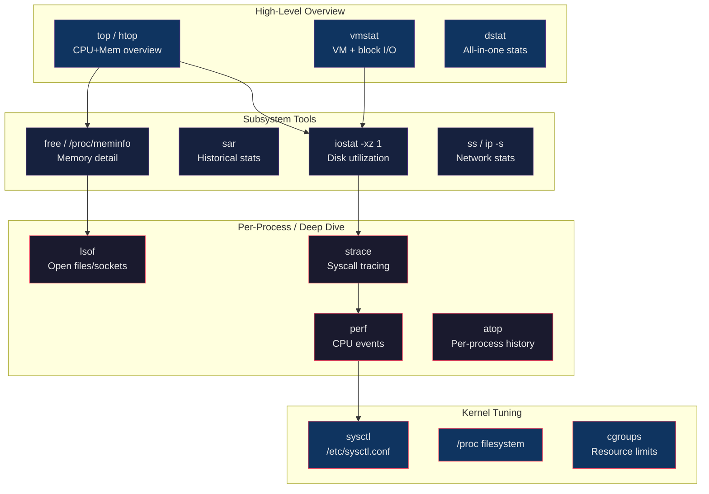

# 📊 Linux Performance Tuning

> [!abstract] TL;DR
> Linux performance analysis starts with understanding CPU, memory, disk I/O, and network as four distinct resource dimensions. Key tools form a hierarchy from high-level snapshots (`top`, `vmstat`, `iostat`) to deep per-process tracing (`strace`, `perf`). Kernel parameters in `/proc/sys/` and `/etc/sysctl.conf` allow tuning network buffers, VM behavior, and file descriptor limits. Performance bottlenecks must be identified empirically — the same symptom (high load) can stem from CPU saturation, I/O wait, memory pressure, or lock contention.

## Intuition

Diagnosing Linux performance is like being a doctor for a sick computer. You start with vitals (`top` — is the patient breathing?), then narrow down: is the CPU overheating (CPU-bound), are the lungs clogged with disk I/O (I/O-bound), or is the patient running out of blood (memory pressure causing swap)? Once you identify the system, you look at the specific organs — `iostat` for the storage, `ss` for the network, `strace` for a specific misbehaving process. `sysctl` is the medication: it adjusts kernel parameters without surgery (rebooting).

## How It Works



## Key Concepts / Details

### top / htop / atop

```bash
# top header breakdown:
# top - 15:42:01 up 10 days,  3:07,  2 users,  load average: 2.15, 1.98, 1.75
#                                                               1min  5min  15min

# Load average interpretation (per CPU core):
# load_avg / num_cpus < 1.0: healthy headroom
# load_avg / num_cpus = 1.0: fully saturated
# load_avg / num_cpus > 1.0: overloaded, processes queuing

# Check CPU count
nproc
grep -c ^processor /proc/cpuinfo

# CPU line: %us %sy %ni %id %wa %hi %si %st
# us = user space        sy = system/kernel
# ni = nice processes    id = idle
# wa = iowait (waiting for disk — key metric!)
# hi = hardware interrupts  si = software interrupts
# st = stolen (VM hypervisor took CPU time)

# Memory line:
# total = total RAM
# free  = truly unused
# used  = used by processes
# buff/cache = kernel buffer/cache (can be reclaimed)
# available = free + reclaimable (what new processes can use)

# top key shortcuts (recap)
# P: sort by CPU, M: sort by memory, T: sort by time
# k: kill, r: renice, f: add fields, 1: per-CPU
# H: toggle threads, c: full command line

# htop
htop
htop -d 10                              # refresh every 10 deciseconds (1s)
htop -u deploy                          # filter to user

# atop — includes disk and network per-process
atop                                    # live
atop -r /var/log/atop/atop_20260728     # replay historical log
```

### iostat — Disk I/O Statistics

```bash
# iostat: part of sysstat package
iostat                                  # one-shot summary
iostat 1                                # refresh every 1 second
iostat -xz 1                            # extended stats, skip zero-activity devices

# Extended output columns:
# r/s    = read operations per second
# w/s    = write operations per second
# rkB/s  = read kilobytes per second
# wkB/s  = write kilobytes per second
# await  = average I/O wait time (ms) — READ THIS
# r_await / w_await = separate read/write wait
# %util  = percentage of time device was busy (100% = saturated)
# aqu-sz = average queue size (backlog)
# svctm  = (deprecated) average service time

# Key thresholds:
# %util > 80%: disk is approaching saturation
# await > 10ms for SSD: investigate
# await > 50ms for HDD: normal-ish, but investigate if application-facing

# Show CPU + device
iostat -xz -c -d 1

# Per-partition stats
iostat -p sda 1

# Example healthy SSD output:
# Device  r/s  w/s  rkB/s  wkB/s  await  %util
# nvme0n1 120  340  4800   8500   0.3    12.0

# Example saturated disk:
# Device  r/s  w/s  rkB/s  wkB/s  await  %util
# sda     45   180  1800   7200   85.0   98.0   ← problem!
```

### vmstat — Virtual Memory Statistics

```bash
vmstat 1                                # refresh every second
vmstat 1 10                             # 10 samples, 1 second apart

# Output columns:
# r  = processes waiting to run (run queue)
# b  = processes in uninterruptible sleep (D state)
# swpd = virtual memory used (swap) — nonzero = memory pressure
# free = idle memory
# buff = memory used for buffers
# cache = memory used for page cache
# si = swap in (pages/sec read from swap) — bad if nonzero under load
# so = swap out (pages/sec written to swap) — very bad
# bi = block input (blocks/sec received from block device)
# bo = block output (blocks/sec sent to block device)
# in = interrupts per second
# cs = context switches per second
# us/sy/id/wa/st = CPU percentages

# Key signals:
# r > num_cpus: CPU run queue congestion
# b > 0 consistently: D-state congestion (I/O wait)
# si/so > 0 regularly: system is swapping (add RAM or tune vm.swappiness)
# cs very high: too many threads / context switching overhead

# Memory details
free -h                                 # human-readable
cat /proc/meminfo                       # full details
```

### sar — Historical System Activity

```bash
# sar is part of sysstat package
# Data collected by sadc daemon into /var/log/sysstat/sa*

# CPU utilization
sar -u 1 5                              # every 1s, 5 samples
sar -u -f /var/log/sysstat/sa28         # historical data from day 28

# Memory
sar -r 1 5                              # RAM stats
sar -S 1 5                              # swap stats

# Disk I/O
sar -d 1 5                              # disk stats
sar -b 1 5                              # I/O and transfer rates

# Network
sar -n DEV 1 5                          # network device stats
sar -n TCP 1 5                          # TCP stats
sar -n SOCK 1 5                         # socket stats

# Load average
sar -q 1 5

# All stats for today
sar -A

# Generate HTML report
sadf -d -- -A | sadf -g > /tmp/sar_report.html
```

### df / du — Disk Space

```bash
# df: disk filesystem usage
df -h                                   # human-readable sizes
df -hT                                  # include filesystem type
df -i                                   # inode usage (can be full even with space free)
df -h /var                              # specific mount point

# du: directory/file sizes
du -sh /var/log                         # summary of directory
du -sh /*  2>/dev/null | sort -h        # sort directories by size
du -sh /var/log/* | sort -h | tail -20  # largest items in /var/log
du -h --max-depth=2 /opt               # limited depth

# ncdu — interactive ncurses du (install separately)
ncdu /var                               # interactive size explorer

# Find large files
find /var -type f -size +100M -exec ls -lh {} \;
find / -type f -size +1G 2>/dev/null
```

### lsof — List Open Files

```bash
# List all open files
lsof | head -50

# Open files by process
lsof -p 1234                            # by PID
lsof -c nginx                           # by command name

# Network connections (replaces netstat for open sockets)
lsof -i                                 # all network connections
lsof -i :80                             # connections on port 80
lsof -i TCP:443                         # TCP port 443
lsof -i @10.0.1.5                       # connections to specific host
lsof -i -n -P                          # numeric, no port name resolution

# Find which process has a file open
lsof /var/log/nginx/access.log

# Find deleted files still held open (consuming disk space)
lsof | grep deleted

# Per-user
lsof -u alice

# Files on a filesystem (before umount)
lsof +D /mnt/data                       # who's using this mount?
```

### strace — System Call Tracing

```bash
# Trace a running process
strace -p 1234
strace -p 1234 -f                       # follow forks/threads

# Trace with timestamps
strace -tt -p 1234                      # absolute time
strace -T -p 1234                       # time spent in each syscall

# Summary of syscall counts
strace -c ls /tmp

# Filter specific syscalls
strace -e trace=open,read,write ls /tmp
strace -e trace=network curl https://example.com
strace -e trace=file ls /tmp           # all file-related syscalls

# Trace new process
strace -f ./my_app arg1 arg2

# Write to file
strace -p 1234 -o /tmp/strace.out

# Useful for diagnosing:
# - Why does this process keep opening/reading the same file?
# - Why is this process hanging? (find the blocked syscall)
# - What config files does this binary read?
strace -e trace=openat python3 myapp.py 2>&1 | grep -v ENOENT
```

### perf — CPU Performance Events

```bash
# perf top: live CPU flame graph in terminal
sudo perf top
sudo perf top -p 1234                   # for specific process

# perf stat: count hardware events for a command
sudo perf stat ls /tmp
sudo perf stat -d ./cpu_intensive_app   # detailed hardware counters

# perf record + report: sampling profiler
sudo perf record -g ./myapp arg1        # record with call graphs
sudo perf record -g -p 1234 sleep 10   # profile running process for 10s
sudo perf report                        # interactive TUI report
sudo perf report --stdio               # text output

# Flame graph (with brendangregg/FlameGraph)
sudo perf record -F 99 -g -p 1234 sleep 30
sudo perf script | stackcollapse-perf.pl | flamegraph.pl > flame.svg
```

### sysctl — Kernel Parameters

```bash
# View all parameters
sysctl -a
sysctl -a | grep net.core

# View specific parameter
sysctl vm.swappiness
sysctl net.core.somaxconn

# Set parameter (temporary — lost on reboot)
sysctl -w vm.swappiness=10
sysctl -w net.core.somaxconn=65535

# Persist in /etc/sysctl.conf or /etc/sysctl.d/*.conf
echo "vm.swappiness=10" >> /etc/sysctl.d/99-tuning.conf
sysctl --system                         # reload all configuration

# Key parameters for DevOps/production tuning:

# Network
net.core.somaxconn = 65535              # max listen queue (default: 4096)
net.ipv4.tcp_max_syn_backlog = 65535    # SYN queue
net.ipv4.ip_local_port_range = 1024 65535  # ephemeral port range
net.ipv4.tcp_fin_timeout = 15           # TIME_WAIT timeout (default: 60s)
net.ipv4.tcp_tw_reuse = 1               # reuse TIME_WAIT sockets (outbound only)
net.core.rmem_max = 134217728           # socket receive buffer max (128MB)
net.core.wmem_max = 134217728           # socket send buffer max

# Memory / VM
vm.swappiness = 10                      # 0=avoid swap, 100=aggressive (default: 60)
vm.dirty_ratio = 15                     # % RAM to hold dirty pages before sync
vm.dirty_background_ratio = 5          # % RAM before background writeback starts
vm.overcommit_memory = 1               # allow overcommit (needed for Redis, Java)

# File system
fs.file-max = 2097152                   # system-wide file descriptor limit
fs.inotify.max_user_watches = 524288    # for development tools (webpack, etc.)

# Check current file descriptor limits
ulimit -n                               # per-process soft limit
ulimit -Hn                              # per-process hard limit
cat /proc/sys/fs/file-nr               # system-wide: open, free, max
```

### Memory Management Details

```bash
# /proc/meminfo key fields
cat /proc/meminfo
# MemTotal:       16384000 kB    — total installed RAM
# MemFree:         2048000 kB    — completely unused
# MemAvailable:    8192000 kB    — available for new allocations
# Buffers:          512000 kB    — kernel buffer cache (metadata)
# Cached:          4096000 kB    — page cache (file data)
# SwapTotal:       2097152 kB
# SwapFree:        2097152 kB    — swap free = no swapping
# Dirty:             65536 kB    — pages waiting to be written
# AnonPages:       4096000 kB    — anonymous/heap pages
# Shmem:            131072 kB    — shared memory
# HugePages_Total:       0       — huge pages configured

# OOM Killer
# When memory is exhausted, kernel OOM killer selects a process to kill
# /proc/PID/oom_score: higher = more likely to be killed
cat /proc/1234/oom_score
cat /proc/1234/oom_score_adj            # range: -1000 to 1000

# Protect critical processes from OOM
echo -1000 > /proc/$(pgrep postgres)/oom_score_adj

# Drop page cache (for testing, not production)
sync; echo 3 > /proc/sys/vm/drop_caches  # 1=pagecache, 2=dentries/inodes, 3=all

# Huge pages (for databases, JVMs)
grep HugePages /proc/meminfo
sysctl -w vm.nr_hugepages=512           # allocate 512 × 2MB huge pages
```

### Performance Tool Comparison Table

| Tool | What It Shows | Best For | Overhead |
|------|-------------|---------|---------|
| `top` | CPU, mem, top processes | Quick health check | Very low |
| `htop` | Same as top, colorized | Interactive investigation | Very low |
| `atop` | CPU+mem+disk+net per process | Historical deep dive | Low |
| `iostat -xz` | Per-disk utilization, IOPS, await | Disk I/O bottlenecks | Very low |
| `vmstat` | VM, swap, block I/O, CPU | Memory/swap pressure | Very low |
| `sar` | Historical all-subsystem stats | Trending, capacity planning | Low |
| `dstat` | Live all-resource stream | Quick combined view | Low |
| `lsof` | Open files, network sockets | Debugging file/socket leaks | Medium |
| `strace` | System calls per process | Debugging stuck/slow processes | High |
| `perf` | CPU hardware events, call stacks | CPU profiling, hotspot finding | Medium |
| `df -hT` | Filesystem capacity + type | Disk space checks | Negligible |
| `du -sh` | Directory size breakdown | Finding large files/dirs | Low-medium |

## Real-World Notes

- `MemAvailable` in `/proc/meminfo` is the only accurate measure of free memory on a running system. `MemFree` is misleading because Linux aggressively uses RAM for page cache; the kernel returns this cache to applications on demand.
- High `%iowait` in `top` combined with low `%util` in `iostat` often points to NFS — the CPU is waiting for network-backed I/O, which `iostat` does not count as local disk utilization.
- `strace -c` on a slow binary often reveals a shocking number of `stat()` calls — a common culprit is misconfigured library paths causing the loader to search dozens of directories for each shared library load.
- After applying `sysctl` changes for high connection counts (`somaxconn`, `tcp_max_syn_backlog`), you must also update the application's listen backlog — the kernel maximum is the ceiling, not the floor.

## Common Pitfalls

1. **Equating `MemFree` with available memory** — a system with 200MB `MemFree` but 8GB `Cached` is healthy; `MemAvailable` is the correct metric for "how much can new processes use."
2. **Ignoring inode exhaustion** — `df -h` shows 40% disk usage but writes fail. Run `df -i`: the inode table may be 100% full (common with many small files, Kubernetes logging, mail servers).
3. **Adding `sysctl` settings without understanding interactions** — setting `tcp_tw_reuse=1` without corresponding `ip_local_port_range` expansion can cause silent connection failures under high churn.
4. **Using `strace` on production under load** — `strace` adds 2-10x overhead to traced processes. On a latency-sensitive service, prefer `perf` or eBPF-based tools (`bpftrace`, `bcc`).
5. **Misreading load average without CPU count** — "load average: 4.0" is a disaster on a 1-core VM but totally fine on a 16-core server. Always divide by core count.

## Related Concepts

- [[Linux_Fundamentals]]
- [[Process_Management]]
- [[Linux_Networking_Commands]]
- [[Linux_Security_Hardening]]
- [[_MOC_Linux_and_OS|Linux and OS MOC]]

## Review Questions

1. `top` shows 80% iowait and the application is slow, but `iostat -xz` shows all disks at under 20% `%util`. What are the likely explanations and how would you confirm them?
2. A Java application is running out of memory and the OOM killer keeps terminating it. You cannot increase RAM immediately. What kernel tuning and process-level adjustments can you make to reduce the risk of OOM kills?
3. Explain the difference between `MemFree` and `MemAvailable` in `/proc/meminfo`. Why does this distinction matter for monitoring and alerting?
4. You suspect a service is making excessive file system calls. Walk through using `strace` to identify the problem, including how you would minimize the performance impact of the tracing.

## Sources

- [Brendan Gregg — Linux Performance](https://www.brendangregg.com/linuxperf.html)
- [sysstat documentation (iostat, sar, mpstat)](http://sebastien.godard.pagesperso-orange.fr/)
- [Linux /proc filesystem documentation](https://www.kernel.org/doc/html/latest/filesystems/proc.html)
- [perf Examples — Brendan Gregg](https://www.brendangregg.com/perf.html)
- [Linux Kernel Documentation: sysctl](https://www.kernel.org/doc/html/latest/admin-guide/sysctl/)

#DevOps #Linux #Performance #Observability #iostat #perf #sysctl #Monitoring
