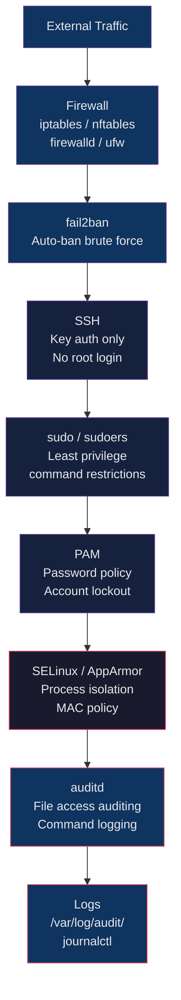

# 🔒 Linux Security Hardening

> [!abstract] TL;DR
> Linux security hardening reduces the attack surface through layered controls: access (sudo, SSH key auth, PAM lockout), network (firewall rules with iptables/nftables, firewalld, ufw), mandatory access control (SELinux/AppArmor), auditing (auditd), and intrusion prevention (fail2ban). CIS Benchmarks provide a comprehensive baseline: disable unused services, remove unnecessary packages, enforce password policies, and set restrictive umask. Each layer independently limits the blast radius of a compromise.

## Intuition

Hardening a Linux system is like securing a vault. The outer wall is your firewall (only specific doors are unlocked). The guard desk checks credentials (SSH key auth, no passwords). Inside, each employee has a keycard scoped to their role (sudo restrictions). Security cameras record everything (auditd). A system like fail2ban is the automated alarm that locks out repeat card-swipers. SELinux/AppArmor is the building's internal policy that says "even if you get past the guard, you can only access the rooms your job requires — nothing else."

## How It Works



## Key Concepts / Details

### sudo and sudoers

```bash
# NEVER edit /etc/sudoers directly — use visudo (validates syntax before saving)
visudo
visudo -f /etc/sudoers.d/myapp         # edit a drop-in file (preferred)

# /etc/sudoers syntax:
# user/group   host=(run_as_user:run_as_group)  NOPASSWD: commands

# Allow user alice to run all commands
alice ALL=(ALL:ALL) ALL

# Allow group ops to run all commands
%ops ALL=(ALL:ALL) ALL

# Allow alice to restart nginx without password
alice ALL=(ALL) NOPASSWD: /usr/bin/systemctl restart nginx

# Restrict alice to specific commands only
alice ALL=(ALL) /usr/bin/systemctl restart nginx, /usr/bin/systemctl status nginx

# Allow ops group to deploy scripts
%ops ALL=(deploy) NOPASSWD: /opt/deploy/*.sh

# Alias definitions
Cmnd_Alias SERVICES = /usr/bin/systemctl start *, /usr/bin/systemctl stop *, /usr/bin/systemctl restart *
%sysadmins ALL=(ALL) NOPASSWD: SERVICES

# Logging sudo usage
Defaults logfile=/var/log/sudo.log
Defaults log_input, log_output          # full session I/O logging

# Test sudoers syntax
visudo -c                               # check syntax without editing
sudo -l -U alice                        # list alice's sudo permissions
```

### SSH Hardening

```bash
# /etc/ssh/sshd_config — key hardening settings

# Disable root login
PermitRootLogin no                      # never allow root SSH

# Disable password authentication (key-only)
PasswordAuthentication no
PubkeyAuthentication yes
AuthorizedKeysFile .ssh/authorized_keys

# Restrict users (whitelist)
AllowUsers alice bob deploy
AllowGroups sshusers ops

# Change default port (security through obscurity — minor benefit)
Port 2222

# Limit authentication attempts
MaxAuthTries 3
MaxSessions 5

# Session timeouts
ClientAliveInterval 300                 # send keepalive every 5 min
ClientAliveCountMax 2                   # disconnect after 2 missed keepalives
LoginGraceTime 30                       # 30 seconds to authenticate

# Disable unused authentication methods
ChallengeResponseAuthentication no
KerberosAuthentication no
GSSAPIAuthentication no
UsePAM yes

# Disable X11 and TCP forwarding (unless needed)
X11Forwarding no
AllowTcpForwarding no
AllowAgentForwarding no

# Banner
Banner /etc/ssh/banner.txt

# Apply changes
systemctl reload sshd

# Test config before reloading
sshd -t                                 # syntax check
# ALWAYS keep a second terminal session open when modifying sshd_config!

# Key management
# Generate strong key pair
ssh-keygen -t ed25519 -C "alice@server" -f ~/.ssh/id_ed25519
# Or RSA 4096
ssh-keygen -t rsa -b 4096 -C "alice@server"

# Copy public key to server
ssh-copy-id -i ~/.ssh/id_ed25519.pub alice@server
```

### SELinux

```bash
# Check SELinux status
getenforce                              # Enforcing | Permissive | Disabled
sestatus                                # detailed status including policy

# Change mode (temporary)
setenforce 1                            # enforce
setenforce 0                            # permissive (logs but doesn't block)

# Persistent config: /etc/selinux/config
# SELINUX=enforcing
# SELINUXTYPE=targeted

# SELinux contexts
ls -Z /etc/nginx/nginx.conf             # show file context
ps axZ | grep nginx                     # show process context
id -Z                                   # show current user context

# Context format: user:role:type:level
# Example: system_u:object_r:httpd_config_t:s0

# Restore default context
restorecon -v /etc/nginx/nginx.conf
restorecon -Rv /var/www/html           # recursive

# Set context
chcon -t httpd_sys_content_t /var/www/html/index.html
semanage fcontext -a -t httpd_sys_content_t "/custom/web(/.*)?"
restorecon -Rv /custom/web

# SELinux booleans
getsebool -a | grep httpd
setsebool -P httpd_can_network_connect on    # allow httpd outbound connections
setsebool -P httpd_execmem on               # allow httpd to execute memory

# Audit and fix denied operations
ausearch -m AVC -ts recent                  # show recent AVC denials
audit2allow -a                              # suggest policy additions
audit2allow -a -M mymodule                  # generate module from all denials
semodule -i mymodule.pp                     # install generated module

# Check if an action would be denied
sesearch --allow --source httpd_t --target etc_t --class file
```

### AppArmor

```bash
# Check AppArmor status
aa-status
systemctl status apparmor

# AppArmor modes per profile
# enforce — violations blocked and logged
# complain — violations logged but not blocked
# disabled — profile inactive

# Set profile modes
aa-enforce /etc/apparmor.d/usr.sbin.nginx
aa-complain /etc/apparmor.d/usr.sbin.nginx
aa-disable /etc/apparmor.d/usr.sbin.nginx

# List profiles and their modes
aa-status --json

# Reload profiles
apparmor_parser -r /etc/apparmor.d/usr.sbin.nginx
systemctl reload apparmor

# View denials
grep apparmor /var/log/syslog | grep DENIED
journalctl | grep apparmor | grep DENIED

# Generate a new profile (learning mode)
aa-genprof /opt/myapp/myapp
# (run the application, then Ctrl+C to scan)
aa-logprof                              # process logs to refine profile

# Example profile snippet (in /etc/apparmor.d/)
# /usr/sbin/nginx {
#   /var/www/html/** r,
#   /etc/nginx/** r,
#   /var/log/nginx/*.log w,
#   /run/nginx.pid rw,
# }
```

### firewalld

```bash
# firewalld: zone-based firewall management
# Default zones: public, trusted, home, internal, dmz, work, drop, block

# Check status and default zone
systemctl status firewalld
firewall-cmd --get-default-zone
firewall-cmd --get-active-zones

# Allow a service (by name)
firewall-cmd --add-service=http
firewall-cmd --add-service=https --permanent  # --permanent = persist
firewall-cmd --add-service=ssh --permanent

# Allow a port
firewall-cmd --add-port=8080/tcp --permanent
firewall-cmd --add-port=9000-9100/tcp --permanent

# Remove rules
firewall-cmd --remove-service=http --permanent
firewall-cmd --remove-port=8080/tcp --permanent

# Reload (apply permanent changes)
firewall-cmd --reload

# List rules for current zone
firewall-cmd --list-all
firewall-cmd --list-all --zone=public

# Zone management
firewall-cmd --zone=dmz --add-interface=eth1
firewall-cmd --zone=trusted --add-source=10.0.0.0/8 --permanent

# Rich rules (more expressive)
firewall-cmd --add-rich-rule='rule family="ipv4" source address="10.0.1.0/24" service name="ssh" accept' --permanent
firewall-cmd --add-rich-rule='rule family="ipv4" source address="1.2.3.4" reject' --permanent
```

### ufw — Ubuntu Firewall

```bash
# ufw: Uncomplicated Firewall (Ubuntu/Debian)

# Enable/disable
ufw enable
ufw disable
ufw status verbose

# Allow/deny rules
ufw allow ssh                           # port 22 TCP
ufw allow 80/tcp
ufw allow 443/tcp
ufw allow from 10.0.0.0/8 to any port 5432   # restrict PostgreSQL to internal

ufw deny 23/tcp                         # deny telnet
ufw deny from 1.2.3.4                  # block specific IP

# Show with numbers (for deletion)
ufw status numbered
ufw delete 3                            # delete rule 3

# Default policies
ufw default deny incoming
ufw default allow outgoing

# Application profiles (/etc/ufw/applications.d/)
ufw app list
ufw allow "Nginx Full"                  # allows both HTTP and HTTPS

# Logging
ufw logging on
ufw logging medium                      # levels: off low medium high full
```

### auditd — Audit Daemon

```bash
# auditd: kernel-level event auditing
systemctl start auditd
systemctl enable auditd

# Audit rules (/etc/audit/rules.d/audit.rules or via auditctl)
# -w: watch path  -p: permissions (r=read, w=write, x=exec, a=attr)
# -k: key tag for searching

# Monitor file access
auditctl -w /etc/passwd -p wa -k user_changes
auditctl -w /etc/sudoers -p wa -k sudoers_changes
auditctl -w /etc/ssh/sshd_config -p wa -k ssh_config

# Monitor command execution (audit all execve syscalls)
auditctl -a always,exit -F arch=b64 -S execve -k command_exec

# Monitor privileged commands
find / -xdev \( -perm -4000 -o -perm -2000 \) -type f | \
  awk '{ print "-a always,exit -F path=" $1 " -F perm=x -F auid>=1000 -k privileged" }' \
  >> /etc/audit/rules.d/privileged.rules

# Persistent rules in /etc/audit/rules.d/
cat > /etc/audit/rules.d/hardening.rules << 'EOF'
-w /etc/passwd -p wa -k user_changes
-w /etc/group -p wa -k group_changes
-w /etc/sudoers -p wa -k sudoers_changes
-w /var/log/auth.log -p wa -k auth_log
-a always,exit -F arch=b64 -S chmod -S fchmod -S fchmodat -k perm_mod
-a always,exit -F arch=b64 -S chown -S fchown -S fchownat -k ownership_change
EOF
service auditd reload

# Search audit logs
ausearch -k user_changes
ausearch -k user_changes --start recent
ausearch -m LOGIN --start today
ausearch -ua alice --start today        # all events for user alice

# Reports
aureport                                # overall summary
aureport --login --start today          # login report
aureport --auth --start today           # authentication report
aureport --failed                       # failed events summary
```

### fail2ban — Intrusion Prevention

```bash
# fail2ban scans logs and bans IPs with too many failures
systemctl start fail2ban
systemctl enable fail2ban

# Status
fail2ban-client status                  # show active jails
fail2ban-client status sshd             # show SSH jail details
# includes: currently failed, total failed, banned IPs

# Configuration hierarchy:
# /etc/fail2ban/jail.conf        — defaults (don't edit)
# /etc/fail2ban/jail.local       — your overrides

cat > /etc/fail2ban/jail.local << 'EOF'
[DEFAULT]
bantime  = 1h           # ban for 1 hour
findtime = 10m          # count failures within 10 minutes
maxretry = 5            # 5 failures triggers ban
ignoreip = 127.0.0.1/8 ::1 10.0.0.0/8   # never ban these IPs

[sshd]
enabled = true
port    = ssh
logpath = %(sshd_log)s
backend = %(sshd_backend)s
maxretry = 3

[nginx-http-auth]
enabled = true
port    = http,https
logpath = %(nginx_error_log)s

[nginx-limit-req]
enabled = true
port    = http,https
logpath = %(nginx_error_log)s
maxretry = 10
EOF

systemctl restart fail2ban

# Manual ban/unban
fail2ban-client set sshd banip 1.2.3.4
fail2ban-client set sshd unbanip 1.2.3.4

# Test filter against log
fail2ban-regex /var/log/auth.log /etc/fail2ban/filter.d/sshd.conf
```

### CIS Benchmark Hardening Basics

```bash
# 1. Disable unused services
systemctl list-unit-files --type=service --state=enabled
systemctl disable avahi-daemon          # mDNS — rarely needed on servers
systemctl disable cups                  # printing
systemctl disable bluetooth
systemctl disable rpcbind               # NFS portmapper (if no NFS)
systemctl disable nfs-server
systemctl disable telnet.socket        # NEVER use telnet

# 2. Remove unnecessary packages
apt purge telnet rsh-client rsh-redone-client nis
dnf remove telnet rsh ypbind rpcbind

# 3. Set restrictive umask
# Default umask: 022 → new files are 644, dirs are 755
# Hardened umask: 027 → new files are 640, dirs are 750
echo "umask 027" >> /etc/profile.d/hardening.sh
echo "umask 027" >> /etc/bashrc

# 4. Password policies (/etc/login.defs)
grep -E "PASS_MAX_DAYS|PASS_MIN_DAYS|PASS_WARN_AGE" /etc/login.defs
# PASS_MAX_DAYS   90        ← change password every 90 days
# PASS_MIN_DAYS   7         ← must wait 7 days between changes
# PASS_WARN_AGE   14        ← warn 14 days before expiry

# 5. PAM password complexity (/etc/pam.d/common-password or /etc/pam.d/system-auth)
# Using pam_pwquality (replaces pam_cracklib)
# Edit /etc/security/pwquality.conf
cat >> /etc/security/pwquality.conf << 'EOF'
minlen = 14
dcredit = -1      # require at least 1 digit
ucredit = -1      # require at least 1 uppercase
lcredit = -1      # require at least 1 lowercase
ocredit = -1      # require at least 1 special char
maxrepeat = 3     # no more than 3 consecutive identical chars
EOF

# 6. PAM account lockout (pam_tally2 on older, faillock on modern)
# /etc/pam.d/system-auth (RHEL) or /etc/pam.d/common-auth (Debian)
# Add before pam_unix.so:
# auth required pam_faillock.so preauth silent deny=5 unlock_time=900
# auth [default=die] pam_faillock.so authfail deny=5 unlock_time=900

# Check locked accounts
faillock --user alice
faillock --reset --user alice           # manually unlock

# 7. Restrict su to wheel group only
# In /etc/pam.d/su:
# auth required pam_wheel.so use_uid
usermod -aG wheel alice
```

## Real-World Notes

- Never test SSH changes without a second terminal session already connected. If `sshd -t` shows a syntax error after editing `sshd_config` and you've already disconnected, you may lock yourself out permanently.
- SELinux in `permissive` mode on staging is invaluable: it logs what `enforcing` would block, letting you build correct policies before going to production. Jumping from `disabled` to `enforcing` in production routinely breaks applications.
- `fail2ban` with an `ignoreip` list for internal networks prevents DevOps engineers from accidentally banning their own CI/CD pipeline runners during automated deployments with frequent authentication.
- The single highest-ROI hardening step for most organizations is disabling password-based SSH authentication and enforcing key-based auth. This eliminates the entire class of brute-force SSH attacks.

## Common Pitfalls

1. **Forgetting `--permanent` in `firewall-cmd`** — rules applied without `--permanent` are active but lost on `firewall-cmd --reload` or system reboot. Always pair with `--reload` after adding permanent rules.
2. **SELinux `disabled` in development, `enforcing` in production** — applications written without SELinux labels will generate AVC denials in production. Run with `permissive` in all environments and fix denials before enabling `enforcing`.
3. **Overly broad `NOPASSWD:` in sudoers** — `alice ALL=(ALL) NOPASSWD: ALL` is functionally equivalent to root access with extra steps. Scope `NOPASSWD:` to the exact commands required.
4. **auditd rule ordering** — auditd processes rules top-to-bottom and stops at the first match. `-a never,exit` (exclusion) rules must precede `-a always,exit` (inclusion) rules or they have no effect.
5. **PAM configuration syntax errors** — a mistake in `/etc/pam.d/sshd` or `common-auth` can lock all users out of the system. Always test PAM changes in a separate terminal with `su - testuser` before closing the current session.

## Related Concepts

- [[Linux_Fundamentals]]
- [[Linux_Networking_Commands]]
- [[Shell_Scripting]]
- [[Process_Management]]
- [[_MOC_Linux_and_OS|Linux and OS MOC]]

## Review Questions

1. Walk through the principle of least privilege as applied to a `sudoers` entry for a deployment user. What specific commands would you allow, and why?
2. Explain the difference between SELinux `enforcing`, `permissive`, and `disabled`. Why is it wrong to set `disabled` in staging and `enforcing` in production?
3. You've added a firewall rule with `firewall-cmd --add-port=8080/tcp`. After rebooting the server the rule is gone. What happened and how do you fix it?
4. A developer reports they are being temporarily locked out of the server during automated deployments. What fail2ban configuration changes would you make, and why?

## Sources

- [CIS Benchmarks for Linux](https://www.cisecurity.org/cis-benchmarks/)
- [SELinux User's and Administrator's Guide — Red Hat](https://access.redhat.com/documentation/en-us/red_hat_enterprise_linux/9/html/using_selinux/index)
- [AppArmor Documentation — Ubuntu](https://ubuntu.com/server/docs/security-apparmor)
- [fail2ban Documentation](https://www.fail2ban.org/wiki/index.php/MANUAL_0_8)
- [OpenSSH Security Best Practices](https://infosec.mozilla.org/guidelines/openssh)
- [Linux Audit System — Red Hat](https://access.redhat.com/documentation/en-us/red_hat_enterprise_linux/9/html/security_hardening/auditing-the-system_security-hardening)

#DevOps #Linux #Security #Hardening #SELinux #SSH #Firewall #CIS
