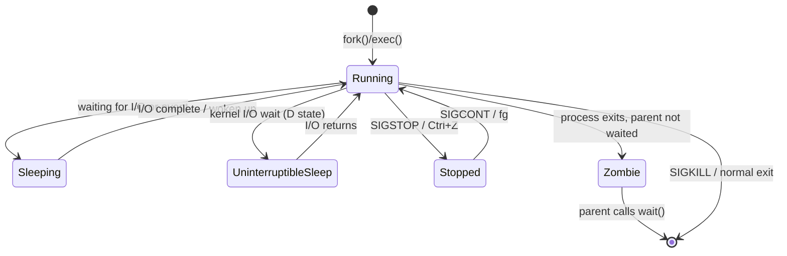

# ⚙️ Process Management

> [!abstract] TL;DR
> Every running program in Linux is a process with a unique PID (Process ID) and a parent PPID. Processes can be monitored with `ps`, `top`, and `htop`, controlled with signals via `kill`/`pkill`, and prioritized via `nice`/`renice`. The systemd init system manages service processes; `journalctl` queries their logs. Background jobs, cron scheduling, and process state transitions (Running, Sleeping, Zombie) are core operational knowledge for any DevOps engineer.

## Intuition

Think of the Linux kernel as an air traffic controller managing thousands of flights (processes) simultaneously. Each flight has a unique call sign (PID), a parent flight that spawned it (PPID), and a priority in the queue (nice value). The controller can temporarily ground a plane (SIGSTOP), ask it to land gracefully (SIGTERM), or force it down immediately (SIGKILL). Zombie processes are like flights that landed but never filed their final paperwork — they linger in the table until their parent acknowledges them.

## How It Works



## Key Concepts / Details

### Process States (STAT codes in `ps`)

| Code | State | Meaning |
|------|-------|---------|
| `R` | Running | Actively executing or in run queue |
| `S` | Sleeping | Waiting for event (interruptible) |
| `D` | Uninterruptible sleep | Waiting for disk/network I/O — cannot be killed |
| `Z` | Zombie | Exited, not yet reaped by parent |
| `T` | Stopped | Paused by SIGSTOP or debugger |
| `I` | Idle kernel thread | Kernel thread waiting for work |

**Modifier flags** (appended): `<` = high priority, `N` = low priority, `s` = session leader, `l` = multi-threaded, `+` = foreground process group

### ps — Process Snapshot

```bash
# BSD style (most common)
ps aux
# USER  PID  %CPU %MEM    VSZ   RSS TTY  STAT START  TIME COMMAND
# root  1234  0.0  0.1  72456  4096 ?    Ss   Jul27  0:00 /usr/sbin/sshd

# UNIX style
ps -ef
# UID  PID  PPID C STIME TTY TIME CMD

# Filter by name
ps aux | grep nginx
ps -C nginx                              # by command name

# Show specific columns
ps -eo pid,ppid,pcpu,pmem,comm,args

# Process tree
ps auxf                                  # ASCII tree
pstree -p                                # cleaner tree with PIDs

# Key fields:
# PID   = process ID
# PPID  = parent process ID
# %CPU  = CPU utilization (averaged over lifetime)
# %MEM  = RSS as % of total RAM
# VSZ   = virtual memory size (KB) — includes shared libs
# RSS   = resident set size (KB) — actual RAM used
# STAT  = process state codes (see table above)
```

### top / htop

```bash
# top — interactive real-time viewer
top

# top header interpretation:
# top - 14:32:01 up 5 days, 3:10,  2 users,  load average: 0.52, 0.48, 0.45
#        timestamp   uptime              active users   1min 5min 15min load avg
#
# Load average: number of processes wanting CPU at that moment
# Rule of thumb: load avg / CPU cores > 1.0 means overloaded

# top key shortcuts:
# P — sort by CPU usage
# M — sort by memory usage
# k — kill process (enter PID)
# r — renice process
# 1 — toggle per-CPU stats
# u — filter by user
# q — quit
# H — toggle threads
# f — field manager

# htop — colorized, mouse-enabled (usually needs install)
htop
htop -u alice                            # filter by user
htop -p 1234,5678                        # filter by PIDs

# atop — historical snapshots, disk/network included
atop 5                                   # refresh every 5s
```

### kill, killall, pkill

**Common signals:**

| Signal | Number | Meaning |
|--------|--------|---------|
| `SIGHUP` | 1 | Hangup — reload config (many daemons) |
| `SIGINT` | 2 | Interrupt (Ctrl+C) |
| `SIGQUIT` | 3 | Quit (Ctrl+\\) — core dump |
| `SIGTERM` | 15 | Graceful termination (default) |
| `SIGKILL` | 9 | Forceful kill — cannot be caught or ignored |
| `SIGSTOP` | 19 | Pause process — cannot be caught |
| `SIGCONT` | 18 | Resume stopped process |
| `SIGUSR1` | 10 | User-defined signal 1 |

```bash
kill 1234                                # send SIGTERM (15) to PID 1234
kill -9 1234                             # force kill
kill -SIGTERM 1234                       # by name
kill -HUP $(cat /var/run/nginx.pid)      # reload nginx config

killall nginx                            # kill all processes named nginx
killall -9 zombie_app
killall -HUP sshd

pkill -f "python worker.py"              # match by full command line
pkill -u alice                           # kill all alice's processes
pkill -SIGTERM -x nginx                  # exact name match

# Show what would be killed (dry run)
pgrep -a nginx                           # list matching PIDs and commands
```

### nice and renice — Process Priority

```bash
# nice values: -20 (highest priority) to +19 (lowest priority)
# Default is 0. Regular users can only INCREASE nice (lower priority).
# Root can set any value.

# Start process with lower priority
nice -n 10 tar -czf backup.tar.gz /data
nice -n 19 find / -name "*.log"          # background indexing — very low priority

# Change priority of running process
renice -n 5 -p 1234                      # set PID 1234 to nice 5
renice -n -5 -p 1234                     # increase priority (root only)
renice -n 10 -u alice                    # renice all alice's processes
renice -n 5 -g 1234                      # renice all processes in process group

# ionice — I/O scheduling priority
ionice -c 3 -p 1234                      # idle I/O class (runs only when disk is free)
ionice -c 2 -n 4 rsync -a /src /dst      # best-effort class, priority 4
```

### systemctl and journalctl

```bash
# systemctl (see Linux_Fundamentals for full service management)
systemctl status nginx
systemctl list-units --state=failed      # find failed services

# journalctl — query systemd journal logs
journalctl -u nginx                      # logs for nginx unit
journalctl -u nginx -f                   # follow (like tail -f)
journalctl -u nginx --since "1 hour ago"
journalctl -u nginx --since "2026-07-28 10:00" --until "2026-07-28 11:00"
journalctl -u nginx -n 50                # last 50 lines
journalctl -u nginx -p err               # only error-level and above
journalctl --boot                        # logs from current boot
journalctl --boot -1                     # logs from previous boot
journalctl -k                            # kernel messages (dmesg equivalent)
journalctl --disk-usage                  # journal size
journalctl --vacuum-size=500M            # trim journal to 500MB
journalctl -o json-pretty -u nginx -n 5  # JSON output
```

### Cron Jobs

```bash
# crontab syntax: minute hour day-of-month month day-of-week command
# Field ranges:
# minute:      0-59
# hour:        0-23
# day-of-month: 1-31
# month:       1-12 (or Jan-Dec)
# day-of-week: 0-7 (0 and 7 = Sunday, or Sun-Sat)
# Special: * (any), */5 (every 5), 1-5 (range), 1,3,5 (list)

# Edit current user's crontab
crontab -e

# Common examples
0 2 * * *       /usr/local/bin/backup.sh         # daily at 2:00 AM
*/15 * * * *    /usr/bin/health_check.sh          # every 15 minutes
0 9 * * 1-5     /opt/reports/generate.sh          # weekdays at 9 AM
0 0 1 * *       /usr/local/bin/monthly_audit.sh   # 1st of every month
@reboot         /opt/myapp/start.sh               # at system boot
@daily          /usr/bin/certbot renew            # once per day

# List crontabs
crontab -l                               # current user
crontab -l -u alice                      # specific user (root only)
crontab -r                               # DANGER: remove all crontabs

# System cron directories
# /etc/cron.d/        — drop-in crontab files (include username field)
# /etc/cron.daily/    — scripts run daily
# /etc/cron.hourly/   — scripts run hourly
# /etc/cron.weekly/   — scripts run weekly
# /etc/cron.monthly/  — scripts run monthly
# /etc/crontab        — system crontab (has username field)

# Redirect cron output to avoid mail
0 2 * * * /usr/local/bin/backup.sh >> /var/log/backup.log 2>&1
```

### Background / Foreground Jobs

```bash
# Run command in background
./long_script.sh &
nohup ./long_script.sh > /var/log/script.log 2>&1 &

# jobs — list current shell's background jobs
jobs
jobs -l                                  # include PIDs
# [1]  Running    ./long_script.sh &
# [2]- Running    python worker.py &
# [3]+ Stopped    vim file.txt

# Foreground/background control
fg %1                                    # bring job 1 to foreground
fg %2                                    # bring job 2 to foreground
bg %1                                    # resume stopped job 1 in background
Ctrl+Z                                   # suspend foreground job (SIGSTOP)

# nohup — immune to SIGHUP (terminal close)
nohup python worker.py &
nohup ./deploy.sh > deploy.log 2>&1 &

# disown — detach from shell (survives logout even without nohup)
./long_task.sh &
disown %1                                # detach job 1
disown -h %1                             # mark immune to SIGHUP only

# screen/tmux (preferred for interactive long-running sessions)
tmux new -s deploy
tmux attach -t deploy
```

## Real-World Notes

- D-state (Uninterruptible Sleep) processes are a red flag. They usually indicate a stuck NFS mount or storage I/O problem. `SIGKILL` cannot kill them — you must fix the underlying I/O issue or reboot.
- Zombie processes are not harmful by themselves (they consume only a PID slot and a small table entry), but a large number indicates a bug in the parent process that is not calling `wait()`. Kill the parent to clean up zombies.
- Use `nice -n 19` for maintenance jobs (backups, log rotation) to ensure they don't compete with production workloads under heavy load.
- `journalctl -f` is the modern replacement for `tail -f /var/log/syslog` — it includes structured metadata and works across all systemd-managed services.

## Common Pitfalls

1. **Using `kill -9` as the first resort** — always try `SIGTERM` first and give the process 5-10 seconds to clean up. SIGKILL bypasses all cleanup handlers, potentially leaving corrupt data, unreleased locks, or orphaned temp files.
2. **Cron jobs silently failing** — by default, cron mails output to the local user. Redirect stdout/stderr explicitly (`>> /var/log/job.log 2>&1`) and check `/var/log/cron` or `journalctl -u cron` for execution errors.
3. **Forgetting PATH in cron** — cron runs with a minimal `PATH`. Always use absolute paths in cron scripts (`/usr/bin/python3`, not `python3`), or explicitly set `PATH=` at the top of the crontab.
4. **`nohup` vs `disown` confusion** — `nohup` prevents SIGHUP on start; `disown` removes an already-running job from the shell's job table. Use `nohup ... &` before starting, `disown` if you forgot.
5. **High load average on low CPU** — load average counts processes waiting for CPU and processes blocked on disk I/O. High iowait in `top` with modest CPU usage means a storage bottleneck, not a CPU bottleneck.

## Related Concepts

- [[Linux_Fundamentals]]
- [[Shell_Scripting]]
- [[Linux_Performance_Tuning]]
- [[Linux_Security_Hardening]]
- [[_MOC_Linux_and_OS|Linux and OS MOC]]

## Review Questions

1. A process shows state `D` in `ps aux` and cannot be killed even with `kill -9`. What does this mean and how do you resolve it?
2. Explain the difference between a zombie process and an orphan process. Which is more problematic and why?
3. You need to run a Python data processing job on a production server without impacting application performance. What commands would you use?
4. A cron job that runs `python3 /opt/scripts/report.py` works fine when run manually but fails silently in cron. Name three likely causes and how to diagnose them.

## Sources

- [Linux man pages: ps(1), kill(1), nice(1), cron(8)](https://man7.org/linux/man-pages/)
- [systemd journal documentation](https://www.freedesktop.org/software/systemd/man/journalctl.html)
- [The Linux Programming Interface, Michael Kerrisk](https://man7.org/tlpi/)
- [Red Hat: Managing Processes](https://access.redhat.com/documentation/en-us/red_hat_enterprise_linux/9/html/managing_monitoring_and_updating_the_kernel/index)

#DevOps #Linux #ProcessManagement #Cron #SystemD #Signals
