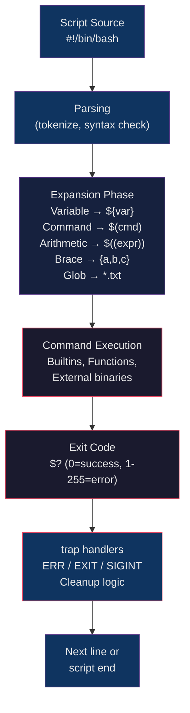

# 🐚 Shell Scripting

> [!abstract] TL;DR
> Bash is the default scripting language for Linux automation — it glues together system commands, handles conditionals and loops, and runs in every environment without installing dependencies. Robust scripts use `set -euo pipefail` for strict error handling, `trap` for cleanup, and local variables to avoid namespace pollution. Mastering parameter expansion, heredocs, and argument parsing turns ad-hoc one-liners into reusable, production-grade automation tools.

## Intuition

A shell script is like a recipe card for the operating system. Each line is a step: "check if the ingredient exists, prepare it this way, if something goes wrong call this cleanup routine." The shell expands variables and substitutions before executing, like a chef reading the recipe and substituting `$(market price)` with the actual today's price before starting. Good recipes (scripts) are idempotent — running them twice produces the same result — and fail fast when an ingredient is missing rather than silently producing bad food.

## How It Works



## Key Concepts / Details

### Variables and Scope

```bash
#!/bin/bash

# Basic assignment (NO spaces around =)
name="Alice"
count=42
pi=3.14

# Accessing variables
echo $name
echo ${name}            # preferred: explicit boundary
echo "Hello, ${name}!"

# Readonly (constant)
readonly MAX_RETRIES=5
declare -r CONFIG_FILE="/etc/app/config.yaml"

# Export to child processes
export DATABASE_URL="postgres://localhost/mydb"

# Local scope in functions (critical to avoid polluting globals)
my_function() {
    local tmp_dir="/tmp/work_$$"
    local result
    result=$(some_command)
    echo "$result"
}

# Unset a variable
unset name

# Default values and parameter expansion
echo "${NAME:-default_value}"          # use default if NAME unset/empty
echo "${NAME:=default_value}"          # assign default if NAME unset/empty
echo "${NAME:+alternate}"              # use alternate if NAME IS set
echo "${NAME:?'NAME is required'}"     # error if NAME unset/empty

# String operations
str="Hello, World"
echo "${#str}"                         # length: 13
echo "${str:7}"                        # substring from index 7: "World"
echo "${str:7:5}"                      # substring 5 chars from index 7: "World"
echo "${str,,}"                        # lowercase: "hello, world"
echo "${str^^}"                        # uppercase: "HELLO, WORLD"
echo "${str/World/Linux}"              # replace first: "Hello, Linux"
echo "${str//l/L}"                     # replace all: "HeLLo, WorLd"
echo "${str#Hello, }"                  # strip prefix: "World"
echo "${str%ld}"                       # strip suffix: "Wor"
```

### Conditionals

```bash
# if/elif/else
if [[ -f /etc/nginx/nginx.conf ]]; then
    echo "nginx config found"
elif [[ -d /etc/nginx ]]; then
    echo "nginx dir exists but no config"
else
    echo "nginx not installed"
fi

# [[ ]] vs [ ]
# [[ ]] is bash-specific, supports =~, &&, ||, no word splitting
# [ ]  is POSIX, portable but more error-prone

# File tests
[[ -f file ]]     # file exists and is regular file
[[ -d dir ]]      # directory exists
[[ -e path ]]     # path exists (any type)
[[ -r file ]]     # readable
[[ -w file ]]     # writable
[[ -x file ]]     # executable
[[ -s file ]]     # exists and non-empty
[[ -L link ]]     # is a symbolic link

# String tests
[[ -z "$var" ]]   # zero length (empty)
[[ -n "$var" ]]   # non-zero length (non-empty)
[[ "$a" == "$b" ]]
[[ "$a" != "$b" ]]
[[ "$str" =~ ^[0-9]+$ ]]   # regex match (bash 3.1+)

# Integer comparisons
[[ $a -eq $b ]]   # equal
[[ $a -ne $b ]]   # not equal
[[ $a -lt $b ]]   # less than
[[ $a -le $b ]]   # less than or equal
[[ $a -gt $b ]]   # greater than
[[ $a -ge $b ]]   # greater than or equal

# Compound conditions
[[ -f config.yaml && -r config.yaml ]]
[[ "$ENV" == "prod" || "$ENV" == "staging" ]]

# One-liner idioms
[[ -d /opt/app ]] || mkdir -p /opt/app     # create if missing
command -v docker &>/dev/null || { echo "docker not found"; exit 1; }
```

### Loops

```bash
# for..in
for item in apple banana cherry; do
    echo "Item: $item"
done

# for..in with array
fruits=("apple" "banana" "cherry")
for fruit in "${fruits[@]}"; do
    echo "$fruit"
done

# for..in with glob
for logfile in /var/log/*.log; do
    echo "Processing $logfile"
    gzip "$logfile"
done

# C-style for
for ((i=0; i<10; i++)); do
    echo "Iteration $i"
done

# while
count=0
while [[ $count -lt 5 ]]; do
    echo "Count: $count"
    ((count++))
done

# while read (process file line-by-line)
while IFS= read -r line; do
    echo "Line: $line"
done < /etc/hosts

# Process command output line by line
while IFS= read -r server; do
    ping -c 1 "$server" &>/dev/null && echo "$server: UP" || echo "$server: DOWN"
done < servers.txt

# until
until ping -c 1 database.internal &>/dev/null; do
    echo "Waiting for database..."
    sleep 2
done

# Loop control
for i in {1..10}; do
    [[ $i -eq 5 ]] && continue     # skip iteration
    [[ $i -eq 8 ]] && break        # exit loop
    echo $i
done
```

### Functions

```bash
# Function definition (two syntaxes, equivalent)
greet() {
    local name="$1"
    local greeting="${2:-Hello}"
    echo "$greeting, $name!"
}

function deploy_app {
    local app_name="$1"
    local version="$2"
    # ...
}

# Calling functions
greet "Alice"
greet "Bob" "Hi"

# Return values
# Functions return exit codes (0-255), not arbitrary values
get_hostname() {
    local host
    host=$(hostname -f) || return 1
    echo "$host"          # output on stdout
    return 0              # success
}

# Capture output
my_host=$(get_hostname) || { echo "Failed to get hostname"; exit 1; }

# Passing arrays
process_servers() {
    local -n servers=$1    # nameref (bash 4.3+)
    for s in "${servers[@]}"; do
        echo "Processing $s"
    done
}
server_list=("web1" "web2" "db1")
process_servers server_list
```

### Error Handling

```bash
#!/bin/bash
# Strict mode — every script should start with this
set -e          # exit on any error (non-zero exit code)
set -u          # treat unset variables as errors
set -o pipefail # pipe fails if ANY command in pipeline fails

# Combined shorthand
set -euo pipefail

# Why pipefail matters:
# Without it:  cat nonexistent.txt | grep foo  → exit 0 (grep succeeds)
# With it:     cat nonexistent.txt | grep foo  → exit 1 (cat failed)

# trap — run cleanup on exit, error, or signal
TMPDIR=$(mktemp -d)
cleanup() {
    echo "Cleaning up $TMPDIR"
    rm -rf "$TMPDIR"
}
trap cleanup EXIT           # runs on any exit
trap cleanup ERR            # runs on error
trap 'echo "Interrupted"; cleanup; exit 1' SIGINT SIGTERM

# Temporarily disable strict mode for expected failures
set +e
dpkg -s package_name &>/dev/null
pkg_installed=$?
set -e

# Explicit error check
if ! docker pull "$IMAGE" 2>/dev/null; then
    echo "ERROR: Failed to pull image $IMAGE" >&2
    exit 1
fi
```

### Shell Expansions

```bash
# Parameter expansion
echo "${var:-default}"           # default if unset/empty
echo "${var:=default}"           # assign and use default if unset/empty
echo "${var:+override}"          # use override ONLY IF var is set
echo "${var:?Error message}"     # abort with error if unset/empty
echo "${#var}"                   # string length
echo "${var:2:5}"                # substring
echo "${var/foo/bar}"            # replace first occurrence
echo "${var//foo/bar}"           # replace all occurrences
echo "${var#prefix}"             # strip shortest prefix match
echo "${var##prefix*}"           # strip longest prefix match
echo "${var%suffix}"             # strip shortest suffix match
echo "${var%%*suffix}"           # strip longest suffix match

# Command substitution
today=$(date +%Y-%m-%d)
file_count=$(find /var/log -name "*.log" | wc -l)

# Arithmetic expansion
result=$((2 + 3 * 4))            # = 14
echo $(( $(date +%s) + 3600 ))   # unix timestamp + 1 hour

# Brace expansion
echo {a,b,c}                     # a b c
mkdir -p /opt/app/{bin,lib,conf,logs}
cp file.conf{,.bak}              # backup: file.conf → file.conf.bak
echo file_{01..05}.txt           # file_01.txt file_02.txt ... file_05.txt
```

### Heredocs

```bash
# Basic heredoc
cat <<EOF
This is a multi-line
string with $variable expansion
EOF

# Single-quoted: no expansion (literal)
cat <<'EOF'
This has $no expansion
even \backslashes are literal
EOF

# Indented heredoc (<<-): strips leading tabs (NOT spaces)
if true; then
    cat <<-EOF
        This line has leading tabs stripped
        But indentation is preserved
    EOF
fi

# Heredoc into a file
cat > /etc/nginx/conf.d/myapp.conf <<'EOF'
server {
    listen 80;
    server_name myapp.example.com;
    root /var/www/myapp;
}
EOF

# Heredoc as command input
mysql -u root -p"$DB_PASS" <<EOF
USE mydb;
CREATE TABLE IF NOT EXISTS users (id INT AUTO_INCREMENT PRIMARY KEY, name VARCHAR(255));
EOF
```

### DevOps Automation Patterns

```bash
# Argument parsing
usage() {
    echo "Usage: $0 [-e env] [-v] [-h] <app_name>"
    echo "  -e    environment (dev|staging|prod)"
    echo "  -v    verbose mode"
    echo "  -h    help"
}

ENV="dev"
VERBOSE=false
while getopts "e:vh" opt; do
    case $opt in
        e) ENV="$OPTARG" ;;
        v) VERBOSE=true ;;
        h) usage; exit 0 ;;
        *) usage; exit 1 ;;
    esac
done
shift $((OPTIND - 1))
APP_NAME="${1:?'App name required. See usage.'}"

# Logging functions
log()   { echo "[$(date '+%Y-%m-%d %H:%M:%S')] INFO  $*"; }
warn()  { echo "[$(date '+%Y-%m-%d %H:%M:%S')] WARN  $*" >&2; }
error() { echo "[$(date '+%Y-%m-%d %H:%M:%S')] ERROR $*" >&2; }

# Retry loop
retry() {
    local max=$1; shift
    local delay=${1:-5}; shift
    local n=0
    until "$@"; do
        ((n++))
        if [[ $n -ge $max ]]; then
            error "Command failed after $max attempts: $*"
            return 1
        fi
        warn "Attempt $n failed. Retrying in ${delay}s..."
        sleep "$delay"
    done
}
retry 3 5 curl -sf https://api.internal/health

# Wait-for-condition
wait_for_port() {
    local host="$1" port="$2" timeout="${3:-30}"
    local start
    start=$(date +%s)
    until nc -z "$host" "$port" 2>/dev/null; do
        [[ $(( $(date +%s) - start )) -ge $timeout ]] && {
            error "Timed out waiting for $host:$port"
            return 1
        }
        sleep 1
    done
    log "$host:$port is reachable"
}
```

### Complete Deployment Helper Script

```bash
#!/bin/bash
# deploy.sh — Application deployment helper
set -euo pipefail

readonly SCRIPT_DIR="$(cd "$(dirname "${BASH_SOURCE[0]}")" && pwd)"
readonly DEPLOY_USER="deploy"
readonly APP_DIR="/opt/myapp"
readonly LOG_FILE="/var/log/myapp/deploy.log"

# Logging
log()   { echo "[$(date '+%Y-%m-%d %H:%M:%S')] INFO  $*" | tee -a "$LOG_FILE"; }
warn()  { echo "[$(date '+%Y-%m-%d %H:%M:%S')] WARN  $*" | tee -a "$LOG_FILE" >&2; }
error() { echo "[$(date '+%Y-%m-%d %H:%M:%S')] ERROR $*" | tee -a "$LOG_FILE" >&2; }

# Cleanup trap
BACKUP_DIR=""
cleanup() {
    if [[ -n "$BACKUP_DIR" && -d "$BACKUP_DIR" ]]; then
        log "Cleaning up temp backup: $BACKUP_DIR"
        rm -rf "$BACKUP_DIR"
    fi
}
trap cleanup EXIT

# Usage
usage() {
    echo "Usage: $0 -v VERSION [-e ENV] [-r]"
    echo "  -v VERSION  Version to deploy (required)"
    echo "  -e ENV      Environment: dev|staging|prod (default: dev)"
    echo "  -r          Rollback to previous version"
    exit 1
}

# Parse arguments
VERSION=""
ENV="dev"
ROLLBACK=false
while getopts "v:e:rh" opt; do
    case $opt in
        v) VERSION="$OPTARG" ;;
        e) ENV="$OPTARG" ;;
        r) ROLLBACK=true ;;
        h) usage ;;
        *) usage ;;
    esac
done

[[ -z "$VERSION" ]] && { error "Version is required."; usage; }
[[ "$ENV" =~ ^(dev|staging|prod)$ ]] || { error "Invalid environment: $ENV"; exit 1; }

ARTIFACT="myapp-${VERSION}.tar.gz"
ARTIFACT_URL="https://artifacts.internal/releases/${ARTIFACT}"

log "Starting deployment: version=$VERSION env=$ENV"

# Check prerequisites
command -v curl &>/dev/null || { error "curl not found"; exit 1; }
[[ -d "$APP_DIR" ]] || { error "App directory $APP_DIR does not exist"; exit 1; }

# Backup current version
if [[ -d "${APP_DIR}/current" ]]; then
    BACKUP_DIR=$(mktemp -d /var/backups/myapp_XXXXXX)
    log "Backing up current version to $BACKUP_DIR"
    cp -a "${APP_DIR}/current" "${BACKUP_DIR}/"
fi

# Download artifact
log "Downloading $ARTIFACT_URL"
TMP_FILE=$(mktemp /tmp/myapp_XXXXXX.tar.gz)
trap "rm -f $TMP_FILE; cleanup" EXIT
curl -fsSL --retry 3 -o "$TMP_FILE" "$ARTIFACT_URL" || {
    error "Failed to download artifact"
    exit 1
}

# Deploy
log "Extracting to ${APP_DIR}/releases/${VERSION}"
mkdir -p "${APP_DIR}/releases/${VERSION}"
tar -xzf "$TMP_FILE" -C "${APP_DIR}/releases/${VERSION}"

# Symlink switch (atomic)
ln -sfn "${APP_DIR}/releases/${VERSION}" "${APP_DIR}/current"

# Restart service
log "Restarting myapp service"
systemctl restart myapp || {
    error "Service restart failed. Rolling back."
    if [[ -n "$BACKUP_DIR" ]]; then
        ln -sfn "${BACKUP_DIR}/current" "${APP_DIR}/current"
        systemctl restart myapp
    fi
    exit 1
}

# Health check
log "Running health check"
wait_for_port() {
    local host="$1" port="$2" timeout="${3:-30}"
    local start; start=$(date +%s)
    until nc -z "$host" "$port" 2>/dev/null; do
        [[ $(( $(date +%s) - start )) -ge $timeout ]] && return 1
        sleep 1
    done
}
wait_for_port localhost 8080 30 || { error "Health check failed"; exit 1; }

log "Deployment complete: myapp $VERSION is live in $ENV"
```

## Real-World Notes

- `set -euo pipefail` is non-negotiable for production scripts. The `-u` flag alone prevents dozens of subtle bugs where an unset `$DEPLOY_ENV` becomes an empty string that gets passed to `rm -rf $TARGET/`.
- Prefer `[[ ]]` over `[ ]` in bash scripts — it handles empty variables safely (no word splitting), supports `&&`/`||` instead of `-a`/`-o`, and enables regex matching with `=~`.
- Always quote `"$variables"` — unquoted variables undergo word splitting and glob expansion, turning `rm $FILE` into `rm file1 file2` if `$FILE` contains spaces.
- Use `shellcheck` (static analysis) on every script before merging. It catches quoting issues, SC2086/SC2006 patterns, and `set -e` pitfalls automatically.

## Common Pitfalls

1. **No `set -euo pipefail`** — scripts silently continue after errors, compounding failures. One failed `mkdir` leads to deploying into the wrong directory.
2. **Unquoted variables** — `if [ $COUNT -gt 0 ]` fails with "unary operator expected" when `$COUNT` is empty. Always write `"$COUNT"`.
3. **Using `exit` codes for data** — functions can only `return` 0-255. Using `return 42` to mean "found 42 files" is wrong; use `echo` to stdout and capture with `$()`.
4. **`for line in $(cat file)`** — splits on whitespace, not newlines. Use `while IFS= read -r line; do ... done < file` instead.
5. **Heredoc indentation with spaces** — `<<-EOF` only strips leading tabs, not spaces. If your editor converts tabs to spaces, the heredoc will include unwanted whitespace in the output.

## Related Concepts

- [[Linux_Fundamentals]]
- [[Process_Management]]
- [[Linux_Networking_Commands]]
- [[Linux_Performance_Tuning]]
- [[_MOC_Linux_and_OS|Linux and OS MOC]]

## Review Questions

1. Explain what `set -euo pipefail` does and give a concrete example where each flag prevents a specific class of bug.
2. What is the difference between `${var:-default}` and `${var:=default}`? When would you use each?
3. Why is `while IFS= read -r line; do ... done < file` preferred over `for line in $(cat file)`?
4. Write a bash function that accepts a URL and a timeout, retries the curl request up to 5 times with exponential backoff, and returns 0 on success or 1 after all retries fail.

## Sources

- [Bash Reference Manual (GNU)](https://www.gnu.org/software/bash/manual/bash.html)
- [ShellCheck — static analysis for shell scripts](https://www.shellcheck.net/)
- [Google Shell Style Guide](https://google.github.io/styleguide/shellguide.html)
- [Advanced Bash-Scripting Guide](https://tldp.org/LDP/abs/html/)
- [Bash Pitfalls — Greg's Wiki](https://mywiki.wooledge.org/BashPitfalls)

#DevOps #Linux #Bash #ShellScripting #Automation #Scripting
