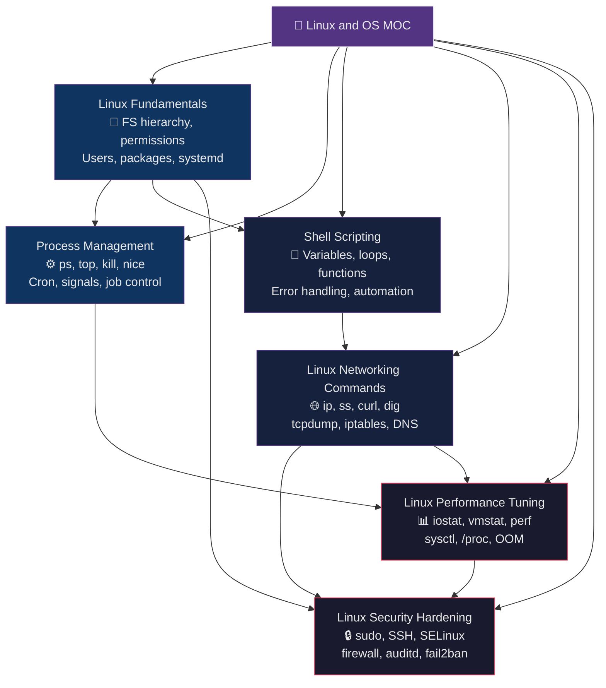

# 🐧 Linux and OS — Section MOC

[[../_MOC_DevOps_Master|↑ DevOps Master MOC]]

> [!abstract] Section Overview
> This section covers Linux fundamentals and operating system administration for DevOps practitioners. It spans the full operational spectrum: from file system layout and user management, through process control and shell automation, to network diagnostics, performance analysis, and security hardening. These notes form the foundation for working effectively in Linux-based production environments — every tool and concept here is applied daily in container orchestration, CI/CD pipelines, and cloud infrastructure.

## Section Architecture

## Notes in This Section

| Note | Key Topics | Difficulty |
|------|-----------|-----------|
| [[Linux_Fundamentals]] | File system hierarchy (FHS), rwx permissions, SUID/SGID/sticky bit, user/group management, apt/dnf, systemd unit files | Beginner |
| [[Process_Management]] | ps aux, top/htop, kill signals (SIGTERM/SIGKILL), nice/renice, cron syntax, background jobs, nohup, D/Z/R states | Beginner |
| [[Shell_Scripting]] | Variables, conditionals, loops, functions, set -euo pipefail, trap, heredocs, getopts, deployment script pattern | Intermediate |
| [[Linux_Networking_Commands]] | ip/ss (vs ifconfig/netstat), tcpdump BPF filters, iptables/nftables, curl timing, dig +trace, nmap basics | Intermediate |
| [[Linux_Performance_Tuning]] | iostat %util/await, vmstat swap metrics, sar history, strace syscall summary, perf flame graphs, sysctl tuning | Advanced |
| [[Linux_Security_Hardening]] | sudo/sudoers NOPASSWD scoping, sshd_config hardening, SELinux contexts/booleans, firewalld zones, auditd rules, fail2ban | Advanced |

## Learning Path

Follow this order for a structured progression from foundations to expert-level operations:

1. **[[Linux_Fundamentals]]** — Start here. Understand the filesystem layout, how permissions work, and how systemd manages services. Everything else builds on this.

2. **[[Process_Management]]** — Learn to inspect, control, and schedule processes. Understand process states, signals, and cron — daily operational tools.

3. **[[Shell_Scripting]]** — Learn to automate the manual tasks from steps 1–2. Write robust scripts with strict error handling. This is the multiplier skill.

4. **[[Linux_Networking_Commands]]** — Understand how traffic flows, diagnose connectivity issues, and inspect network state. Essential for any production debugging.

5. **[[Linux_Performance_Tuning]]** — Learn to measure and tune system performance. Understand I/O bottlenecks, memory pressure, and kernel parameters. Applied after establishing baseline operations.

6. **[[Linux_Security_Hardening]]** — Apply defense-in-depth controls. Requires comfort with all preceding topics since hardening touches filesystem, processes, networking, and scripting simultaneously.

## Related Sections

| Section | Relationship |
|---------|-------------|
| [[../01_Containers_Docker/_MOC_Containers_Docker|Containers and Docker]] | Containers run as Linux processes; cgroups and namespaces extend OS concepts |
| [[../02_Kubernetes/_MOC_Kubernetes|Kubernetes]] | K8s nodes run Linux; node-level debugging uses all tools from this section |
| [[../03_CI_CD/_MOC_CI_CD|CI/CD Pipelines]] | Pipeline agents are Linux processes; shell scripting drives build and deploy steps |
| [[../04_Infrastructure_as_Code/_MOC_IaC|Infrastructure as Code]] | Ansible, Terraform configure Linux systems defined in this section |
| [[../05_Monitoring_Observability/_MOC_Monitoring|Monitoring and Observability]] | Performance tools here feed metrics into monitoring stacks |
| [[../06_Networking/_MOC_Networking|Networking]] | Linux networking commands bridge OS-level and infrastructure-level networking |

#DevOps #Linux #OperatingSystems #MOC #SectionIndex
