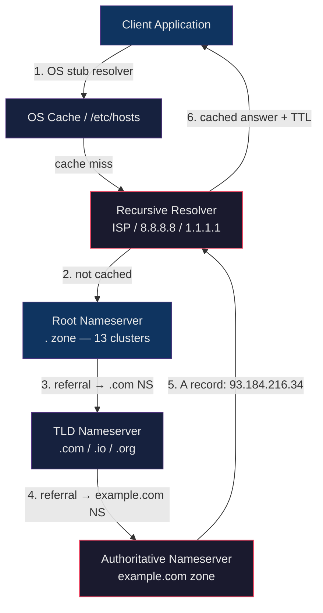

# 🌍 DNS and Resolution

> [!abstract] TL;DR
> DNS (Domain Name System) is the internet's distributed phone book — it translates human-readable domain names into IP addresses through a hierarchical delegation tree. Resolution is a multi-hop process: a recursive resolver queries root servers, then TLD servers, then authoritative nameservers to obtain the final answer. Records are cached at every layer (OS, browser, resolver) with TTL controlling freshness. In Kubernetes, CoreDNS provides cluster-internal DNS over the `cluster.local` domain.

## Intuition

Think of DNS like asking directions in a foreign city. You ask a local guide (recursive resolver), who doesn't know the specific address but knows to ask city hall (root server), which redirects you to the district office (TLD), which finally directs you to the building's concierge (authoritative nameserver) who gives the exact room number (IP address). Each answer is written on a sticky note that expires after TTL seconds.

## How It Works



### Resolution Chain Details

**Recursive query**: Client asks resolver to do all the work and return a final answer.
**Iterative query**: Resolver asks each server in turn, following referrals itself.

The recursive resolver caches every intermediate response. Subsequent queries for the same domain (within TTL) never leave the resolver.

## Key Concepts / Details

### DNS Record Types

| Record | Purpose | Example |
|--------|---------|---------|
| `A` | IPv4 address | `example.com. → 93.184.216.34` |
| `AAAA` | IPv6 address | `example.com. → 2606:2800::1` |
| `CNAME` | Alias to another name | `www → example.com` |
| `MX` | Mail exchange + priority | `10 mail.example.com` |
| `TXT` | Free-form text (SPF/DKIM) | `"v=spf1 include:_spf.google.com ~all"` |
| `SRV` | Service location (k8s, SIP) | `_http._tcp.example.com 10 5 80 web.example.com` |
| `NS` | Nameserver delegation | `example.com. → ns1.registrar.com` |
| `PTR` | Reverse lookup (IP→name) | `34.216.184.93.in-addr.arpa. → example.com` |
| `SOA` | Zone authority metadata | Serial, refresh, retry, expire values |

### dig Command Examples

```bash
# A record lookup
dig example.com A

# AAAA (IPv6)
dig example.com AAAA

# MX record
dig example.com MX

# TXT (SPF/DKIM)
dig example.com TXT

# Reverse lookup (PTR)
dig -x 93.184.216.34

# Query specific nameserver, bypass local cache
dig @8.8.8.8 example.com A

# Trace full resolution chain
dig +trace example.com

# Short output only
dig +short example.com

# Check DNSSEC signatures
dig +dnssec example.com

# SRV record
dig _https._tcp.example.com SRV

# NS delegation
dig example.com NS
```

### TTL: Caching Trade-offs

```
Low TTL (60–300s)   → Fast failover, geo-routing, blue/green switches
                       BUT → higher resolver load, more authoritative queries

High TTL (3600–86400s) → Better caching performance, reduced latency
                          BUT → slow to propagate changes
```

**Negative caching (NXDOMAIN TTL)**: When a domain does not exist, resolvers cache the negative answer. The SOA record's `minimum` field caps the negative TTL. Misconfigurations that cause NXDOMAIN can persist for this duration.

### OS-Level Resolution

```
# /etc/resolv.conf — Linux DNS configuration
nameserver 10.0.0.1         # Primary resolver
nameserver 10.0.0.2         # Fallback resolver
search corp.example.com     # Append to single-label names
domain corp.example.com     # Local domain name
options ndots:5             # Threshold before treating as FQDN

# /etc/nsswitch.conf — resolution order
hosts: files dns mDNS4_minimal  # Check /etc/hosts first, then DNS
```

### Split-Horizon DNS

Different DNS answers returned based on query source (internal vs external):

```
Internal client queries 10.0.0.1 (internal resolver)
  → api.example.com → 10.10.5.20 (private IP, direct access)

External client queries 8.8.8.8 (public resolver)
  → api.example.com → 203.0.113.10 (public IP, via LB)
```

Use cases: internal services not exposed externally, reduced latency for internal traffic, split VPN routing.

### CoreDNS in Kubernetes

Every Kubernetes cluster runs CoreDNS as the in-cluster DNS server. Services are discoverable via predictable names:

```
# Service DNS pattern
<service>.<namespace>.svc.cluster.local

# Pod DNS pattern
<pod-ip-dashes>.<namespace>.pod.cluster.local

# Examples
my-api.default.svc.cluster.local
postgres.database.svc.cluster.local
```

**CoreDNS Corefile** (ConfigMap `kube-dns` in `kube-system`):

```
.:53 {
    errors
    health {
        lameduck 5s
    }
    ready
    kubernetes cluster.local in-addr.arpa ip6.arpa {
        pods insecure
        fallthrough in-addr.arpa ip6.arpa
        ttl 30
    }
    prometheus :9153
    forward . /etc/resolv.conf          # upstream for external names
    cache 30
    loop
    reload
    loadbalance
}
```

**ndots:5 implications**: With `ndots:5` in a pod's resolv.conf, single-label or short names like `postgres` trigger up to 5 suffix appends before falling back to a literal lookup. This causes extra DNS queries. Use FQDNs (trailing dot) in production configs to avoid this overhead.

### DNSSEC

DNSSEC adds cryptographic signatures to DNS records:
- Zone owner signs records with a private key (RRSIG records)
- Resolvers verify signatures using the public key (DNSKEY records)
- Chain of trust from root (.) → TLD → domain
- Prevents DNS cache poisoning / Kaminsky attack
- Does NOT encrypt queries (use DoH/DoT for that)

```bash
# Check DNSSEC validation
dig +dnssec +sigchase example.com A
dig @8.8.8.8 +dnssec example.com DNSKEY
```

## Real-World Notes

- **CDNs use low TTLs** (60–300s) on edge-routed domains so Anycast routing can shift traffic rapidly. Static asset domains often use high TTLs (86400s) since content is immutable by URL.
- **DNS failover is not instant**: even with TTL=0, operating systems and some resolvers enforce a minimum cache time. Plan for 1–5 minutes of propagation in incident response runbooks.
- **Kubernetes DNS debugging**: run `kubectl run -it --rm dns-debug --image=busybox --restart=Never -- nslookup kubernetes.default` to test cluster DNS without deploying a full pod.
- **Split-horizon via Route 53**: AWS Route 53 Private Hosted Zones attach to specific VPCs, enabling split-horizon without managing separate BIND instances.

## Common Pitfalls

1. **Forgetting the trailing dot in FQDNs** — `example.com.` is a fully qualified domain name; `example.com` without the dot may have search domains appended by the OS, producing unexpected lookups in Kubernetes with `ndots:5`.
2. **TTL mismatch during cutover** — changing an A record while old TTL (e.g., 86400s) is still cached means old IPs remain live for up to 24 hours. Lower TTL at least one TTL period before planned changes.
3. **CNAME at zone apex is invalid** — you cannot set a CNAME on the root (`@`) of a zone because the apex also needs SOA and NS records. Use ALIAS/ANAME records (Route 53 ALIAS, Cloudflare CNAME flattening) instead.
4. **ndots:5 causing 5x DNS queries in Kubernetes** — every short name like `redis` generates queries for `redis.default.svc.cluster.local`, `redis.svc.cluster.local`, `redis.cluster.local`, `redis.ec2.internal`, and finally `redis` before resolving. Always use FQDNs or at least `redis.default` in high-traffic services.
5. **Negative caching hiding misconfigurations** — a typo in a DNS record that produces NXDOMAIN will be cached for the negative TTL (up to the SOA minimum, often 300–3600s). Fix both the record AND wait for negative cache expiry.

## Related Concepts

- [[HTTP_HTTPS_Deep_Dive]] — DNS resolution is the first step before any HTTP request
- [[SSL_TLS_Certificates]] — DNS-01 ACME challenge requires creating TXT records
- [[Load_Balancers_and_Proxies]] — LBs often front multiple A records; DNS-based load balancing via round-robin A records
- [[SSH_and_Remote_Access]] — `known_hosts` stores host keys keyed by DNS name or IP
- [[Firewall_and_Network_Security]] — DNS traffic (port 53 UDP/TCP) must be allowed through firewalls
- [[_MOC_Networking_Protocols]] — Section MOC

## Review Questions

1. Trace the full DNS resolution path for `api.example.com` starting from a cold cache. Which servers are contacted in order, and what does each return?
2. Why is setting a CNAME record at the zone apex (root domain) invalid in standard DNS, and what are the common workarounds?
3. In a Kubernetes cluster with `ndots:5`, how many DNS queries does the name `redis` trigger before resolving, and how can you reduce this overhead?
4. Explain the difference between a recursive DNS query and an iterative one, and which type a stub resolver (on a client machine) typically makes versus what a recursive resolver makes.

## Sources

- [RFC 1034 — Domain Names: Concepts and Facilities](https://datatracker.ietf.org/doc/html/rfc1034)
- [RFC 1035 — Domain Names: Implementation and Specification](https://datatracker.ietf.org/doc/html/rfc1035)
- [CoreDNS documentation](https://coredns.io/manual/toc/)
- [Kubernetes DNS for Services and Pods](https://kubernetes.io/docs/concepts/services-networking/dns-pod-service/)
- [dig man page](https://linux.die.net/man/1/dig)
- [DNSSEC — How It Works (Cloudflare)](https://www.cloudflare.com/dns/dnssec/how-dnssec-works/)

#DevOps #Networking #DNS #CoreDNS #Kubernetes #Infrastructure
