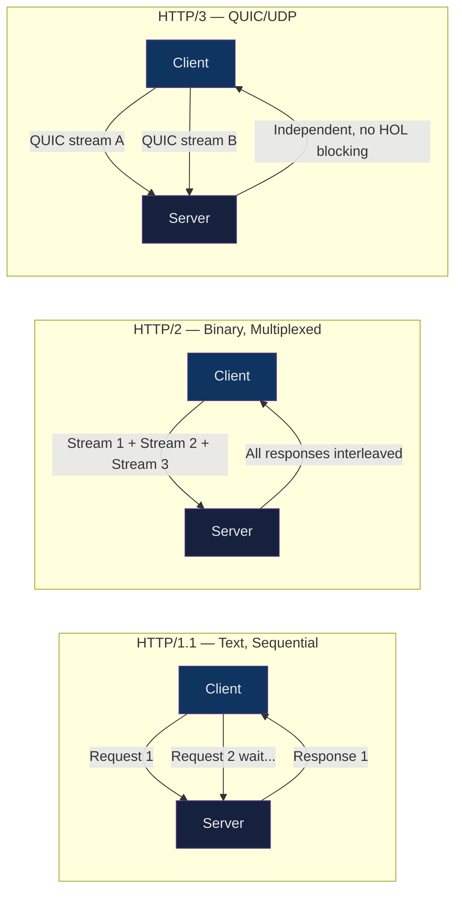

# 🌐 HTTP/HTTPS Deep Dive

> [!abstract] TL;DR
> HTTP is the application-layer protocol powering the web; it has evolved from the text-based HTTP/1.1 (persistent connections, pipelining) to binary HTTP/2 (multiplexed streams, header compression, server push) to HTTP/3 which runs over QUIC/UDP to eliminate TCP head-of-line blocking. HTTPS wraps HTTP in TLS for confidentiality and integrity. Status codes, headers, cookies, and CORS rules are the operational vocabulary every DevOps engineer must know for debugging, proxy configuration, and API design.

## Intuition

Think of HTTP versions as postal systems. HTTP/1.1 is one postal truck that delivers letters one at a time on a single road (pipelining helps queue them, but a traffic jam still blocks everything). HTTP/2 is the same truck but it opens multiple parallel lanes on the same road — many packages arrive simultaneously. HTTP/3 replaces the road itself: instead of a single highway (TCP), it uses many independent dirt paths (QUIC streams over UDP) so a pothole on one path doesn't affect the others.

## How It Works



## Key Concepts / Details

### HTTP/1.1 — Request/Response Structure

```http
GET /api/users/42 HTTP/1.1
Host: api.example.com
Accept: application/json
Authorization: Bearer eyJhbGc...
Connection: keep-alive
User-Agent: curl/8.1.0

```

```http
HTTP/1.1 200 OK
Content-Type: application/json
Content-Length: 87
Cache-Control: max-age=300
ETag: "abc123"

{"id": 42, "name": "Alice"}
```

**Persistent connections (keep-alive)**: Reuses the same TCP connection for multiple requests. Default in HTTP/1.1; dramatically reduces TCP handshake overhead.

**Pipelining limitation**: Requests can be sent without waiting for responses, but responses must arrive in order — creating head-of-line (HOL) blocking. Rarely used in practice.

### HTTP/2 — Binary Multiplexing

| Feature | HTTP/1.1 | HTTP/2 |
|---------|----------|--------|
| Framing | Text | Binary frames |
| Connections | Multiple TCP | 1 TCP with streams |
| HOL blocking | Yes (TCP + app layer) | Reduced (still TCP HOL) |
| Header compression | None | HPACK |
| Server push | No | Yes |

```
HTTP/2 Frame types:
HEADERS  — compressed request/response headers
DATA     — request/response body
SETTINGS — connection parameters
WINDOW_UPDATE — flow control
PUSH_PROMISE — server-initiated resources
RST_STREAM — cancel a stream
PING     — keep-alive / RTT measurement
GOAWAY   — graceful connection close
```

**HPACK compression**: Headers reference a static table of 61 common header name/value pairs and a dynamic table built from the current connection's history. `Content-Type: application/json` (common) compresses to 1–2 bytes.

**Server Push**: Server proactively sends resources (CSS, JS) the client will need before it requests them. In practice, HTTP/2 Push is being deprecated in favor of `<link rel="preload">` hints.

### HTTP/3 / QUIC

- Runs over **UDP** — no TCP 3-way handshake
- **0-RTT resumption**: Reconnect to a known server in zero round trips (sends data immediately)
- **Connection migration**: Connection ID is not tied to IP:port tuple; mobile clients can switch networks without reconnecting
- **Built-in TLS 1.3**: Crypto is baked into QUIC — no separate TLS handshake
- **QPACK**: Header compression for HTTP/3, accounts for QUIC stream ordering

```bash
# Check if server supports HTTP/3
curl --http3 https://cloudflare.com -I

# nghttp2 for HTTP/2 inspection
nghttp -nv https://example.com
```

### HTTP Status Codes

```
2xx — Success
  200 OK              Standard success
  201 Created         Resource created (POST/PUT)
  204 No Content      Success, no body (DELETE)

3xx — Redirection
  301 Moved Permanently   SEO-safe permanent redirect (GET stays GET)
  302 Found               Temporary redirect (legacy, GET)
  307 Temporary Redirect  Temporary, preserves method (POST stays POST)
  308 Permanent Redirect  Permanent, preserves method

4xx — Client Errors
  400 Bad Request         Malformed request syntax
  401 Unauthorized        Missing/invalid authentication
  403 Forbidden           Authenticated but not authorized
  404 Not Found           Resource does not exist
  405 Method Not Allowed  Wrong HTTP method
  409 Conflict            State conflict (duplicate, version mismatch)
  422 Unprocessable       Semantically invalid body (FastAPI validation)
  429 Too Many Requests   Rate limit exceeded (Retry-After header)

5xx — Server Errors
  500 Internal Server Error   Unhandled exception
  502 Bad Gateway             Upstream returned invalid response
  503 Service Unavailable     Overloaded / maintenance
  504 Gateway Timeout         Upstream timed out
```

### Important Headers

```http
# Request headers
Content-Type: application/json          # body MIME type
Accept: application/json, text/html     # desired response type
Authorization: Bearer <token>           # auth credential
Cache-Control: no-cache                 # caching directive
If-None-Match: "abc123"                 # conditional GET (ETag)
If-Modified-Since: Thu, 01 Jan 2026...  # conditional GET (date)
X-Forwarded-For: 203.0.113.5           # original client IP (behind proxy)
X-Request-ID: 550e8400-e29b-41d4-a716  # distributed tracing correlation
Connection: keep-alive                  # connection reuse

# Response headers
ETag: "abc123"                          # resource version identifier
Last-Modified: Thu, 01 Jan 2026...      # last modification date
Cache-Control: max-age=3600, public     # caching policy
Transfer-Encoding: chunked              # streaming response
Strict-Transport-Security: max-age=31536000; includeSubDomains  # HSTS
Content-Security-Policy: default-src 'self'  # XSS mitigation
X-Content-Type-Options: nosniff         # prevent MIME sniffing
```

### Cookies

```http
# Server sets cookie
Set-Cookie: session=abc123; Path=/; Max-Age=3600; Secure; HttpOnly; SameSite=Strict

# Cookie attributes:
HttpOnly    — JS cannot access cookie (prevents XSS theft)
Secure      — only sent over HTTPS
SameSite    — Strict: never cross-site | Lax: GET navigations OK | None: always (requires Secure)
Max-Age     — seconds until expiry (preferred over Expires)
Domain      — cookie scope; .example.com includes subdomains
Path        — URL path scope
```

### CORS (Cross-Origin Resource Sharing)

```
Simple request (no preflight): GET/POST with standard headers
Complex request → preflight OPTIONS first

Preflight flow:
  OPTIONS /api/data HTTP/1.1
  Origin: https://app.example.com
  Access-Control-Request-Method: DELETE
  Access-Control-Request-Headers: Authorization

  HTTP/1.1 204 No Content
  Access-Control-Allow-Origin: https://app.example.com
  Access-Control-Allow-Methods: GET, POST, DELETE
  Access-Control-Allow-Headers: Authorization
  Access-Control-Max-Age: 86400          ← cache preflight result
```

### HSTS (HTTP Strict Transport Security)

```http
Strict-Transport-Security: max-age=31536000; includeSubDomains; preload
```

- Browser remembers: only connect via HTTPS for `max-age` seconds
- `includeSubDomains`: applies to all subdomains
- `preload`: submits domain to browser HSTS preload list (hardcoded into browsers)
- First-visit TOFU (Trust On First Use) problem: initial HTTP visit is still vulnerable → preload list solves this

### Chunked Transfer Encoding

```http
HTTP/1.1 200 OK
Transfer-Encoding: chunked

7\r\n
Mozilla\r\n
9\r\n
Developer\r\n
7\r\n
Network\r\n
0\r\n
\r\n
```

Each chunk is preceded by its hex length. The final chunk has length `0`. Used for streaming responses where `Content-Length` is unknown in advance (log streaming, SSE alternatives, large file downloads).

## Real-World Notes

- **502 vs 503 vs 504**: 502 = LB got a garbage response from upstream (upstream crashed); 503 = upstream is down/overloaded (LB got a connection refused or the upstream returned 503); 504 = LB got no response within its timeout. Knowing the difference pinpoints whether the issue is upstream crash (502), overload/deployment (503), or slow query/deadlock (504).
- **X-Forwarded-For in multi-hop proxies** appends IPs: `X-Forwarded-For: client, proxy1, proxy2`. Always take the leftmost untrusted value when rate-limiting or geo-restricting — an attacker can spoof additional IPs to the right.
- **HTTP/2 requires TLS** in all major browsers (h2 only over HTTPS), though the spec doesn't require it. When enabling HTTP/2 on Nginx/Apache, TLS is a practical prerequisite.
- **429 Too Many Requests** should include a `Retry-After` header (seconds or HTTP-date) to allow clients to back off gracefully; without it, clients typically use exponential backoff with jitter.

## Common Pitfalls

1. **Caching POST responses** — `Cache-Control: max-age` on a POST response is ignored by most caches but can cause issues with reverse proxies. POST is not idempotent and should not be cached; use GET with query params for cacheable lookups.
2. **301 vs 308 for API redirects** — A 301 redirect causes most clients to downgrade POST to GET on the redirected request. Use 308 (Permanent Redirect) to preserve the method for API endpoints that move permanently.
3. **CORS wildcard with credentials** — `Access-Control-Allow-Origin: *` cannot be combined with `Access-Control-Allow-Credentials: true`. For credentialed requests, you must echo back the specific `Origin` header value.
4. **Missing `Secure` flag on session cookies** — without `Secure`, the browser sends the cookie over plain HTTP, exposing the session token to network sniffing even if the site uses HTTPS everywhere.
5. **HTTP/2 multiplexing masking slow upstream** — a single slow backend stream in HTTP/2 can consume a stream slot and indirectly delay other streams by exhausting the server's connection concurrency limit. Monitor per-stream latency, not just connection-level metrics.

## Related Concepts

- [[SSL_TLS_Certificates]] — HTTPS is HTTP over TLS; TLS handshake precedes every HTTPS request
- [[DNS_and_Resolution]] — DNS resolves the hostname before any HTTP connection is made
- [[Load_Balancers_and_Proxies]] — LBs operate at L7 (HTTP) or L4 (TCP); understand status codes for health checks
- [[Firewall_and_Network_Security]] — HTTP (80) and HTTPS (443) are the primary ports to manage in firewall rules
- [[SSH_and_Remote_Access]] — HTTPS APIs are often the alternative to SSH for automated access
- [[_MOC_Networking_Protocols]] — Section MOC

## Review Questions

1. Explain the difference between HTTP/1.1 pipelining and HTTP/2 multiplexing. Why does HTTP/1.1 pipelining still suffer from head-of-line blocking even with persistent connections?
2. A client receives a `401` vs a `403` response. What is the semantic difference, and what should a well-behaved client do differently in each case?
3. Why can you not combine `Access-Control-Allow-Origin: *` with `Access-Control-Allow-Credentials: true` in a CORS response? What should you do instead for a credentialed cross-origin API?
4. What does the `ETag` / `If-None-Match` conditional GET pattern achieve, and how does it differ from `Last-Modified` / `If-Modified-Since`?

## Sources

- [RFC 7230 — HTTP/1.1 Message Syntax](https://datatracker.ietf.org/doc/html/rfc7230)
- [RFC 9113 — HTTP/2](https://datatracker.ietf.org/doc/html/rfc9113)
- [RFC 9114 — HTTP/3](https://datatracker.ietf.org/doc/html/rfc9114)
- [MDN Web Docs — HTTP](https://developer.mozilla.org/en-US/docs/Web/HTTP)
- [Cloudflare Learning — HTTP/3](https://www.cloudflare.com/learning/performance/what-is-http3/)
- [HPACK Specification — RFC 7541](https://datatracker.ietf.org/doc/html/rfc7541)

#DevOps #Networking #HTTP #HTTPS #HTTP2 #QUIC #WebProtocols
