# ⚖️ Load Balancers and Proxies

> [!abstract] TL;DR
> Load balancers distribute traffic across backend instances to improve availability and throughput. L4 load balancers operate at the TCP/UDP layer (fast, no content awareness); L7 load balancers understand HTTP and can route by URL, headers, or cookies. Algorithms range from round-robin to consistent hashing for session affinity. Reverse proxies add SSL termination, caching, and header manipulation; forward proxies control outbound traffic. HAProxy and Nginx are the two dominant open-source options; cloud-managed options (ALB, GLB) add deep integrations.

## Intuition

A load balancer is like a maitre d' at a restaurant. When customers (requests) arrive, the maitre d' looks at available tables (servers) and assigns each customer to a table — round-robin if all tables seat the same size group, least-connections if groups vary, sticky sessions if the same party must return to the same waiter. An L4 load balancer is like a coat check: it sees envelopes (TCP packets) and routes them without opening them. An L7 load balancer reads the letter inside (HTTP body/headers) and routes based on content.

## How It Works

```mermaid
graph TD
    classDef dark fill:#0f3460,stroke:#533483,color:#e8e8e8
    classDef mid fill:#16213e,stroke:#533483,color:#e8e8e8
    classDef accent fill:#1a1a2e,stroke:#e94560,color:#e8e8e8

    Client[Client] -->|Request| VIP[Virtual IP / DNS]
    VIP -->|L4: TCP/UDP| L4LB[L4 Load Balancer<br/>IP + Port routing]
    VIP -->|L7: HTTP| L7LB[L7 Load Balancer<br/>URL / Header routing]

    L4LB -->|TCP stream| B1[Backend 1]
    L4LB -->|TCP stream| B2[Backend 2]
    L4LB -->|TCP stream| B3[Backend 3]

    L7LB -->|/api/*| API[API Servers]
    L7LB -->|/static/*| Static[Static Servers]
    L7LB -->|/auth/*| Auth[Auth Service]

    class Client dark
    class VIP mid
    class L4LB,L7LB accent
    class B1,B2,B3,API,Static,Auth mid
```



## Key Concepts / Details

### L4 vs L7 Load Balancing

| Dimension | L4 (Transport Layer) | L7 (Application Layer) |
|-----------|---------------------|----------------------|
| Sees | IP + port + TCP/UDP flags | HTTP method, URL, headers, body |
| TLS | Passthrough (doesn't decrypt) | Terminates TLS (decrypts) |
| Routing granularity | IP:port → backend pool | URL path, hostname, cookies |
| Session state | IP hash for affinity | Cookie-based, header-based |
| Performance | Very fast (kernel bypass possible) | Slower (parse HTTP) |
| Use cases | Database, raw TCP, any protocol | HTTP APIs, microservices, web |
| Examples | HAProxy TCP mode, AWS NLB | Nginx, HAProxy HTTP mode, AWS ALB |

### Load Balancing Algorithms

```
Round Robin
  Request 1 → Backend A
  Request 2 → Backend B
  Request 3 → Backend C
  Request 4 → Backend A ...
  Simple, no state, assumes equal capacity

Weighted Round Robin
  Backend A: weight 3 → gets 3x more requests than Backend B (weight 1)
  Useful when backends have different hardware specs

Least Connections
  Route to backend with fewest active connections
  Better for requests with variable processing time

Least Response Time
  Route to backend with lowest combo of active connections + response time
  HAProxy: leastconn; Nginx Plus: least_time

IP Hash / Consistent Hashing
  hash(client_ip) % n_backends → always same backend for same IP
  Sticky sessions without cookies
  Consistent hashing minimizes rehashing when backends are added/removed

Random
  Uniformly random selection; effective with many backends

Sticky Sessions (Session Affinity)
  Cookie-based: LB sets a cookie (SERVERID) mapping client to backend
  Required for stateful apps (in-memory session, file uploads in progress)
  Problem: uneven distribution if some sessions are long-lived
```

### Reverse Proxy vs Forward Proxy

```
Reverse Proxy (server-side):
  Client → Reverse Proxy → Backend Servers
  Client thinks it's talking directly to the backend
  Use cases:
    - SSL/TLS termination
    - Load balancing
    - Caching (serve static assets without hitting app)
    - Rate limiting
    - Authentication (OAuth2 proxy)
    - Header manipulation (add X-Real-IP, remove internal headers)

Forward Proxy (client-side):
  Client → Forward Proxy → Internet
  Server thinks the proxy is the client
  Use cases:
    - Corporate outbound traffic control
    - Content filtering (block social media)
    - Bandwidth throttling
    - Anonymization (Tor, VPNs use similar concept)
    - Caching for outbound requests (Squid)
```

### Nginx as Load Balancer

```nginx
# /etc/nginx/nginx.conf

upstream api_backend {
    # Default: round-robin
    least_conn;                          # override to least connections

    server 10.0.1.10:8080 weight=3;      # 3x more requests
    server 10.0.1.11:8080 weight=1;
    server 10.0.1.12:8080 backup;        # only used when others fail

    # Health check parameters (Nginx Open Source — passive only)
    server 10.0.1.13:8080 max_fails=3 fail_timeout=30s;

    keepalive 32;                        # idle keepalive connections per worker
}

server {
    listen 443 ssl http2;
    server_name api.example.com;

    ssl_certificate     /etc/ssl/fullchain.pem;
    ssl_certificate_key /etc/ssl/privkey.pem;

    location /api/ {
        proxy_pass http://api_backend;

        # Pass original client info to backends
        proxy_set_header Host              $host;
        proxy_set_header X-Real-IP         $remote_addr;
        proxy_set_header X-Forwarded-For   $proxy_add_x_forwarded_for;
        proxy_set_header X-Forwarded-Proto $scheme;

        # Timeouts
        proxy_connect_timeout 5s;
        proxy_send_timeout    60s;
        proxy_read_timeout    60s;

        # Buffering
        proxy_buffering on;
        proxy_buffer_size 4k;
    }

    location /static/ {
        root /var/www;
        expires 1y;
        add_header Cache-Control "public, immutable";
    }
}
```

### HAProxy as Load Balancer

```
# /etc/haproxy/haproxy.cfg

global
    log /dev/log local0
    maxconn 50000
    stats socket /run/haproxy/admin.sock mode 660 level admin

defaults
    log     global
    mode    http
    option  httplog
    option  dontlognull
    timeout connect 5s
    timeout client  60s
    timeout server  60s
    option  redispatch                   # retry on different backend on failure
    retries 3

# HTTP frontend
frontend http_front
    bind *:80
    bind *:443 ssl crt /etc/ssl/example.com.pem alpn h2,http/1.1
    redirect scheme https code 301 if !{ ssl_fc }
    default_backend api_servers

    # ACL-based routing
    acl is_api path_beg /api/
    acl is_ws  path_beg /ws/
    use_backend api_servers  if is_api
    use_backend ws_servers   if is_ws

# Backend pool
backend api_servers
    balance leastconn
    option httpchk GET /health HTTP/1.1\r\nHost:\ localhost
    http-check expect status 200

    server api-01 10.0.1.10:8080 check inter 2s rise 2 fall 3 weight 1
    server api-02 10.0.1.11:8080 check inter 2s rise 2 fall 3 weight 1
    server api-03 10.0.1.12:8080 check inter 2s rise 2 fall 3 backup

# TCP mode (L4 — for databases, SMTP, etc.)
frontend db_front
    bind *:5432
    mode tcp
    default_backend db_servers

backend db_servers
    mode tcp
    balance source
    server db-primary 10.0.2.10:5432 check
    server db-replica 10.0.2.11:5432 check backup

# Stats page (http://haproxy:8404/stats)
frontend stats
    bind *:8404
    stats enable
    stats uri /stats
    stats refresh 30s
    stats auth admin:secret
```

### Health Checks

```
Active health check (proactive):
  LB periodically sends HTTP GET /health (or TCP SYN) to each backend
  Marks backend as down after N consecutive failures
  Marks backend as up after M consecutive successes (rise/fall thresholds)
  Remove backend from rotation immediately on failure

  HAProxy: option httpchk GET /health; fall 3; rise 2
  Nginx Plus: health_check interval=5s fails=3 passes=2;
  Nginx Open Source: max_fails=3 fail_timeout=30s (passive only)

Passive health check (reactive):
  LB monitors actual traffic for errors (5xx, connection refused, timeouts)
  Marks backend as unhealthy after observing N errors in a time window
  Less precise — clients see failures before backend is removed
  Available in Nginx Open Source; HAProxy calls this "observe mode"

Health check endpoint best practices:
  GET /health → 200 OK {"status": "ok"}   (always returns fast)
  GET /ready  → 200/503                   (Kubernetes readiness: is pod ready?)
  GET /live   → 200/500                   (Kubernetes liveness: should pod restart?)
  Deep health: check DB connection, cache connectivity (use with caution — cascading failures)
```

### Connection Draining

When removing a backend (deployment, scaling down):

```
1. Mark backend as "draining" in LB (no new connections routed to it)
2. LB continues serving existing in-flight connections
3. After timeout (e.g., 30s) or when connections reach 0, remove backend
4. Kubernetes: preStop hook + terminationGracePeriodSeconds achieves this

HAProxy: echo "disable server api_servers/api-01" | socat stdio /run/haproxy/admin.sock
Nginx: upstream server api-01 down;  (mark down, existing connections finish)
AWS ALB: deregistration_delay.timeout_seconds = 30
```

### SSL Termination at the Load Balancer

```
Option 1: SSL Termination (most common)
  Client ──HTTPS──→ LB ──HTTP──→ Backend
  LB holds private key; single cert to manage
  Backend gets plain HTTP; simpler but unencrypted internally

Option 2: SSL Passthrough (L4)
  Client ──HTTPS──→ LB (TCP passthrough) ──HTTPS──→ Backend
  LB cannot read headers; no content-based routing
  Backend holds private key; full end-to-end encryption

Option 3: SSL Re-encryption (most secure)
  Client ──HTTPS──→ LB ──HTTPS──→ Backend
  LB terminates, inspects, re-encrypts to backend
  Nginx: proxy_ssl_verify on; proxy_ssl_certificate ...;
```

### Comparison Table

| Feature | Nginx | HAProxy | AWS ALB | Envoy |
|---------|-------|---------|---------|-------|
| Primary use | Web server + proxy | Load balancer | Cloud LB | Service mesh proxy |
| L4 support | Limited | Excellent | Via NLB | Yes |
| L7 routing | Excellent | Good (ACLs) | Excellent | Excellent |
| gRPC | With config | Partial | Yes | Native |
| WebSocket | Yes | Yes | Yes | Yes |
| Active health checks | Nginx Plus only | Yes | Yes | Yes |
| Dynamic config | Yes (+ signals) | Runtime socket | API | xDS API |
| Observability | Access logs | Stats page | CloudWatch | Prometheus + tracing |
| Learning curve | Low | Medium | Low | High |

## Real-World Notes

- **Circuit breakers complement health checks** — health checks remove a backend that returns errors, but a circuit breaker at the client side (Envoy, Resilience4j) stops sending requests immediately when error rate spikes, without waiting for the LB to notice. Together they minimize the blast radius of an upstream failure.
- **Sticky sessions are a scaling anti-pattern** — session affinity ties users to specific backends, making zero-downtime deploys and auto-scaling harder. The correct solution is externalizing session state to Redis/DynamoDB, allowing any backend to serve any user.
- **HAProxy stats socket** enables real-time operational control without reloads: dynamically enable/disable backends, drain servers before deployment, query connection counts per backend — all via Unix socket commands (scriptable with socat or haproxyadmin).
- **AWS ALB target groups** support weighted targets natively — useful for canary deployments: send 5% of traffic to the new version target group and 95% to the old one, then gradually shift weight.

## Common Pitfalls

1. **Passing `X-Forwarded-For` through multiple proxy hops** — if the first proxy adds `X-Forwarded-For: client_ip` and the second proxy also appends it, you get `X-Forwarded-For: client_ip, proxy1_ip`. Application code must take the leftmost IP, but if the first proxy is untrusted (attacker), they can inject a fake IP. Only trust `X-Forwarded-For` from known proxy IP ranges.
2. **Forgetting backend keepalive in Nginx** — without `keepalive 32` in the upstream block, Nginx opens a new TCP connection for every proxied request. Under high throughput, TCP connection overhead adds measurable latency and exhausts ephemeral ports. Always set `proxy_http_version 1.1` and `proxy_set_header Connection ""` with keepalive.
3. **Health check endpoint doing too much** — a "deep" health check that queries the database causes cascading failures: if the DB is slow, all backends appear unhealthy simultaneously, and the LB removes all of them. Use shallow health checks (liveness) for LB routing; use deep checks only for Kubernetes readiness (which stops new traffic but doesn't kill the pod).
4. **Idle connection timeout mismatch** — if the LB's `timeout server 60s` is longer than the backend application's idle connection close timeout, the LB forwards requests on what it thinks is a live connection but the backend has already closed. Fix: LB timeout < backend idle timeout, or enable TCP keepalives.
5. **Not testing connection draining** — deploying a new version without verifying draining works results in dropped in-flight requests (HTTP 502). Test with `ab` or `wrk` running during a deployment to observe zero error rate.

## Related Concepts

- [[HTTP_HTTPS_Deep_Dive]] — L7 LBs route based on HTTP semantics; status codes (502/503/504) signal LB issues
- [[SSL_TLS_Certificates]] — SSL termination at the LB requires private key management; mTLS for backend auth
- [[DNS_and_Resolution]] — DNS round-robin is the simplest form of load distribution; LB VIPs use a single DNS A record
- [[Firewall_and_Network_Security]] — LBs sit in front of firewall DMZ; security groups control which IPs reach the LB
- [[SSH_and_Remote_Access]] — SSH tunnels can route through LBs; L4 LBs can front SSH jump hosts
- [[_MOC_Networking_Protocols]] — Section MOC

## Review Questions

1. What is the fundamental difference between L4 and L7 load balancing in terms of what information the load balancer can use for routing decisions? Give a concrete scenario where you must use L7 routing.
2. Explain why sticky sessions (session affinity) are considered an anti-pattern for horizontally scaled stateless services. What is the correct architectural alternative?
3. Compare active vs passive health checks. In what scenario would passive health checks cause more user-visible errors than active checks, and why?
4. When does SSL termination at the load balancer create a security concern, and what option addresses that concern while still allowing L7 routing?

## Sources

- [HAProxy documentation](https://www.haproxy.com/documentation/)
- [Nginx Load Balancing guide](https://docs.nginx.com/nginx/admin-guide/load-balancer/http-load-balancer/)
- [AWS Elastic Load Balancing — ALB](https://docs.aws.amazon.com/elasticloadbalancing/latest/application/)
- [Envoy Proxy documentation](https://www.envoyproxy.io/docs)
- [The Art of Capacity Planning (O'Reilly)](https://www.oreilly.com/library/view/the-art-of/9780596518578/)
- [High Performance Browser Networking — Ilya Grigorik](https://hpbn.co/)

#DevOps #Networking #LoadBalancing #Nginx #HAProxy #ReverseProxy #Infrastructure
