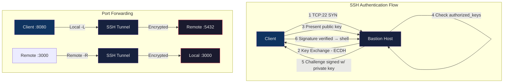

# 🔑 SSH and Remote Access

> [!abstract] TL;DR
> SSH (Secure Shell) is the standard protocol for encrypted remote access to servers. Key-based authentication (Ed25519 preferred) replaces passwords; ssh-agent caches decrypted keys in memory; the SSH config file (~/.ssh/config) centralizes per-host settings including connection multiplexing. Port forwarding (local/remote/dynamic) creates encrypted tunnels for arbitrary TCP traffic. Bastion hosts centralize access to private networks, and SSH CAs enable short-lived certificate-based authentication at scale.

## Intuition

Think of SSH like a master key system for a hotel. Each guest (user) has a unique key (key pair) — the front desk keeps a record of which keys work (authorized_keys), but never the key itself. ssh-agent is a keychain you keep in your pocket so you don't re-insert your key every time. A bastion host is the hotel lobby: all guests must pass through it to reach the secured floors — there's no direct stairwell from outside.

## How It Works



## Key Concepts / Details

### SSH Key Pairs

```bash
# Generate Ed25519 key (modern, recommended — 256-bit, compact)
ssh-keygen -t ed25519 -C "user@hostname" -f ~/.ssh/id_ed25519

# Generate RSA key (legacy compatibility, use 4096-bit minimum)
ssh-keygen -t rsa -b 4096 -C "user@hostname" -f ~/.ssh/id_rsa

# Key files:
# ~/.ssh/id_ed25519       — private key (NEVER share, chmod 600)
# ~/.ssh/id_ed25519.pub   — public key (safe to share)

# Copy public key to remote server
ssh-copy-id -i ~/.ssh/id_ed25519.pub user@host

# Manually append to authorized_keys
cat ~/.ssh/id_ed25519.pub >> ~/.ssh/authorized_keys
chmod 600 ~/.ssh/authorized_keys
chmod 700 ~/.ssh

# known_hosts — stores server fingerprints (TOFU)
# First connection: prompted to verify fingerprint, then stored
# ~/.ssh/known_hosts
```

**Ed25519 vs RSA**:

| Feature | Ed25519 | RSA 4096 |
|---------|---------|----------|
| Key size | 256 bits | 4096 bits |
| Speed | Fast (Edwards curve) | Slower |
| Public key length | 68 chars | ~700 chars |
| Security level | ~128-bit | ~140-bit |
| Compatibility | Modern SSH (OpenSSH 6.5+) | Universal |

### ssh-agent

```bash
# Start ssh-agent (usually auto-started by desktop environment)
eval "$(ssh-agent -s)"

# Add key to agent (prompts for passphrase once)
ssh-add ~/.ssh/id_ed25519

# Add with time limit (removes key after 4 hours)
ssh-add -t 14400 ~/.ssh/id_ed25519

# List loaded keys
ssh-add -l

# Remove all keys
ssh-add -D

# Agent forwarding — forward your local agent to the remote server
ssh -A user@bastion
# WARNING: -A trusts the remote root user to use your agent socket
# Only forward to trusted hosts (never public/shared servers)

# SSH_AUTH_SOCK — socket path the agent listens on
echo $SSH_AUTH_SOCK
# /tmp/ssh-XXXXXX/agent.12345
```

### SSH Config File (~/.ssh/config)

```
# Default settings for all hosts
Host *
    ServerAliveInterval 60          # send keepalive every 60s
    ServerAliveCountMax 3           # disconnect after 3 missed keepalives
    AddKeysToAgent yes              # auto-add keys to agent on first use
    IdentitiesOnly yes              # only use specified keys

# Bastion host
Host bastion
    HostName bastion.example.com
    User ec2-user
    IdentityFile ~/.ssh/id_ed25519
    Port 22

# Jump through bastion to private host
Host app-server
    HostName 10.0.1.50              # private IP, not publicly routable
    User ubuntu
    IdentityFile ~/.ssh/id_ed25519
    ProxyJump bastion               # use 'bastion' as jump host

# Connection multiplexing — reuse existing connection (faster repeat logins)
Host prod-*
    ControlMaster auto
    ControlPath ~/.ssh/sockets/%r@%h:%p
    ControlPersist 10m              # keep master alive 10 min after last session

# Dev environment shorthand
Host dev
    HostName dev.example.com
    User karan
    Port 2222
    IdentityFile ~/.ssh/dev_key
    ForwardAgent yes                # be deliberate — only for trusted hosts
```

```bash
mkdir -p ~/.ssh/sockets && chmod 700 ~/.ssh/sockets
```

### Port Forwarding

```bash
# LOCAL forwarding (-L): forward local port to remote destination
# Access remote database from local machine:
ssh -L 5432:db.internal:5432 user@bastion
# → connect to localhost:5432, traffic tunnels to db.internal:5432

# General syntax:
# ssh -L [local_addr:]local_port:remote_host:remote_port user@jump_host

# REMOTE forwarding (-R): expose local port on remote server
# Expose local dev server to remote (reverse tunnel):
ssh -R 8080:localhost:3000 user@public-server
# → public-server:8080 forwards to your localhost:3000

# DYNAMIC (-D): SOCKS5 proxy for arbitrary TCP
ssh -D 1080 user@bastion
# Configure browser/curl to use SOCKS5 proxy at localhost:1080:
curl --socks5 localhost:1080 http://internal-app.corp/

# Background forwarding (no interactive shell)
ssh -N -f -L 5432:db.internal:5432 user@bastion
# -N: no remote command
# -f: background before command execution
```

### ProxyJump and Multi-Hop SSH

```bash
# Single jump host
ssh -J user@bastion user@private-host

# Multiple hops (chain)
ssh -J bastion1,bastion2 user@final-host

# In ~/.ssh/config (preferred)
Host final
    HostName 10.0.2.100
    ProxyJump bastion

# Legacy ProxyCommand (equivalent)
Host final-legacy
    ProxyCommand ssh -W %h:%p bastion
```

### Bastion Host Architecture

```
Internet
   │
   ▼
┌──────────────────┐
│   Bastion Host   │  ← Only port 22 open from internet
│  (Public Subnet) │    All other inbound traffic blocked
└────────┬─────────┘
         │ SSH tunnel
         ▼
┌──────────────────────────────────┐
│         Private Subnet           │
│  app-01  app-02  db-01  cache-01 │  ← No direct internet access
└──────────────────────────────────┘
```

**Security best practices for bastions**:
- No user data/services; minimal attack surface
- Key-based auth only (`PasswordAuthentication no`)
- Enable audit logging (AWS CloudTrail / auditd)
- Use short-lived SSH certificates instead of static authorized_keys
- Consider AWS Systems Manager Session Manager as a key-less alternative (no open port 22)

### SFTP and SCP

```bash
# SFTP — interactive file transfer
sftp user@host
sftp> ls                 # list remote directory
sftp> pwd                # remote working directory
sftp> lcd /local/path    # change local directory
sftp> get remote.txt     # download file
sftp> put local.txt      # upload file
sftp> mkdir backups      # create remote directory
sftp> bye                # exit

# SFTP-only jail in sshd_config (restrict user to SFTP, no shell)
Match User sftp-user
    ForceCommand internal-sftp
    ChrootDirectory /srv/sftp/%u    # user sees only this directory
    AllowTcpForwarding no
    X11Forwarding no

# SCP — non-interactive copy
scp file.txt user@host:/remote/path/        # upload
scp user@host:/remote/file.txt ./local/     # download
scp -r ./dir user@host:/remote/             # recursive
scp -p file.txt user@host:/path/            # preserve timestamps
scp -l 1000 large.bin user@host:/path/      # limit bandwidth (1000 Kbps)
scp -P 2222 file.txt user@host:/path/       # custom port (capital P)
```

### SSH Hardening (sshd_config)

```
# /etc/ssh/sshd_config — harden before exposing to internet

Port 22                           # consider non-standard port (obscurity)
Protocol 2                        # SSH protocol v2 only

PermitRootLogin no                # never allow root login
PasswordAuthentication no         # key-based auth only
ChallengeResponseAuthentication no
UsePAM yes

PubkeyAuthentication yes
AuthorizedKeysFile .ssh/authorized_keys

AllowUsers alice bob deploy       # whitelist specific users
# AllowGroups ssh-users           # or whitelist by group

MaxAuthTries 3                    # lockout after 3 failed attempts
LoginGraceTime 20                 # 20s to complete auth before disconnect
MaxSessions 10                    # max concurrent sessions per connection

ClientAliveInterval 300           # server sends keepalive every 5 min
ClientAliveCountMax 2             # disconnect after 2 missed keepalives

X11Forwarding no                  # disable X11 unless needed
AllowTcpForwarding no             # disable port forwarding for most users
AllowAgentForwarding no           # disable agent forwarding for most users

# Logging
SyslogFacility AUTH
LogLevel VERBOSE                  # log key fingerprints

Banner /etc/ssh/banner.txt        # legal warning before login
```

```bash
# Reload sshd after changes (test config first!)
sshd -t                           # test config syntax
systemctl reload sshd
```

### Certificate-Based SSH (SSH CAs)

Scales better than managing authorized_keys on every server:

```bash
# Create SSH CA (on secure key management host)
ssh-keygen -t ed25519 -f /etc/ssh/ssh_ca -C "corp-ssh-ca"

# Sign a user's public key with the CA
ssh-keygen -s /etc/ssh/ssh_ca \
    -I "alice@example.com" \       # certificate identity (for logs)
    -n "admin,deploy" \            # principals (allowed usernames)
    -V +8h \                       # valid for 8 hours only
    ~/.ssh/id_ed25519.pub

# Output: ~/.ssh/id_ed25519-cert.pub

# On servers — trust the CA (instead of per-user authorized_keys)
# /etc/ssh/sshd_config:
TrustedUserCAKeys /etc/ssh/ssh_ca.pub

# User connects with cert automatically (ssh loads *-cert.pub with key)
ssh alice@server
```

Short-lived certs (4–24h) eliminate the need for revocation — certs simply expire. Used by Uber, Lyft, and others for zero-touch SSH access.

## Real-World Notes

- **ControlMaster multiplexing** dramatically speeds up Ansible runs and repeated SSH commands to the same host — a second connection reuses the existing TCP/TLS channel without re-authenticating. Ansible enables this via `ssh_args = -o ControlMaster=auto -o ControlPersist=60s`.
- **AWS SSM Session Manager** is increasingly preferred over bastions for EC2 access: no open port 22, sessions are logged to CloudWatch, no SSH key management required — access is controlled via IAM policies instead.
- **ssh-agent forwarding (-A) is a security risk** on shared hosts: any root user on the intermediate host can use your forwarded agent to authenticate as you to any server your key allows. Use ProxyJump instead, which forwards the connection but not the agent.
- **Ed25519 keys in git** — the same SSH key infrastructure is used by git over SSH (GitHub, GitLab, Bitbucket). Adding your Ed25519 public key to GitHub allows `git clone git@github.com:org/repo.git` without passwords.

## Common Pitfalls

1. **Wrong permissions on ~/.ssh/** — SSH silently ignores authorized_keys if permissions are too permissive. `~/.ssh` must be `700`, `authorized_keys` must be `600`, private keys must be `600`. Verify with `ls -la ~/.ssh/`.
2. **Host key verification failure after server rebuild** — rebuilding a server generates new host keys; `known_hosts` retains the old fingerprint and SSH refuses to connect with a warning. Remove the old entry: `ssh-keygen -R hostname` before reconnecting.
3. **Agent forwarding to shared/untrusted hosts** — a compromised or malicious root user on an intermediate host can invoke your forwarded agent to authenticate anywhere your key is trusted. Use `-J` (ProxyJump) instead; it establishes a direct tunnel without exposing the agent to the intermediate host.
4. **Connection multiplexing sockets not cleaned up** — stale `ControlPath` sockets prevent new master connections. Explicitly close with `ssh -O exit hostname` or set `ControlPersist` to a short duration.
5. **Dynamic port forwarding SOCKS proxy leaking DNS** — when using `-D` for a SOCKS proxy, applications that don't support SOCKS DNS may resolve DNS locally and only tunnel the TCP connection, leaking hostnames. Use `proxychains` or ensure your browser uses SOCKS5h (DNS through proxy) not SOCKS5.

## Related Concepts

- [[SSL_TLS_Certificates]] — SSH uses asymmetric crypto similar to TLS; SSH CAs parallel TLS CAs
- [[Firewall_and_Network_Security]] — SSH (port 22) is a primary firewall concern; iptables rules for SSH access
- [[DNS_and_Resolution]] — ProxyJump and SSH host resolution rely on DNS; `known_hosts` stores names
- [[Load_Balancers_and_Proxies]] — SSH proxying/tunneling is conceptually related to HTTP proxying
- [[_MOC_Networking_Protocols]] — Section MOC

## Review Questions

1. Why is `ssh -J bastion user@private-host` (ProxyJump) preferred over `ssh -A user@bastion` followed by `ssh user@private-host` from within the bastion session? What is the specific security difference?
2. Explain SSH connection multiplexing (`ControlMaster`). What problem does it solve, and what are the operational risks?
3. How do SSH certificate authorities scale better than the traditional `authorized_keys` model? What is the purpose of short-lived certificates (e.g., `-V +8h`)?
4. A developer reports "Host key verification failed" when connecting to a server after a recent rebuild. What caused this and what is the correct fix?

## Sources

- [OpenSSH manual pages](https://www.openssh.com/manual.html)
- [SSH CA — Scalable and Secure Access with SSH Certificates (Netflix)](https://netflixtechblog.com/scalable-and-secure-access-with-ssh-9da112a7b1cb)
- [AWS SSM Session Manager](https://docs.aws.amazon.com/systems-manager/latest/userguide/session-manager.html)
- [Mozilla SSH Guidelines](https://infosec.mozilla.org/guidelines/openssh)
- [ssh_config man page](https://linux.die.net/man/5/ssh_config)
- [sshd_config man page](https://linux.die.net/man/5/sshd_config)

#DevOps #Networking #SSH #Security #RemoteAccess #BastionHost #PortForwarding
