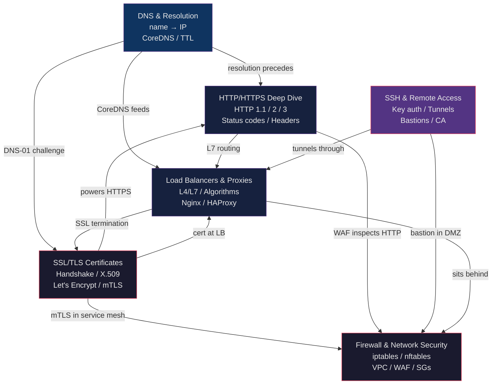

# 🌐 Networking Protocols — Section MOC

> [!abstract] Section Overview
> This section covers the core networking protocols and security primitives that underpin every production DevOps deployment. DNS resolves names to IPs and powers Kubernetes service discovery. HTTP/HTTPS is the language of web APIs, understood at every layer from curl to Nginx to ALBs. TLS/certificates provide the cryptographic foundation for HTTPS and mTLS. SSH is the universal remote access tool. Load balancers distribute traffic and absorb failures. Firewalls enforce the perimeter and internal access controls. Together these six areas form a complete mental model for network architecture, debugging, and security.

[[../_MOC_DevOps_Master|↑ DevOps Master MOC]]

---

## Section Architecture

---

## Notes in This Section

| Note | Key Topics | Difficulty |
|------|-----------|------------|
| [[DNS_and_Resolution]] | Resolution chain, record types (A/AAAA/CNAME/MX/TXT/SRV/PTR), TTL, caching, split-horizon, CoreDNS, DNSSEC, dig commands | Intermediate |
| [[HTTP_HTTPS_Deep_Dive]] | HTTP/1.1 vs HTTP/2 vs HTTP/3 (QUIC), status codes, headers, cookies, CORS, HSTS, chunked encoding | Intermediate |
| [[SSL_TLS_Certificates]] | TLS 1.2/1.3 handshake, X.509, certificate chain, Let's Encrypt / ACME, cert-manager, mTLS, SNI, OCSP stapling | Advanced |
| [[SSH_and_Remote_Access]] | Key pairs (Ed25519), ssh-agent, SSH config, port forwarding, ProxyJump, bastions, SFTP/SCP, hardening, SSH CAs | Intermediate |
| [[Load_Balancers_and_Proxies]] | L4 vs L7, algorithms, reverse proxy, Nginx upstream, HAProxy frontend/backend, health checks, connection draining, SSL termination | Intermediate |
| [[Firewall_and_Network_Security]] | iptables tables/chains/targets, nftables, WAF, AWS NACLs vs Security Groups, DMZ architecture, VPC | Advanced |

---

## Learning Path

The recommended progression through this section, from foundational to advanced:

1. **[[DNS_and_Resolution]]** — Start here. Every network connection begins with DNS. Understanding resolution, TTL, caching, and record types grounds everything else. The CoreDNS subsection directly applies to Kubernetes.

2. **[[HTTP_HTTPS_Deep_Dive]]** — The protocol most DevOps engineers work with daily. HTTP status codes and headers are the vocabulary of debugging every API, proxy, and load balancer interaction. Read this before the LB and TLS notes.

3. **[[SSL_TLS_Certificates]]** — Understand TLS before configuring any HTTPS endpoint. The cert-manager section is prerequisite knowledge for Kubernetes ingress setup. mTLS is foundational for service mesh understanding.

4. **[[SSH_and_Remote_Access]]** — Essential operational skill. Port forwarding and bastion patterns are used daily. Certificate-based SSH is the enterprise-grade approach.

5. **[[Load_Balancers_and_Proxies]]** — Brings together HTTP, DNS, and TLS knowledge. Nginx and HAProxy configuration is directly applicable to real infrastructure. Understanding L4 vs L7 is critical for architecture decisions.

6. **[[Firewall_and_Network_Security]]** — The security perimeter around everything. iptables knowledge is required for Linux server hardening; VPC/SG/NACL knowledge is mandatory for AWS infrastructure work.

> [!tip] Parallel Study
> DNS + HTTP can be studied in parallel (neither depends on the other). TLS builds on both. SSH, LBs, and Firewalls can each be studied after TLS independently.

---

## Key Cross-Cutting Themes

**Debugging a failed HTTPS request** touches every note in this section:
1. DNS resolution — `dig api.example.com` (DNS_and_Resolution)
2. TLS handshake — `openssl s_client -connect api.example.com:443` (SSL_TLS_Certificates)
3. HTTP response — `curl -v https://api.example.com` — status codes, headers (HTTP_HTTPS_Deep_Dive)
4. Load balancer — 502/503/504 interpretation, backend health (Load_Balancers_and_Proxies)
5. Firewall — is port 443 open? are SG rules correct? (Firewall_and_Network_Security)
6. SSH access — `ssh -J bastion admin@backend` to inspect logs directly (SSH_and_Remote_Access)

**Zero-trust networking** touches SSL_TLS_Certificates (mTLS), SSH_and_Remote_Access (cert-based SSH), and Firewall_and_Network_Security (least-privilege SGs).

**Kubernetes networking** draws from DNS_and_Resolution (CoreDNS, cluster.local), SSL_TLS_Certificates (cert-manager, Ingress TLS), and Load_Balancers_and_Proxies (Ingress controllers as L7 LBs).

---

## Related Sections

- [[../_MOC_DevOps_Master|↑ DevOps Master MOC]] — Parent section with all DevOps vault topics
- `[[../01_Containers_Docker/_MOC_Containers_Docker]]` — Container networking (CNI, overlay networks) builds on these fundamentals
- `[[../02_Kubernetes/_MOC_Kubernetes]]` — Kubernetes Service, Ingress, NetworkPolicy, CoreDNS are all applied networking
- `[[../03_CI_CD/_MOC_CI_CD]]` — Pipeline webhooks, artifact registries, and deploy targets all use HTTPS
- `[[../06_Cloud_AWS/_MOC_Cloud_AWS]]` — VPC, ALB, Route 53, ACM, WAF are AWS implementations of these concepts
- `[[../07_Observability/_MOC_Observability]]` — Network metrics (latency, error rates, throughput) are key observability signals
- `[[../08_Security/_MOC_Security]]` — Network security is one pillar of the broader security posture

---

#DevOps #Networking #MOC #DNS #HTTP #TLS #SSH #LoadBalancing #Firewall #Infrastructure
