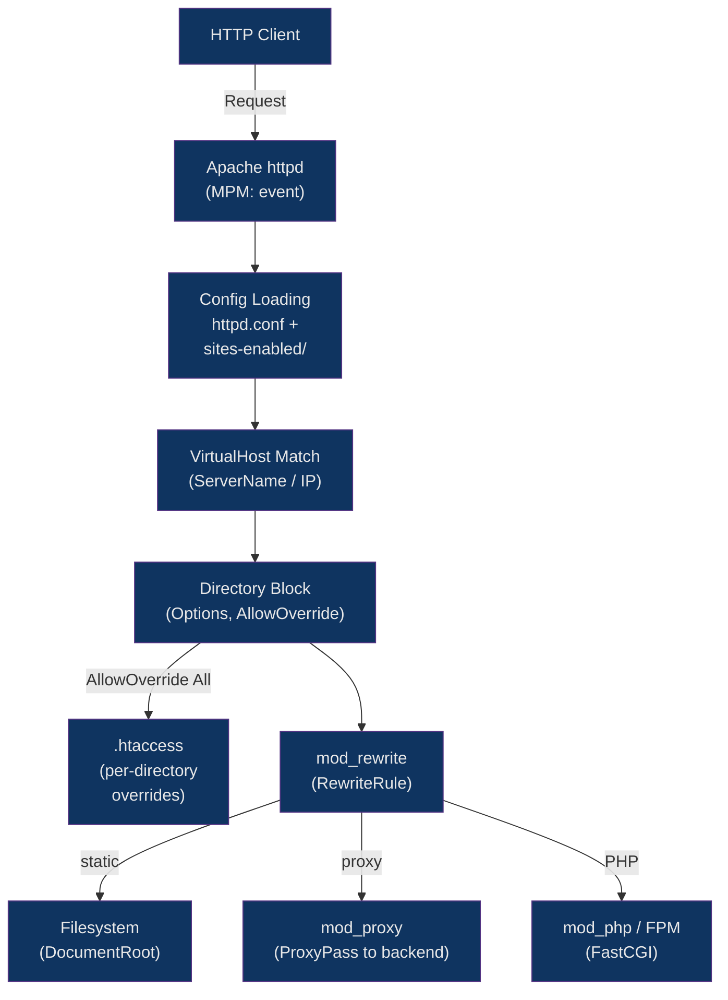

# 🪶 Apache Configuration

> [!abstract] TL;DR
> Apache HTTP Server is a mature, module-based web server with per-directory configuration via `.htaccess` files. Its Debian-style layout separates site configs into `sites-available/` (all configs) and `sites-enabled/` (active symlinks), toggled with `a2ensite`/`a2dissite`. The MPM (Multi-Processing Module) determines concurrency model — modern deployments use the `event` MPM for async connection handling. `mod_rewrite` handles URL transformation, while `mod_proxy` enables reverse proxying. Apache's greatest flexibility — `.htaccess` delegation — is also its main performance liability.

## Intuition

Apache is like a postal sorting office where each package (request) is handled by a dedicated worker. You can attach custom routing labels (`.htaccess`) to any mailbox slot (directory), and the sorter checks those labels on every delivery. Nginx is more like an automated conveyor belt — faster and more predictable, but you can't attach labels mid-line; everything must be configured at the source.

## How It Works



## Key Concepts / Details

### Debian-Style File Layout

```
/etc/apache2/
├── apache2.conf          # Main config (includes sites-enabled/*, conf-enabled/*)
├── ports.conf            # Listen directives
├── mods-available/       # All available modules (.load + .conf files)
├── mods-enabled/         # Symlinks to enabled modules
├── sites-available/      # All site configs
├── sites-enabled/        # Symlinks to active site configs
└── conf-available/       # Misc config snippets
    conf-enabled/
```

```bash
# Enable / disable sites
a2ensite  example.com.conf
a2dissite example.com.conf

# Enable / disable modules
a2enmod  rewrite
a2enmod  proxy proxy_http ssl headers
a2dismod  status

# Apply changes
systemctl reload apache2

# Test config syntax
apachectl configtest   # or: apache2ctl configtest
```

### VirtualHost Directives

```apache
# /etc/apache2/sites-available/example.com.conf

<VirtualHost *:80>
    ServerName  example.com
    ServerAlias www.example.com

    # Redirect all HTTP → HTTPS
    RewriteEngine On
    RewriteRule ^ https://%{HTTP_HOST}%{REQUEST_URI} [R=301,L]
</VirtualHost>

<VirtualHost *:443>
    ServerName    example.com
    DocumentRoot  /var/www/example.com/public

    SSLEngine on
    SSLCertificateFile    /etc/ssl/certs/example.com.crt
    SSLCertificateKeyFile /etc/ssl/private/example.com.key

    # Directory permissions
    <Directory /var/www/example.com/public>
        Options -Indexes +FollowSymLinks
        AllowOverride All        # Allow .htaccess in this dir
        Require all granted
    </Directory>

    # Deny access to sensitive files
    <FilesMatch "^\.">
        Require all denied
    </FilesMatch>

    ErrorLog  ${APACHE_LOG_DIR}/example.com_error.log
    CustomLog ${APACHE_LOG_DIR}/example.com_access.log combined
</VirtualHost>
```

### .htaccess — Per-Directory Overrides

`.htaccess` files allow delegated configuration at the filesystem level — useful for shared hosting where users cannot edit the main config. Every request triggers a filesystem stat for `.htaccess` files up the directory tree, making `AllowOverride None` the best-performance default.

```apache
# /var/www/app/public/.htaccess

# Required: AllowOverride must include FileInfo, Options, or All in the parent <Directory>
Options -Indexes

# SPA rewrite — send all non-file requests to index.html
RewriteEngine On
RewriteBase /
RewriteCond %{REQUEST_FILENAME} !-f
RewriteCond %{REQUEST_FILENAME} !-d
RewriteRule ^ index.html [L]

# Security headers (requires mod_headers)
Header always set X-Content-Type-Options "nosniff"
Header always set X-Frame-Options "SAMEORIGIN"

# Cache static assets
<FilesMatch "\.(js|css|png|jpg|woff2|svg)$">
    Header set Cache-Control "max-age=31536000, public, immutable"
</FilesMatch>
```

**`AllowOverride` granular control:**

| Value | What .htaccess can override |
|---|---|
| `None` | Nothing — .htaccess is ignored (best performance) |
| `All` | Everything (AuthConfig, FileInfo, Indexes, Limit, Options) |
| `FileInfo` | Document type and metadata directives |
| `Options` | Options directive only |
| `AuthConfig` | Authorization directives |

### mod_rewrite — URL Transformation

```apache
RewriteEngine On

# --- Common Patterns ---

# 1. Force HTTPS
RewriteCond %{HTTPS} off
RewriteRule ^ https://%{HTTP_HOST}%{REQUEST_URI} [R=301,L]

# 2. www → non-www (canonical domain)
RewriteCond %{HTTP_HOST} ^www\.(.+)$ [NC]
RewriteRule ^ https://%1%{REQUEST_URI} [R=301,L]

# 3. Clean URLs (remove .php extension)
RewriteCond %{REQUEST_FILENAME} !-f
RewriteRule ^([^/]+)/?$ $1.php [L]

# 4. Remove trailing slash (except root)
RewriteCond %{REQUEST_FILENAME} !-d
RewriteRule ^(.*)/$ /$1 [R=301,L]

# 5. API version rewrite (internal, no redirect)
RewriteRule ^api/v1/(.*)$ /api/handler.php?path=$1 [QSA,L]
```

**Flag reference:**

| Flag | Meaning |
|---|---|
| `[L]` | Last rule — stop processing rules after this match |
| `[R=301]` | External redirect with HTTP status (301 permanent, 302 temp) |
| `[QSA]` | Query String Append — preserve existing query string |
| `[NC]` | No Case — case-insensitive match |
| `[PT]` | Pass Through — pass URL to next handler (needed with mod_proxy) |
| `[F]` | Forbidden — return 403 |

### mod_proxy — Reverse Proxy

```apache
# Enable required modules: a2enmod proxy proxy_http proxy_balancer lbmethod_byrequests

<VirtualHost *:443>
    ServerName api.example.com

    # Single backend
    ProxyPreserveHost On      # Forward original Host header to backend
    ProxyPass         /       http://127.0.0.1:3000/
    ProxyPassReverse  /       http://127.0.0.1:3000/
    # ProxyPassReverse rewrites Location headers in redirects from backend

    # Header forwarding
    RequestHeader set X-Forwarded-Proto "https"
    RequestHeader set X-Real-IP         "%{REMOTE_ADDR}s"
</VirtualHost>

# Load-balanced cluster
<Proxy "balancer://nodejs_cluster">
    BalancerMember http://10.0.0.1:3000 loadfactor=3
    BalancerMember http://10.0.0.2:3000 loadfactor=1
    ProxySet lbmethod=byrequests    # Round-robin by requests
    # lbmethod=bytraffic  — by bytes transferred
    # lbmethod=bybusyness — by active requests (like least_conn)
</Proxy>

<VirtualHost *:443>
    ServerName app.example.com
    ProxyPass        / balancer://nodejs_cluster/
    ProxyPassReverse / balancer://nodejs_cluster/
</VirtualHost>
```

### MPM — Multi-Processing Modules

```apache
# Check active MPM
apachectl -V | grep MPM

# Switch MPM (Debian)
a2dismod mpm_prefork
a2enmod  mpm_event
systemctl restart apache2
```

| MPM | Model | PHP Compatibility | Use Case |
|---|---|---|---|
| `prefork` | One process per connection, no threads | mod_php (non-thread-safe) safe | Legacy PHP apps, shared hosting |
| `worker` | Process pool + threads per process | mod_php unsafe; use FastCGI | Non-PHP apps, older configs |
| `event` | Like worker + async keep-alive handling | mod_php unsafe; use FPM | Modern deployments, high concurrency |

```apache
# /etc/apache2/mods-available/mpm_event.conf
<IfModule mpm_event_module>
    StartServers          2
    MinSpareThreads      25
    MaxSpareThreads      75
    ThreadLimit          64
    ThreadsPerChild      25
    MaxRequestWorkers   150    # Total concurrent connections limit
    MaxConnectionsPerChild 0   # 0 = unlimited (worker lives forever)
</IfModule>
```

### Performance Tuning

```apache
# KeepAlive settings
KeepAlive On
MaxKeepAliveRequests 100
KeepAliveTimeout 5    # Lower than nginx default — frees workers faster

# mod_deflate (compression)
<IfModule mod_deflate.c>
    AddOutputFilterByType DEFLATE text/html text/plain text/css
    AddOutputFilterByType DEFLATE application/javascript application/json
    AddOutputFilterByType DEFLATE image/svg+xml font/woff2
    DeflateCompressionLevel 6
</IfModule>

# Static file caching with mod_expires
<IfModule mod_expires.c>
    ExpiresActive On
    ExpiresByType image/jpeg         "access plus 1 year"
    ExpiresByType application/javascript "access plus 1 year"
    ExpiresByType text/css           "access plus 1 year"
    ExpiresByType text/html          "access plus 0 seconds"
</IfModule>
```

### Apache vs Nginx Comparison

| Feature | Apache | Nginx |
|---|---|---|
| **Architecture** | Process/thread-per-connection | Event-driven, async |
| **Config style** | XML-like directives, very verbose | Concise blocks |
| **Dynamic config** | `.htaccess` per directory | Not supported — requires reload |
| **Static file performance** | Good | Excellent (sendfile, epoll) |
| **High concurrency** | Struggles with C10K | Handles easily |
| **PHP** | mod_php (in-process, prefork) | FastCGI (PHP-FPM only) |
| **Module ecosystem** | Enormous (400+ modules) | Good but smaller |
| **Shared hosting** | Dominant (cPanel, Plesk) | Rare |
| **Reverse proxy** | mod_proxy works well | First-class, more features |
| **Learning curve** | Steeper but more documentation | Simpler for common tasks |
| **Best for** | Legacy PHP apps, `.htaccess` delegation | High-traffic, reverse proxy, static |

## Real-World Notes

- `AllowOverride None` in every `<Directory>` block unless you explicitly need `.htaccess` — each directory lookup stat costs real I/O, especially on high-traffic sites with deep paths.
- When proxying to a backend with `ProxyPass`, always add `ProxyPassReverse` with the same arguments — without it, redirect `Location` headers from the backend contain the internal URL and break the client.
- `mod_php` with the `prefork` MPM loads PHP into every Apache worker process — this means Apache workers hold full PHP memory even when serving static files. Modern deployments use PHP-FPM with the `event` MPM to separate concerns.
- The `[PT]` (pass-through) flag in `RewriteRule` is required when combining `mod_rewrite` with `mod_proxy` — without it, the rewritten URL is treated as a filesystem path instead of being passed to `ProxyPass`.

## Common Pitfalls

1. **`AllowOverride All` left on production** — Leaving `AllowOverride All` on directories that don't need it forces Apache to read `.htaccess` files on every request, including any attacker-created ones. Lock down to `AllowOverride None` or specific types.
2. **Missing `RewriteEngine On`** — All `RewriteRule` and `RewriteCond` directives are silently ignored if `RewriteEngine On` is not declared in the same scope (VirtualHost or `.htaccess`). The server serves files normally without error.
3. **`ProxyPass` without `ProxyPassReverse`** — Backend 302 redirects return `Location: http://127.0.0.1:3000/new-page` to the client instead of `https://example.com/new-page`, causing the browser to attempt an unreachable internal address.
4. **`mod_php` with non-prefork MPM** — `mod_php` (as opposed to PHP-FPM) is not thread-safe. Using it with `mpm_worker` or `mpm_event` causes random memory corruption and crashes; always use `mpm_prefork` with `mod_php`.
5. **Catching all `[R=301]` too broadly** — A `RewriteRule` with `[R=301,L]` at the VirtualHost level before a `[PT]` rule for proxied paths causes redirect loops; always verify redirect conditions with `RewriteCond` guards.

## Related Concepts

- [[Nginx_Configuration]]
- [[Nginx_as_Reverse_Proxy]]
- [[Caddy_and_Modern_Servers]]
- [[Web_Server_Security]]
- [[../05_Containers/Docker_Networking|Docker Networking]]

## Review Questions

1. What is the performance cost of `AllowOverride All`, and what mechanism causes it on every request?
2. Why must `mod_php` always be paired with `mpm_prefork` and never with `mpm_event`?
3. A backend redirect returns `Location: http://localhost:8080/dashboard`. Which directive prevents this from reaching the client?
4. What does the `[PT]` flag do in a `RewriteRule`, and when is it required?

## Sources

- [Apache HTTP Server Documentation](https://httpd.apache.org/docs/2.4/)
- [mod_rewrite Reference](https://httpd.apache.org/docs/2.4/mod/mod_rewrite.html)
- [Apache MPM Documentation](https://httpd.apache.org/docs/2.4/mpm.html)
- [DigitalOcean: Apache Virtual Hosts](https://www.digitalocean.com/community/tutorials/how-to-set-up-apache-virtual-hosts-on-ubuntu)

#DevOps #Apache #WebServer #modRewrite #VirtualHosts #MPM #ReverseProxy
