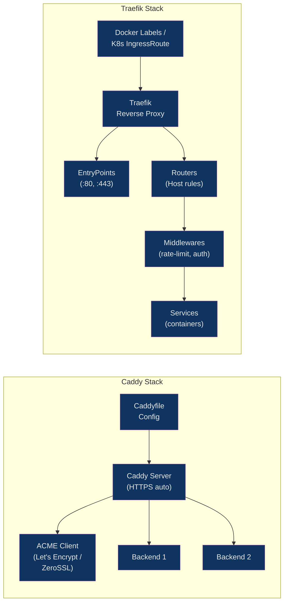

# 🆕 Caddy and Modern Web Servers

> [!abstract] TL;DR
> Caddy is a Go-based web server that provisions and renews TLS certificates automatically via ACME without any configuration. Its `Caddyfile` syntax is dramatically simpler than nginx or Apache — a site block header replaces 10+ lines of config. Traefik is a cloud-native reverse proxy designed for containerized environments, using Docker labels or Kubernetes CRDs for dynamic config rather than static files. Both are strong alternatives to nginx for teams that value reduced operational overhead over maximum tunability.

## Intuition

Nginx is a high-performance race car — fast and configurable, but you need a mechanic team. Caddy is a Tesla — handles the routine maintenance (TLS certificates, HTTPS redirects) automatically, and you drive it with a simple interface. Traefik is a smart highway interchange — it reads the license plates of containers as they appear and automatically routes traffic to them without you ever changing the signage.

## How It Works



## Key Concepts / Details

### Caddyfile Syntax

A Caddyfile uses the site address as the block header. No `listen` directives needed — Caddy figures out ports from the address.

```caddy
# /etc/caddy/Caddyfile

# Automatic HTTPS — Caddy obtains cert from Let's Encrypt automatically
example.com {
    reverse_proxy localhost:3000
}

# Multiple domains — one cert per site
api.example.com {
    reverse_proxy /v1/* localhost:8001
    reverse_proxy /v2/* localhost:8002
}

# Static file server
static.example.com {
    root * /var/www/static
    file_server browse     # directory listing enabled
}

# Redirect www → non-www (automatic in Caddy 2 with handle_path)
www.example.com {
    redir https://example.com{uri} permanent
}

# HTTP only (disable automatic HTTPS for local dev)
:8080 {
    file_server
    root * ./public
}
```

### Automatic HTTPS — How It Works

```
1. Caddy starts, reads Caddyfile
2. For each site with a hostname (not IP/localhost):
   a. Checks if cert exists in storage (~/.local/share/caddy or /var/lib/caddy)
   b. If not, initiates ACME HTTP-01 challenge:
      - Registers with CA (Let's Encrypt / ZeroSSL)
      - Serves challenge token at /.well-known/acme-challenge/<token>
      - CA verifies, issues cert
3. Cert stored and auto-renewed 30 days before expiry
4. HTTP → HTTPS redirect configured automatically
5. TLS 1.2/1.3 only, strong ciphers — no manual ssl_protocols needed
```

```caddy
# DNS-01 Challenge (for wildcard certs, no port 80 needed)
# Requires DNS provider plugin (e.g., cloudflare)
*.example.com {
    tls {
        dns cloudflare {env.CF_API_TOKEN}
    }
    reverse_proxy localhost:3000
}

# On-Demand TLS — obtain cert for any hostname at connection time
# Useful for multi-tenant SaaS platforms
{
    on_demand_tls {
        ask http://localhost:9000/check-domain
        interval 2m
        burst 5
    }
}
```

### Reverse Proxy with Caddy

```caddy
api.example.com {
    # Load balancing — multiple backends
    reverse_proxy {
        to localhost:3000 localhost:3001 localhost:3002

        # Load balancing policy
        lb_policy round_robin          # or: least_conn, random, random_choose 2, ip_hash

        # Health checking
        health_uri /health
        health_interval 10s
        health_timeout  5s
        health_status   200

        # Retry on failure
        lb_retries 3
        lb_try_duration 5s
    }

    # Headers
    header_up X-Real-IP {remote_host}
    header_up X-Forwarded-Proto {scheme}
    header_up -X-Powered-By     # Remove header from upstream response

    # Timeouts
    transport http {
        dial_timeout       5s
        response_header_timeout 30s
        keepalive          30s
        keepalive_idle_conns 100
    }
}
```

### Static File Server & Common Directives

```caddy
files.example.com {
    root * /srv/files
    file_server browse

    # Try files, fall back to 404
    try_files {path} {path}/ =404

    # Gzip + Zstandard compression
    encode zstd gzip

    # Custom headers
    header {
        Cache-Control "public, max-age=3600"
        X-Content-Type-Options nosniff
        -Server    # Remove Server header
    }

    # Redirect /old → /new
    redir /old /new permanent

    # Rate limiting (requires caddy-ratelimit plugin)
    rate_limit {
        zone dynamic {
            key {remote_host}
            events 100
            window 1m
        }
    }

    # Basic auth
    basicauth /admin/* {
        user JDJhJDE0JHh5... # bcrypt hash (caddy hash-password)
    }
}
```

### Caddy Admin API

Caddy exposes a REST API for dynamic config management — no reload signal needed.

```bash
# Default admin endpoint
curl http://localhost:2019/config/

# Hot-reload config via API (JSON format)
curl -X POST http://localhost:2019/load \
  -H "Content-Type: application/json" \
  -d @caddy.json

# Add a route dynamically
curl -X POST http://localhost:2019/config/apps/http/servers/srv0/routes \
  -H "Content-Type: application/json" \
  -d '{"match":[{"host":["new.example.com"]}],"handle":[{"handler":"reverse_proxy","upstreams":[{"dial":"localhost:4000"}]}]}'

# Graceful reload via signal (also works)
systemctl reload caddy
```

### Caddy Plugins — xcaddy

```bash
# Build Caddy with custom plugins
go install github.com/caddyserver/xcaddy/cmd/xcaddy@latest

xcaddy build \
    --with github.com/caddy-dns/cloudflare \
    --with github.com/mholt/caddy-ratelimit \
    --with github.com/greenpau/caddy-security

# The resulting binary includes all plugins statically linked
./caddy run --config /etc/caddy/Caddyfile
```

### Traefik — Container-Native Proxy

Traefik is configured via providers (Docker, Kubernetes, file) rather than a static config file. Labels on containers become routing rules automatically.

```yaml
# docker-compose.yml
version: "3.8"

services:
  traefik:
    image: traefik:v3.0
    command:
      - "--api.insecure=true"           # Dashboard on :8080
      - "--providers.docker=true"
      - "--providers.docker.exposedbydefault=false"
      - "--entrypoints.web.address=:80"
      - "--entrypoints.websecure.address=:443"
      - "--certificatesresolvers.letsencrypt.acme.tlschallenge=true"
      - "--certificatesresolvers.letsencrypt.acme.email=admin@example.com"
      - "--certificatesresolvers.letsencrypt.acme.storage=/letsencrypt/acme.json"
    ports:
      - "80:80"
      - "443:443"
      - "8080:8080"   # Dashboard
    volumes:
      - /var/run/docker.sock:/var/run/docker.sock:ro
      - ./letsencrypt:/letsencrypt

  webapp:
    image: my-app:latest
    labels:
      - "traefik.enable=true"
      - "traefik.http.routers.webapp.rule=Host(`app.example.com`)"
      - "traefik.http.routers.webapp.entrypoints=websecure"
      - "traefik.http.routers.webapp.tls.certresolver=letsencrypt"
      - "traefik.http.services.webapp.loadbalancer.server.port=3000"
      # Middleware: rate limiting
      - "traefik.http.middlewares.ratelimit.ratelimit.average=100"
      - "traefik.http.middlewares.ratelimit.ratelimit.burst=50"
      - "traefik.http.routers.webapp.middlewares=ratelimit"
```

### Traefik Kubernetes IngressRoute (CRD)

```yaml
# Traefik uses its own CRDs instead of standard Ingress
apiVersion: traefik.io/v1alpha1
kind: IngressRoute
metadata:
  name: webapp-route
  namespace: production
spec:
  entryPoints:
    - websecure
  routes:
    - match: Host(`app.example.com`) && PathPrefix(`/api`)
      kind: Rule
      services:
        - name: webapp-service
          port: 3000
      middlewares:
        - name: rate-limit-middleware
  tls:
    certResolver: letsencrypt
---
apiVersion: traefik.io/v1alpha1
kind: Middleware
metadata:
  name: rate-limit-middleware
spec:
  rateLimit:
    average: 100
    burst: 50
```

### Server Comparison Table

| Feature | Nginx | Apache | Caddy | Traefik |
|---|---|---|---|---|
| **Config complexity** | Medium | High | Low | Low (label-based) |
| **Automatic HTTPS** | No (manual certbot) | No (manual) | Yes (built-in) | Yes (built-in) |
| **Config reload** | Signal (`nginx -s reload`) | `apachectl graceful` | API or signal | Hot-reload (API) |
| **K8s integration** | Ingress Controller (nginx) | Rare | Ingress controller | Native IngressRoute CRD |
| **Dynamic config** | No (file + reload) | .htaccess (runtime) | Admin API | Provider auto-discovery |
| **Performance** | Excellent | Good | Very good | Good |
| **Memory usage** | Low | Medium | Medium | Medium |
| **Plugin system** | Compiled modules | Runtime modules | xcaddy (compiled) | Plugins (compiled) |
| **Best for** | High-perf, fine-grained tuning | Legacy PHP, shared hosting | Simplicity + auto-TLS | Docker/K8s environments |

### When to Choose Each

```
Nginx    → High-traffic production, fine-grained caching, complex routing rules,
           existing ops team familiar with it, maximum performance tuning

Apache   → Legacy PHP applications (mod_php), shared hosting, .htaccess required
           by application framework, Apache-specific modules needed

Caddy    → Small to medium projects, teams that want zero TLS ops burden,
           rapid prototyping, non-ops teams, self-hosted with public domain

Traefik  → Microservices on Docker Compose, Kubernetes clusters,
           frequent container deployments where static configs become unwieldy,
           need for automatic service discovery
```

## Real-World Notes

- Caddy stores certificates in `/var/lib/caddy/.local/share/caddy` — this directory must be backed up or persisted (in containers, mount a volume) or certs are re-requested on every restart, potentially hitting Let's Encrypt rate limits (50 certs/domain/week).
- Traefik's `exposedbydefault=false` label is a security-critical default — without it, every container in Docker gets a public route automatically, exposing internal services.
- Caddy's On-Demand TLS requires an `ask` endpoint that returns 200 for valid domains and non-200 for invalid ones — without this gate, any attacker can trigger cert issuance for arbitrary domains using your Caddy instance.
- Traefik's dashboard exposes full routing config — always put it behind authentication middleware in production (`--api.insecure=true` is for local dev only).

## Common Pitfalls

1. **Caddy cert storage not persisted in Docker** — Running Caddy in a container without a named volume for cert storage causes it to re-request certificates on every restart. Hitting Let's Encrypt's 5 duplicate-cert/week limit results in hours-long lockout.
2. **Traefik `exposedbydefault=true`** — Default in older versions; leaves all containers publicly accessible. Always set `exposedbydefault=false` and explicitly opt in containers with `traefik.enable=true`.
3. **Port mismatch in Traefik labels** — `traefik.http.services.webapp.loadbalancer.server.port` must match the port the container application actually listens on — not the Docker published port. A mismatch silently results in 502.
4. **Caddy `on_demand_tls` without `ask` guard** — Without a validation endpoint, Caddy will attempt to issue a certificate for any hostname that connects, making it trivially abusable to exhaust your ACME account rate limits.
5. **Mixing Caddyfile and JSON config** — Caddy's JSON API config and Caddyfile are equivalent but separate — editing the Caddyfile on disk while using the API can cause the API config to be overwritten on restart. Use one consistently.

## Related Concepts

- [[Nginx_Configuration]]
- [[Nginx_as_Reverse_Proxy]]
- [[Apache_Configuration]]
- [[Web_Server_Security]]
- [[../05_Containers/Docker_Networking|Docker Networking]]
- [[../06_Kubernetes/Kubernetes_Ingress|Kubernetes Ingress]]

## Review Questions

1. How does Caddy obtain a TLS certificate without any manual configuration, and what protocol does it use?
2. A Caddy instance running in Docker keeps losing its certificates on restart — what is the fix?
3. In Traefik, a container is running but not receiving traffic even though labels are set. What is the first label to check?
4. What is On-Demand TLS in Caddy and why is the `ask` endpoint mandatory for security?

## Sources

- [Caddy Documentation](https://caddyserver.com/docs/)
- [Caddyfile Concepts](https://caddyserver.com/docs/caddyfile/concepts)
- [Traefik Documentation](https://doc.traefik.io/traefik/)
- [Traefik Getting Started with Docker](https://doc.traefik.io/traefik/getting-started/quick-start/)
- [xcaddy — Build Custom Caddy](https://github.com/caddyserver/xcaddy)

#DevOps #Caddy #Traefik #WebServer #AutomaticHTTPS #ACME #ContainerProxy #Kubernetes
