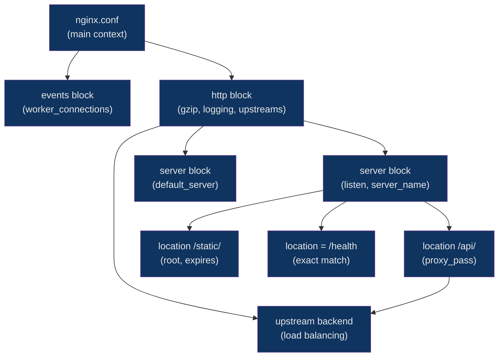

# ⚙️ Nginx Configuration

> [!abstract] TL;DR
> Nginx uses a hierarchical configuration file structure where directives cascade from outer contexts into inner ones. The main contexts are `main`, `events`, `http`, `server`, and `location` — each narrowing scope. Server blocks act as virtual hosts, and location blocks route requests within a server. Directives like `gzip`, `limit_req_zone`, and `log_format` provide compression, rate limiting, and structured logging with minimal overhead.

## Intuition

Think of nginx.conf like a set of nested Russian dolls: the outermost doll (main context) contains global rules, and every inner doll (events → http → server → location) inherits from its parent but can override anything it wants. A request travels inward until it finds the most specific rule that matches, then bounces back out with a response.

## How It Works



**Request matching order for location blocks:**
1. Exact match `=` — checked first, stops immediately on match
2. Preferential prefix `^~` — stops if matched, no regex attempted
3. Regex matches `~` (case-sensitive) and `~*` (case-insensitive) — first match wins
4. Longest prefix `/` — fallback

## Key Concepts / Details

### Context Hierarchy

```nginx
# /etc/nginx/nginx.conf

# --- MAIN CONTEXT ---
user www-data;
worker_processes auto;          # one per CPU core
error_log /var/log/nginx/error.log warn;
pid /run/nginx.pid;

# --- EVENTS BLOCK ---
events {
    worker_connections 1024;    # max simultaneous connections per worker
    use epoll;                  # Linux kernel event model (auto-detected)
    multi_accept on;
}

# --- HTTP BLOCK ---
http {
    include       /etc/nginx/mime.types;
    default_type  application/octet-stream;

    sendfile        on;
    keepalive_timeout 65;

    # Include all site configs
    include /etc/nginx/conf.d/*.conf;
    include /etc/nginx/sites-enabled/*;
}
```

### Server Blocks (Virtual Hosts)

```nginx
server {
    listen 80 default_server;       # default_server catches unmatched requests
    listen [::]:80 default_server;
    server_name example.com www.example.com;

    root /var/www/html;
    index index.html index.htm;

    # Redirect HTTP → HTTPS
    return 301 https://$host$request_uri;
}

server {
    listen 443 ssl;
    server_name example.com;

    root /var/www/example.com;
    index index.html;
}
```

### Location Blocks — Priority & Matching

```nginx
server {
    # 1. Exact match (highest priority)
    location = /favicon.ico {
        access_log off;
        return 204;
    }

    # 2. Preferential prefix (stops regex scan)
    location ^~ /images/ {
        root /var/www;
        expires 30d;
    }

    # 3. Case-sensitive regex
    location ~ \.php$ {
        fastcgi_pass unix:/run/php/php8.2-fpm.sock;
    }

    # 4. Case-insensitive regex
    location ~* \.(css|js|woff2)$ {
        expires 1y;
        add_header Cache-Control "public, immutable";
    }

    # 5. Prefix fallback (lowest priority)
    location / {
        try_files $uri $uri/ =404;
    }
}
```

### root vs alias — The Key Difference

```nginx
# root appends the full location path
location /static/ {
    root /var/www;
    # Request: /static/app.js → File: /var/www/static/app.js
}

# alias REPLACES the location prefix
location /static/ {
    alias /var/www/assets/;
    # Request: /static/app.js → File: /var/www/assets/app.js
    # Note: trailing slash on alias is required when location has trailing slash
}
```

### Upstream Groups & Load Balancing

```nginx
upstream backend {
    # Default: round-robin
    server 10.0.0.1:8080 weight=3;
    server 10.0.0.2:8080 weight=1;
    server 10.0.0.3:8080 max_fails=3 fail_timeout=30s;
    server 10.0.0.4:8080 backup;      # used only when others are down

    keepalive 32;   # keep this many idle connections to upstream
}

upstream api_servers {
    least_conn;     # route to server with fewest active connections
    server 10.0.1.1:3000;
    server 10.0.1.2:3000;
}
```

### gzip Compression

```nginx
http {
    gzip on;
    gzip_vary on;              # Vary: Accept-Encoding header
    gzip_proxied any;          # compress responses from proxy backends
    gzip_comp_level 6;         # 1 (fastest) to 9 (best ratio); 6 is sweet spot
    gzip_min_length 256;       # don't compress tiny responses
    gzip_types
        text/plain text/css text/xml
        application/json application/javascript application/xml
        image/svg+xml font/woff2;
}
```

### Rate Limiting

```nginx
http {
    # Define zone: key=IP, zone name=api_limit, 10MB shared memory, 10 req/sec
    limit_req_zone $binary_remote_addr zone=api_limit:10m rate=10r/s;
    limit_req_zone $binary_remote_addr zone=login_limit:10m rate=5r/m;

    server {
        location /api/ {
            limit_req zone=api_limit burst=20 nodelay;
            # burst: allow queue of 20 extra requests
            # nodelay: process burst requests immediately, don't delay them
            limit_req_status 429;
        }

        location /login {
            limit_req zone=login_limit burst=3;
        }
    }
}
```

### Logging

```nginx
http {
    # Custom log format
    log_format main '$remote_addr - $remote_user [$time_local] '
                    '"$request" $status $body_bytes_sent '
                    '"$http_referer" "$http_user_agent" '
                    '$request_time $upstream_response_time';

    log_format json_combined escape=json
        '{"time":"$time_iso8601",'
        '"ip":"$remote_addr",'
        '"method":"$request_method",'
        '"uri":"$uri",'
        '"status":$status,'
        '"duration":$request_time}';

    access_log /var/log/nginx/access.log main;
    error_log  /var/log/nginx/error.log warn;  # debug|info|notice|warn|error|crit

    server {
        # Per-server log
        access_log /var/log/nginx/example.com.access.log json_combined;
    }
}
```

### Static File Serving with Caching

```nginx
location /static/ {
    root /var/www;
    autoindex off;

    # Cache fingerprinted assets forever
    location ~* \.(js|css|woff2|png|jpg|svg)$ {
        expires 1y;
        add_header Cache-Control "public, immutable";
        access_log off;
    }

    # HTML: no-cache so browsers re-validate
    location ~* \.html$ {
        expires -1;
        add_header Cache-Control "no-cache, must-revalidate";
    }
}

location / {
    try_files $uri $uri/ /index.html;   # SPA fallback
}
```

### Modular Config Organization

```nginx
# nginx.conf
http {
    include /etc/nginx/mime.types;
    include /etc/nginx/conf.d/*.conf;         # shared snippets
    include /etc/nginx/sites-enabled/*.conf;  # site configs (symlinks from sites-available)
}

# /etc/nginx/conf.d/gzip.conf      — gzip settings
# /etc/nginx/conf.d/security.conf  — security headers
# /etc/nginx/snippets/ssl.conf     — SSL params (included in server blocks)
```

### Config Testing & Reload

```bash
# Test config syntax without reloading
nginx -t

# Full output with config file locations
nginx -T

# Graceful reload (no dropped connections)
nginx -s reload

# Or via systemd
systemctl reload nginx
```

## Real-World Notes

- `worker_processes auto` is almost always correct — it pins one worker per logical CPU core. Manually setting it higher does not help and increases context-switch overhead.
- The `try_files` directive is critical for SPAs: `try_files $uri $uri/ /index.html` lets the frontend router handle all paths instead of nginx returning 404.
- `keepalive` in an upstream block is frequently overlooked but dramatically reduces TCP handshake overhead for high-traffic reverse proxy setups — set it to roughly 2x your expected concurrent upstream connections.
- Always use `nginx -t` in CI before deploying a config change; a bad config will cause reload to silently fail, leaving the old config running.

## Common Pitfalls

1. **Trailing slash with `proxy_pass`** — `proxy_pass http://backend` preserves the location prefix in the upstream URL; `proxy_pass http://backend/` strips it. This difference causes subtle 404s when proxying to `/api/` backends.
2. **`root` inside location block** — Placing `root` inside every location block instead of inheriting from the server block means a typo in one location exposes a wrong directory without warning.
3. **`alias` without trailing slash** — `alias /var/www/assets` (no trailing slash) when the location ends in `/` causes doubled slashes or path mismatches. Always match trailing slashes.
4. **`limit_req_zone` in server/location context** — The zone definition (`limit_req_zone`) must be in the `http` context, not inside a `server` or `location` block; only `limit_req` goes inside server/location.
5. **Reloading after syntax errors** — `nginx -s reload` does nothing if `nginx -t` would fail — the old config stays running silently. Always run `nginx -t` first and check the exit code.

## Related Concepts

- [[Nginx_as_Reverse_Proxy]]
- [[Apache_Configuration]]
- [[Caddy_and_Modern_Servers]]
- [[Web_Server_Security]]
- [[../08_Load_Balancing/Load_Balancing_Algorithms|Load Balancing Algorithms]]
- [[../09_CDN/CDN_Fundamentals|CDN Fundamentals]]

## Review Questions

1. A location block with `^~` matched a request — will nginx continue checking regex location blocks? Why or why not?
2. What is the behavioral difference between `root` and `alias` directives, and when would using `alias` cause a path error?
3. You define `limit_req_zone` inside a `server` block and nginx fails to reload — what is wrong and where should it go?
4. How does `keepalive 32` in an upstream block differ from `keepalive_timeout` in the http block?

## Sources

- [Nginx Beginner's Guide](https://nginx.org/en/docs/beginners_guide.html)
- [Nginx Location Block Docs](https://nginx.org/en/docs/http/ngx_http_core_module.html#location)
- [ngx_http_limit_req_module](https://nginx.org/en/docs/http/ngx_http_limit_req_module.html)
- [DigitalOcean: Understanding the Nginx Config File](https://www.digitalocean.com/community/tutorials/understanding-the-nginx-configuration-file-structure-and-configuration-contexts)

#DevOps #Nginx #WebServer #Configuration #RateLimiting #VirtualHosts
