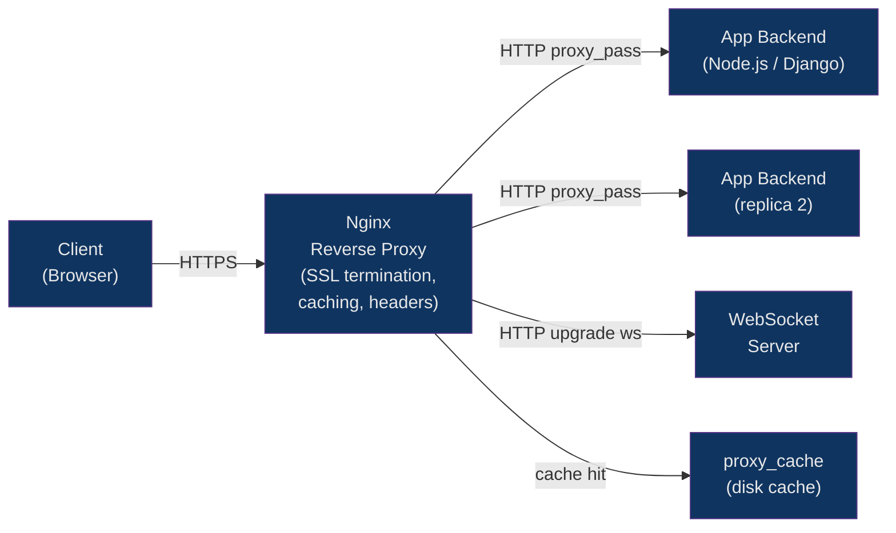
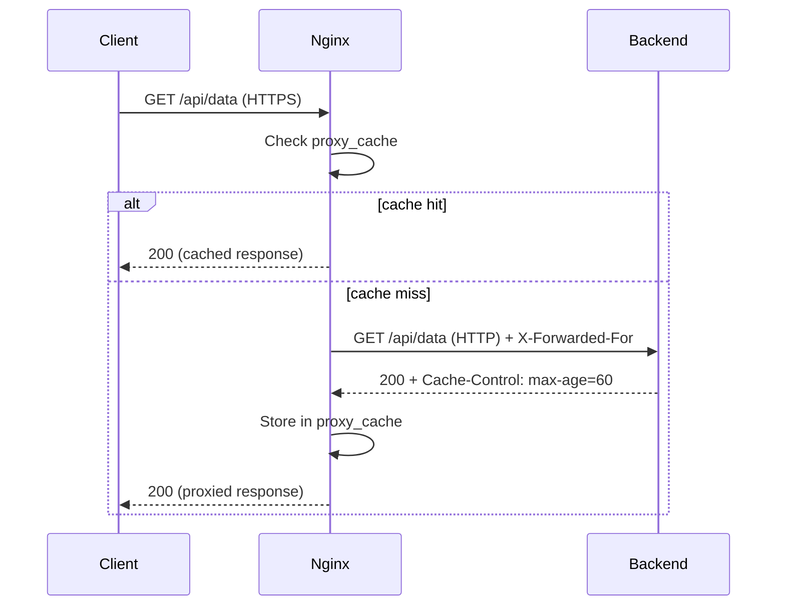

# 🔀 Nginx as Reverse Proxy

> [!abstract] TL;DR
> Nginx sits in front of backend services, forwarding client requests via `proxy_pass` and returning upstream responses — while handling SSL termination, header injection, and caching itself. The `proxy_set_header` directives preserve the original client identity across the proxy boundary. Nginx open-source uses passive health checks (removing failed servers after `max_fails` threshold), while Nginx Plus adds active probing. The `proxy_cache` subsystem stores upstream responses on disk to serve repeat requests without hitting backends.

## Intuition

A reverse proxy is like a hotel concierge: guests (clients) always speak to the concierge, who decides which room service kitchen (backend) should handle each order, forwards it, and brings the response back. The kitchen never talks directly to the guest. The concierge can also cache common orders ("a glass of water") without bothering the kitchen at all.

## How It Works





## Key Concepts / Details

### Basic proxy_pass Configuration

```nginx
upstream nodejs_app {
    server 127.0.0.1:3000;
    server 127.0.0.1:3001;
    keepalive 16;
}

server {
    listen 80;
    server_name api.example.com;

    location / {
        proxy_pass http://nodejs_app;
        # Trailing slash gotcha:
        #   proxy_pass http://nodejs_app        → /api/v1/user → /api/v1/user (prefix kept)
        #   proxy_pass http://nodejs_app/       → /api/v1/user → /user (prefix stripped)
    }
}
```

### Header Forwarding — Preserving Client Identity

```nginx
location / {
    proxy_pass http://nodejs_app;

    # Tell backend the real client IP
    proxy_set_header X-Real-IP          $remote_addr;
    proxy_set_header X-Forwarded-For    $proxy_add_x_forwarded_for;
    # $proxy_add_x_forwarded_for appends to existing XFF header (correct for chained proxies)

    # Tell backend the original scheme (http vs https)
    proxy_set_header X-Forwarded-Proto  $scheme;

    # Pass the original Host header (not upstream's IP)
    proxy_set_header Host               $host;

    # Remove internal headers before passing upstream
    proxy_set_header X-Internal-Secret "";

    # Required for HTTP/1.1 keepalive to upstream
    proxy_http_version 1.1;
    proxy_set_header Connection "";
}
```

### Timeout Tuning

```nginx
location /api/ {
    proxy_pass http://backend;

    proxy_connect_timeout  5s;    # Time to establish TCP connection to upstream
    proxy_send_timeout    15s;    # Time between two successive writes to upstream
    proxy_read_timeout    60s;    # Time to wait for upstream response (reset per chunk)
    # For long-running requests (file uploads, streaming), increase proxy_read_timeout
}
```

### Load Balancing Strategies

```nginx
# Round-robin (default) — equal distribution
upstream rr_backend {
    server 10.0.0.1:8080;
    server 10.0.0.2:8080;
}

# Least connections — best for unequal request durations
upstream lc_backend {
    least_conn;
    server 10.0.0.1:8080;
    server 10.0.0.2:8080;
}

# IP hash — sticky sessions (same client → same server)
upstream sticky_backend {
    ip_hash;
    server 10.0.0.1:8080;
    server 10.0.0.2:8080;
}

# Weighted — route more traffic to powerful nodes
upstream weighted_backend {
    server 10.0.0.1:8080 weight=4;
    server 10.0.0.2:8080 weight=1;
}

# Passive health checks (open source)
upstream resilient_backend {
    server 10.0.0.1:8080 max_fails=3 fail_timeout=30s;
    server 10.0.0.2:8080 max_fails=3 fail_timeout=30s;
    server 10.0.0.3:8080 backup;
}
```

### WebSocket Proxying

```nginx
# WebSocket requires HTTP/1.1 upgrade handshake
map $http_upgrade $connection_upgrade {
    default upgrade;
    ''      close;
}

server {
    location /ws/ {
        proxy_pass http://ws_backend;

        proxy_http_version 1.1;
        proxy_set_header Upgrade    $http_upgrade;
        proxy_set_header Connection $connection_upgrade;
        proxy_set_header Host       $host;

        # WebSocket connections are long-lived — increase timeout
        proxy_read_timeout 3600s;
        proxy_send_timeout 3600s;
    }
}
```

### Proxy Caching

```nginx
http {
    # Cache zone: path, max cache size, inactive expiry
    proxy_cache_path /var/cache/nginx
        levels=1:2
        keys_zone=api_cache:10m    # 10MB for keys (stores ~80k keys)
        max_size=1g                # Max disk usage
        inactive=60m               # Remove if not accessed for 60 min
        use_temp_path=off;

    server {
        location /api/public/ {
            proxy_pass http://backend;
            proxy_cache api_cache;

            # Cache 200/301 for 10min, 404 for 1min
            proxy_cache_valid 200 301 10m;
            proxy_cache_valid 404      1m;

            # Cache key includes method, host, URI, and Accept-Encoding
            proxy_cache_key "$request_method$host$request_uri$http_accept_encoding";

            # Bypass cache if client sends Cache-Control: no-cache
            proxy_cache_bypass $http_cache_control;

            # Serve stale while revalidating (reduces latency)
            proxy_cache_use_stale error timeout updating http_500 http_502 http_503 http_504;

            # Add header to see cache status (HIT/MISS/BYPASS)
            add_header X-Cache-Status $upstream_cache_status;
        }
    }
}
```

### proxy_buffering Tradeoffs

```nginx
location /api/ {
    proxy_pass http://backend;

    # proxy_buffering on (default): nginx buffers full response in memory/disk
    # before sending to client — frees upstream connections faster, good for slow clients
    proxy_buffering on;
    proxy_buffer_size        4k;
    proxy_buffers            8 4k;
    proxy_busy_buffers_size  8k;

    # proxy_buffering off: stream response directly to client
    # Required for SSE (Server-Sent Events) and streaming responses
    # location /events/ { proxy_buffering off; }
}
```

### SSL Termination at Nginx

```nginx
server {
    listen 443 ssl http2;
    server_name api.example.com;

    ssl_certificate     /etc/ssl/certs/api.example.com.crt;
    ssl_certificate_key /etc/ssl/private/api.example.com.key;

    # Only TLS 1.2 and 1.3
    ssl_protocols TLSv1.2 TLSv1.3;

    # Strong cipher suites (prefer ECDHE for forward secrecy)
    ssl_ciphers ECDHE-ECDSA-AES128-GCM-SHA256:ECDHE-RSA-AES128-GCM-SHA256:ECDHE-ECDSA-AES256-GCM-SHA384:ECDHE-RSA-AES256-GCM-SHA384:ECDHE-ECDSA-CHACHA20-POLY1305:ECDHE-RSA-CHACHA20-POLY1305;
    ssl_prefer_server_ciphers off;  # Let TLS 1.3 choose (client preference)

    # Session resumption — reduces TLS handshake latency for repeat clients
    ssl_session_cache   shared:SSL:10m;
    ssl_session_timeout 1d;
    ssl_session_tickets off;  # Disable for PFS

    # OCSP stapling — server fetches and caches cert revocation status
    ssl_stapling on;
    ssl_stapling_verify on;
    resolver 8.8.8.8 1.1.1.1 valid=300s;

    location / {
        proxy_pass http://nodejs_app;   # Proxy to HTTP backend
        proxy_set_header X-Forwarded-Proto https;
        proxy_set_header Host $host;
    }
}
```

### Complete Production Example — Node.js with HTTPS, WebSockets, Caching

```nginx
proxy_cache_path /var/cache/nginx levels=1:2 keys_zone=app_cache:10m max_size=500m inactive=30m;

map $http_upgrade $connection_upgrade {
    default upgrade;
    ''      close;
}

upstream app {
    least_conn;
    server 127.0.0.1:3000 max_fails=3 fail_timeout=15s;
    server 127.0.0.1:3001 max_fails=3 fail_timeout=15s;
    keepalive 32;
}

server {
    listen 80;
    server_name app.example.com;
    return 301 https://$host$request_uri;
}

server {
    listen 443 ssl http2;
    server_name app.example.com;

    ssl_certificate     /etc/letsencrypt/live/app.example.com/fullchain.pem;
    ssl_certificate_key /etc/letsencrypt/live/app.example.com/privkey.pem;
    ssl_protocols TLSv1.2 TLSv1.3;
    ssl_session_cache shared:SSL:10m;

    add_header Strict-Transport-Security "max-age=31536000; includeSubDomains" always;
    add_header X-Content-Type-Options nosniff always;

    # WebSocket endpoint
    location /ws {
        proxy_pass http://app;
        proxy_http_version 1.1;
        proxy_set_header Upgrade    $http_upgrade;
        proxy_set_header Connection $connection_upgrade;
        proxy_set_header Host       $host;
        proxy_read_timeout 86400s;
    }

    # Cacheable API
    location /api/v1/public/ {
        proxy_pass http://app;
        proxy_cache app_cache;
        proxy_cache_valid 200 5m;
        proxy_cache_use_stale updating error timeout;
        add_header X-Cache-Status $upstream_cache_status;
        proxy_set_header Host               $host;
        proxy_set_header X-Real-IP          $remote_addr;
        proxy_set_header X-Forwarded-For    $proxy_add_x_forwarded_for;
        proxy_set_header X-Forwarded-Proto  $scheme;
    }

    # All other requests
    location / {
        proxy_pass http://app;
        proxy_http_version 1.1;
        proxy_set_header Connection "";
        proxy_set_header Host               $host;
        proxy_set_header X-Real-IP          $remote_addr;
        proxy_set_header X-Forwarded-For    $proxy_add_x_forwarded_for;
        proxy_set_header X-Forwarded-Proto  $scheme;
        proxy_connect_timeout  5s;
        proxy_read_timeout    30s;
    }
}
```

## Real-World Notes

- `proxy_add_x_forwarded_for` appends the connecting client's IP to any existing `X-Forwarded-For` header — crucial for correct IP chaining when multiple proxies are involved (CDN → nginx → app).
- Setting `proxy_http_version 1.1` with `proxy_set_header Connection ""` is required to enable HTTP/1.1 keepalive to upstream servers; without it, nginx falls back to HTTP/1.0 and opens a new TCP connection per request.
- The `proxy_cache_use_stale updating` directive is a high-availability technique: if a cached entry is expired but being refreshed, nginx serves the old cached version to avoid latency spikes during revalidation.
- Nginx Plus (commercial) supports active upstream health checks (periodic HTTP probes) and slow-start; open-source nginx only does passive health checks by counting failed requests.

## Common Pitfalls

1. **Trailing slash asymmetry with `proxy_pass`** — `proxy_pass http://backend/` strips the matched location prefix from the forwarded URL; omitting the slash preserves it. Mixing these across locations causes hard-to-debug 404s on backends.
2. **Not setting `X-Forwarded-Proto`** — Backend sees HTTP even though client connected over HTTPS, causing redirect loops (app redirects to HTTPS, nginx proxies as HTTP again indefinitely).
3. **WebSocket timeout defaults** — The default `proxy_read_timeout` (60s) terminates idle WebSocket connections every minute. Always set `proxy_read_timeout` to a value larger than your heartbeat interval for WebSocket locations.
4. **Caching authenticated responses** — Without carefully setting `proxy_cache_bypass $cookie_session` or `proxy_no_cache`, nginx can cache and serve one user's data to another user. Always exclude auth-gated endpoints from caching.
5. **Ignoring `keepalive` in upstream blocks** — Without `keepalive`, nginx establishes a new TCP+TLS connection per request to upstream. Under moderate load this dominates latency; add `keepalive 16` and `proxy_http_version 1.1`.

## Related Concepts

- [[Nginx_Configuration]]
- [[Web_Server_Security]]
- [[Caddy_and_Modern_Servers]]
- [[../08_Load_Balancing/Load_Balancing_Algorithms|Load Balancing Algorithms]]
- [[../09_CDN/CDN_Caching|CDN Caching]]

## Review Questions

1. What single directive difference between `proxy_pass http://backend` and `proxy_pass http://backend/` causes different URL forwarding behavior, and why?
2. A client connects over HTTPS, but your backend application generates `http://` links. Which header must nginx inject to fix this, and what value should it have?
3. How does nginx open-source detect that an upstream server is unhealthy, and what happens once `fail_timeout` expires?
4. You have a cached `/api/data` endpoint and want to ensure user A's response is never served to user B. What cache key or bypass directive would you configure?

## Sources

- [ngx_http_proxy_module Docs](https://nginx.org/en/docs/http/ngx_http_proxy_module.html)
- [Nginx WebSocket Proxying](https://nginx.org/en/docs/http/websocket.html)
- [Nginx Caching Guide](https://docs.nginx.com/nginx/admin-guide/content-cache/content-caching/)
- [DigitalOcean: Nginx Reverse Proxy](https://www.digitalocean.com/community/tutorials/how-to-set-up-nginx-load-balancing)

#DevOps #Nginx #ReverseProxy #LoadBalancing #SSLTermination #Caching #WebSocket
