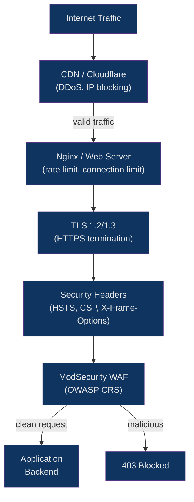

# 🔒 Web Server Security

> [!abstract] TL;DR
> Web server security spans TLS configuration (disabling old protocols, enforcing PFS cipher suites), HTTP security headers (HSTS, CSP, X-Frame-Options), server identity hiding, DDoS mitigation via rate limiting and connection limits, and WAF deployment with ModSecurity's OWASP Core Rule Set. HSTS forces browsers to refuse plaintext connections; CSP blocks XSS attack vectors by allowlisting script sources. Getting HSTS wrong (e.g., premature `preload`) can lock a domain off the web — it requires careful rollout. Tools like `ssllabs.com` and `testssl.sh` provide authoritative TLS grading.

## Intuition

Securing a web server is like hardening a building: TLS is the locked front door (and you remove the old skeleton keys — SSL 3.0, TLS 1.0); security headers are warning signs posted at every entrance telling browsers exactly what they're allowed to do inside; ModSecurity is the security guard checking bags at the door. The goal is defense-in-depth — attackers who bypass one layer face the next.

## How It Works



## Key Concepts / Details

### TLS Configuration Best Practices

```nginx
# /etc/nginx/snippets/ssl-params.conf

# Protocols: only TLS 1.2 and 1.3 — disable 1.0 and 1.1 (deprecated by RFC 8996)
ssl_protocols TLSv1.2 TLSv1.3;

# Cipher suites for TLS 1.2 (TLS 1.3 ciphers are fixed and always strong)
# Prefer ECDHE for Perfect Forward Secrecy; AES-GCM and ChaCha20 for AEAD
ssl_ciphers ECDHE-ECDSA-AES128-GCM-SHA256:ECDHE-RSA-AES128-GCM-SHA256:ECDHE-ECDSA-AES256-GCM-SHA384:ECDHE-RSA-AES256-GCM-SHA384:ECDHE-ECDSA-CHACHA20-POLY1305:ECDHE-RSA-CHACHA20-POLY1305:DHE-RSA-AES128-GCM-SHA256:DHE-RSA-AES256-GCM-SHA384;

# Let TLS 1.3 clients pick their preferred cipher (best for TLS 1.3)
# For TLS 1.2 we still use server preference (prevents downgrade attacks)
ssl_prefer_server_ciphers off;

# Elliptic curves (for ECDHE key exchange)
ssl_ecdh_curve X25519:prime256v1:secp384r1;

# Session resumption — reduces handshake overhead for repeat clients
ssl_session_cache   shared:SSL:50m;
ssl_session_timeout 1d;
ssl_session_tickets off;    # Disable — tickets can compromise PFS if ticket key leaks

# DH parameters for DHE cipher suites (generate with: openssl dhparam -out dhparam.pem 4096)
ssl_dhparam /etc/ssl/dhparam.pem;

# OCSP Stapling — server fetches and caches revocation status, includes with handshake
ssl_stapling         on;
ssl_stapling_verify  on;
ssl_trusted_certificate /etc/ssl/certs/chain.pem;  # Full chain for OCSP verification
resolver 1.1.1.1 8.8.8.8 valid=300s;
resolver_timeout 5s;
```

**Perfect Forward Secrecy (PFS):** ECDHE and DHE key exchanges generate a unique ephemeral session key per connection. Even if the server's private key is later compromised, past sessions cannot be decrypted — each session key existed only in RAM.

### HSTS — HTTP Strict Transport Security

```nginx
# Tell browsers: NEVER connect to this domain over HTTP, ever
add_header Strict-Transport-Security "max-age=31536000; includeSubDomains; preload" always;
```

**HSTS rollout — do it in stages:**

```
Stage 1: max-age=300                   # 5 minutes — test that HTTPS works everywhere
Stage 2: max-age=86400                 # 1 day — monitor for broken subdomains
Stage 3: max-age=2592000               # 30 days — normal operations
Stage 4: max-age=31536000              # 1 year — stable, can apply for preload list
Stage 5: max-age=31536000; includeSubDomains; preload  # After all subdomains are HTTPS-ready
```

**`includeSubDomains` danger:** Adding this when any subdomain (e.g., `legacy.example.com`) doesn't support HTTPS makes that subdomain permanently unreachable via browsers until the HSTS max-age expires. Audit all subdomains first.

**`preload` danger:** Submitting to the [HSTS preload list](https://hstspreload.org) is nearly irreversible — browsers ship with the list hard-coded. Removal takes months and requires a browser release cycle.

### Security Headers

```nginx
# /etc/nginx/snippets/security-headers.conf

# CSP — allowlist where scripts, styles, images can load from
# Start with report-only to find violations before enforcing
add_header Content-Security-Policy-Report-Only
    "default-src 'self'; script-src 'self' https://cdn.example.com; style-src 'self' 'unsafe-inline'; img-src 'self' data: https:; report-uri /csp-report" always;

# Enforce CSP (after validating report-only doesn't break anything)
add_header Content-Security-Policy
    "default-src 'self'; script-src 'self' https://cdn.example.com; style-src 'self'; img-src 'self' data:; font-src 'self'; connect-src 'self' https://api.example.com; frame-ancestors 'none'; base-uri 'self'; form-action 'self'" always;

# Prevent clickjacking — don't allow this site to be framed
add_header X-Frame-Options "SAMEORIGIN" always;
# Or: "DENY" to prevent all framing (including same origin)

# Prevent MIME type sniffing — browser respects Content-Type header
add_header X-Content-Type-Options "nosniff" always;

# Control referrer information sent to third-party sites
add_header Referrer-Policy "strict-origin-when-cross-origin" always;

# Disable browser features you don't use
add_header Permissions-Policy "camera=(), microphone=(), geolocation=(), payment=()" always;

# X-XSS-Protection is deprecated in modern browsers (CSP replaces it)
# but some scanners still flag its absence; set to disabled to prevent bypasses
add_header X-XSS-Protection "0" always;
```

**CSP directive quick reference:**

| Directive | Controls |
|---|---|
| `default-src` | Fallback for all fetch directives |
| `script-src` | JavaScript sources |
| `style-src` | CSS sources |
| `img-src` | Image sources |
| `connect-src` | XHR, Fetch, WebSocket destinations |
| `frame-ancestors` | Who can embed this page (replaces X-Frame-Options) |
| `form-action` | Where forms can submit |
| `base-uri` | Allowed `<base>` element URLs |

### Hiding Server Identity

```nginx
# nginx — remove version from Server header
http {
    server_tokens off;    # Server: nginx  (not: nginx/1.25.3)
}

# For complete removal, use headers_more module:
# more_clear_headers Server;
```

```apache
# Apache — minimal server info in response
ServerTokens Prod       # Server: Apache  (not: Apache/2.4.57 Ubuntu)
ServerSignature Off     # No version in error pages
```

```caddy
# Caddy — remove Server header entirely
header -Server
```

### DDoS Mitigation Basics

```nginx
# Connection limits (limit_conn_module)
http {
    limit_conn_zone $binary_remote_addr zone=conn_per_ip:10m;

    server {
        limit_conn conn_per_ip 20;    # Max 20 simultaneous connections per IP
        limit_conn_status 429;
    }
}

# Request rate limits (limit_req_module)
http {
    limit_req_zone $binary_remote_addr zone=req_per_ip:10m rate=50r/s;
    limit_req_zone $binary_remote_addr zone=login:10m     rate=5r/m;

    server {
        location / {
            limit_req zone=req_per_ip burst=100 nodelay;
            limit_req_status 429;
        }

        location /auth/login {
            limit_req zone=login burst=5;
        }
    }
}

# Request body/size limits (protect against large payload attacks)
client_max_body_size 10m;        # Default: 1m; set 0 to disable check
client_body_timeout  12s;
client_header_timeout 12s;
send_timeout 10s;
```

### IP Blocking — Geo Module and Deny Rules

```nginx
# Allow/deny specific IPs
location /admin/ {
    allow 10.0.0.0/8;       # Internal network
    allow 203.0.113.0/24;   # Office IP range
    deny all;               # Block everyone else
}

# Block IPs from a file (nginx Plus or with geo module)
http {
    geo $blocked_ip {
        default          0;
        include /etc/nginx/blocklist.conf;  # ip 1; entries
    }

    server {
        if ($blocked_ip) {
            return 403;
        }
    }
}

# blocklist.conf format:
# 198.51.100.1  1;
# 198.51.100.0/24  1;
```

### ModSecurity WAF

```nginx
# /etc/nginx/nginx.conf — load ModSecurity as dynamic module
load_module modules/ngx_http_modsecurity_module.so;

http {
    modsecurity on;
    modsecurity_rules_file /etc/nginx/modsecurity/main.conf;
}
```

```apache
# /etc/modsecurity/modsecurity.conf

# Detection only — log but don't block (start here)
SecRuleEngine DetectionOnly
# Prevention mode — block matching requests
# SecRuleEngine On

# Log location
SecAuditLog /var/log/modsecurity/audit.log
SecAuditLogParts ABCFHZ
SecAuditLogType Serial

# OWASP Core Rule Set inclusion
Include /usr/share/modsecurity-crs/crs-setup.conf
Include /usr/share/modsecurity-crs/rules/*.conf

# Paranoia level: 1=low FP, 2=moderate, 3=strict, 4=very strict
# Higher = more rules = more false positives
SecAction "id:900000, phase:1, nolog, pass, t:none, setvar:tx.paranoia_level=2"
```

**CRS rule categories (by rule ID range):**

| ID Range | Category |
|---|---|
| 920xxx | Protocol enforcement |
| 930xxx | Local file inclusion (LFI) |
| 931xxx | Remote file inclusion (RFI) |
| 932xxx | OS command injection |
| 933xxx | PHP injection |
| 941xxx | XSS attacks |
| 942xxx | SQL injection |
| 944xxx | Java attacks |

**Tuning false positives:**

```apache
# Disable a specific rule globally
SecRuleRemoveById 942100

# Disable a rule for a specific URI
<LocationMatch "/api/v1/search">
    SecRuleRemoveById 942100 942200
</LocationMatch>

# Add exception by tag
SecRuleUpdateTargetByTag "OWASP_CRS/WEB_ATTACK/SQL_INJECTION" "!ARGS:content"
```

### SSL/TLS Testing Tools

```bash
# testssl.sh — comprehensive command-line TLS scanner
docker run --rm drwetter/testssl.sh example.com

# Check specific issues
testssl.sh --protocols example.com   # which protocols are enabled
testssl.sh --ciphers example.com     # cipher suite audit
testssl.sh --headers example.com     # security headers check

# Mozilla SSL Configuration Generator
# https://ssl-config.mozilla.org/ — generates nginx/apache/HAProxy config
# Choose: Modern (TLS 1.3 only), Intermediate (TLS 1.2+1.3), Old (legacy compat)

# SSL Labs (web-based, detailed grade report)
# https://www.ssllabs.com/ssltest/

# securityheaders.com — scan security headers
curl -I https://example.com | grep -i "strict-transport\|content-security\|x-frame\|x-content-type"
```

### Complete Hardened Nginx HTTPS Server Block

```nginx
# /etc/nginx/sites-enabled/hardened-example.com.conf
include /etc/nginx/snippets/ssl-params.conf;

server {
    listen 80;
    server_name example.com www.example.com;
    return 301 https://example.com$request_uri;
}

server {
    listen 443 ssl http2;
    server_name example.com;

    # TLS (via shared snippet)
    ssl_certificate     /etc/letsencrypt/live/example.com/fullchain.pem;
    ssl_certificate_key /etc/letsencrypt/live/example.com/privkey.pem;

    # Identity hiding
    server_tokens off;

    # Security headers
    add_header Strict-Transport-Security  "max-age=63072000; includeSubDomains; preload" always;
    add_header Content-Security-Policy    "default-src 'self'; script-src 'self'; style-src 'self'; img-src 'self' data:; frame-ancestors 'none'; base-uri 'self'" always;
    add_header X-Frame-Options            "DENY" always;
    add_header X-Content-Type-Options     "nosniff" always;
    add_header Referrer-Policy            "strict-origin-when-cross-origin" always;
    add_header Permissions-Policy         "camera=(), microphone=(), geolocation=()" always;
    add_header X-XSS-Protection           "0" always;

    # DDoS limits
    limit_conn conn_per_ip 30;
    limit_req  zone=req_per_ip burst=100 nodelay;
    client_max_body_size 10m;

    # Root and default
    root  /var/www/example.com/public;
    index index.html;

    # Block hidden files (except .well-known for ACME)
    location ~ /\.(?!well-known) {
        deny all;
        access_log off;
        log_not_found off;
    }

    # Static assets — cached, no access log
    location ~* \.(js|css|png|jpg|jpeg|gif|ico|svg|woff2|ttf)$ {
        expires 1y;
        add_header Cache-Control "public, immutable";
        access_log off;
    }

    # Application
    location / {
        try_files $uri $uri/ /index.html;
        proxy_pass http://app_backend;
        proxy_set_header Host               $host;
        proxy_set_header X-Real-IP          $remote_addr;
        proxy_set_header X-Forwarded-For    $proxy_add_x_forwarded_for;
        proxy_set_header X-Forwarded-Proto  $scheme;
    }
}
```

## Real-World Notes

- Start CSP in `Content-Security-Policy-Report-Only` mode with `report-uri` pointed to a collector (e.g., sentry.io CSP report endpoint). Collect violations for 1-2 weeks before switching to enforcing mode — inline scripts, third-party analytics, and browser extensions routinely cause CSP violations that would break the site.
- The `always` parameter in `add_header` is critical — without it, nginx only adds headers to 200/304 responses. Error pages (4xx, 5xx) will lack the security headers, which scanners penalize.
- PFS cipher suites (ECDHE, DHE) generate a unique session key per connection, making captured traffic undecipherable even if the server's private key is later stolen — this is why `ssl_session_tickets off` pairs with PFS configuration.
- ModSecurity in Detection mode is safe to enable immediately on production — it logs violations without blocking. Review logs for 1-2 weeks before switching to Prevention mode to identify and whitelist false positives for your application.

## Common Pitfalls

1. **`add_header` without `always`** — Security headers are omitted from 4xx/5xx error responses. Security scanners test error pages and report the missing headers, giving a false picture. Always use `add_header ... always`.
2. **Premature HSTS `preload`** — Submitting to the preload list before all subdomains support HTTPS makes those subdomains permanently inaccessible in all major browsers. Roll HSTS out incrementally with short max-age first.
3. **CSP with `'unsafe-inline'` for scripts** — Adding `'unsafe-inline'` to `script-src` nullifies most XSS protection that CSP provides. Use nonces (`'nonce-<random>'`) or hashes for inline scripts instead.
4. **ModSecurity Prevention mode without tuning** — Enabling `SecRuleEngine On` without a tuning period causes false positives that block legitimate requests (e.g., SQL keywords in blog posts trigger SQL injection rules). Always run Detection mode first and collect false positive data.
5. **`ssl_session_tickets on` with PFS ciphers** — Session tickets encrypt resumed sessions with a long-lived ticket key on the server. If that key is compromised (or if it's not rotated), all resumed sessions using tickets can be decrypted — defeating PFS. Disable tickets or rotate the key regularly.

## Related Concepts

- [[Nginx_Configuration]]
- [[Nginx_as_Reverse_Proxy]]
- [[Apache_Configuration]]
- [[Caddy_and_Modern_Servers]]
- [[../11_Security/TLS_SSL_Fundamentals|TLS/SSL Fundamentals]]
- [[../11_Security/OWASP_Top_10|OWASP Top 10]]

## Review Questions

1. Why does `ssl_session_tickets off` matter for Perfect Forward Secrecy, even when ECDHE cipher suites are in use?
2. A security scanner reports that your 404 error page is missing the `X-Frame-Options` header even though it appears on 200 responses — what is the nginx config error and how do you fix it?
3. Describe the correct order for rolling out HSTS from zero to `preload`, and what is the irreversible risk of skipping stages?
4. You enable ModSecurity with OWASP CRS and legitimate search queries containing SQL keywords start returning 403 — what is the safest first step before modifying the CRS rules?

## Sources

- [Mozilla SSL Configuration Generator](https://ssl-config.mozilla.org/)
- [OWASP ModSecurity Core Rule Set](https://owasp.org/www-project-modsecurity-core-rule-set/)
- [HSTS Preload List](https://hstspreload.org/)
- [testssl.sh](https://testssl.sh/)
- [securityheaders.com](https://securityheaders.com/)
- [RFC 8996 — Deprecating TLS 1.0 and 1.1](https://datatracker.ietf.org/doc/html/rfc8996)
- [Content Security Policy MDN Reference](https://developer.mozilla.org/en-US/docs/Web/HTTP/CSP)

#DevOps #WebSecurity #TLS #HSTS #SecurityHeaders #CSP #ModSecurity #WAF #DDoS #RateLimiting
