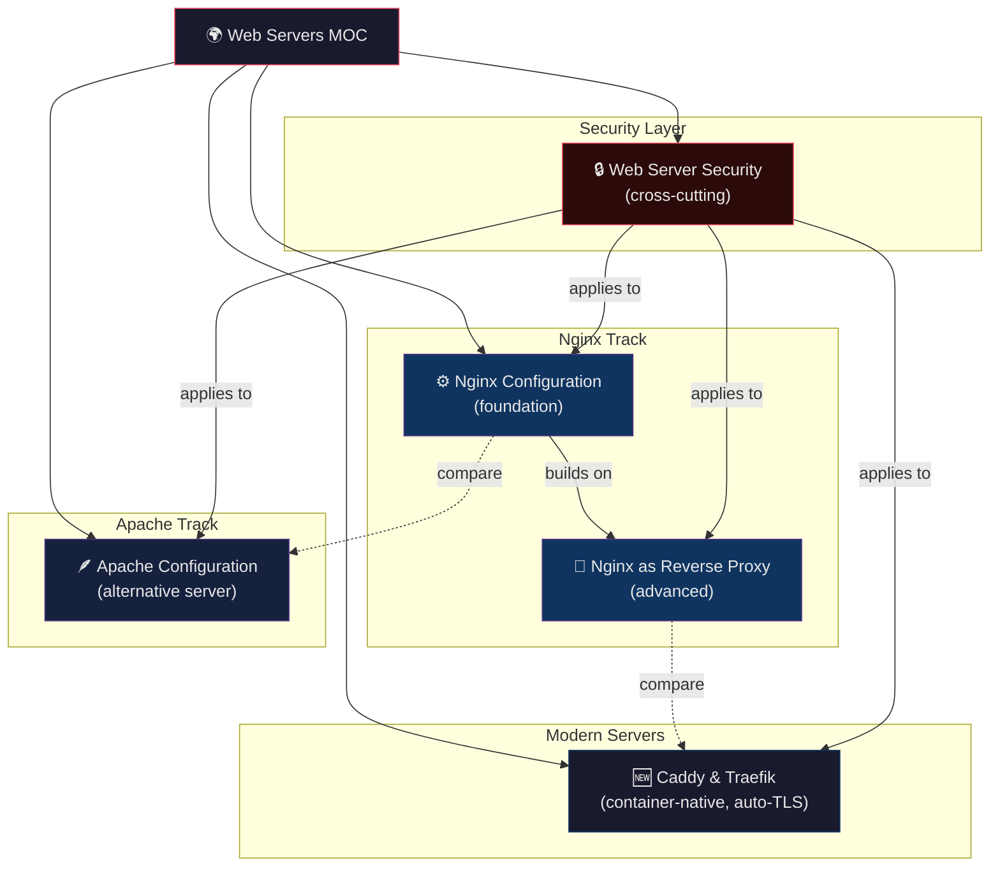

# 🌍 Web Servers — Section MOC

> [!abstract] Section Overview
> This section covers the major web server technologies used in production DevOps environments. It begins with Nginx — the dominant reverse proxy and high-performance static server — covering its config hierarchy, virtual hosts, location matching, and upstream management. Nginx as a reverse proxy is treated separately, covering header forwarding, caching, SSL termination, and WebSocket proxying. Apache is covered for legacy and shared-hosting contexts, with focus on mod_rewrite, MPMs, and .htaccess delegation. Caddy and Traefik represent the modern generation: Caddy for automatic HTTPS simplicity and Traefik for container-native service discovery. The section closes with a cross-cutting security module covering TLS hardening, security headers, WAF (ModSecurity), and DDoS mitigation applicable to all servers.

[[../_MOC_DevOps_Master|↑ DevOps Master MOC]]

---

## Section Architecture



---

## Notes in This Section

| Note | Key Topics | Difficulty |
|---|---|---|
| [[Nginx_Configuration]] | nginx.conf hierarchy, server/location blocks, location priority, upstream groups, gzip, rate limiting, logging | Intermediate |
| [[Nginx_as_Reverse_Proxy]] | proxy_pass, header forwarding, load balancing, WebSocket proxying, proxy_cache, SSL termination, timeouts | Intermediate |
| [[Apache_Configuration]] | httpd.conf layout, VirtualHosts, .htaccess, mod_rewrite, mod_proxy, MPMs (prefork/worker/event), performance tuning | Intermediate |
| [[Caddy_and_Modern_Servers]] | Caddyfile syntax, automatic HTTPS (ACME), Caddy reverse proxy, Traefik Docker labels, IngressRoute CRD, server comparison | Intermediate |
| [[Web_Server_Security]] | TLS best practices, PFS, HSTS, security headers (CSP, X-Frame-Options), server tokens, DDoS mitigation, ModSecurity WAF | Advanced |

---

## Learning Path

Follow this order to build understanding from fundamentals to advanced topics:

```
1. Nginx_Configuration
   └─ Understand the config hierarchy, how requests are matched,
      and how upstreams are defined before doing anything else.

2. Apache_Configuration
   └─ Compare mental model: how Apache differs from Nginx
      (MPM, .htaccess, mod_rewrite vs location blocks).

3. Nginx_as_Reverse_Proxy
   └─ Extends Nginx knowledge — proxy_pass, SSL termination,
      caching, WebSocket. Prerequisite: Nginx_Configuration.

4. Caddy_and_Modern_Servers
   └─ See how modern alternatives simplify configuration and
      add automatic HTTPS. Good contrast after Apache + Nginx.

5. Web_Server_Security
   └─ Cross-cutting security practices applicable to all servers.
      Best studied after you understand how each server works,
      so you can apply TLS/header configs concretely.
```

**Quick reference paths:**

- "I need to proxy to a Node.js app" → [[Nginx_as_Reverse_Proxy]]
- "I need to set up a PHP site with .htaccess" → [[Apache_Configuration]]
- "I need automatic HTTPS with minimal config" → [[Caddy_and_Modern_Servers]]
- "I need to add security headers and configure TLS" → [[Web_Server_Security]]
- "Container/Kubernetes routing" → [[Caddy_and_Modern_Servers]] (Traefik section)

---

## Related Sections

| Section | Relationship |
|---|---|
| [[../08_Load_Balancing/_MOC_Load_Balancing\|08 — Load Balancing]] | Upstream load balancing concepts that Nginx implements |
| [[../09_CDN/_MOC_CDN\|09 — CDN]] | CDN sits in front of web servers; cache-control headers are shared |
| [[../05_Containers/_MOC_Containers\|05 — Containers]] | Caddy/Traefik in Docker; nginx as sidecar or Ingress Controller |
| [[../06_Kubernetes/_MOC_Kubernetes\|06 — Kubernetes]] | Nginx Ingress Controller, Traefik IngressRoute CRDs |
| [[../11_Security/_MOC_Security\|11 — Security]] | TLS fundamentals, OWASP, certificate management (overlaps Web_Server_Security) |
| [[../04_CI_CD/_MOC_CI_CD\|04 — CI/CD]] | Deploying config changes safely; nginx -t in pipelines |

---

#DevOps #WebServer #Nginx #Apache #Caddy #Traefik #MOC #Section10
